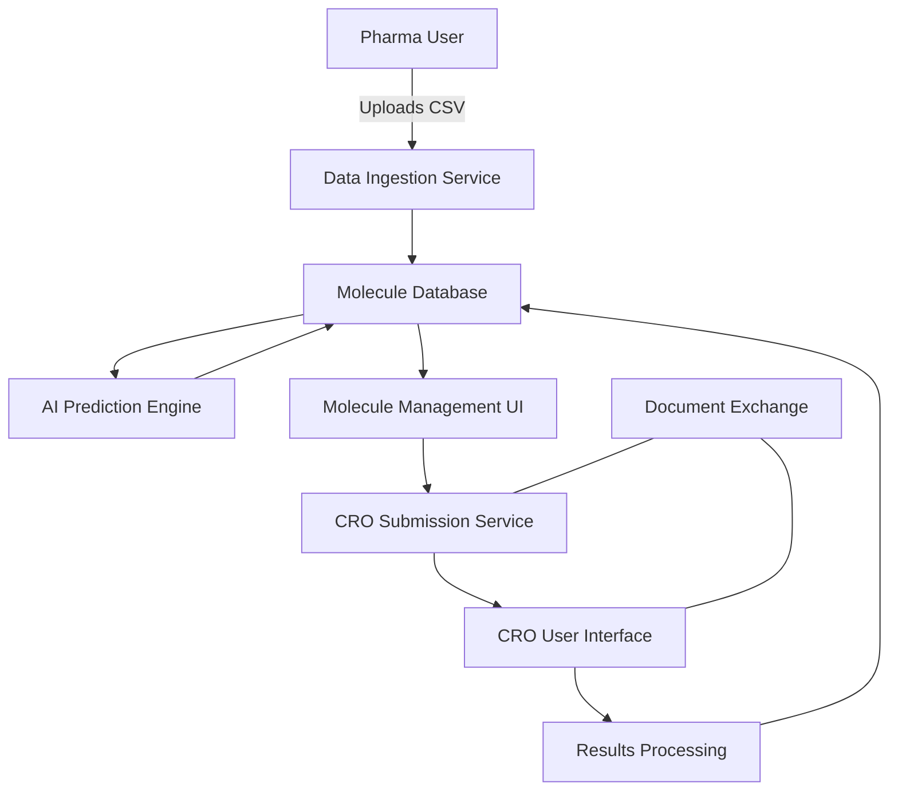

# Molecular Data Management and CRO Integration Platform

A cloud-based application designed to revolutionize small molecule drug discovery workflows for small to mid-cap pharmaceutical companies. This platform addresses the critical gap between computational chemistry and experimental validation by providing a seamless interface for organizing molecular data, predicting properties, and connecting directly with Contract Research Organizations (CROs) for experimental testing.

## Key Features

- CSV-based molecular data ingestion with SMILES validation
- Interactive molecule sorting, filtering, and library management
- AI-powered property prediction and visualization
- Direct CRO submission workflow with integrated communications
- Secure document exchange for legal/compliance requirements
- Results tracking and visualization
- Role-based access control for pharma and CRO users

## System Architecture

The platform employs a microservices architecture with the following components:

- **Frontend**: React-based SPA with Material UI and ChemDoodle Web for molecular visualization
- **Backend**: Python/FastAPI microservices for domain-specific functionality
- **Database**: PostgreSQL with chemical structure extensions
- **Storage**: S3 for document storage and large datasets
- **Caching**: Redis for performance optimization
- **Integration**: External AI prediction engine, DocuSign for e-signatures

The system is deployed on AWS using containerization (Docker) and orchestration (ECS) for scalability and reliability.



## Technology Stack

- **Frontend**: React 18.0+, TypeScript 4.9+, Material UI 5.0+, ChemDoodle Web 9.0+
- **Backend**: Python 3.10+, FastAPI 0.95+, RDKit 2023.03+, Pydantic 2.0+
- **Database**: PostgreSQL 15.0+, SQLAlchemy 2.0+
- **Infrastructure**: AWS (ECS, RDS, S3, Cognito), Docker, Terraform

## Getting Started

### Prerequisites

- Docker and Docker Compose
- Git
- AWS CLI (for deployment)

### Quick Start with Docker

1. Clone the repository
   ```bash
   git clone https://github.com/your-org/molecular-platform.git
   cd molecular-platform
   ```

2. Copy the example environment files
   ```bash
   cp src/backend/.env.example src/backend/.env
   cp src/web/.env.example src/web/.env.local
   ```

3. Update environment variables in the .env files

4. Start the application with Docker Compose
   ```bash
   docker-compose up -d
   ```

5. Access the application at http://localhost:3000

For detailed setup instructions, see the [Development Setup Guide](docs/development/setup.md)

## Project Structure

```
├── src/
│   ├── backend/           # Python/FastAPI backend services
│   │   ├── app/           # Application code
│   │   ├── tests/         # Backend tests
│   │   └── scripts/       # Utility scripts
│   └── web/              # React frontend application
│       ├── src/           # Frontend source code
│       └── tests/         # Frontend tests
├── docs/                 # Documentation
│   ├── api/              # API documentation
│   ├── architecture/     # Architecture documentation
│   ├── development/      # Development guides
│   ├── deployment/       # Deployment documentation
│   ├── user/             # User guides
│   └── compliance/       # Compliance documentation
├── infrastructure/       # Infrastructure as code
│   ├── terraform/        # Terraform configurations
│   ├── cloudformation/   # CloudFormation templates
│   └── ansible/          # Ansible playbooks
├── deployment/           # Deployment configurations
│   ├── docker-compose/   # Docker Compose configurations
│   ├── kubernetes/       # Kubernetes manifests
│   └── ecs/              # ECS task definitions
└── tests/                # Integration and performance tests
```

## Development

### Backend Development

For backend development, see the [Backend README](src/backend/README.md) for detailed instructions.

### Frontend Development

For frontend development, see the [Frontend README](src/web/README.md) for detailed instructions.

### Code Quality

This project follows strict code quality standards:

- Python: PEP 8, Black, isort, Flake8, mypy
- TypeScript: ESLint, Prettier, TypeScript strict mode
- Pre-commit hooks for automated code quality checks
- Comprehensive test coverage requirements

## Testing

The project includes comprehensive testing at multiple levels:

- **Unit Tests**: Backend (pytest) and Frontend (Jest)
- **Integration Tests**: API and service integration testing
- **End-to-End Tests**: Cypress for browser-based testing
- **Performance Tests**: k6 for load, stress, and endurance testing

Run tests with the following commands:

```bash
# Backend tests
cd src/backend
pytest

# Frontend tests
cd src/web
npm run test

# End-to-end tests
cd src/web
npm run test:e2e
```

## Deployment

The application is designed to be deployed on AWS using ECS for container orchestration. The deployment process is automated through CI/CD pipelines implemented with GitHub Actions.

For detailed deployment instructions, see the [Deployment Documentation](docs/deployment/ci-cd.md)

## Documentation

Comprehensive documentation is available in the `docs` directory:

- [API Documentation](docs/api/openapi.yaml)
- [Architecture Overview](docs/architecture/overview.md)
- [Development Setup](docs/development/setup.md)
- [Deployment Guide](docs/deployment/infrastructure.md)
- [User Guides](docs/user/getting-started.md)
- [Compliance Documentation](docs/compliance/21-cfr-part-11.md)

## Security and Compliance

The platform is designed with security and compliance as core principles:

- Role-based access control with fine-grained permissions
- Data encryption at rest and in transit
- Comprehensive audit logging for all actions
- 21 CFR Part 11 compliance for electronic records and signatures
- GDPR compliance for data protection

For detailed security information, see the [Security Documentation](docs/architecture/security.md)

## Contributing

We welcome contributions to the Molecular Data Management and CRO Integration Platform. Please follow these guidelines when contributing:

1. Fork the repository
2. Create a feature branch (`git checkout -b feature/amazing-feature`)
3. Commit your changes (`git commit -m 'Add amazing feature'`)
4. Push to the branch (`git push origin feature/amazing-feature`)
5. Open a Pull Request

Please ensure your code follows the project's coding standards and includes appropriate tests.

## License

This project is licensed under the terms specified in the LICENSE file.