# Technical Specifications

## 1. INTRODUCTION

### 1.1 EXECUTIVE SUMMARY

The Molecular Data Management and CRO Integration Platform is a cloud-based application designed to revolutionize small molecule drug discovery workflows for small to mid-cap pharmaceutical companies. This platform addresses the critical gap between computational chemistry and experimental validation by providing a seamless interface for organizing molecular data, predicting properties, and connecting directly with Contract Research Organizations (CROs) for experimental testing.

The system solves three key business challenges:

1. Inefficient molecular data organization and analysis
2. Disconnected workflows between computational predictions and experimental validation
3. Cumbersome CRO engagement processes requiring multiple systems

Primary stakeholders include small to mid-cap pharmaceutical R&D teams, CRO service providers, and computational chemists. By streamlining these workflows, the platform is expected to reduce drug discovery cycle times by 30-40% and significantly lower operational costs associated with molecule management and CRO engagement.

### 1.2 SYSTEM OVERVIEW

#### 1.2.1 Project Context

This platform positions itself as an all-in-one solution in the fragmented molecular data management market. Current alternatives typically address only portions of the workflow, requiring scientists to use multiple disconnected systems:

| Current Limitations | Impact |
| --- | --- |
| Manual CSV manipulation in spreadsheets | Error-prone, time-consuming |
| Separate systems for predictions vs. experiments | Workflow discontinuity |
| Email-based CRO communications | Lack of tracking, compliance risks |
| Paper-based legal documentation | Delayed experimental initiation |

The platform will integrate with existing enterprise systems including LIMS (Laboratory Information Management Systems), ERP platforms, and proprietary AI prediction engines.

#### 1.2.2 High-Level Description

The system is a cloud-native application with these primary capabilities:

- Molecular data ingestion and organization from CSV files
- Interactive sorting, filtering, and library management
- AI-powered property prediction and visualization
- Direct CRO submission workflow with integrated communications
- Secure document exchange for legal/compliance requirements

The architecture employs a microservices approach with a React frontend, Python/FastAPI backend, and PostgreSQL database. The system leverages AWS cloud infrastructure for scalability and security.

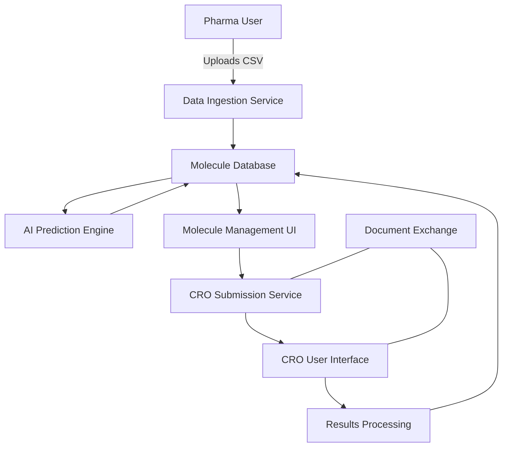
```mermaid
graph TD
    A[Pharma User] -->|Uploads CSV| B[Data Ingestion Service]
    B --> C[Molecule Database]
    C --> D[AI Prediction Engine]
    D --> C
    C --> E[Molecule Management UI]
    E --> F[CRO Submission Service]
    F --> G[CRO User Interface]
    G --> H[Results Processing]
    H --> C
    I[Document Exchange] --- F
    I --- G
```

#### 1.2.3 Success Criteria

| Success Metric | Target | Measurement Method |
| --- | --- | --- |
| Reduction in molecule-to-CRO submission time | 75% decrease | Time tracking from upload to submission |
| User adoption rate | \>80% of target users | Monthly active user tracking |
| Data processing efficiency | Handle 500K molecules per upload | Performance testing |
| Experimental turnaround time | 30% reduction | Time from submission to results receipt |

### 1.3 SCOPE

#### 1.3.1 In-Scope

**Core Features and Functionalities:**

- CSV-based molecular data ingestion with SMILES and property columns
- Interactive molecule sorting, filtering, and organization
- Custom library creation and management
- AI-powered property prediction integration
- CRO submission workflow with specification management
- Secure document exchange for legal requirements
- Results tracking and visualization
- Role-based access control for pharma and CRO users

**Implementation Boundaries:**

- User Groups: Small to mid-cap pharmaceutical R&D teams, CRO service providers
- Geographic Coverage: Global deployment with multi-region support
- Data Domains: Small molecule chemical structures, physicochemical properties, experimental assay data
- Security: RBAC, encryption, audit logging, and 21 CFR Part 11 compliance

#### 1.3.2 Out-of-Scope

The following items are explicitly excluded from the initial implementation:

- Large molecule (biologics) support
- Molecular structure drawing/editing capabilities
- Quantum mechanical calculations or molecular dynamics simulations
- Automated synthesis planning
- Direct laboratory instrument integration
- Clinical trial data management
- Patient data handling
- Regulatory submission preparation
- Manufacturing process development
- Full ERP/financial system integration (limited API hooks only)
- Mobile application versions (web responsive only)

Future phases may incorporate selected out-of-scope items based on user feedback and business priorities.

## 2. PRODUCT REQUIREMENTS

### 2.1 FEATURE CATALOG

#### 2.1.1 Data Management Features

| Feature ID | Feature Name | Category | Priority | Status |
| --- | --- | --- | --- | --- |
| F-101 | CSV Molecular Data Ingestion | Data Management | Critical | Approved |
| F-102 | Molecule Library Management | Data Management | Critical | Approved |
| F-103 | Molecule Sorting and Filtering | Data Management | High | Approved |
| F-104 | Custom Library Creation | Data Management | High | Approved |
| F-105 | Molecule Status Tracking | Data Management | Medium | Approved |

**F-101: CSV Molecular Data Ingestion**

- **Overview**: Enables users to upload CSV files containing SMILES structures and associated molecular properties
- **Business Value**: Eliminates manual data entry and reduces errors in molecular data processing
- **User Benefits**: Streamlined data import process with validation and error handling
- **Technical Context**: Requires CSV parsing, SMILES validation, and database integration

**F-102: Molecule Library Management**

- **Overview**: System for organizing molecules into libraries with metadata and categorization
- **Business Value**: Improves organization of molecular assets and research efficiency
- **User Benefits**: Simplified molecule organization and retrieval
- **Technical Context**: Requires database schema for molecule-library relationships and metadata storage

**Dependencies for Data Management Features**:

- **Prerequisite Features**: User authentication system
- **System Dependencies**: Database for molecular data storage
- **External Dependencies**: SMILES validation libraries
- **Integration Requirements**: AI prediction engine API integration

#### 2.1.2 User Interface Features

| Feature ID | Feature Name | Category | Priority | Status |
| --- | --- | --- | --- | --- |
| F-201 | Interactive Molecule Dashboard | User Interface | Critical | Approved |
| F-202 | Drag-and-Drop Molecule Organization | User Interface | High | Approved |
| F-203 | Molecule Property Visualization | User Interface | Medium | Approved |
| F-204 | Experiment Queue Management UI | User Interface | High | Approved |
| F-205 | CRO Submission Interface | User Interface | Critical | Approved |

**F-201: Interactive Molecule Dashboard**

- **Overview**: Central dashboard displaying molecular libraries, properties, and statuses
- **Business Value**: Provides comprehensive overview of molecular assets and experiments
- **User Benefits**: Single interface for monitoring and managing molecular data
- **Technical Context**: Requires responsive UI components and real-time data updates

**F-205: CRO Submission Interface**

- **Overview**: Interface for selecting molecules and submitting them to CROs with specifications
- **Business Value**: Streamlines CRO engagement process and reduces administrative overhead
- **User Benefits**: Simplified workflow for experimental testing requests
- **Technical Context**: Requires integration with document management and messaging systems

**Dependencies for UI Features**:

- **Prerequisite Features**: Data management features (F-101, F-102)
- **System Dependencies**: Frontend framework (React.js)
- **External Dependencies**: UI component libraries
- **Integration Requirements**: WebSocket for real-time updates

#### 2.1.3 AI Integration Features

| Feature ID | Feature Name | Category | Priority | Status |
| --- | --- | --- | --- | --- |
| F-301 | AI Property Prediction | AI Integration | High | Approved |
| F-302 | Molecular Ranking | AI Integration | Medium | Approved |
| F-303 | Property Visualization | AI Integration | Medium | Approved |

**F-301: AI Property Prediction**

- **Overview**: Integration with AI engine to predict molecular properties
- **Business Value**: Reduces need for experimental testing of all properties
- **User Benefits**: Access to predicted properties for decision-making
- **Technical Context**: Requires API integration with external AI prediction engine

**Dependencies for AI Integration Features**:

- **Prerequisite Features**: CSV Molecular Data Ingestion (F-101)
- **System Dependencies**: API gateway for external services
- **External Dependencies**: AI prediction engine
- **Integration Requirements**: Secure API communication, asynchronous processing

#### 2.1.4 CRO Integration Features

| Feature ID | Feature Name | Category | Priority | Status |
| --- | --- | --- | --- | --- |
| F-401 | CRO Service Selection | CRO Integration | Critical | Approved |
| F-402 | Experiment Specification Management | CRO Integration | High | Approved |
| F-403 | Secure Document Exchange | CRO Integration | Critical | Approved |
| F-404 | Results Processing and Integration | CRO Integration | High | Approved |
| F-405 | CRO Communication Channel | CRO Integration | Medium | Approved |

**F-403: Secure Document Exchange**

- **Overview**: System for securely exchanging legal and compliance documents with CROs
- **Business Value**: Ensures regulatory compliance and protects intellectual property
- **User Benefits**: Streamlined document management and reduced administrative burden
- **Technical Context**: Requires secure storage, e-signature integration, and access controls

**F-404: Results Processing and Integration**

- **Overview**: System for receiving, processing, and integrating experimental results from CROs
- **Business Value**: Creates closed-loop workflow from prediction to experimental validation
- **User Benefits**: Centralized access to both computational and experimental data
- **Technical Context**: Requires data parsing, validation, and integration with molecule database

**Dependencies for CRO Integration Features**:

- **Prerequisite Features**: Molecule Library Management (F-102), CRO Submission Interface (F-205)
- **System Dependencies**: Secure storage for documents, messaging system
- **External Dependencies**: E-signature service (DocuSign)
- **Integration Requirements**: CRO user authentication, secure document transfer

#### 2.1.5 Security and Compliance Features

| Feature ID | Feature Name | Category | Priority | Status |
| --- | --- | --- | --- | --- |
| F-501 | Role-Based Access Control | Security | Critical | Approved |
| F-502 | Data Encryption | Security | Critical | Approved |
| F-503 | Audit Logging | Compliance | High | Approved |
| F-504 | 21 CFR Part 11 Compliance | Compliance | High | Approved |

**F-501: Role-Based Access Control**

- **Overview**: System for managing user roles and permissions across the platform
- **Business Value**: Ensures data security and appropriate access levels
- **User Benefits**: Controlled access to sensitive information
- **Technical Context**: Requires authentication system with role management

**F-504: 21 CFR Part 11 Compliance**

- **Overview**: Features ensuring compliance with FDA electronic records regulations
- **Business Value**: Enables use in regulated pharmaceutical environments
- **User Benefits**: Regulatory-compliant workflow
- **Technical Context**: Requires audit trails, e-signatures, and validated systems

**Dependencies for Security and Compliance Features**:

- **Prerequisite Features**: User authentication system
- **System Dependencies**: Encryption services, logging infrastructure
- **External Dependencies**: Compliance validation tools
- **Integration Requirements**: Integration with enterprise SSO systems

### 2.2 FUNCTIONAL REQUIREMENTS TABLE

#### 2.2.1 CSV Molecular Data Ingestion (F-101)

| Requirement ID | Description | Acceptance Criteria | Priority |
| --- | --- | --- | --- |
| F-101-RQ-001 | System must allow users to upload CSV files containing molecular data | Users can successfully upload CSV files through drag-drop or file selection | Must-Have |
| F-101-RQ-002 | System must validate CSV format and SMILES strings | Invalid files are rejected with specific error messages | Must-Have |
| F-101-RQ-003 | System must allow mapping of CSV columns to system properties | Users can interactively map columns to predefined or custom properties | Must-Have |
| F-101-RQ-004 | System must handle large CSV files (up to 500,000 molecules) | Large files are processed without timeout or performance degradation | Should-Have |

**Technical Specifications**:

- **Input Parameters**: CSV file, column mapping configuration
- **Output/Response**: Validation results, import summary, error report
- **Performance Criteria**: Process 10,000 molecules per minute
- **Data Requirements**: Valid SMILES strings, numerical property values

**Validation Rules**:

- **Business Rules**: CSV must contain at least SMILES column and one property column
- **Data Validation**: SMILES strings must be chemically valid, numerical values within reasonable ranges
- **Security Requirements**: File scanning for malware, size limits
- **Compliance Requirements**: Maintain audit trail of all imports

#### 2.2.2 Molecule Library Management (F-102)

| Requirement ID | Description | Acceptance Criteria | Priority |
| --- | --- | --- | --- |
| F-102-RQ-001 | System must allow creation of custom molecule libraries | Users can create, name, and describe molecule libraries | Must-Have |
| F-102-RQ-002 | System must support adding/removing molecules from libraries | Users can add or remove molecules with immediate UI update | Must-Have |
| F-102-RQ-003 | System must support library metadata and categorization | Libraries can be tagged, categorized, and described | Should-Have |
| F-102-RQ-004 | System must track molecule history across libraries | System maintains audit trail of molecule movement | Should-Have |

**Technical Specifications**:

- **Input Parameters**: Library metadata, molecule selections
- **Output/Response**: Updated library structure, confirmation messages
- **Performance Criteria**: Library operations complete in \<1 second
- **Data Requirements**: Molecule IDs, library metadata

**Validation Rules**:

- **Business Rules**: Libraries must have unique names within a user account
- **Data Validation**: Library names limited to 100 characters
- **Security Requirements**: Libraries accessible only to authorized users
- **Compliance Requirements**: Track all library modifications

#### 2.2.3 CRO Submission Interface (F-205)

| Requirement ID | Description | Acceptance Criteria | Priority |
| --- | --- | --- | --- |
| F-205-RQ-001 | System must allow selection of molecules for CRO submission | Users can select multiple molecules from libraries for submission | Must-Have |
| F-205-RQ-002 | System must provide CRO service selection | Users can select from available CRO services with descriptions | Must-Have |
| F-205-RQ-003 | System must support specification of experimental parameters | Users can define assay parameters and requirements | Must-Have |
| F-205-RQ-004 | System must facilitate document attachment and exchange | Users can attach and manage legal/compliance documents | Must-Have |

**Technical Specifications**:

- **Input Parameters**: Selected molecules, CRO service, specifications, documents
- **Output/Response**: Submission confirmation, tracking ID
- **Performance Criteria**: Submission process completes in \<5 seconds
- **Data Requirements**: Molecule data, service specifications, document metadata

**Validation Rules**:

- **Business Rules**: Submissions require minimum specification completeness
- **Data Validation**: Required fields must be completed
- **Security Requirements**: Secure transmission of confidential information
- **Compliance Requirements**: Document version control and signatures

#### 2.2.4 AI Property Prediction (F-301)

| Requirement ID | Description | Acceptance Criteria | Priority |
| --- | --- | --- | --- |
| F-301-RQ-001 | System must integrate with AI engine for property predictions | System successfully sends SMILES to AI engine and receives predictions | Must-Have |
| F-301-RQ-002 | System must display predicted properties alongside experimental data | UI clearly distinguishes predicted vs. experimental values | Must-Have |
| F-301-RQ-003 | System must handle asynchronous prediction processing | Long-running predictions don't block UI, users notified when complete | Should-Have |
| F-301-RQ-004 | System must store prediction confidence metrics | Confidence scores displayed with predictions | Could-Have |

**Technical Specifications**:

- **Input Parameters**: SMILES strings, prediction configuration
- **Output/Response**: Predicted properties with confidence scores
- **Performance Criteria**: API response time \<5 seconds for batch of 100 molecules
- **Data Requirements**: Valid SMILES strings, prediction configuration

**Validation Rules**:

- **Business Rules**: Predictions clearly marked as computational estimates
- **Data Validation**: Prediction values within reasonable ranges
- **Security Requirements**: Secure API communication
- **Compliance Requirements**: Track prediction provenance

### 2.3 FEATURE RELATIONSHIPS

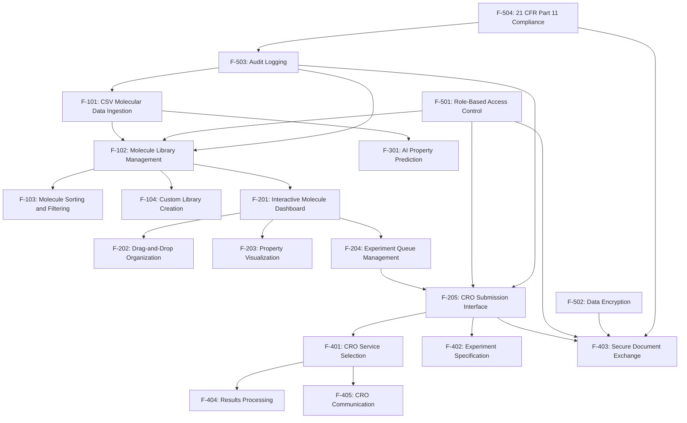
```mermaid
graph TD
    F101[F-101: CSV Molecular Data Ingestion] --> F102[F-102: Molecule Library Management]
    F101 --> F301[F-301: AI Property Prediction]
    F102 --> F103[F-103: Molecule Sorting and Filtering]
    F102 --> F104[F-104: Custom Library Creation]
    F102 --> F201[F-201: Interactive Molecule Dashboard]
    F201 --> F202[F-202: Drag-and-Drop Organization]
    F201 --> F203[F-203: Property Visualization]
    F201 --> F204[F-204: Experiment Queue Management]
    F204 --> F205[F-205: CRO Submission Interface]
    F205 --> F401[F-401: CRO Service Selection]
    F205 --> F402[F-402: Experiment Specification]
    F205 --> F403[F-403: Secure Document Exchange]
    F401 --> F404[F-404: Results Processing]
    F401 --> F405[F-405: CRO Communication]
    F501[F-501: Role-Based Access Control] --> F102
    F501 --> F205
    F501 --> F403
    F502[F-502: Data Encryption] --> F403
    F503[F-503: Audit Logging] --> F101
    F503 --> F102
    F503 --> F205
    F504[F-504: 21 CFR Part 11 Compliance] --> F403
    F504 --> F503
```

#### 2.3.1 Integration Points

| Primary Feature | Integrates With | Integration Type | Purpose |
| --- | --- | --- | --- |
| CSV Molecular Data Ingestion (F-101) | AI Property Prediction (F-301) | Data Flow | Send molecular structures for prediction |
| Molecule Library Management (F-102) | Interactive Dashboard (F-201) | UI Component | Display and manage libraries |
| CRO Submission Interface (F-205) | Secure Document Exchange (F-403) | Service | Handle legal documentation |
| Results Processing (F-404) | Molecule Library Management (F-102) | Data Flow | Update molecules with experimental results |

#### 2.3.2 Shared Components

| Component | Used By Features | Purpose |
| --- | --- | --- |
| Molecule Viewer | F-201, F-205, F-404 | Visualize molecular structures |
| Property Table | F-103, F-201, F-301 | Display molecular properties |
| Document Manager | F-403, F-404, F-504 | Handle document uploads and signatures |
| Notification System | F-101, F-301, F-404, F-405 | Alert users of system events |

### 2.4 IMPLEMENTATION CONSIDERATIONS

#### 2.4.1 Technical Constraints

| Feature | Constraint | Impact | Mitigation |
| --- | --- | --- | --- |
| CSV Molecular Data Ingestion (F-101) | File size limitations | Large datasets may timeout | Implement chunked processing |
| AI Property Prediction (F-301) | External API dependency | Service availability affects system | Implement caching and fallback |
| Secure Document Exchange (F-403) | Regulatory requirements | Complex implementation | Use validated third-party components |
| 21 CFR Part 11 Compliance (F-504) | Validation overhead | Development time increase | Phased implementation approach |

#### 2.4.2 Performance Requirements

| Feature | Metric | Target | Testing Method |
| --- | --- | --- | --- |
| CSV Molecular Data Ingestion (F-101) | Processing speed | 10,000 molecules/minute | Load testing with sample datasets |
| Interactive Dashboard (F-201) | UI response time | \<500ms for sorting/filtering | Performance profiling |
| AI Property Prediction (F-301) | Batch processing | 100 molecules in \<5 seconds | API response time testing |
| Results Processing (F-404) | Data integration | \<2 seconds per result set | Integration testing |

#### 2.4.3 Scalability Considerations

| Feature | Scaling Dimension | Approach | Infrastructure Requirement |
| --- | --- | --- | --- |
| Molecule Library Management (F-102) | Data volume | Database partitioning | PostgreSQL with horizontal scaling |
| AI Property Prediction (F-301) | Computation | Asynchronous processing | Queue system with worker pools |
| CRO Submission Interface (F-205) | Concurrent users | Stateless design | Load-balanced application servers |
| Secure Document Exchange (F-403) | Storage | Object storage with lifecycle | S3 with versioning and retention |

#### 2.4.4 Security Implications

| Feature | Security Concern | Requirement | Implementation Approach |
| --- | --- | --- | --- |
| Role-Based Access Control (F-501) | Unauthorized access | Fine-grained permissions | OAuth2 with custom role definitions |
| Data Encryption (F-502) | Data exposure | Encryption at rest and in transit | AES-256 encryption, TLS 1.3 |
| Secure Document Exchange (F-403) | Document leakage | Access controls and audit | Watermarking, access logging |
| CRO Communication (F-405) | Confidential communications | Secure messaging | Encrypted channels, message expiration |

## 3. TECHNOLOGY STACK

### 3.1 PROGRAMMING LANGUAGES

| Component | Language | Version | Justification |
| --- | --- | --- | --- |
| Frontend | JavaScript (TypeScript) | TypeScript 4.9+ | Type safety for complex molecular data structures and improved developer experience |
| Backend | Python | 3.10+ | Extensive libraries for chemical informatics (RDKit), AI integration, and data processing |
| Database Scripts | SQL | PostgreSQL dialect | Optimized for relational data and complex molecule-property relationships |
| Infrastructure | YAML, HCL | Latest | For AWS CloudFormation/Terraform infrastructure definition |

**Selection Criteria:**

- Python was selected for the backend due to its strong ecosystem of scientific computing libraries, particularly for molecular data processing (RDKit, NumPy) and AI model integration
- TypeScript provides type safety for the complex data structures required in molecular visualization and property management
- SQL is essential for the complex relational queries needed for molecule filtering and organization

### 3.2 FRAMEWORKS & LIBRARIES

#### 3.2.1 Frontend

| Framework/Library | Version | Purpose | Justification |
| --- | --- | --- | --- |
| React | 18.0+ | UI framework | Component-based architecture ideal for complex molecular dashboards |
| Material UI | 5.0+ | UI component library | Provides pre-built components for data tables, forms, and scientific visualization |
| Redux Toolkit | 1.9+ | State management | Manages complex application state for molecule libraries and filtering |
| React Query | 4.0+ | Data fetching | Optimized for handling large datasets with caching and background updates |
| D3.js | 7.0+ | Data visualization | Required for property distribution plots and molecular property heatmaps |
| ChemDoodle Web | 9.0+ | Molecular visualization | Specialized library for rendering molecular structures from SMILES |

#### 3.2.2 Backend

| Framework/Library | Version | Purpose | Justification |
| --- | --- | --- | --- |
| FastAPI | 0.95+ | API framework | High performance async framework with automatic OpenAPI documentation |
| RDKit | 2023.03+ | Cheminformatics | Industry-standard library for molecular data processing and SMILES validation |
| Pydantic | 2.0+ | Data validation | Type validation for molecular data and API requests/responses |
| SQLAlchemy | 2.0+ | ORM | Database abstraction for complex molecule-property relationships |
| Celery | 5.2+ | Task queue | Asynchronous processing for AI predictions and large CSV imports |
| scikit-learn | 1.2+ | ML utilities | Supporting library for AI prediction engine integration |

**Compatibility Requirements:**

- All frontend libraries must support modern browsers (Chrome, Firefox, Safari, Edge)
- Backend libraries must be compatible with Python 3.10+ and containerization
- ChemDoodle Web requires WebGL support for 3D molecular rendering

### 3.3 DATABASES & STORAGE

| Component | Technology | Version | Purpose | Justification |
| --- | --- | --- | --- | --- |
| Primary Database | PostgreSQL | 15.0+ | Relational data storage | Optimized for complex queries across molecule properties and relationships |
| Document Storage | AWS S3 | Latest | File storage | Secure storage for CSV files, legal documents, and experimental results |
| Caching | Redis | 7.0+ | Performance optimization | In-memory caching for frequent molecule queries and session data |
| Search Index | Elasticsearch | 8.0+ | Molecule search | Specialized indexing for chemical structure and property searching |
| Backup Storage | AWS Glacier | Latest | Long-term archiving | Cost-effective storage for compliance with data retention policies |

**Data Persistence Strategies:**

- Molecule data stored in normalized PostgreSQL tables with optimized indexes for property filtering
- Binary files (documents, large result sets) stored in S3 with metadata in PostgreSQL
- Redis used for caching frequent queries and session management with 24-hour TTL
- Database partitioning implemented for large molecule libraries (\>1M molecules)

### 3.4 THIRD-PARTY SERVICES

| Service | Purpose | Integration Method | Justification |
| --- | --- | --- | --- |
| AWS Cognito | Authentication & Authorization | OAuth 2.0 | Secure identity management with MFA support and enterprise SSO integration |
| DocuSign | E-signature | REST API | Industry-standard for legally binding document signatures between pharma and CROs |
| AWS SQS | Message queue | SDK | Reliable asynchronous communication between microservices |
| AWS CloudWatch | Monitoring & logging | SDK | Comprehensive monitoring for performance and compliance auditing |
| Stripe | Payment processing (optional) | REST API | Secure handling of CRO service payments if required |
| External AI Engine | Property prediction | REST API | Integration with specialized molecular property prediction services |

**Integration Requirements:**

- All third-party services must support OAuth 2.0 authentication
- DocuSign integration must comply with 21 CFR Part 11 for electronic signatures
- AI Engine API must handle batch processing of molecules (100+ per request)
- All integrations must implement circuit breakers for fault tolerance

### 3.5 DEVELOPMENT & DEPLOYMENT

| Component | Technology | Version | Purpose | Justification |
| --- | --- | --- | --- | --- |
| Containerization | Docker | 24.0+ | Application packaging | Consistent environments across development and production |
| Container Orchestration | AWS ECS | Latest | Container management | Managed service with auto-scaling and high availability |
| Infrastructure as Code | Terraform | 1.5+ | Infrastructure provisioning | Reproducible infrastructure with state management |
| CI/CD | GitHub Actions | Latest | Automated pipeline | Integration with source control and comprehensive testing support |
| API Gateway | AWS API Gateway | Latest | API management | Request throttling, authentication, and routing |
| Monitoring | Datadog | Latest | Application performance | Comprehensive monitoring with molecular data-specific dashboards |

**Development Tools:**

- VS Code with specialized extensions for React, Python, and molecular visualization
- ESLint/Prettier for code formatting and static analysis
- PyTest for backend testing with \>80% code coverage requirement
- Jest and React Testing Library for frontend testing
- Postman collections for API testing and documentation

**Deployment Strategy:**

- Blue-green deployment for zero-downtime updates
- Canary releases for high-risk features with gradual rollout
- Automated database migrations with rollback capability
- Infrastructure defined as code with immutable patterns

### 3.6 ARCHITECTURE DIAGRAM

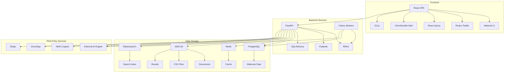
```mermaid
graph TD
    subgraph "Frontend"
        A[React SPA] --> B[Material UI]
        A --> C[Redux Toolkit]
        A --> D[React Query]
        A --> E[ChemDoodle Web]
        A --> F[D3.js]
    end
    
    subgraph "Backend Services"
        G[FastAPI] --> H[RDKit]
        G --> I[Pydantic]
        G --> J[SQLAlchemy]
        K[Celery Workers] --> H
    end
    
    subgraph "Data Storage"
        L[PostgreSQL] --> M[Molecule Data]
        N[Redis] --> O[Cache]
        P[AWS S3] --> Q[Documents]
        P --> R[CSV Files]
        P --> S[Results]
        T[Elasticsearch] --> U[Search Index]
    end
    
    subgraph "Third-Party Services"
        V[AWS Cognito]
        W[DocuSign]
        X[External AI Engine]
        Y[Stripe]
    end
    
    A --> G
    G --> L
    G --> N
    G --> P
    G --> T
    G --> V
    G --> W
    G --> X
    G --> Y
    K --> L
    K --> X
```

### 3.7 TECHNOLOGY SELECTION RATIONALE

The technology stack has been carefully selected to address the specific requirements of a molecular data management platform with CRO integration:

1. **Performance & Scalability**

   - FastAPI provides high-performance async processing for handling large molecular datasets
   - PostgreSQL with partitioning supports the 500,000 molecule batch requirement
   - Redis caching ensures sub-second response times for molecule filtering and sorting

2. **Security & Compliance**

   - AWS Cognito provides enterprise-grade authentication with MFA support
   - PostgreSQL offers row-level security for molecule data isolation
   - DocuSign integration ensures 21 CFR Part 11 compliant e-signatures

3. **Scientific Computing**

   - RDKit is the industry standard for cheminformatics and SMILES processing
   - ChemDoodle Web provides specialized molecular visualization
   - Integration with external AI engines leverages specialized prediction capabilities

4. **Developer Experience**

   - TypeScript and Pydantic provide strong typing for complex molecular data structures
   - FastAPI's automatic OpenAPI documentation simplifies API integration
   - Containerization ensures consistent development and production environments

5. **Operational Excellence**

   - Terraform enables reproducible infrastructure deployment
   - ECS provides auto-scaling for handling variable workloads
   - Comprehensive monitoring with Datadog ensures system reliability

This stack balances modern development practices with the specialized requirements of molecular data processing and scientific computing, while maintaining the security and compliance needs of pharmaceutical research.

## 4. PROCESS FLOWCHART

### 4.1 SYSTEM WORKFLOWS

#### 4.1.1 Core Business Processes

##### Molecule Data Ingestion and Organization Workflow

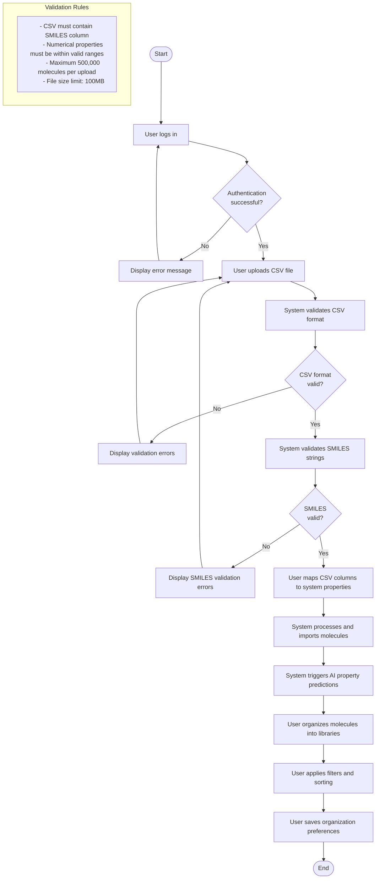
```mermaid
flowchart TD
    Start([Start]) --> A[User logs in]
    A --> B{Authentication<br>successful?}
    B -->|No| C[Display error message]
    C --> A
    B -->|Yes| D[User uploads CSV file]
    D --> E[System validates CSV format]
    E --> F{CSV format<br>valid?}
    F -->|No| G[Display validation errors]
    G --> D
    F -->|Yes| H[System validates SMILES strings]
    H --> I{SMILES<br>valid?}
    I -->|No| J[Display SMILES validation errors]
    J --> D
    I -->|Yes| K[User maps CSV columns to system properties]
    K --> L[System processes and imports molecules]
    L --> M[System triggers AI property predictions]
    M --> N[User organizes molecules into libraries]
    N --> O[User applies filters and sorting]
    O --> P[User saves organization preferences]
    P --> End([End])

    subgraph ValidationRules["Validation Rules"]
        VR1["- CSV must contain SMILES column
        - Numerical properties must be within valid ranges
        - Maximum 500,000 molecules per upload
        - File size limit: 100MB"]
    end
```

##### CRO Submission Workflow

```mermaid
flowchart TD
    Start([Start]) --> A[User selects molecules for testing]
    A --> B[User clicks "Submit to CRO"]
    B --> C[System validates molecule selection]
    C --> D{Selection<br>valid?}
    D -->|No| E[Display validation errors]
    E --> A
    D -->|Yes| F[User selects CRO service]
    F --> G[User specifies experimental parameters]
    G --> H[System validates parameters]
    H --> I{Parameters<br>valid?}
    I -->|No| J[Display parameter errors]
    J --> G
    I -->|Yes| K[User uploads/selects legal documents]
    K --> L{Documents<br>complete?}
    L -->|No| M[Prompt for missing documents]
    M --> K
    L -->|Yes| N[System creates submission package]
    N --> O[System notifies CRO of new submission]
    O --> P[CRO reviews submission]
    P --> Q{CRO accepts<br>submission?}
    Q -->|No| R[CRO requests modifications]
    R --> S[User updates submission]
    S --> P
    Q -->|Yes| T[CRO confirms pricing and timeline]
    T --> U[User approves pricing]
    U --> V[System updates molecule status to "Submitted to CRO"]
    V --> End([End])

    subgraph "Business Rules"
        BR1["- Submission requires minimum specification completeness
        - Legal documents must be signed before submission
        - Pricing approval required before experiment initiation
        - Molecules must have valid structures"]
    end
```

##### Experimental Results Processing Workflow

```mermaid
flowchart TD
    Start([Start]) --> A[CRO completes experiment]
    A --> B[CRO uploads results data]
    B --> C[System validates results format]
    C --> D{Format<br>valid?}
    D -->|No| E[Display format errors]
    E --> B
    D -->|Yes| F[System processes results data]
    F --> G[System links results to original molecules]
    G --> H[System updates molecule status to "Results Available"]
    H --> I[System notifies pharma user of results]
    I --> J[Pharma user reviews results]
    J --> K{Results<br>acceptable?}
    K -->|No| L[User requests additional testing]
    L --> M[CRO reviews request]
    M --> Start
    K -->|Yes| N[User integrates results into analysis]
    N --> O[System updates molecule metadata with experimental values]
    O --> End([End])

    subgraph "Validation Rules"
        VR2["- Results must include all requested molecules
        - Data format must match specification
        - Results must include quality control metrics
        - Results must be linked to original submission ID"]
    end
```

#### 4.1.2 Integration Workflows

##### AI Property Prediction Integration

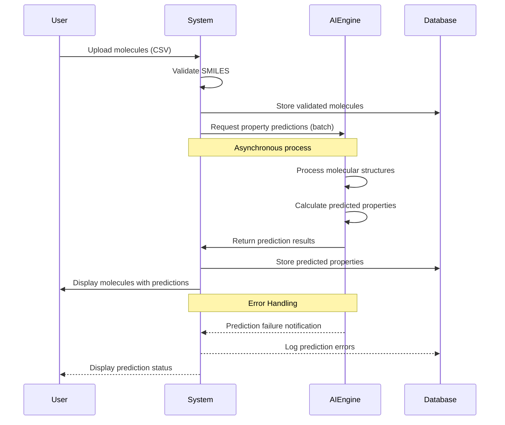
```mermaid
sequenceDiagram
    participant User
    participant System
    participant AIEngine
    participant Database

    User->>System: Upload molecules (CSV)
    System->>System: Validate SMILES
    System->>Database: Store validated molecules
    System->>AIEngine: Request property predictions (batch)
    Note over System,AIEngine: Asynchronous process
    AIEngine->>AIEngine: Process molecular structures
    AIEngine->>AIEngine: Calculate predicted properties
    AIEngine->>System: Return prediction results
    System->>Database: Store predicted properties
    System->>User: Display molecules with predictions
    
    Note over System,AIEngine: Error Handling
    AIEngine-->>System: Prediction failure notification
    System-->>Database: Log prediction errors
    System-->>User: Display prediction status
```

##### CRO Integration Sequence

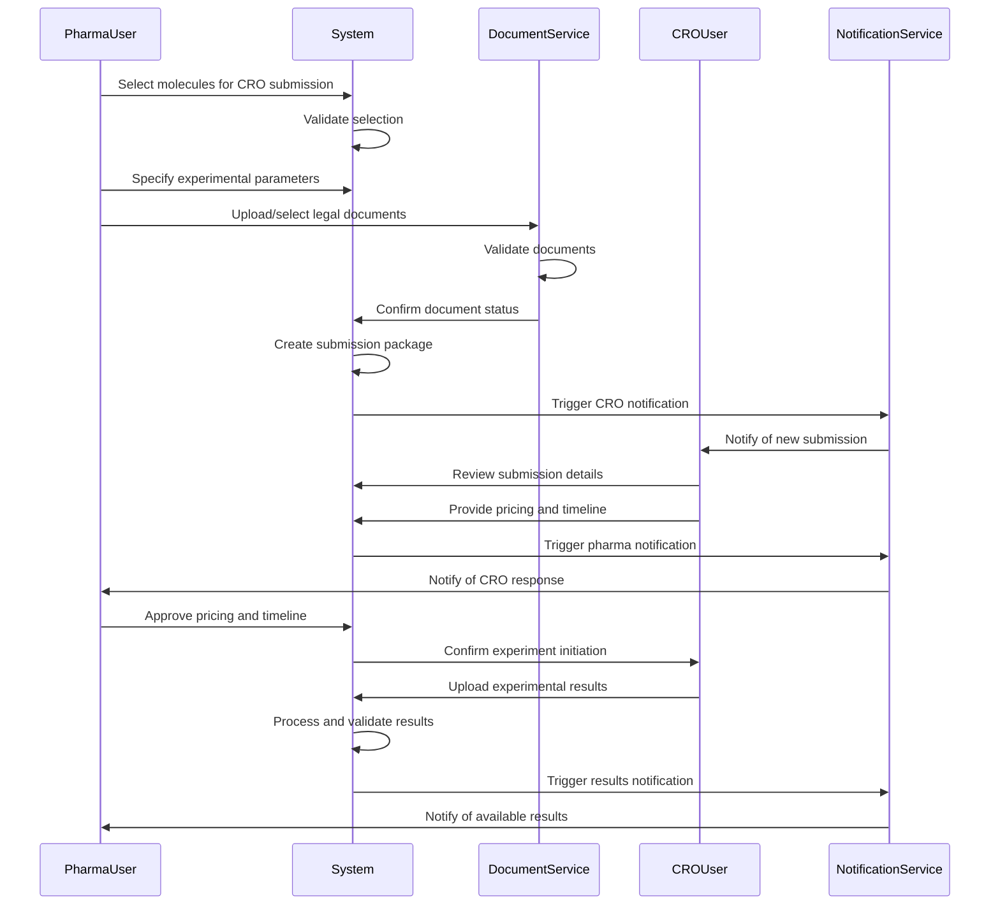
```mermaid
sequenceDiagram
    participant PharmaUser
    participant System
    participant DocumentService
    participant CROUser
    participant NotificationService

    PharmaUser->>System: Select molecules for CRO submission
    System->>System: Validate selection
    PharmaUser->>System: Specify experimental parameters
    PharmaUser->>DocumentService: Upload/select legal documents
    DocumentService->>DocumentService: Validate documents
    DocumentService->>System: Confirm document status
    System->>System: Create submission package
    System->>NotificationService: Trigger CRO notification
    NotificationService->>CROUser: Notify of new submission
    CROUser->>System: Review submission details
    CROUser->>System: Provide pricing and timeline
    System->>NotificationService: Trigger pharma notification
    NotificationService->>PharmaUser: Notify of CRO response
    PharmaUser->>System: Approve pricing and timeline
    System->>CROUser: Confirm experiment initiation
    CROUser->>System: Upload experimental results
    System->>System: Process and validate results
    System->>NotificationService: Trigger results notification
    NotificationService->>PharmaUser: Notify of available results
```

### 4.2 FLOWCHART REQUIREMENTS

#### 4.2.1 Molecule Library Management Workflow

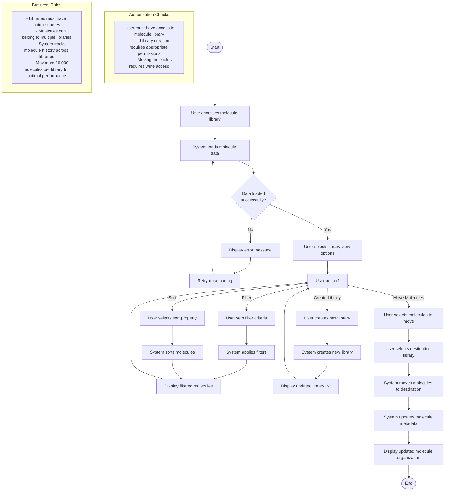
```mermaid
flowchart TD
    Start([Start]) --> A[User accesses molecule library]
    A --> B[System loads molecule data]
    B --> C{Data loaded<br>successfully?}
    C -->|No| D[Display error message]
    D --> E[Retry data loading]
    E --> B
    C -->|Yes| F[User selects library view options]
    
    F --> G[User action?]
    G -->|Filter| H[User sets filter criteria]
    G -->|Sort| I[User selects sort property]
    G -->|Create Library| J[User creates new library]
    G -->|Move Molecules| K[User selects molecules to move]
    
    H --> L[System applies filters]
    I --> M[System sorts molecules]
    J --> N[System creates new library]
    K --> O[User selects destination library]
    
    L --> P[Display filtered molecules]
    M --> P
    N --> Q[Display updated library list]
    O --> R[System moves molecules to destination]
    
    P --> G
    Q --> G
    R --> S[System updates molecule metadata]
    S --> T[Display updated molecule organization]
    T --> End([End])
    
    subgraph "Authorization Checks"
        AC1["- User must have access to molecule library
        - Library creation requires appropriate permissions
        - Moving molecules requires write access"]
    end
    
    subgraph "Business Rules"
        BR2["- Libraries must have unique names
        - Molecules can belong to multiple libraries
        - System tracks molecule history across libraries
        - Maximum 10,000 molecules per library for optimal performance"]
    end
```

#### 4.2.2 Error Handling and Recovery Workflow

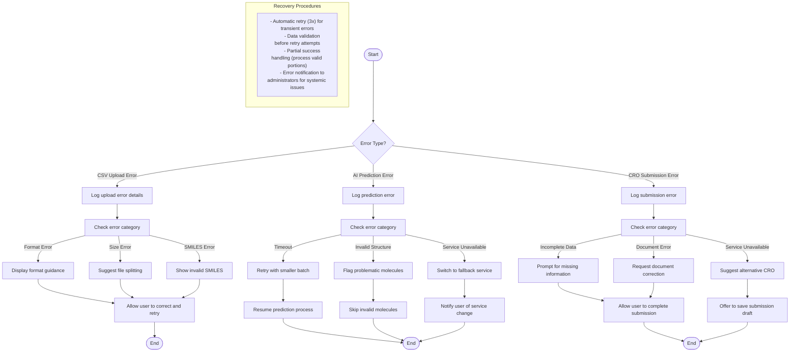
```mermaid
flowchart TD
    Start([Start]) --> A{Error Type?}
    
    A -->|CSV Upload Error| B[Log upload error details]
    B --> C[Check error category]
    C -->|Format Error| D[Display format guidance]
    C -->|Size Error| E[Suggest file splitting]
    C -->|SMILES Error| F[Show invalid SMILES]
    D --> G[Allow user to correct and retry]
    E --> G
    F --> G
    G --> End1([End])
    
    A -->|AI Prediction Error| H[Log prediction error]
    H --> I[Check error category]
    I -->|Timeout| J[Retry with smaller batch]
    I -->|Invalid Structure| K[Flag problematic molecules]
    I -->|Service Unavailable| L[Switch to fallback service]
    J --> M[Resume prediction process]
    K --> N[Skip invalid molecules]
    L --> O[Notify user of service change]
    M --> End2([End])
    N --> End2
    O --> End2
    
    A -->|CRO Submission Error| P[Log submission error]
    P --> Q[Check error category]
    Q -->|Incomplete Data| R[Prompt for missing information]
    Q -->|Document Error| S[Request document correction]
    Q -->|Service Unavailable| T[Suggest alternative CRO]
    R --> U[Allow user to complete submission]
    S --> U
    T --> V[Offer to save submission draft]
    U --> End3([End])
    V --> End3
    
    subgraph "Recovery Procedures"
        RP1["- Automatic retry (3x) for transient errors
        - Data validation before retry attempts
        - Partial success handling (process valid portions)
        - Error notification to administrators for systemic issues"]
    end
```

### 4.3 TECHNICAL IMPLEMENTATION

#### 4.3.1 State Management Diagram

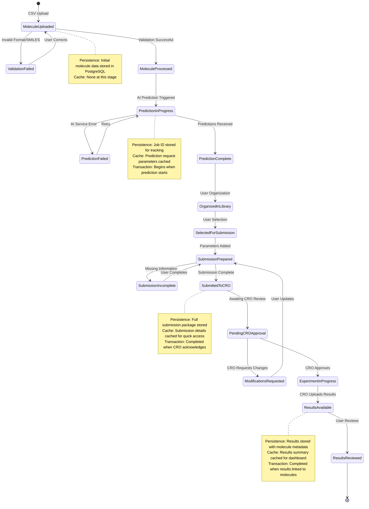
```mermaid
stateDiagram-v2
    [*] --> MoleculeUploaded: CSV Upload
    
    MoleculeUploaded --> ValidationFailed: Invalid Format/SMILES
    ValidationFailed --> MoleculeUploaded: User Corrects
    
    MoleculeUploaded --> MoleculeProcessed: Validation Successful
    MoleculeProcessed --> PredictionInProgress: AI Prediction Triggered
    
    PredictionInProgress --> PredictionFailed: AI Service Error
    PredictionFailed --> PredictionInProgress: Retry
    
    PredictionInProgress --> PredictionComplete: Predictions Received
    PredictionComplete --> OrganizedInLibrary: User Organization
    
    OrganizedInLibrary --> SelectedForSubmission: User Selection
    SelectedForSubmission --> SubmissionPrepared: Parameters Added
    
    SubmissionPrepared --> SubmissionIncomplete: Missing Information
    SubmissionIncomplete --> SubmissionPrepared: User Completes
    
    SubmissionPrepared --> SubmittedToCRO: Submission Complete
    SubmittedToCRO --> PendingCROApproval: Awaiting CRO Review
    
    PendingCROApproval --> ModificationsRequested: CRO Requests Changes
    ModificationsRequested --> SubmissionPrepared: User Updates
    
    PendingCROApproval --> ExperimentInProgress: CRO Approves
    ExperimentInProgress --> ResultsAvailable: CRO Uploads Results
    
    ResultsAvailable --> ResultsReviewed: User Reviews
    ResultsReviewed --> [*]
    
    note right of MoleculeUploaded
        Persistence: Initial molecule data stored in PostgreSQL
        Cache: None at this stage
    end note
    
    note right of PredictionInProgress
        Persistence: Job ID stored for tracking
        Cache: Prediction request parameters cached
        Transaction: Begins when prediction starts
    end note
    
    note right of SubmittedToCRO
        Persistence: Full submission package stored
        Cache: Submission details cached for quick access
        Transaction: Completed when CRO acknowledges
    end note
    
    note right of ResultsAvailable
        Persistence: Results stored with molecule metadata
        Cache: Results summary cached for dashboard
        Transaction: Completed when results linked to molecules
    end note
```

#### 4.3.2 Error Handling Strategy

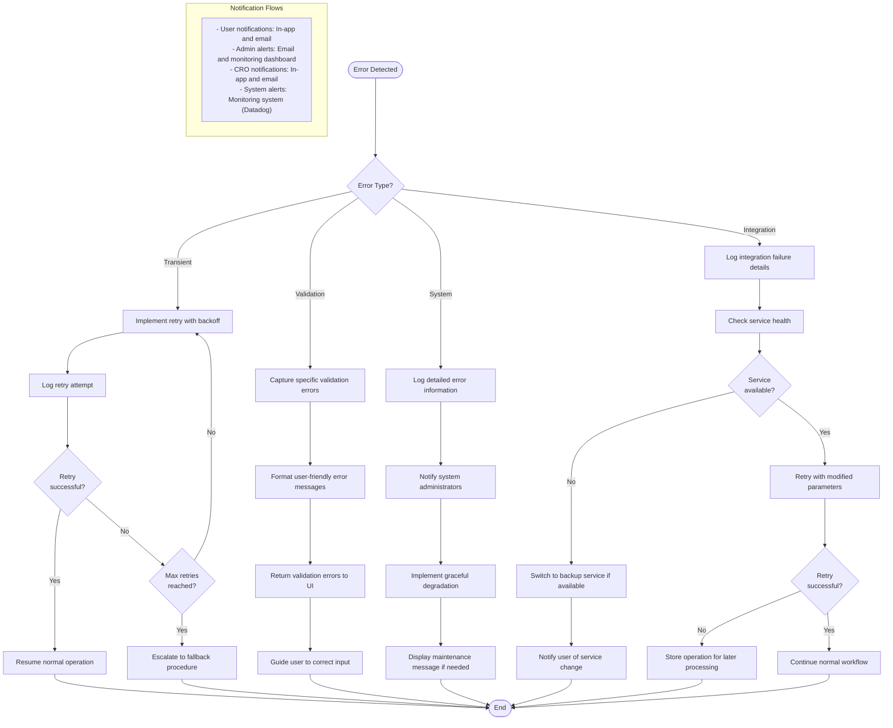
```mermaid
flowchart TD
    Start([Error Detected]) --> A{Error Type?}
    
    A -->|Transient| B[Implement retry with backoff]
    B --> C[Log retry attempt]
    C --> D{Retry<br>successful?}
    D -->|Yes| E[Resume normal operation]
    D -->|No| F{Max retries<br>reached?}
    F -->|No| B
    F -->|Yes| G[Escalate to fallback procedure]
    
    A -->|Validation| H[Capture specific validation errors]
    H --> I[Format user-friendly error messages]
    I --> J[Return validation errors to UI]
    J --> K[Guide user to correct input]
    
    A -->|System| L[Log detailed error information]
    L --> M[Notify system administrators]
    M --> N[Implement graceful degradation]
    N --> O[Display maintenance message if needed]
    
    A -->|Integration| P[Log integration failure details]
    P --> Q[Check service health]
    Q --> R{Service<br>available?}
    R -->|No| S[Switch to backup service if available]
    R -->|Yes| T[Retry with modified parameters]
    S --> U[Notify user of service change]
    T --> V{Retry<br>successful?}
    V -->|No| W[Store operation for later processing]
    V -->|Yes| X[Continue normal workflow]
    
    E --> End([End])
    G --> End
    K --> End
    O --> End
    U --> End
    W --> End
    X --> End
    
    subgraph "Notification Flows"
        NF1["- User notifications: In-app and email
        - Admin alerts: Email and monitoring dashboard
        - CRO notifications: In-app and email
        - System alerts: Monitoring system (Datadog)"]
    end
```

### 4.4 HIGH-LEVEL SYSTEM WORKFLOW

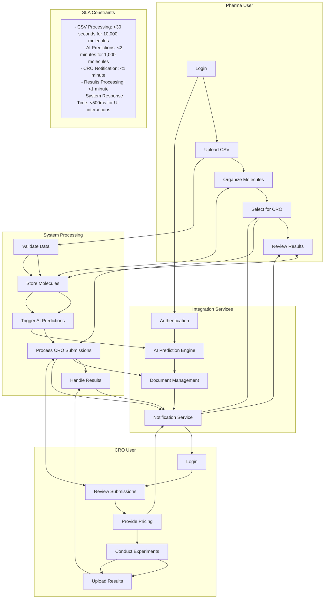
```mermaid
flowchart TD
    subgraph "Pharma User"
        A1[Login] --> A2[Upload CSV]
        A2 --> A3[Organize Molecules]
        A3 --> A4[Select for CRO]
        A4 --> A5[Review Results]
    end
    
    subgraph "System Processing"
        B1[Validate Data] --> B2[Store Molecules]
        B2 --> B3[Trigger AI Predictions]
        B3 --> B4[Process CRO Submissions]
        B4 --> B5[Handle Results]
    end
    
    subgraph "CRO User"
        C1[Login] --> C2[Review Submissions]
        C2 --> C3[Provide Pricing]
        C3 --> C4[Conduct Experiments]
        C4 --> C5[Upload Results]
    end
    
    subgraph "Integration Services"
        D1[Authentication] --> D2[AI Prediction Engine]
        D2 --> D3[Document Management]
        D3 --> D4[Notification Service]
    end
    
    A1 --> D1
    A2 --> B1
    B1 --> B2
    B2 --> B3
    B3 --> D2
    A3 <--> B2
    A4 --> B4
    B4 --> D3
    B4 --> D4 --> C1
    C2 <--> B4
    C3 --> D4 --> A4
    C4 --> C5
    C5 --> B5
    B5 --> D4 --> A5
    A5 <--> B2
    
    subgraph "SLA Constraints"
        SLA1["- CSV Processing: <30 seconds for 10,000 molecules
        - AI Predictions: <2 minutes for 1,000 molecules
        - CRO Notification: <1 minute
        - Results Processing: <1 minute
        - System Response Time: <500ms for UI interactions"]
    end
```

### 4.5 INTEGRATION SEQUENCE DIAGRAM

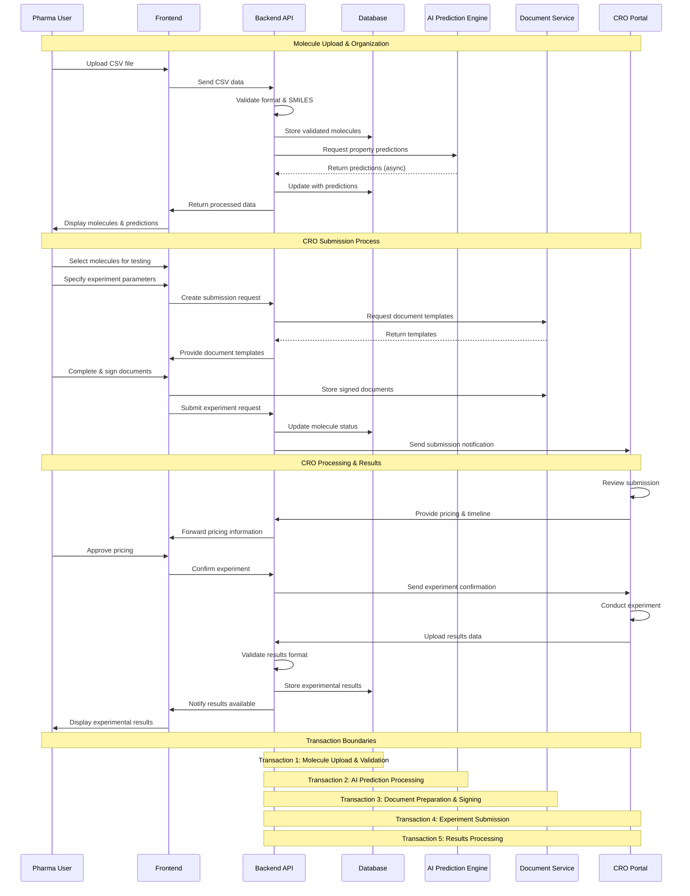
```mermaid
sequenceDiagram
    participant PU as Pharma User
    participant FE as Frontend
    participant BE as Backend API
    participant DB as Database
    participant AI as AI Prediction Engine
    participant DOC as Document Service
    participant CRO as CRO Portal
    
    Note over PU,CRO: Molecule Upload & Organization
    PU->>FE: Upload CSV file
    FE->>BE: Send CSV data
    BE->>BE: Validate format & SMILES
    BE->>DB: Store validated molecules
    BE->>AI: Request property predictions
    AI-->>BE: Return predictions (async)
    BE->>DB: Update with predictions
    BE->>FE: Return processed data
    FE->>PU: Display molecules & predictions
    
    Note over PU,CRO: CRO Submission Process
    PU->>FE: Select molecules for testing
    PU->>FE: Specify experiment parameters
    FE->>BE: Create submission request
    BE->>DOC: Request document templates
    DOC-->>BE: Return templates
    BE->>FE: Provide document templates
    PU->>FE: Complete & sign documents
    FE->>DOC: Store signed documents
    FE->>BE: Submit experiment request
    BE->>DB: Update molecule status
    BE->>CRO: Send submission notification
    
    Note over PU,CRO: CRO Processing & Results
    CRO->>CRO: Review submission
    CRO->>BE: Provide pricing & timeline
    BE->>FE: Forward pricing information
    PU->>FE: Approve pricing
    FE->>BE: Confirm experiment
    BE->>CRO: Send experiment confirmation
    CRO->>CRO: Conduct experiment
    CRO->>BE: Upload results data
    BE->>BE: Validate results format
    BE->>DB: Store experimental results
    BE->>FE: Notify results available
    FE->>PU: Display experimental results
    
    Note over PU,CRO: Transaction Boundaries
    Note over BE,DB: Transaction 1: Molecule Upload & Validation
    Note over BE,AI: Transaction 2: AI Prediction Processing
    Note over BE,DOC: Transaction 3: Document Preparation & Signing
    Note over BE,CRO: Transaction 4: Experiment Submission
    Note over CRO,BE: Transaction 5: Results Processing
```

## 5. SYSTEM ARCHITECTURE

### 5.1 HIGH-LEVEL ARCHITECTURE

#### 5.1.1 System Overview

The Molecular Data Management and CRO Integration Platform employs a **microservices architecture** to provide flexibility, scalability, and maintainability. This architectural approach was selected to accommodate the diverse functional requirements spanning molecular data processing, AI integration, and CRO workflow management.

Key architectural principles include:

- **Domain-driven design** with bounded contexts for molecular management, AI prediction, and CRO integration
- **API-first approach** enabling clean separation between frontend and backend services
- **Event-driven communication** for asynchronous processing of long-running operations
- **Defense in depth** security model with multiple layers of protection
- **Infrastructure as code** for consistent environment provisioning

The system boundaries encompass the web application, backend services, databases, and integration points with external systems (AI prediction engine, CRO systems, document management). Major interfaces include RESTful APIs for synchronous operations and message queues for asynchronous processes.

#### 5.1.2 Core Components Table

| Component Name | Primary Responsibility | Key Dependencies | Critical Considerations |
| --- | --- | --- | --- |
| Molecule Management Service | Handle molecule data ingestion, validation, and organization | PostgreSQL, S3, RDKit | SMILES validation performance, large dataset handling |
| AI Integration Service | Coordinate with external AI prediction engine | Message Queue, AI Engine API | Asynchronous processing, fault tolerance |
| CRO Submission Service | Manage experiment requests and CRO communication | Document Service, Notification Service | Secure data exchange, workflow state management |
| Document Exchange Service | Handle legal document management and e-signatures | S3, DocuSign API | Compliance with 21 CFR Part 11, audit trails |
| User Management Service | Handle authentication, authorization, and user profiles | OAuth Providers, RBAC System | Security, multi-tenant isolation |
| Frontend Application | Provide user interface for all system functions | Backend APIs, WebSockets | Responsive design, interactive visualizations |

#### 5.1.3 Data Flow Description

The primary data flow begins with CSV uploads containing molecular data (SMILES and properties). The Molecule Management Service validates this data using RDKit and stores it in PostgreSQL, with molecular structures indexed for efficient searching. Validated molecules are then sent to the AI Integration Service, which coordinates with the external AI engine to predict additional properties through asynchronous processing.

When users organize molecules into libraries and select candidates for testing, the CRO Submission Service creates experiment requests. These requests flow through the Document Exchange Service to handle legal requirements before being transmitted to CRO users. Communication between pharma and CRO users occurs through a secure messaging channel implemented with WebSockets for real-time updates.

Experimental results from CROs are processed by the Results Integration Service, which validates and transforms the data before storing it alongside the original molecular records. This creates a complete audit trail from computational prediction to experimental validation.

Key data stores include:

- PostgreSQL for relational data (molecules, properties, libraries, users)
- S3 for document storage and large CSV files
- Redis for caching frequently accessed data and session management
- Elasticsearch for advanced molecular searching capabilities

#### 5.1.4 External Integration Points

| System Name | Integration Type | Data Exchange Pattern | Protocol/Format | SLA Requirements |
| --- | --- | --- | --- | --- |
| AI Prediction Engine | Service API | Request-Response (Async) | REST/JSON | 95% of predictions \< 2 minutes |
| DocuSign | Third-party API | Request-Response | REST/JSON | 99.9% availability |
| CRO LIMS Systems (Optional) | Data Exchange | Batch Export/Import | REST/CSV | Daily synchronization |
| Enterprise SSO | Authentication | Federated Identity | SAML/OAuth 2.0 | 99.99% availability |
| AWS S3 | Storage Service | Direct Integration | S3 API | 99.99% durability |
| Monitoring Systems | Telemetry | Continuous Stream | OpenTelemetry | Real-time alerting |

### 5.2 COMPONENT DETAILS

#### 5.2.1 Molecule Management Service

**Purpose and Responsibilities:**

- CSV file parsing and validation
- SMILES structure validation using RDKit
- Molecule storage and indexing
- Library management and organization
- Property calculation and normalization

**Technologies and Frameworks:**

- Python 3.10+ with FastAPI
- RDKit for cheminformatics
- Pandas for data manipulation
- PostgreSQL with chemical structure extensions
- Celery for background processing

**Key Interfaces:**

- `/molecules/upload` - CSV upload endpoint
- `/molecules/validate` - SMILES validation endpoint
- `/molecules/libraries` - Library management endpoints
- `/molecules/properties` - Property management endpoints

**Data Persistence:**

- Molecules stored in PostgreSQL with chemical fingerprint indexing
- Large CSV files temporarily stored in S3
- Molecule-library relationships maintained in relational tables
- Property data normalized and indexed for efficient filtering

**Scaling Considerations:**

- Horizontal scaling for API layer
- Database read replicas for query-heavy operations
- Partitioning of molecule tables by library or project
- Caching of frequent queries with Redis

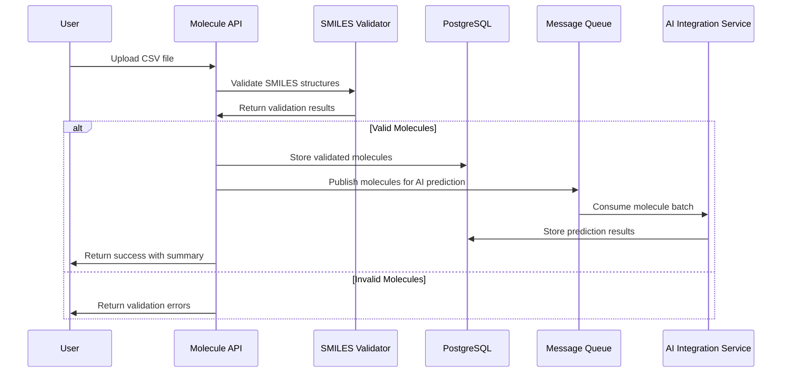
```mermaid
sequenceDiagram
    participant User
    participant API as Molecule API
    participant Validator as SMILES Validator
    participant DB as PostgreSQL
    participant Queue as Message Queue
    participant AI as AI Integration Service
    
    User->>API: Upload CSV file
    API->>Validator: Validate SMILES structures
    Validator->>API: Return validation results
    
    alt Valid Molecules
        API->>DB: Store validated molecules
        API->>Queue: Publish molecules for AI prediction
        Queue->>AI: Consume molecule batch
        AI->>DB: Store prediction results
        API->>User: Return success with summary
    else Invalid Molecules
        API->>User: Return validation errors
    end
```

#### 5.2.2 AI Integration Service

**Purpose and Responsibilities:**

- Coordinate with external AI prediction engine
- Manage prediction requests and responses
- Handle asynchronous processing of predictions
- Store and associate prediction results with molecules

**Technologies and Frameworks:**

- Python 3.10+ with FastAPI
- Redis for job queuing
- AWS SQS for reliable message delivery
- Pydantic for data validation

**Key Interfaces:**

- `/predictions/request` - Submit prediction requests
- `/predictions/status` - Check prediction status
- `/predictions/results` - Retrieve prediction results
- `/predictions/batch` - Batch prediction management

**Data Persistence:**

- Prediction requests and results stored in PostgreSQL
- Job status tracking in Redis
- Prediction metadata indexed for efficient querying

**Scaling Considerations:**

- Auto-scaling based on queue depth
- Batch processing for efficient API usage
- Circuit breakers for external API protection
- Retry mechanisms with exponential backoff

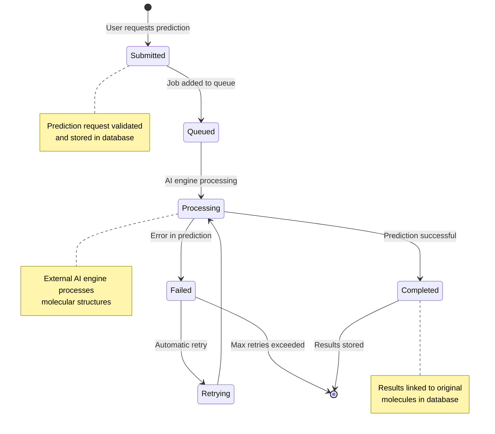
```mermaid
stateDiagram-v2
    [*] --> Submitted: User requests prediction
    Submitted --> Queued: Job added to queue
    Queued --> Processing: AI engine processing
    Processing --> Failed: Error in prediction
    Processing --> Completed: Prediction successful
    Failed --> Retrying: Automatic retry
    Retrying --> Processing
    Failed --> [*]: Max retries exceeded
    Completed --> [*]: Results stored
    
    note right of Submitted
        Prediction request validated
        and stored in database
    end note
    
    note right of Processing
        External AI engine processes
        molecular structures
    end note
    
    note right of Completed
        Results linked to original
        molecules in database
    end note
```

#### 5.2.3 CRO Submission Service

**Purpose and Responsibilities:**

- Manage experiment specifications and requests
- Coordinate CRO selection and communication
- Track submission status and history
- Handle pricing and approval workflows

**Technologies and Frameworks:**

- Python 3.10+ with FastAPI
- State machine for workflow management
- WebSockets for real-time communication
- PostgreSQL for data persistence

**Key Interfaces:**

- `/submissions/create` - Create new submission
- `/submissions/status` - Check submission status
- `/submissions/approve` - Approve pricing/timeline
- `/submissions/results` - Manage experimental results

**Data Persistence:**

- Submission records in PostgreSQL
- Workflow state transitions logged for audit
- Document references linked to submissions
- Results data associated with original molecules

**Scaling Considerations:**

- Stateless design for horizontal scaling
- Database connection pooling
- Caching of submission status
- Asynchronous processing of state transitions

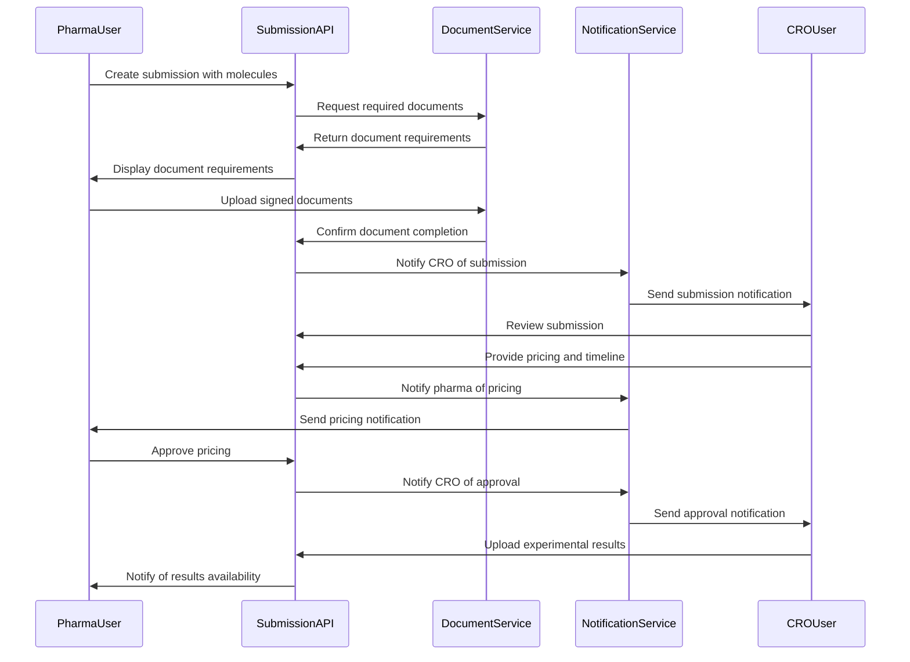
```mermaid
sequenceDiagram
    participant PharmaUser
    participant SubmissionAPI
    participant DocumentService
    participant NotificationService
    participant CROUser
    
    PharmaUser->>SubmissionAPI: Create submission with molecules
    SubmissionAPI->>DocumentService: Request required documents
    DocumentService->>SubmissionAPI: Return document requirements
    SubmissionAPI->>PharmaUser: Display document requirements
    
    PharmaUser->>DocumentService: Upload signed documents
    DocumentService->>SubmissionAPI: Confirm document completion
    
    SubmissionAPI->>NotificationService: Notify CRO of submission
    NotificationService->>CROUser: Send submission notification
    
    CROUser->>SubmissionAPI: Review submission
    CROUser->>SubmissionAPI: Provide pricing and timeline
    SubmissionAPI->>NotificationService: Notify pharma of pricing
    NotificationService->>PharmaUser: Send pricing notification
    
    PharmaUser->>SubmissionAPI: Approve pricing
    SubmissionAPI->>NotificationService: Notify CRO of approval
    NotificationService->>CROUser: Send approval notification
    
    CROUser->>SubmissionAPI: Upload experimental results
    SubmissionAPI->>PharmaUser: Notify of results availability
```

#### 5.2.4 Document Exchange Service

**Purpose and Responsibilities:**

- Manage legal and compliance documents
- Integrate with e-signature services
- Ensure document versioning and audit trails
- Control document access based on roles

**Technologies and Frameworks:**

- Python 3.10+ with FastAPI
- AWS S3 for document storage
- DocuSign API for e-signatures
- PostgreSQL for metadata storage

**Key Interfaces:**

- `/documents/upload` - Document upload endpoint
- `/documents/signature` - E-signature request endpoint
- `/documents/download` - Secure document retrieval
- `/documents/audit` - Audit trail access

**Data Persistence:**

- Documents stored in S3 with encryption
- Metadata and access logs in PostgreSQL
- Version history maintained for all documents
- Signature status tracked in relational tables

**Scaling Considerations:**

- S3 for virtually unlimited document storage
- Caching of document metadata
- Read replicas for audit log queries
- Connection pooling for database access

### 5.3 TECHNICAL DECISIONS

#### 5.3.1 Architecture Style Decisions

| Decision | Options Considered | Selection | Rationale |
| --- | --- | --- | --- |
| Overall Architecture | Monolith, Microservices, Serverless | Microservices | Better scalability for different components, team autonomy, technology flexibility |
| API Design | REST, GraphQL, gRPC | REST with some GraphQL | REST for standard operations, GraphQL for complex molecule queries |
| Frontend Architecture | MPA, SPA, SSR | SPA with React | Rich interactive experience needed for molecular visualization and organization |
| Deployment Model | VMs, Containers, Serverless | Containerized Microservices | Balance of control and scalability, consistent environments |

The microservices architecture was selected to allow independent scaling of the compute-intensive molecular processing components separately from the user-facing services. This approach also enables different teams to work on separate domains (molecular management, AI integration, CRO workflows) without tight coupling.

REST was chosen as the primary API style for its simplicity and broad support, with GraphQL added specifically for complex molecular queries where clients need flexible data retrieval patterns. This hybrid approach balances developer familiarity with the specific needs of scientific applications.

#### 5.3.2 Communication Pattern Choices

| Pattern | Use Case | Implementation | Justification |
| --- | --- | --- | --- |
| Synchronous REST | User-initiated actions, CRUD operations | FastAPI endpoints | Immediate feedback for user actions |
| Asynchronous Messaging | AI predictions, large CSV processing | AWS SQS, Celery | Long-running operations that shouldn't block user interface |
| WebSockets | Real-time notifications, CRO communication | FastAPI WebSockets | Interactive communication between pharma and CRO users |
| Batch Processing | Bulk molecule operations, nightly jobs | Celery scheduled tasks | Efficient processing of large datasets |

Asynchronous messaging was selected for AI predictions to handle the potentially long processing times without blocking the user interface. This pattern also provides natural retry capabilities and better fault tolerance for integration with external services.

WebSockets enable real-time communication between pharma and CRO users, creating a collaborative environment that reduces the traditional email back-and-forth that slows down experimental workflows.

#### 5.3.3 Data Storage Solution Rationale

| Data Type | Storage Solution | Key Features Used | Rationale |
| --- | --- | --- | --- |
| Molecular Data | PostgreSQL | Chemical extension, JSON support | Relational integrity with specialized chemical indexing |
| Document Storage | AWS S3 | Versioning, encryption, lifecycle policies | Scalable, secure storage with compliance features |
| Search Indexes | Elasticsearch | Chemical fingerprint indexing | Fast substructure and similarity searching |
| Caching Layer | Redis | In-memory storage, TTL, pub/sub | Performance optimization for frequent queries |

PostgreSQL was selected for molecular data due to its ability to handle both structured property data and chemical structures with specialized extensions. The relational model ensures data integrity across molecules, libraries, and experimental results.

S3 provides virtually unlimited storage for documents with built-in versioning and lifecycle policies that support compliance requirements. The combination with PostgreSQL for metadata creates a hybrid approach that optimizes for both document storage and queryability.

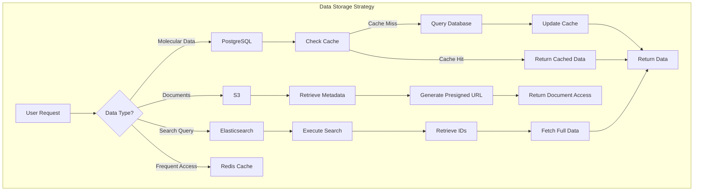
```mermaid
graph TD
    subgraph "Data Storage Strategy"
        A[User Request] --> B{Data Type?}
        B -->|Molecular Data| C[PostgreSQL]
        B -->|Documents| D[S3]
        B -->|Search Query| E[Elasticsearch]
        B -->|Frequent Access| F[Redis Cache]
        
        C --> G[Check Cache]
        G -->|Cache Miss| H[Query Database]
        G -->|Cache Hit| I[Return Cached Data]
        H --> J[Update Cache]
        J --> K[Return Data]
        I --> K
        
        D --> L[Retrieve Metadata]
        L --> M[Generate Presigned URL]
        M --> N[Return Document Access]
        
        E --> O[Execute Search]
        O --> P[Retrieve IDs]
        P --> Q[Fetch Full Data]
        Q --> K
    end
```

#### 5.3.4 Caching Strategy Justification

| Cache Type | Implementation | Data Cached | Invalidation Strategy |
| --- | --- | --- | --- |
| API Response Cache | Redis | Common molecule queries, library listings | TTL (5 minutes) + explicit invalidation on updates |
| Session Cache | Redis | User session data, authentication tokens | TTL based on session duration |
| Database Query Cache | PostgreSQL | Frequently accessed molecule properties | Automatic invalidation on data change |
| Static Asset Cache | CloudFront | UI components, molecular visualization assets | Version-based invalidation on deployment |

A multi-level caching strategy was implemented to optimize performance across different types of data access patterns. API response caching significantly improves the performance of molecule listing and filtering operations, which are frequently performed by users during molecule organization.

Session caching in Redis provides fast authentication checks without database queries on every request. The TTL-based invalidation ensures security while maintaining performance.

#### 5.3.5 Security Mechanism Selection

| Security Concern | Selected Mechanism | Implementation | Justification |
| --- | --- | --- | --- |
| Authentication | OAuth 2.0 + JWT | AWS Cognito | Industry standard, supports SSO integration |
| Authorization | RBAC with fine-grained permissions | Custom middleware | Complex permission requirements for molecule access |
| Data Encryption | AES-256 | AWS KMS, TLS 1.3 | Strong encryption for sensitive molecular IP |
| API Security | Rate limiting, input validation | API Gateway, Pydantic | Protection against abuse and injection attacks |
| Audit Logging | Structured logging, tamper-proof storage | CloudWatch Logs | 21 CFR Part 11 compliance requirement |

OAuth 2.0 was selected for authentication to support integration with enterprise identity providers while maintaining a consistent security model. The JWT implementation allows for stateless authentication with rich claims for authorization decisions.

RBAC with fine-grained permissions addresses the complex access control requirements where molecules may be shared across teams with different levels of access (view, edit, submit to CRO).

### 5.4 CROSS-CUTTING CONCERNS

#### 5.4.1 Monitoring and Observability Approach

The system implements a comprehensive monitoring strategy using the following components:

- **Metrics Collection**: Prometheus for system and application metrics
- **Logging**: Structured JSON logs with correlation IDs
- **Tracing**: OpenTelemetry for distributed tracing across services
- **Alerting**: PagerDuty integration for critical issues
- **Dashboards**: Grafana for visualization of system health

Key monitored metrics include:

- API response times (95th percentile \< 500ms)
- Molecule processing throughput (molecules/minute)
- AI prediction queue depth and processing time
- Error rates by service and endpoint
- Database query performance

Custom dashboards are provided for:

- Molecule processing pipeline health
- CRO submission workflow status
- System resource utilization
- Security and compliance metrics

#### 5.4.2 Logging and Tracing Strategy

| Log Type | Content | Storage | Retention |
| --- | --- | --- | --- |
| Application Logs | Service operations, user actions | CloudWatch Logs | 90 days active, 7 years archived |
| Security Logs | Authentication, authorization decisions | CloudWatch Logs | 7 years (compliance requirement) |
| Audit Logs | Document access, molecule submissions | CloudWatch Logs + S3 archive | 7 years (compliance requirement) |
| Performance Logs | Slow queries, API latency | CloudWatch Logs | 30 days |

All logs include:

- Correlation ID for request tracing
- User ID (where applicable)
- Timestamp in ISO 8601 format
- Service name and version
- Structured data in JSON format

Distributed tracing with OpenTelemetry provides end-to-end visibility across services, with particular focus on:

- CSV processing pipeline
- AI prediction workflow
- CRO submission process
- Document exchange operations

#### 5.4.3 Error Handling Patterns

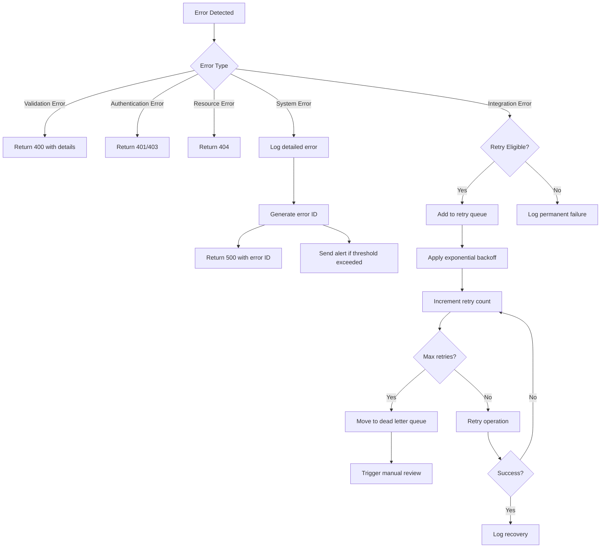
```mermaid
flowchart TD
    A[Error Detected] --> B{Error Type}
    
    B -->|Validation Error| C[Return 400 with details]
    B -->|Authentication Error| D[Return 401/403]
    B -->|Resource Error| E[Return 404]
    B -->|System Error| F[Log detailed error]
    
    F --> G[Generate error ID]
    G --> H[Return 500 with error ID]
    G --> I[Send alert if threshold exceeded]
    
    B -->|Integration Error| J{Retry Eligible?}
    J -->|Yes| K[Add to retry queue]
    J -->|No| L[Log permanent failure]
    
    K --> M[Apply exponential backoff]
    M --> N[Increment retry count]
    N --> O{Max retries?}
    O -->|No| P[Retry operation]
    O -->|Yes| Q[Move to dead letter queue]
    Q --> R[Trigger manual review]
    
    P --> S{Success?}
    S -->|Yes| T[Log recovery]
    S -->|No| N
```

The system implements a consistent error handling strategy across all components:

1. **Client-Facing Errors**:

   - Validation errors return 400 with specific field errors
   - Authentication/authorization errors return 401/403
   - Not found errors return 404 with consistent format

2. **System Errors**:

   - Logged with full context and stack trace
   - Assigned unique error ID returned to user
   - Alerts triggered based on frequency and severity

3. **Integration Errors**:

   - Retried with exponential backoff
   - Circuit breakers prevent cascade failures
   - Dead letter queues for manual investigation

4. **Recovery Procedures**:

   - Automated recovery for transient failures
   - Graceful degradation for non-critical services
   - Manual intervention workflows for critical failures

#### 5.4.4 Authentication and Authorization Framework

The authentication and authorization framework is built on AWS Cognito with custom authorization logic:

**Authentication Components**:

- OAuth 2.0 flows for web application
- JWT tokens with short expiration
- Refresh token rotation for security
- MFA for sensitive operations

**Authorization Model**:

- Role-based access control (RBAC) as foundation
- Resource-based permissions for molecules and libraries
- Attribute-based rules for special cases
- Permission inheritance through group membership

**Key Permission Sets**:

- Molecule Management (view, create, edit, delete)
- Library Organization (create, modify, share)
- CRO Submission (create, approve, view results)
- System Administration (user management, configuration)

**Implementation**:

- JWT claims contain roles and key attributes
- API Gateway validates token signature and expiration
- Service-level middleware enforces fine-grained permissions
- All authorization decisions are logged for audit

#### 5.4.5 Performance Requirements and SLAs

| Component | Metric | Target | Measurement Method |
| --- | --- | --- | --- |
| API Endpoints | Response Time | 95% \< 500ms | Application monitoring |
| CSV Processing | Throughput | 10,000 molecules/minute | Batch processing metrics |
| AI Prediction | Processing Time | 95% \< 2 minutes for 100 molecules | Queue monitoring |
| Search Functionality | Response Time | 95% \< 1 second | Application monitoring |
| Document Upload | Processing Time | 95% \< 5 seconds | Application monitoring |

**System-Wide SLAs**:

- 99.95% availability during business hours
- 99.9% availability after hours
- Maximum 1 hour recovery time for critical functions
- Maximum 4 hour recovery time for non-critical functions

**Scaling Triggers**:

- API servers scale when CPU \> 70% for 3 minutes
- Worker nodes scale when queue depth \> 1000 for 5 minutes
- Database read replicas added when read load \> 80% for 10 minutes

#### 5.4.6 Disaster Recovery Procedures

The disaster recovery strategy follows a warm standby approach with the following components:

**Backup Procedures**:

- Database: Daily full backups, hourly incremental backups
- Document Storage: Versioned with cross-region replication
- Configuration: Infrastructure as code in version control

**Recovery Time Objectives (RTO)**:

- Critical functions: 1 hour
- Non-critical functions: 4 hours
- Complete system: 8 hours

**Recovery Point Objectives (RPO)**:

- Database: 1 hour maximum data loss
- Document Storage: 15 minutes maximum data loss
- Transaction logs: 5 minutes maximum data loss

**Testing Schedule**:

- Quarterly recovery drills from backup
- Annual full disaster recovery simulation
- Automated recovery testing for critical components

**Failover Process**:

1. Detect failure through monitoring alerts
2. Initiate recovery workflow in secondary region
3. Restore data from latest backup
4. Verify system integrity and data consistency
5. Switch DNS to recovery environment
6. Notify users of temporary service interruption

## 6. SYSTEM COMPONENTS DESIGN

### 6.1 FRONTEND COMPONENTS

#### 6.1.1 Component Architecture

The frontend architecture follows a component-based design using React with a focus on reusability, maintainability, and performance. The architecture is organized into the following layers:

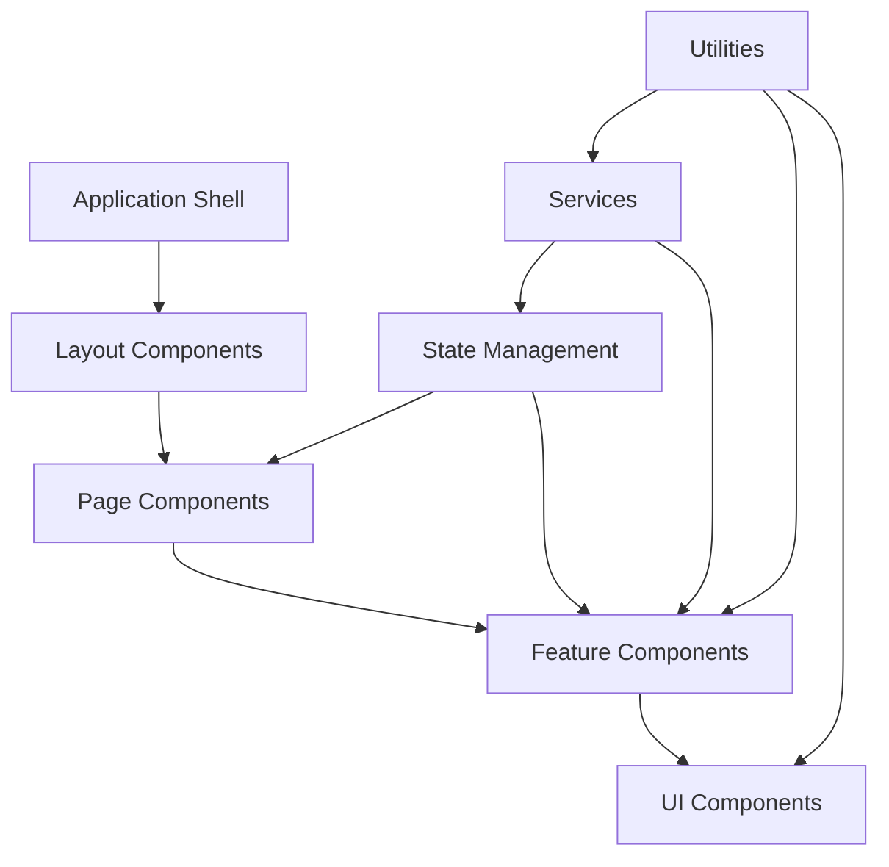
```mermaid
graph TD
    A[Application Shell] --> B[Layout Components]
    B --> C[Page Components]
    C --> D[Feature Components]
    D --> E[UI Components]
    F[State Management] --> C
    F --> D
    G[Services] --> D
    G --> F
    H[Utilities] --> D
    H --> E
    H --> G
```

**Component Categories:**

| Category | Description | Examples | Responsibility |
| --- | --- | --- | --- |
| Layout Components | Define the overall structure | AppLayout, SideNav, Header | Page structure and navigation |
| Page Components | Top-level route components | MoleculeDashboard, CROSubmission | Route handling and feature composition |
| Feature Components | Domain-specific components | MoleculeTable, LibraryManager | Business logic implementation |
| UI Components | Reusable visual elements | MoleculeCard, PropertyChart | Presentation and user interaction |
| Services | API communication | MoleculeService, CROService | Data fetching and mutation |
| State Management | Global state | Redux store, Context providers | Cross-component state coordination |
| Utilities | Helper functions | MoleculeFormatter, ValidationUtils | Shared functionality |

#### 6.1.2 Key Frontend Components

**Molecule Management Components:**

| Component | Purpose | Key Features | Dependencies |
| --- | --- | --- | --- |
| MoleculeUploader | Handle CSV file uploads | Drag-drop interface, column mapping, validation feedback | React Dropzone, CSV Parser |
| MoleculeTable | Display molecular data in tabular format | Sorting, filtering, pagination, selection | Material UI DataGrid, ChemDoodle |
| MoleculeCard | Display individual molecule details | Structure visualization, property display, action buttons | ChemDoodle Web, D3.js |
| LibraryManager | Organize molecules into libraries | Drag-drop organization, library creation/editing | React DnD, Redux |
| PropertyFilter | Filter molecules by properties | Range sliders, multi-select filters, saved filter presets | Material UI, Redux |

**CRO Integration Components:**

| Component | Purpose | Key Features | Dependencies |
| --- | --- | --- | --- |
| SubmissionBuilder | Create CRO submissions | Molecule selection, service specification, document attachment | Redux, Form validation |
| ExperimentQueue | Manage pending experiments | Status tracking, priority management, batch operations | Material UI, WebSockets |
| DocumentExchange | Handle legal document workflow | Document preview, e-signature integration, version tracking | PDF.js, DocuSign SDK |
| CROCommunication | Facilitate pharma-CRO messaging | Thread-based messaging, notification system, file sharing | WebSockets, Redux |
| ResultsViewer | Display experimental results | Data visualization, comparison with predictions, export options | D3.js, ChemDoodle |

#### 6.1.3 State Management Strategy

The application uses a hybrid state management approach:

1. **Redux** for global application state:

   - Molecule libraries and collections
   - User authentication and permissions
   - Application-wide settings and preferences
   - CRO submission status and workflow state

2. **React Context** for feature-specific state:

   - Current view configurations
   - UI component states (expanded/collapsed)
   - Form wizard progress

3. **React Query** for server state management:

   - API data fetching and caching
   - Optimistic updates
   - Background refetching
   - Pagination state

**State Organization:**

```mermaid
graph TD
    A[Redux Store] --> B[Auth Slice]
    A --> C[Molecules Slice]
    A --> D[Libraries Slice]
    A --> E[Submissions Slice]
    A --> F[UI Slice]
    
    G[React Context] --> H[MoleculeTableContext]
    G --> I[SubmissionWizardContext]
    G --> J[FilterContext]
    
    K[React Query] --> L[Molecules Queries]
    K --> M[Predictions Queries]
    K --> N[CRO Queries]
    K --> O[Results Queries]
```

#### 6.1.4 UI/UX Implementation

**Design System:**

The application implements a consistent design system with the following components:

| Element | Implementation | Purpose |
| --- | --- | --- |
| Color Palette | Material UI theming | Visual hierarchy and branding |
| Typography | Custom font scale | Readability and information hierarchy |
| Spacing | 8px grid system | Consistent component spacing |
| Components | Material UI + custom | Consistent interactive elements |
| Icons | Material Icons + custom scientific icons | Clear visual communication |

**Responsive Design Strategy:**

The application uses a mobile-first approach with the following breakpoints:

| Breakpoint | Target Devices | Layout Adjustments |
| --- | --- | --- |
| \< 600px | Mobile phones | Single column, stacked components |
| 600px - 960px | Tablets, small laptops | Two-column layout, condensed tables |
| \> 960px | Desktops, large displays | Multi-column layout, expanded visualizations |

**Accessibility Considerations:**

- WCAG 2.1 AA compliance for all components
- Keyboard navigation support for all interactive elements
- Screen reader compatibility with ARIA attributes
- Sufficient color contrast (minimum 4.5:1 ratio)
- Focus indicators for interactive elements

### 6.2 BACKEND SERVICES

#### 6.2.1 Service Architecture

The backend follows a microservices architecture organized around business domains:

```mermaid
graph TD
    A[API Gateway] --> B[Molecule Service]
    A --> C[AI Integration Service]
    A --> D[CRO Service]
    A --> E[Document Service]
    A --> F[User Service]
    
    B --> G[(Molecule DB)]
    C --> H[AI Engine]
    D --> I[(Submission DB)]
    E --> J[Document Storage]
    F --> K[(User DB)]
    
    L[Message Queue] --- B
    L --- C
    L --- D
```

**Service Boundaries:**

| Service | Responsibility | Domain Objects | External Dependencies |
| --- | --- | --- | --- |
| Molecule Service | Molecule data management | Molecule, Property, Library | RDKit, PostgreSQL |
| AI Integration Service | Property prediction coordination | Prediction, Model, Job | External AI Engine, Redis |
| CRO Service | Experiment submission workflow | Submission, Experiment, Result | SQS, PostgreSQL |
| Document Service | Legal document management | Document, Signature, Template | S3, DocuSign |
| User Service | Authentication and authorization | User, Role, Permission | Cognito, PostgreSQL |

#### 6.2.2 API Design

The API follows RESTful principles with the following structure:

**Molecule Service API:**

| Endpoint | Method | Purpose | Request Body | Response |
| --- | --- | --- | --- | --- |
| /molecules | POST | Upload molecules | CSV file, mapping config | Upload summary |
| /molecules | GET | List molecules | Filters, pagination | Molecule list |
| /molecules/{id} | GET | Get molecule details | - | Molecule details |
| /molecules/batch | POST | Batch operations | Operation type, molecule IDs | Operation result |
| /libraries | GET | List libraries | - | Library list |
| /libraries | POST | Create library | Library metadata | Library details |
| /libraries/{id}/molecules | POST | Add molecules to library | Molecule IDs | Updated library |

**CRO Service API:**

| Endpoint | Method | Purpose | Request Body | Response |
| --- | --- | --- | --- | --- |
| /submissions | POST | Create submission | Molecules, specifications | Submission details |
| /submissions | GET | List submissions | Filters, pagination | Submission list |
| /submissions/{id} | GET | Get submission details | - | Submission details |
| /submissions/{id}/status | PATCH | Update submission status | New status, comments | Updated submission |
| /submissions/{id}/documents | POST | Attach document | Document metadata, file | Document details |
| /submissions/{id}/results | POST | Upload results | Results data, metadata | Results summary |

**API Versioning Strategy:**

- URL-based versioning (e.g., `/api/v1/molecules`)
- Backward compatibility maintained for at least one previous version
- Deprecation notices provided at least 6 months before endpoint removal

**API Documentation:**

- OpenAPI 3.0 specification for all endpoints
- Automatic documentation generation with FastAPI
- Interactive API explorer with Swagger UI
- Code examples for common operations

#### 6.2.3 Data Processing Pipelines

**Molecule Ingestion Pipeline:**

```mermaid
flowchart LR
    A[CSV Upload] --> B[File Validation]
    B --> C[Column Mapping]
    C --> D[SMILES Validation]
    D --> E[Property Extraction]
    E --> F[Database Storage]
    F --> G[AI Prediction Trigger]
    G --> H[Library Assignment]
```

**Pipeline Components:**

| Component | Implementation | Responsibility | Performance Considerations |
| --- | --- | --- | --- |
| File Validation | FastAPI + Pydantic | Validate CSV format and structure | Memory-efficient streaming for large files |
| Column Mapping | Custom mapper | Map CSV columns to system properties | User-guided mapping with suggestions |
| SMILES Validation | RDKit | Validate chemical structures | Parallel processing for large batches |
| Property Extraction | Pandas | Extract and normalize property values | Chunked processing for memory efficiency |
| Database Storage | SQLAlchemy | Store molecules and properties | Bulk insert operations |
| AI Prediction | SQS + Lambda | Trigger asynchronous predictions | Batched requests to AI engine |
| Library Assignment | PostgreSQL | Organize molecules into libraries | Efficient many-to-many relationships |

**CRO Submission Pipeline:**

```mermaid
flowchart LR
    A[Submission Creation] --> B[Molecule Validation]
    B --> C[Specification Validation]
    C --> D[Document Collection]
    D --> E[Submission Package Creation]
    E --> F[CRO Notification]
    F --> G[Status Tracking]
    G --> H[Results Processing]
```

**Error Handling Strategy:**

| Error Type | Handling Approach | User Feedback | Recovery Mechanism |
| --- | --- | --- | --- |
| CSV Format Errors | Validation before processing | Detailed error messages with line numbers | Guided correction workflow |
| SMILES Validation Errors | Partial processing with error flagging | List of invalid structures | Option to skip or correct |
| Database Errors | Transaction rollback | Generic error with support reference | Automatic retry with exponential backoff |
| AI Service Errors | Circuit breaker pattern | Notification of prediction delay | Background retry with status updates |
| CRO Integration Errors | Message queue with dead letter queue | Submission status update | Manual intervention workflow |

#### 6.2.4 Background Processing

**Job Types and Implementation:**

| Job Type | Implementation | Scheduling | Retry Strategy | Monitoring |
| --- | --- | --- | --- | --- |
| AI Prediction | Celery + Redis | On-demand after upload | 3 retries with exponential backoff | Queue depth, processing time |
| Large CSV Processing | Celery + Redis | On-demand after upload | 2 retries with notification | Progress tracking, memory usage |
| CRO Notification | AWS SQS + Lambda | On submission creation | 5 retries over 24 hours | Delivery status, failure rate |
| Document Processing | AWS Step Functions | On document upload | State-dependent retry logic | Step completion, error rates |
| Results Integration | Celery + Redis | On result upload | 3 retries with manual fallback | Processing time, error rate |

**Job Coordination:**

- Distributed task queue with Redis for short-lived jobs
- AWS SQS for reliable message delivery between services
- AWS Step Functions for complex workflows with multiple stages
- Dead letter queues for failed jobs requiring manual intervention

**Monitoring and Alerting:**

- Real-time job status dashboard for administrators
- Automatic alerts for queue backlog exceeding thresholds
- Job failure notifications with error context
- Performance metrics for job processing time and resource usage

### 6.3 DATABASE DESIGN

#### 6.3.1 Data Models

**Core Domain Models:**

```mermaid
erDiagram
    User ||--o{ Library : owns
    User ||--o{ Submission : creates
    Molecule ||--o{ MoleculeProperty : has
    Molecule }o--o{ Library : belongs_to
    Molecule ||--o{ PredictedProperty : has
    Molecule }o--o{ Submission : included_in
    Submission ||--o{ Document : contains
    Submission ||--o{ Result : receives
    CROService ||--o{ Submission : fulfills
    Result ||--o{ ResultProperty : contains
```

**Key Entities and Attributes:**

| Entity | Key Attributes | Relationships | Constraints |
| --- | --- | --- | --- |
| User | id, email, name, role | Libraries, Submissions | Unique email |
| Molecule | id, smiles, inchi_key, created_at | Properties, Libraries, Submissions | Unique inchi_key |
| MoleculeProperty | molecule_id, name, value, units | Molecule | Composite key (molecule_id, name) |
| Library | id, name, description, owner_id | User, Molecules | Unique name per user |
| Submission | id, status, created_at, cro_service_id | User, Molecules, Documents, Results | - |
| Document | id, submission_id, type, status, url | Submission | - |
| Result | id, submission_id, status, uploaded_at | Submission, ResultProperties | - |
| ResultProperty | result_id, molecule_id, name, value | Result, Molecule | Composite key (result_id, molecule_id, name) |
| CROService | id, name, description, provider | Submissions | Unique name |

#### 6.3.2 Schema Design

**PostgreSQL Schema:**

```sql
-- Users and Authentication
CREATE TABLE users (
    id UUID PRIMARY KEY,
    email VARCHAR(255) UNIQUE NOT NULL,
    name VARCHAR(255) NOT NULL,
    role VARCHAR(50) NOT NULL,
    created_at TIMESTAMP NOT NULL DEFAULT NOW(),
    last_login TIMESTAMP
);

-- Molecules and Properties
CREATE TABLE molecules (
    id UUID PRIMARY KEY,
    smiles TEXT NOT NULL,
    inchi_key VARCHAR(27) UNIQUE NOT NULL,
    molecular_weight FLOAT,
    formula VARCHAR(255),
    created_at TIMESTAMP NOT NULL DEFAULT NOW(),
    created_by UUID REFERENCES users(id)
);

CREATE TABLE molecule_properties (
    molecule_id UUID REFERENCES molecules(id),
    name VARCHAR(100) NOT NULL,
    value FLOAT,
    units VARCHAR(50),
    source VARCHAR(50) NOT NULL,
    PRIMARY KEY (molecule_id, name)
);

-- Libraries and Organization
CREATE TABLE libraries (
    id UUID PRIMARY KEY,
    name VARCHAR(100) NOT NULL,
    description TEXT,
    owner_id UUID REFERENCES users(id),
    created_at TIMESTAMP NOT NULL DEFAULT NOW(),
    UNIQUE (owner_id, name)
);

CREATE TABLE library_molecules (
    library_id UUID REFERENCES libraries(id),
    molecule_id UUID REFERENCES molecules(id),
    added_at TIMESTAMP NOT NULL DEFAULT NOW(),
    added_by UUID REFERENCES users(id),
    PRIMARY KEY (library_id, molecule_id)
);

-- CRO Integration
CREATE TABLE cro_services (
    id UUID PRIMARY KEY,
    name VARCHAR(100) UNIQUE NOT NULL,
    description TEXT,
    provider VARCHAR(255) NOT NULL,
    active BOOLEAN NOT NULL DEFAULT TRUE
);

CREATE TABLE submissions (
    id UUID PRIMARY KEY,
    name VARCHAR(255) NOT NULL,
    status VARCHAR(50) NOT NULL,
    cro_service_id UUID REFERENCES cro_services(id),
    created_by UUID REFERENCES users(id),
    created_at TIMESTAMP NOT NULL DEFAULT NOW(),
    updated_at TIMESTAMP NOT NULL DEFAULT NOW()
);

CREATE TABLE submission_molecules (
    submission_id UUID REFERENCES submissions(id),
    molecule_id UUID REFERENCES molecules(id),
    PRIMARY KEY (submission_id, molecule_id)
);

CREATE TABLE documents (
    id UUID PRIMARY KEY,
    submission_id UUID REFERENCES submissions(id),
    name VARCHAR(255) NOT NULL,
    type VARCHAR(50) NOT NULL,
    status VARCHAR(50) NOT NULL,
    url TEXT NOT NULL,
    uploaded_at TIMESTAMP NOT NULL DEFAULT NOW(),
    uploaded_by UUID REFERENCES users(id)
);

CREATE TABLE results (
    id UUID PRIMARY KEY,
    submission_id UUID REFERENCES submissions(id),
    status VARCHAR(50) NOT NULL,
    uploaded_at TIMESTAMP NOT NULL DEFAULT NOW(),
    uploaded_by UUID REFERENCES users(id)
);

CREATE TABLE result_properties (
    result_id UUID REFERENCES results(id),
    molecule_id UUID REFERENCES molecules(id),
    name VARCHAR(100) NOT NULL,
    value FLOAT,
    units VARCHAR(50),
    PRIMARY KEY (result_id, molecule_id, name)
);
```

**Indexing Strategy:**

| Table | Index | Type | Purpose | Performance Impact |
| --- | --- | --- | --- | --- |
| molecules | inchi_key | B-tree | Unique molecule lookup | High positive impact for deduplication |
| molecules | created_at | B-tree | Time-based queries | Medium impact for recent uploads |
| molecule_properties | (molecule_id, name) | B-tree | Property lookup | High impact for filtering |
| library_molecules | (library_id, molecule_id) | B-tree | Library membership | High impact for library views |
| submissions | status | B-tree | Status-based filtering | Medium impact for workflow views |
| submissions | created_at | B-tree | Time-based queries | Medium impact for recent submissions |
| result_properties | (result_id, molecule_id) | B-tree | Result lookup | High impact for result display |

**Partitioning Strategy:**

For large-scale deployments, the following partitioning strategies will be implemented:

| Table | Partitioning Method | Key | Retention Policy |
| --- | --- | --- | --- |
| molecules | Range | created_at (monthly) | No automatic purging |
| molecule_properties | List | source | No automatic purging |
| library_molecules | Range | added_at (monthly) | No automatic purging |
| submissions | Range | created_at (monthly) | Archive after 2 years |
| results | Range | uploaded_at (monthly) | Archive after 2 years |

#### 6.3.3 Data Access Patterns

**Common Query Patterns:**

| Use Case | Query Pattern | Optimization Strategy |
| --- | --- | --- |
| Molecule filtering by properties | Join molecules with properties, filter by range | Materialized views for common filters |
| Library contents retrieval | Join libraries with molecules | Denormalized counts for pagination |
| Submission status tracking | Filter submissions by status | Status-specific indexes |
| Result analysis | Join results with molecules and properties | Composite indexes for common analyses |
| User's recent activities | Filter by user_id and timestamp | User-specific activity views |

**Data Access Layer Implementation:**

The data access layer follows the repository pattern with the following components:

| Component | Implementation | Responsibility |
| --- | --- | --- |
| Base Repository | SQLAlchemy base class | Common CRUD operations |
| Molecule Repository | Extended repository | Molecule-specific queries and operations |
| Library Repository | Extended repository | Library management and molecule organization |
| Submission Repository | Extended repository | Submission workflow and status management |
| Result Repository | Extended repository | Result processing and integration |

**Caching Strategy:**

| Data Type | Cache Implementation | TTL | Invalidation Trigger |
| --- | --- | --- | --- |
| Molecule lists | Redis | 5 minutes | New molecule upload |
| Library contents | Redis | 10 minutes | Library modification |
| User preferences | Redis | 1 hour | User preference update |
| Submission status | Redis | 1 minute | Status change |
| Common property filters | Redis | 30 minutes | New molecule upload |

### 6.4 INTEGRATION COMPONENTS

#### 6.4.1 AI Engine Integration

**Integration Architecture:**

```mermaid
sequenceDiagram
    participant MS as Molecule Service
    participant AIS as AI Integration Service
    participant MQ as Message Queue
    participant AIE as External AI Engine
    participant DB as Database
    
    MS->>MQ: Publish molecule batch
    MQ->>AIS: Consume molecule batch
    AIS->>AIS: Prepare prediction request
    AIS->>AIE: Submit prediction request
    AIE->>AIE: Process predictions
    AIE->>AIS: Return prediction results
    AIS->>DB: Store prediction results
    AIS->>MQ: Publish completion event
    MQ->>MS: Consume completion event
```

**API Contract:**

| Endpoint | Method | Request Format | Response Format | Error Handling |
| --- | --- | --- | --- | --- |
| /predictions/batch | POST | JSON with SMILES array and property requests | Job ID for tracking | 400 for invalid request, 503 for service unavailable |
| /predictions/status/{jobId} | GET | Job ID in path | Job status and completion percentage | 404 for unknown job |
| /predictions/results/{jobId} | GET | Job ID in path | Array of molecules with predicted properties | 404 for unknown job, 204 for incomplete job |

**Fault Tolerance:**

- Circuit breaker pattern to prevent cascading failures
- Retry mechanism with exponential backoff
- Fallback to cached predictions for common molecules
- Graceful degradation when AI service is unavailable

**Performance Optimization:**

- Batch processing of molecules (100 per request)
- Parallel requests for different property types
- Caching of prediction results for identical molecules
- Prioritization queue for urgent predictions

#### 6.4.2 CRO Integration

**Integration Architecture:**

```mermaid
sequenceDiagram
    participant PS as Pharma User Service
    participant SS as Submission Service
    participant DS as Document Service
    participant NS as Notification Service
    participant CS as CRO Service
    
    PS->>SS: Create submission
    SS->>DS: Request document templates
    DS->>SS: Return document requirements
    SS->>NS: Notify CRO of new submission
    NS->>CS: Deliver notification
    CS->>SS: Update submission status
    CS->>DS: Upload signed documents
    DS->>SS: Confirm document completion
    CS->>SS: Upload experimental results
    SS->>NS: Notify pharma of results
    NS->>PS: Deliver results notification
```

**Communication Protocols:**

| Integration Point | Protocol | Format | Security | Reliability Mechanism |
| --- | --- | --- | --- | --- |
| Submission Notification | WebSockets + SQS | JSON | JWT authentication | Message persistence in SQS |
| Document Exchange | REST + S3 | JSON + Binary | Signed URLs | S3 versioning and replication |
| Status Updates | WebSockets | JSON | JWT authentication | Acknowledgment required |
| Results Upload | REST + S3 | CSV + JSON | Signed URLs | Checksums and validation |

**Data Transformation:**

| Source Format | Target Format | Transformation Logic | Validation Rules |
| --- | --- | --- | --- |
| Internal molecule representation | CRO-compatible format | Property mapping, unit conversion | Required fields present, valid ranges |
| CRO result format | Internal result schema | Property extraction, normalization | Data completeness, value ranges |
| Legal document templates | Filled documents | Template variable substitution | Required fields completed |
| Experimental specifications | CRO protocol format | Protocol mapping, parameter translation | Protocol completeness, parameter validity |

**Integration Testing:**

- Mock CRO service for automated testing
- Sandbox environment for end-to-end testing
- Contract tests for API compatibility
- Chaos testing for reliability verification

#### 6.4.3 Document Management Integration

**Integration Architecture:**

```mermaid
flowchart TD
    A[Document Service] --> B{Document Type}
    B -->|Legal| C[DocuSign Integration]
    B -->|Specifications| D[Template Engine]
    B -->|Results| E[S3 Storage]
    
    C --> F[E-Signature Flow]
    D --> G[PDF Generation]
    E --> H[Secure Access Control]
    
    F --> I[Status Tracking]
    G --> J[Version Control]
    H --> K[Audit Logging]
```

**DocuSign Integration:**

| Feature | Implementation | Configuration | Compliance Consideration |
| --- | --- | --- | --- |
| Template Management | DocuSign Templates API | Pre-configured templates for NDAs, MSAs | Template versioning for audit |
| Envelope Creation | DocuSign eSignature API | Dynamic recipient routing | 21 CFR Part 11 compliance |
| Signature Workflow | DocuSign Embedded Signing | In-app signing experience | Signature verification |
| Status Tracking | DocuSign Connect Webhooks | Real-time status updates | Complete audit trail |

**Document Storage:**

| Document Type | Storage Location | Retention Policy | Access Control |
| --- | --- | --- | --- |
| Legal Agreements | S3 + PostgreSQL metadata | 7 years minimum | Role-based with explicit grants |
| Experimental Specifications | S3 + PostgreSQL metadata | Project lifetime | Submission-based access |
| Result Reports | S3 + PostgreSQL metadata | Project lifetime | Result-based access |
| Audit Logs | CloudWatch Logs + S3 archive | 7 years minimum | Admin-only access |

**Compliance Features:**

- Digital signatures compliant with 21 CFR Part 11
- Complete audit trail of document access and modifications
- Version control for all documents
- Tamper-evident storage with checksums
- Retention policies enforced at the storage level

### 6.5 SECURITY COMPONENTS

#### 6.5.1 Authentication and Authorization

**Authentication Flow:**

```mermaid
sequenceDiagram
    participant User
    participant Frontend
    participant AuthService
    participant Cognito
    participant API
    
    User->>Frontend: Login request
    Frontend->>AuthService: Forward credentials
    AuthService->>Cognito: Authenticate user
    Cognito->>AuthService: Return tokens
    AuthService->>Frontend: Return JWT
    Frontend->>API: Request with JWT
    API->>API: Validate JWT
    API->>API: Check permissions
    API->>Frontend: Return response
```

**Authorization Model:**

| Role | Permissions | Access Scope | Restrictions |
| --- | --- | --- | --- |
| Admin | Full system access | All resources | None |
| Pharma Manager | Create/manage all pharma resources | Organization-wide | Cannot access other organizations |
| Pharma Scientist | Create/use molecules and libraries | Assigned projects | Cannot submit to CRO without approval |
| CRO Manager | Manage all CRO submissions | All submissions to CRO | Cannot access pharma internal data |
| CRO Technician | Process assigned submissions | Assigned submissions | Cannot modify pricing or terms |

**Permission Implementation:**

- Role-based access control (RBAC) as foundation
- Resource-based permissions for fine-grained control
- Attribute-based rules for dynamic authorization
- JWT claims contain roles and key attributes
- API Gateway validates token signature and expiration
- Service-level middleware enforces fine-grained permissions

#### 6.5.2 Data Protection

**Encryption Strategy:**

| Data Category | At Rest | In Transit | Key Management |
| --- | --- | --- | --- |
| User credentials | Cognito managed (AES-256) | TLS 1.3 | AWS managed |
| Molecule structures | AES-256 (RDS encryption) | TLS 1.3 | AWS KMS |
| Proprietary data | AES-256 (RDS encryption) | TLS 1.3 | AWS KMS |
| Documents | AES-256 (S3 encryption) | TLS 1.3 | AWS KMS |
| Backups | AES-256 (S3 encryption) | TLS 1.3 | AWS KMS |

**Data Classification:**

| Classification | Examples | Protection Requirements | Handling Procedures |
| --- | --- | --- | --- |
| Public | Published molecules, service descriptions | Basic encryption | No special handling |
| Internal | Molecule libraries, experiment protocols | Encryption, access controls | Role-based access |
| Confidential | Novel molecules, proprietary assays | Strong encryption, strict access controls | Audit logging, need-to-know basis |
| Restricted | Legal agreements, financial terms | Maximum security measures | Explicit grants, DLP monitoring |

**Privacy Controls:**

- Data minimization principles applied to all collections
- Explicit consent for data sharing between organizations
- Data anonymization for analytical purposes
- Configurable data retention policies
- Right to erasure support for non-essential data

#### 6.5.3 Compliance Features

**21 CFR Part 11 Compliance:**

| Requirement | Implementation | Validation Approach |
| --- | --- | --- |
| Electronic Signatures | DocuSign qualified signatures | Compliance documentation, audit trails |
| Audit Trails | Comprehensive logging of all actions | Tamper-evident storage, retention policies |
| System Validation | IQ/OQ/PQ documentation | Validation protocol execution |
| Access Controls | Role-based with strong authentication | Regular access reviews |
| Record Retention | Configurable retention policies | Automated enforcement |

**Security Monitoring:**

| Monitoring Type | Implementation | Alert Triggers | Response Procedure |
| --- | --- | --- | --- |
| Authentication Monitoring | Cognito + CloudTrail | Failed login attempts, unusual patterns | Account lockout, security notification |
| API Access Monitoring | API Gateway + CloudWatch | Unauthorized access attempts, unusual volume | Rate limiting, IP blocking |
| Data Access Monitoring | Database audit logs | Sensitive data access, bulk downloads | Access review, potential lockdown |
| Infrastructure Monitoring | AWS GuardDuty | Unusual network activity, potential threats | Automated remediation, security team notification |

**Incident Response:**

- Defined security incident response plan
- Automated alerts for security events
- Forensic logging for incident investigation
- Regular security drills and tabletop exercises
- Post-incident review process

### 6.6 DEPLOYMENT COMPONENTS

#### 6.6.1 Infrastructure Design

**AWS Infrastructure:**

```mermaid
graph TD
    subgraph "Public Subnet"
        ALB[Application Load Balancer]
        WAF[AWS WAF]
    end
    
    subgraph "Private Subnet - Web Tier"
        ECS1[ECS Cluster - Frontend]
        API[API Gateway]
    end
    
    subgraph "Private Subnet - Application Tier"
        ECS2[ECS Cluster - Backend Services]
        Lambda[Lambda Functions]
        SQS[SQS Queues]
    end
    
    subgraph "Private Subnet - Data Tier"
        RDS[RDS PostgreSQL]
        ElastiCache[Redis ElastiCache]
        ES[Elasticsearch]
    end
    
    subgraph "Storage"
        S3[S3 Buckets]
    end
    
    subgraph "Security & Monitoring"
        Cognito[Cognito]
        CloudWatch[CloudWatch]
        GuardDuty[GuardDuty]
    end
    
    WAF --> ALB
    ALB --> ECS1
    ALB --> API
    API --> ECS2
    API --> Lambda
    ECS2 --> SQS
    Lambda --> SQS
    ECS2 --> RDS
    ECS2 --> ElastiCache
    ECS2 --> ES
    ECS2 --> S3
    Lambda --> S3
    ECS1 --> API
    API --> Cognito
    ECS2 --> CloudWatch
    Lambda --> CloudWatch
    RDS --> CloudWatch
```

**Infrastructure Components:**

| Component | Purpose | Sizing | Scaling Strategy |
| --- | --- | --- | --- |
| ECS Clusters | Container orchestration | 2+ t3.medium instances per service | Auto-scaling based on CPU/memory |
| RDS PostgreSQL | Primary database | db.r5.large, Multi-AZ | Read replicas for scaling reads |
| ElastiCache Redis | Caching, job queue | cache.m5.large, cluster mode | Auto-scaling based on memory pressure |
| S3 Buckets | Document storage, backups | Standard tier | No scaling needed |
| Lambda Functions | Event processing | 1024MB memory | Concurrent execution scaling |
| API Gateway | API management | Standard tier | Auto-scaling built-in |
| SQS Queues | Asynchronous messaging | Standard queues | Auto-scaling built-in |
| Elasticsearch | Molecular search | 3+ r5.large.elasticsearch | Auto-scaling based on CPU/memory |

**Network Design:**

- VPC with public and private subnets across 3 availability zones
- Public subnets contain only load balancers and NAT gateways
- Private subnets for application and data tiers
- Security groups with principle of least privilege
- Network ACLs for subnet-level protection
- VPC endpoints for AWS service access without internet

#### 6.6.2 Containerization Strategy

**Container Architecture:**

| Service | Base Image | Container Configuration | Resource Limits |
| --- | --- | --- | --- |
| Frontend | nginx:alpine | Static asset serving | 0.5 CPU, 512MB RAM |
| API Gateway | node:16-alpine | API routing and authentication | 1 CPU, 1GB RAM |
| Molecule Service | python:3.10-slim | FastAPI application with RDKit | 2 CPU, 4GB RAM |
| AI Integration Service | python:3.10-slim | FastAPI application | 1 CPU, 2GB RAM |
| CRO Service | python:3.10-slim | FastAPI application | 1 CPU, 2GB RAM |
| Document Service | python:3.10-slim | FastAPI application | 1 CPU, 2GB RAM |
| Worker Service | python:3.10-slim | Celery workers | 2 CPU, 4GB RAM |

**Container Orchestration:**

- ECS for container management
- Task definitions with resource limits and health checks
- Service definitions with desired count and auto-scaling
- Application Load Balancer for traffic distribution
- ECS service discovery for inter-service communication

**CI/CD Pipeline:**

```mermaid
flowchart TD
    A[Developer Push] --> B[GitHub Actions]
    B --> C[Build & Test]
    C --> D{Tests Pass?}
    D -->|No| E[Notify Developer]
    D -->|Yes| F[Build Docker Image]
    F --> G[Push to ECR]
    G --> H[Update ECS Service]
    H --> I[Run Smoke Tests]
    I --> J{Tests Pass?}
    J -->|No| K[Rollback Deployment]
    J -->|Yes| L[Update Status]
```

#### 6.6.3 Monitoring and Observability

**Monitoring Components:**

| Component | Implementation | Metrics Collected | Alert Thresholds |
| --- | --- | --- | --- |
| Application Metrics | Prometheus + CloudWatch | Request rate, latency, error rate | Error rate \> 1%, P95 latency \> 500ms |
| System Metrics | CloudWatch | CPU, memory, disk usage | CPU \> 80%, memory \> 85%, disk \> 90% |
| Database Metrics | RDS Enhanced Monitoring | Query performance, connections, locks | Slow queries \> 5%, connection usage \> 80% |
| API Gateway Metrics | CloudWatch | Request count, latency, error rate | 4xx rate \> 5%, 5xx rate \> 1% |
| Custom Business Metrics | CloudWatch Custom Metrics | Upload success rate, prediction completion | Upload failures \> 5%, prediction failures \> 2% |

**Logging Strategy:**

| Log Source | Format | Destination | Retention | Analysis Tools |
| --- | --- | --- | --- | --- |
| Application Logs | JSON | CloudWatch Logs | 30 days | CloudWatch Insights |
| Access Logs | Combined Log Format | S3 + Athena | 90 days | Athena SQL |
| Audit Logs | JSON | CloudWatch Logs + S3 | 7 years | CloudWatch Insights, Athena |
| Infrastructure Logs | Various | CloudWatch Logs | 30 days | CloudWatch Insights |

**Dashboards and Visualization:**

- Real-time operational dashboard with service health
- Molecule processing pipeline performance
- CRO submission workflow status
- System resource utilization
- Security and compliance metrics

**Alerting Strategy:**

- Critical alerts sent to PagerDuty for immediate response
- Warning alerts sent to Slack for awareness
- Daily digest of system health metrics
- Weekly performance trend reports
- Monthly compliance and security summaries

#### 6.6.4 Disaster Recovery

**Backup Strategy:**

| Data Type | Backup Method | Frequency | Retention | Verification |
| --- | --- | --- | --- | --- |
| Database | RDS automated backups | Daily full, 5-minute transaction logs | 35 days | Monthly restore test |
| Documents | S3 cross-region replication | Real-time | Indefinite with lifecycle policies | Quarterly verification |
| Application Config | Infrastructure as Code | Every change | Full history in Git | Deployment validation |
| Container Images | ECR replication | Every build | 90 days | Build verification |

**Recovery Procedures:**

| Scenario | RTO | RPO | Recovery Procedure |
| --- | --- | --- | --- |
| Single AZ Failure | \< 5 minutes | 0 data loss | Automatic failover to standby AZ |
| Database Corruption | \< 1 hour | \< 5 minutes | Point-in-time recovery from backup |
| Region Failure | \< 4 hours | \< 15 minutes | Deploy to DR region from backups |
| Accidental Data Deletion | \< 2 hours | \< 1 hour | Point-in-time recovery or S3 versioning |

**Business Continuity:**

- Multi-region architecture for critical components
- Regular disaster recovery testing
- Documented recovery procedures
- Cross-trained operations team
- Automated recovery for common failure scenarios

## 6.1 CORE SERVICES ARCHITECTURE

### 6.1.1 SERVICE COMPONENTS

The Molecular Data Management and CRO Integration Platform employs a microservices architecture to provide modularity, scalability, and maintainability. Each service has well-defined boundaries and responsibilities, allowing for independent development and deployment.

#### Service Boundaries and Responsibilities

| Service | Primary Responsibility | Key Functions |
| --- | --- | --- |
| Molecule Service | Manage molecular data and libraries | CSV ingestion, SMILES validation, library organization |
| AI Integration Service | Coordinate with external AI prediction engine | Property prediction requests, result processing |
| CRO Submission Service | Handle experiment submissions and tracking | Submission creation, status tracking, result integration |
| Document Service | Manage legal and compliance documents | Document storage, e-signature integration, version control |
| User Service | Handle authentication and authorization | User management, role-based access control, audit logging |
| Notification Service | Manage communications between users | Email notifications, in-app alerts, status updates |

#### Inter-Service Communication Patterns

The system implements multiple communication patterns based on the specific interaction requirements:

| Pattern | Use Case | Implementation | Justification |
| --- | --- | --- | --- |
| Synchronous REST | User-initiated actions | HTTP/JSON API calls | Immediate feedback needed |
| Asynchronous Messaging | Long-running processes | AWS SQS | Decoupling services for resilience |
| Event-Driven | Status updates, notifications | AWS EventBridge | Loose coupling between services |
| WebSockets | Real-time communications | Socket.IO | Interactive CRO-Pharma messaging |

```mermaid
sequenceDiagram
    participant MS as Molecule Service
    participant AIS as AI Integration Service
    participant CSS as CRO Submission Service
    participant DS as Document Service
    participant NS as Notification Service
    
    MS->>AIS: Request property predictions (REST)
    AIS-->>MS: Acknowledge request (REST)
    AIS->>AIS: Process predictions asynchronously
    AIS-->>MS: Return prediction results (Event)
    
    MS->>CSS: Submit molecules for testing (REST)
    CSS->>DS: Request document templates (REST)
    DS-->>CSS: Return document requirements (REST)
    CSS->>NS: Notify CRO of submission (Event)
    NS-->>CSS: Confirm notification delivery (Event)
    
    Note over MS,NS: Synchronous calls shown with solid arrows
    Note over MS,NS: Asynchronous events shown with dashed arrows
```

#### Service Discovery and Load Balancing

| Component | Implementation | Configuration | Purpose |
| --- | --- | --- | --- |
| Service Discovery | AWS Cloud Map | DNS-based discovery | Locate service instances |
| API Gateway | AWS API Gateway | Route-based mapping | External API access point |
| Load Balancer | AWS Application Load Balancer | Health check every 30s | Distribute traffic evenly |
| Container Orchestration | AWS ECS | Task-based scaling | Manage service instances |

#### Circuit Breaker and Resilience Patterns

| Pattern | Implementation | Configuration | Services Applied |
| --- | --- | --- | --- |
| Circuit Breaker | Resilience4j | 50% failure threshold, 30s reset | AI Integration, CRO Submission |
| Bulkhead | Thread pool isolation | 10 threads per service | All external integrations |
| Rate Limiting | API Gateway | 100 req/min per user | All public endpoints |
| Timeout Control | Service configuration | 5s default, 30s for AI calls | All service communications |

### 6.1.2 SCALABILITY DESIGN

The platform is designed for horizontal scalability to handle varying loads, particularly for compute-intensive operations like molecular data processing and AI predictions.

#### Scaling Approach

```mermaid
flowchart TD
    subgraph "Load Balancing Layer"
        ALB[Application Load Balancer]
    end
    
    subgraph "Service Layer"
        MS1[Molecule Service 1]
        MS2[Molecule Service 2]
        MS3[Molecule Service 3]
        AIS1[AI Integration 1]
        AIS2[AI Integration 2]
        CSS1[CRO Submission 1]
        CSS2[CRO Submission 2]
    end
    
    subgraph "Data Layer"
        RDS[(Primary Database)]
        RDSRead1[(Read Replica 1)]
        RDSRead2[(Read Replica 2)]
        Redis[(Cache Cluster)]
    end
    
    ALB --> MS1
    ALB --> MS2
    ALB --> MS3
    ALB --> AIS1
    ALB --> AIS2
    ALB --> CSS1
    ALB --> CSS2
    
    MS1 --> RDS
    MS2 --> RDS
    MS3 --> RDS
    AIS1 --> RDS
    AIS2 --> RDS
    CSS1 --> RDS
    CSS2 --> RDS
    
    MS1 -.-> RDSRead1
    MS2 -.-> RDSRead1
    MS3 -.-> RDSRead2
    AIS1 -.-> RDSRead2
    AIS2 -.-> RDSRead2
    
    MS1 --> Redis
    MS2 --> Redis
    MS3 --> Redis
    AIS1 --> Redis
    AIS2 --> Redis
    CSS1 --> Redis
    CSS2 --> Redis
```

#### Auto-Scaling Configuration

| Service | Scaling Dimension | Scaling Trigger | Min/Max Instances | Cooldown Period |
| --- | --- | --- | --- | --- |
| Molecule Service | Horizontal | CPU \> 70% for 3 min | 2/10 | 5 minutes |
| AI Integration Service | Horizontal | SQS Queue Depth \> 100 | 1/8 | 3 minutes |
| CRO Submission Service | Horizontal | Request Count \> 50/min | 2/6 | 5 minutes |
| Document Service | Horizontal | CPU \> 60% for 3 min | 1/4 | 5 minutes |

#### Resource Allocation Strategy

| Service | CPU Allocation | Memory Allocation | Storage Requirements | Scaling Priority |
| --- | --- | --- | --- | --- |
| Molecule Service | 2 vCPU | 4 GB | 20 GB ephemeral | High |
| AI Integration Service | 2 vCPU | 8 GB | 10 GB ephemeral | High |
| CRO Submission Service | 1 vCPU | 2 GB | 10 GB ephemeral | Medium |
| Document Service | 1 vCPU | 2 GB | 5 GB ephemeral | Low |

#### Performance Optimization Techniques

| Technique | Implementation | Target Services | Expected Impact |
| --- | --- | --- | --- |
| Response Caching | Redis with 5-min TTL | Molecule Service, AI Service | 70% reduction in DB load |
| Database Connection Pooling | PgBouncer | All services | 40% reduction in connection overhead |
| Asynchronous Processing | SQS + Worker pattern | CSV Processing, AI Predictions | Non-blocking user experience |
| Read Replicas | PostgreSQL read replicas | Molecule queries, Reporting | 60% reduction in primary DB load |

### 6.1.3 RESILIENCE PATTERNS

The system implements multiple resilience patterns to ensure high availability and fault tolerance.

#### Fault Tolerance Mechanisms

```mermaid
flowchart TD
    A[Client Request] --> B{API Gateway}
    B -->|Primary Path| C[Service Instance 1]
    B -->|Fallback Path| D[Service Instance 2]
    
    C --> E{Circuit<br>Breaker}
    E -->|Closed| F[(Primary Database)]
    E -->|Open| G[(Read Replica)]
    
    D --> H{Bulkhead}
    H --> I[Dedicated Thread Pool]
    I --> J[Rate Limited API Call]
    
    F -.->|Replication| G
    
    K[Monitoring] --> L{Health Check}
    L -->|Unhealthy| M[Remove from Load Balancer]
    L -->|Healthy| N[Keep in Rotation]
    
    subgraph "Resilience Patterns"
        E
        H
        K
    end
```

#### Disaster Recovery Procedures

| Scenario | Recovery Strategy | RTO | RPO | Testing Frequency |
| --- | --- | --- | --- | --- |
| Single AZ Failure | Multi-AZ deployment | \< 5 minutes | 0 data loss | Automatic |
| Region Failure | Cross-region replication | \< 4 hours | \< 15 minutes | Quarterly |
| Database Corruption | Point-in-time recovery | \< 1 hour | \< 5 minutes | Monthly |
| Service Failure | Auto-scaling replacement | \< 5 minutes | 0 data loss | Continuous |

#### Data Redundancy Approach

| Data Type | Primary Storage | Redundancy Mechanism | Consistency Model |
| --- | --- | --- | --- |
| Molecular Data | PostgreSQL | Multi-AZ, daily snapshots | Strong consistency |
| Document Files | S3 | Cross-region replication | Eventual consistency |
| User Sessions | Redis | Multi-AZ cluster | Strong consistency |
| Event Logs | CloudWatch | Cross-region replication | Eventual consistency |

#### Service Degradation Policies

| Failure Scenario | Degradation Strategy | User Impact | Recovery Action |
| --- | --- | --- | --- |
| AI Engine Unavailable | Disable predictions, show cached | Limited new predictions | Auto-retry with backoff |
| Document Service Down | Queue document requests | Delayed document processing | Auto-healing via ECS |
| Database Read Replicas Down | Redirect reads to primary | Slower query performance | Auto-provision new replicas |
| Full Region Failure | Redirect to DR region | Brief service interruption | DNS failover to backup |

#### Failover Configurations

| Component | Failover Trigger | Failover Target | Failback Procedure |
| --- | --- | --- | --- |
| Database | Primary instance failure | Standby in another AZ | Automatic promotion |
| Application Servers | Health check failure | New container instances | Auto-scaling replacement |
| API Gateway | Regional endpoint failure | Secondary region | DNS record update |
| Cache Cluster | Primary node failure | Replica promotion | Automatic with Redis cluster |

The core services architecture provides a robust foundation for the Molecular Data Management and CRO Integration Platform, ensuring high availability, scalability, and resilience while maintaining clear service boundaries and responsibilities.

## 6.2 DATABASE DESIGN

### 6.2.1 SCHEMA DESIGN

#### Entity Relationships

The database schema is designed to support the core functionality of molecular data management, organization, and CRO integration. The primary entities and their relationships are illustrated in the following ERD:

```mermaid
erDiagram
    User ||--o{ Library : owns
    User ||--o{ Submission : creates
    User ||--o{ MoleculeUpload : uploads
    
    Molecule ||--o{ MoleculeProperty : has
    Molecule }o--o{ Library : belongs_to
    Molecule }o--o{ Submission : included_in
    
    Library ||--o{ LibraryMolecule : contains
    LibraryMolecule }|--|| Molecule : references
    
    Submission ||--o{ SubmissionMolecule : contains
    SubmissionMolecule }|--|| Molecule : references
    Submission ||--o{ Document : includes
    Submission ||--o{ Result : receives
    
    CROService ||--o{ Submission : fulfills
    
    Result ||--o{ ResultProperty : contains
    ResultProperty }|--|| Molecule : references
    
    MoleculeUpload ||--o{ Molecule : creates
```

#### Data Models and Structures

**Core Tables**

| Entity | Description | Primary Key | Key Attributes |
| --- | --- | --- | --- |
| User | System users (pharma, CRO, admin) | id (UUID) | email, name, role, organization |
| Molecule | Chemical structures and metadata | id (UUID) | smiles, inchi_key, molecular_weight, formula |
| MoleculeProperty | Properties associated with molecules | (molecule_id, name) | value, units, source |
| Library | User-defined collections of molecules | id (UUID) | name, description, owner_id |

**Organization Tables**

| Entity | Description | Primary Key | Key Attributes |
| --- | --- | --- | --- |
| LibraryMolecule | Junction table for library-molecule relationship | (library_id, molecule_id) | added_at, added_by |
| MoleculeUpload | Record of CSV uploads | id (UUID) | filename, status, row_count, user_id |
| MoleculeFlag | User-defined flags for molecules | (molecule_id, user_id, flag_type) | value, notes |

**CRO Integration Tables**

| Entity | Description | Primary Key | Key Attributes |
| --- | --- | --- | --- |
| CROService | Available CRO services | id (UUID) | name, description, provider |
| Submission | Experiment requests to CROs | id (UUID) | status, cro_service_id, created_by |
| SubmissionMolecule | Molecules included in a submission | (submission_id, molecule_id) | concentration, notes |
| Document | Legal and specification documents | id (UUID) | submission_id, type, url, status |
| Result | Experimental results from CROs | id (UUID) | submission_id, status, uploaded_at |
| ResultProperty | Experimental property values | (result_id, molecule_id, name) | value, units |

#### Indexing Strategy

| Table | Index Name | Columns | Type | Purpose |
| --- | --- | --- | --- | --- |
| Molecule | idx_molecule_inchi_key | inchi_key | UNIQUE | Fast molecule lookup by InChI Key |
| Molecule | idx_molecule_smiles_hash | md5(smiles) | HASH | Efficient SMILES-based searches |
| MoleculeProperty | idx_property_value | (name, value) | B-TREE | Range queries on property values |
| Library | idx_library_owner | owner_id | B-TREE | Find libraries by owner |
| Submission | idx_submission_status | status | B-TREE | Filter submissions by status |
| Submission | idx_submission_date | created_at | B-TREE | Time-based submission queries |
| ResultProperty | idx_result_property | (name, value) | B-TREE | Filter results by property values |

#### Partitioning Approach

For large-scale deployments, the following partitioning strategies will be implemented:

| Table | Partitioning Method | Key | Retention Strategy |
| --- | --- | --- | --- |
| Molecule | RANGE | created_at (monthly) | No automatic purging |
| MoleculeProperty | LIST | source (experimental/predicted) | No automatic purging |
| Submission | RANGE | created_at (quarterly) | Archive after 2 years |
| Result | RANGE | uploaded_at (quarterly) | Archive after 2 years |

#### Replication Configuration

```mermaid
flowchart TD
    subgraph "Primary Region"
        PDB[(Primary Database)]
        PRR[(Read Replica 1)]
        PRR2[(Read Replica 2)]
    end
    
    subgraph "Secondary Region"
        SDB[(Standby Database)]
        SRR[(Read Replica 3)]
    end
    
    PDB -->|Synchronous Replication| SDB
    PDB -->|Asynchronous Replication| PRR
    PDB -->|Asynchronous Replication| PRR2
    SDB -->|Asynchronous Replication| SRR
    
    subgraph "Application Connections"
        W[Write Operations] -->|All Writes| PDB
        R1[Read Operations - Primary Region] -->|Heavy Queries| PRR
        R2[Read Operations - Primary Region] -->|Standard Queries| PRR2
        R3[Read Operations - Secondary Region] -->|All Reads| SRR
    end
```

#### Backup Architecture

| Backup Type | Frequency | Retention | Storage | Verification |
| --- | --- | --- | --- | --- |
| Full Database | Daily | 30 days | S3 | Weekly restore test |
| Transaction Logs | Continuous | 7 days | S3 | Daily validation |
| Logical Backup | Weekly | 90 days | S3 Glacier | Monthly restore test |
| Cross-Region Snapshot | Weekly | 90 days | Secondary region | Quarterly DR test |

### 6.2.2 DATA MANAGEMENT

#### Migration Procedures

The database migration strategy follows a controlled, versioned approach:

1. **Schema Migrations**

   - Implemented using Alembic with Python SQLAlchemy
   - Each migration is atomic and reversible
   - Migrations are applied in CI/CD pipeline with validation

2. **Data Migrations**

   - Batch processing for large data transformations
   - Temporary tables for complex transformations
   - Validation steps before and after migration

3. **Rollback Procedures**

   - Point-in-time recovery capability
   - Transaction log replay for fine-grained recovery
   - Schema version rollback scripts

#### Versioning Strategy

| Component | Versioning Approach | Implementation |
| --- | --- | --- |
| Schema | Sequential version numbers | Alembic revision IDs |
| Data Models | Semantic versioning | SQLAlchemy model versions |
| Queries | API versioning | Stored in version-specific modules |
| Migrations | Timestamped identifiers | YYYYMMDDHHMMSS format |

#### Archival Policies

| Data Type | Active Retention | Archive Trigger | Archive Storage | Retrieval Process |
| --- | --- | --- | --- | --- |
| Molecules | Indefinite | Never | N/A | N/A |
| Submissions | 2 years | Age \> 2 years | S3 Glacier | Restore request with 24h SLA |
| Results | 2 years | Age \> 2 years | S3 Glacier | Restore request with 24h SLA |
| Audit Logs | 90 days | Age \> 90 days | S3 Glacier | Restore request with 24h SLA |

#### Data Storage and Retrieval Mechanisms

```mermaid
flowchart TD
    A[Application Request] --> B{Data Type?}
    
    B -->|Molecule Data| C{In Cache?}
    C -->|Yes| D[Return Cached Data]
    C -->|No| E[Query Database]
    E --> F[Update Cache]
    F --> G[Return Data]
    
    B -->|Document| H[Generate S3 Presigned URL]
    H --> I[Return URL to Client]
    
    B -->|Archived Data| J[Check Archive Status]
    J -->|Available| K[Query Archive Database]
    J -->|Needs Restore| L[Initiate Restore]
    L --> M[Notify User of Delay]
    K --> N[Return Archived Data]
    
    D --> O[Response to Client]
    G --> O
    I --> O
    N --> O
```

#### Caching Policies

| Cache Type | Implementation | TTL | Invalidation Strategy |
| --- | --- | --- | --- |
| Molecule Data | Redis | 30 minutes | On update or explicit invalidation |
| Library Contents | Redis | 15 minutes | On library modification |
| Query Results | Redis | 5 minutes | Time-based expiration only |
| User Preferences | Redis | 60 minutes | On user preference update |

### 6.2.3 COMPLIANCE CONSIDERATIONS

#### Data Retention Rules

| Data Category | Retention Period | Regulatory Requirement | Implementation |
| --- | --- | --- | --- |
| Molecular Structures | Indefinite | IP protection | Permanent storage with versioning |
| Experimental Results | 7 years minimum | 21 CFR Part 11 | Time-based archiving with audit |
| User Activity Logs | 2 years | Internal policy | Automated archiving to Glacier |
| Legal Documents | 7 years minimum | Contract requirements | S3 with legal hold capability |

#### Backup and Fault Tolerance Policies

| Component | Backup Frequency | Recovery Point Objective | Recovery Time Objective | Testing Frequency |
| --- | --- | --- | --- | --- |
| Primary Database | Daily + continuous WAL | \< 5 minutes | \< 1 hour | Monthly |
| Document Storage | Continuous replication | \< 15 minutes | \< 30 minutes | Quarterly |
| Cache Layer | No backup (ephemeral) | N/A | \< 5 minutes | Weekly |
| Configuration Data | On change | \< 1 hour | \< 15 minutes | Monthly |

#### Privacy Controls

| Data Type | Classification | Protection Mechanism | Access Restrictions |
| --- | --- | --- | --- |
| Molecule Structures | Confidential | Encryption at rest and in transit | Owner + explicit shares only |
| User Information | PII | Encryption, minimal collection | Self + administrators only |
| CRO Communications | Confidential | Encrypted storage, access logging | Submission participants only |
| Experimental Results | Confidential | Encryption, versioning | Owner + explicit shares only |

#### Audit Mechanisms

All database operations are tracked through a comprehensive audit system:

| Audit Type | Captured Information | Storage | Retention | Access |
| --- | --- | --- | --- | --- |
| Data Modifications | Who, what, when, old/new values | Audit tables | 7 years | Admins only |
| Access Attempts | User, timestamp, resource, success/failure | Log storage | 2 years | Security team |
| Schema Changes | Change details, approver, timestamp | Version control | Indefinite | DevOps team |
| Query Patterns | Query type, execution time, resource usage | Monitoring system | 90 days | Database admins |

#### Access Controls

Database access is strictly controlled through multiple layers:

1. **Authentication Layer**

   - IAM roles for service accounts
   - No direct user database access
   - Temporary credentials with automatic rotation

2. **Authorization Layer**

   - Row-level security policies
   - Column-level encryption for sensitive data
   - Role-based access control

3. **Network Security**

   - VPC isolation
   - Security groups limiting access
   - No public database endpoints

### 6.2.4 PERFORMANCE OPTIMIZATION

#### Query Optimization Patterns

| Query Type | Optimization Technique | Implementation | Expected Impact |
| --- | --- | --- | --- |
| Molecule Filtering | Materialized views | Precomputed property ranges | 10x faster property filters |
| Library Contents | Denormalized counters | Maintain count in library table | Instant count operations |
| Submission Status | Status-specific indexes | Partial indexes by status | 5x faster status queries |
| Complex Joins | Query decomposition | Multiple simple queries | Reduced query complexity |

#### Caching Strategy

The system implements a multi-level caching strategy:

```mermaid
flowchart TD
    A[Client Request] --> B[API Gateway]
    B --> C[Application Server]
    
    C --> D{Cache Check}
    D -->|Miss| E[Database Query]
    D -->|Hit| F[Return Cached Result]
    
    E --> G[Result Processing]
    G --> H[Update Cache]
    H --> I[Return Result]
    
    subgraph "Cache Layers"
        J[L1: API Response Cache]
        K[L2: Object Cache]
        L[L3: Query Result Cache]
        M[L4: Database Buffer Cache]
    end
    
    D -.-> J
    D -.-> K
    D -.-> L
    E -.-> M
```

| Cache Layer | Purpose | Implementation | Scope |
| --- | --- | --- | --- |
| L1: API Response | Cache complete API responses | Redis + API Gateway | Global, short TTL |
| L2: Object Cache | Cache domain objects | Redis | Service-level, medium TTL |
| L3: Query Result | Cache frequent query results | Redis | Database-level, short TTL |
| L4: Buffer Cache | Database page cache | PostgreSQL | Instance-level, automatic |

#### Connection Pooling

| Service | Pool Size | Min/Max Connections | Idle Timeout | Implementation |
| --- | --- | --- | --- | --- |
| Molecule Service | 20 | 5/30 | 10 minutes | PgBouncer |
| CRO Service | 15 | 3/20 | 5 minutes | PgBouncer |
| User Service | 10 | 2/15 | 5 minutes | PgBouncer |
| Background Workers | 30 | 10/50 | 15 minutes | PgBouncer |

#### Read/Write Splitting

```mermaid
flowchart TD
    A[Application Request] --> B{Operation Type?}
    
    B -->|Write| C[Primary Database]
    B -->|Read| D{Query Type?}
    
    D -->|Simple/Critical| E[Read Replica 1]
    D -->|Complex/Report| F[Read Replica 2]
    D -->|Batch/Analytics| G[Read Replica 3]
    
    C --> H[Transaction Log]
    H --> I[Replication Stream]
    I --> E
    I --> F
    I --> G
    
    subgraph "Load Balancing"
        J[Connection Router]
        J --> C
        J --> E
        J --> F
        J --> G
    end
```

| Query Category | Routing Destination | Consistency Requirement | Latency Expectation |
| --- | --- | --- | --- |
| Transactional Writes | Primary | Strong | \< 100ms |
| User Interface Reads | Read Replica 1 | Eventually consistent | \< 50ms |
| Reporting Queries | Read Replica 2 | Eventually consistent | \< 500ms |
| Batch Processing | Read Replica 3 | Eventually consistent | \< 1000ms |

#### Batch Processing Approach

| Process | Implementation | Batch Size | Scheduling | Error Handling |
| --- | --- | --- | --- | --- |
| CSV Import | Chunked processing | 5,000 molecules | On-demand | Failed rows logged, continue |
| AI Predictions | Queue-based workers | 100 molecules | Continuous | Retry 3x with backoff |
| Library Updates | Bulk operations | 1,000 molecules | On-demand | Transaction rollback |
| Result Processing | Stream processing | 500 results | On upload | Partial success, log errors |

The database design provides a robust foundation for the Molecular Data Management and CRO Integration Platform, ensuring data integrity, performance, and compliance while supporting the complex relationships between molecules, libraries, and experimental submissions.

## 6.3 INTEGRATION ARCHITECTURE

### 6.3.1 API DESIGN

The Molecular Data Management and CRO Integration Platform implements a comprehensive API architecture to facilitate seamless integration between components and external systems.

#### Protocol Specifications

| Protocol | Usage | Implementation | Justification |
| --- | --- | --- | --- |
| REST | Primary API communication | HTTP/JSON | Industry standard, stateless, broad support |
| WebSockets | Real-time notifications | Socket.IO | Required for CRO-Pharma messaging |
| GraphQL | Complex molecule queries | Apollo Server | Flexible data retrieval for molecule properties |
| SFTP | Secure file transfers | AWS Transfer | Large dataset exchange with CROs |

The primary API communication follows RESTful principles with JSON payloads, while WebSockets enable real-time communication between pharma users and CROs. GraphQL is implemented for complex molecular property queries where flexible data retrieval is essential.

#### Authentication Methods

```mermaid
sequenceDiagram
    participant Client
    participant API Gateway
    participant Auth Service
    participant Cognito
    participant Resource Server
    
    Client->>API Gateway: Request with credentials
    API Gateway->>Auth Service: Forward authentication request
    Auth Service->>Cognito: Validate credentials
    Cognito-->>Auth Service: Return tokens
    Auth Service-->>API Gateway: Return JWT
    Client->>API Gateway: Request with JWT
    API Gateway->>API Gateway: Validate JWT
    API Gateway->>Resource Server: Forward authenticated request
```

| Authentication Method | Use Case | Implementation | Security Features |
| --- | --- | --- | --- |
| OAuth 2.0 | User authentication | AWS Cognito | MFA, token rotation |
| API Keys | Service-to-service | API Gateway | Key rotation, usage plans |
| JWT | Session management | Custom middleware | Short expiration, signature validation |
| mTLS | High-security integrations | AWS Certificate Manager | Certificate validation |

OAuth 2.0 is the primary authentication method for user access, supporting integration with enterprise identity providers. Service-to-service communication uses API keys with strict rotation policies, while JWT tokens manage session state with short expiration times.

#### Authorization Framework

| Authorization Level | Implementation | Scope | Validation |
| --- | --- | --- | --- |
| Role-Based | JWT claims | User type permissions | API Gateway authorizer |
| Resource-Based | Database policies | Molecule/library access | Service middleware |
| Attribute-Based | Dynamic rules | Contextual permissions | Custom authorization service |
| Scope-Based | OAuth scopes | API endpoint access | API Gateway authorizer |

The authorization framework implements multiple layers of access control:

- Role-based permissions define broad access patterns (Pharma User, CRO User, Admin)
- Resource-based policies control access to specific molecules and libraries
- Attribute-based rules handle dynamic permissions based on molecule status or submission state
- Scope-based controls limit API endpoint access based on OAuth scopes

#### Rate Limiting Strategy

| API Category | Rate Limit | Burst Allowance | Throttling Response |
| --- | --- | --- | --- |
| Standard Endpoints | 100 req/min | 20 req/burst | 429 Too Many Requests |
| Batch Operations | 20 req/min | 5 req/burst | 429 with retry-after |
| AI Prediction | 50 req/min | 10 req/burst | Queued processing |
| CRO Communication | 200 req/min | 50 req/burst | 429 with exponential backoff |

Rate limiting is implemented at the API Gateway level with different tiers based on operation type and resource consumption. Batch operations and AI predictions have lower limits due to their resource-intensive nature, while standard CRUD operations and communications have higher allowances.

#### Versioning Approach

| Versioning Method | Implementation | Lifecycle Policy | Deprecation Strategy |
| --- | --- | --- | --- |
| URL Path | /api/v1/molecules | Major versions only | 6-month overlap period |
| Header-based | Accept: application/vnd.molecule.v2+json | Minor versions | 3-month notice period |
| Query Parameter | ?api-version=2023-09-01 | Date-based versions | Documentation of changes |

The API implements a multi-faceted versioning strategy:

- Major version changes use URL path versioning for clear separation
- Minor versions use header-based versioning for backward compatibility
- Date-based versions provide fine-grained control for specific endpoints

All API versions maintain backward compatibility within the same major version, and deprecation notices are provided at least 6 months before endpoint removal.

#### Documentation Standards

| Documentation Type | Tool | Update Frequency | Access Control |
| --- | --- | --- | --- |
| OpenAPI Specification | Swagger UI | On deployment | Public |
| API Reference | ReDoc | On deployment | Public |
| Integration Guides | Markdown/GitBook | Monthly | Registered users |
| Code Examples | GitHub repositories | Quarterly | Public |

API documentation is automatically generated from code annotations using OpenAPI 3.0 specifications. The documentation includes:

- Endpoint descriptions and parameters
- Request/response schemas with examples
- Authentication requirements
- Error codes and handling
- Rate limiting information
- Code examples in multiple languages

### 6.3.2 MESSAGE PROCESSING

#### Event Processing Patterns

```mermaid
flowchart TD
    A[Event Source] --> B{Event Type}
    B -->|Molecule Upload| C[CSV Processing Service]
    B -->|Status Change| D[Notification Service]
    B -->|Prediction Complete| E[Results Processing]
    B -->|CRO Communication| F[Messaging Service]
    
    C --> G[Event Bus]
    D --> G
    E --> G
    F --> G
    
    G --> H[Molecule Service]
    G --> I[AI Service]
    G --> J[CRO Service]
    G --> K[User Service]
    
    subgraph "Event Patterns"
        L[Command] -.-> C
        M[Event] -.-> D
        N[Document] -.-> E
        O[Message] -.-> F
    end
```

| Event Pattern | Use Case | Implementation | Processing Model |
| --- | --- | --- | --- |
| Command | Direct actions | SQS + Lambda | Synchronous with acknowledgment |
| Event | State changes | EventBridge | Asynchronous with fan-out |
| Document | Data updates | SNS + SQS | Guaranteed delivery |
| Message | User communications | WebSockets | Real-time with persistence |

The system implements multiple event processing patterns based on the specific requirements of each integration point:

- Command pattern for direct actions requiring immediate response
- Event pattern for state changes that trigger multiple downstream processes
- Document pattern for data updates requiring guaranteed delivery
- Message pattern for real-time communications between users

#### Message Queue Architecture

```mermaid
flowchart LR
    subgraph "Producers"
        A[Molecule Service]
        B[AI Service]
        C[CRO Service]
    end
    
    subgraph "Message Brokers"
        D[SQS Standard Queues]
        E[SQS FIFO Queues]
        F[SNS Topics]
        G[EventBridge Bus]
    end
    
    subgraph "Consumers"
        H[Processing Workers]
        I[Notification Service]
        J[Analytics Service]
        K[Audit Service]
    end
    
    A --> D
    A --> F
    B --> D
    B --> G
    C --> E
    C --> F
    
    D --> H
    E --> H
    F --> I
    F --> J
    G --> I
    G --> K
```

| Queue Type | Use Case | Implementation | Delivery Guarantee |
| --- | --- | --- | --- |
| Standard Queue | Batch processing | AWS SQS Standard | At-least-once |
| FIFO Queue | Ordered operations | AWS SQS FIFO | Exactly-once |
| Topic | Fan-out notifications | AWS SNS | Best-effort |
| Event Bus | Cross-service events | AWS EventBridge | At-least-once |

The message queue architecture uses different queue types based on the specific requirements of each integration scenario:

- Standard queues for high-throughput batch processing where order is not critical
- FIFO queues for operations requiring strict ordering (e.g., molecule status updates)
- Topics for fan-out notifications to multiple subscribers
- Event bus for cross-service event routing with pattern matching

#### Stream Processing Design

| Stream Type | Data Source | Processing Pattern | Consumers |
| --- | --- | --- | --- |
| Molecule Updates | Database change data capture | Kinesis Data Streams | Analytics, Audit |
| User Activity | Application logs | Kinesis Firehose | Monitoring, Compliance |
| CRO Communications | WebSocket messages | Kinesis Data Analytics | Sentiment analysis |
| System Metrics | CloudWatch | Kinesis Data Analytics | Performance monitoring |

Stream processing is implemented for continuous data flows that require real-time analysis:

- Database change data capture streams molecule updates for analytics and audit
- Application logs stream user activity for monitoring and compliance
- WebSocket messages stream CRO communications for sentiment analysis
- System metrics stream performance data for monitoring and alerting

#### Batch Processing Flows

```mermaid
sequenceDiagram
    participant Source as Data Source
    participant Trigger as Batch Trigger
    participant Processor as Batch Processor
    participant Queue as Job Queue
    participant Worker as Worker Nodes
    participant Target as Data Target
    
    Source->>Trigger: Data ready notification
    Trigger->>Processor: Initiate batch job
    Processor->>Processor: Split into tasks
    Processor->>Queue: Enqueue tasks
    
    loop For each task
        Queue->>Worker: Dequeue task
        Worker->>Worker: Process task
        Worker->>Target: Write results
        Worker->>Queue: Acknowledge completion
    end
    
    Processor->>Processor: Monitor completion
    Processor->>Trigger: Notify job completion
```

| Batch Process | Trigger | Processing Strategy | Error Handling |
| --- | --- | --- | --- |
| CSV Import | File upload | Chunked processing | Failed rows logged, continue |
| AI Predictions | Queue threshold | Parallel processing | Retry with backoff |
| Result Integration | CRO upload | Sequential processing | Transaction rollback |
| Report Generation | Scheduled | Map-reduce | Partial results with warnings |

Batch processing flows are designed for efficient handling of large datasets:

- CSV imports use chunked processing to handle files with up to 500,000 molecules
- AI predictions use parallel processing with dynamic batching based on complexity
- Result integration uses sequential processing with transaction integrity
- Report generation uses map-reduce patterns for efficient aggregation

#### Error Handling Strategy

| Error Type | Detection Method | Recovery Approach | Notification |
| --- | --- | --- | --- |
| Transient Failures | Status codes, timeouts | Retry with exponential backoff | Log only |
| Validation Errors | Schema validation | Return detailed error messages | User notification |
| Integration Failures | Circuit breaker | Fallback to alternative service | Admin alert |
| Data Corruption | Checksum validation | Restore from backup | Critical alert |

The error handling strategy implements multiple layers of protection:

- Circuit breakers prevent cascading failures in service integrations
- Dead letter queues capture failed messages for analysis and replay
- Retry mechanisms with exponential backoff handle transient failures
- Comprehensive logging provides audit trail for troubleshooting
- Alerting thresholds trigger notifications based on error severity and frequency

### 6.3.3 EXTERNAL SYSTEMS

#### Third-Party Integration Patterns

```mermaid
flowchart TD
    subgraph "Platform Core"
        A[API Gateway]
        B[Integration Service]
        C[Security Service]
    end
    
    subgraph "External Services"
        D[AI Prediction Engine]
        E[DocuSign]
        F[CRO LIMS Systems]
        G[Enterprise SSO]
    end
    
    A --> B
    B --> C
    
    B <--> D
    B <--> E
    B <--> F
    C <--> G
    
    subgraph "Integration Patterns"
        H[API Facade]
        I[Message Translator]
        J[Content Enricher]
        K[Circuit Breaker]
    end
    
    H -.-> B
    I -.-> B
    J -.-> B
    K -.-> B
```

| Integration Pattern | External System | Implementation | Purpose |
| --- | --- | --- | --- |
| API Facade | AI Prediction Engine | Adapter service | Simplify complex API interactions |
| Message Translator | CRO LIMS Systems | Transform service | Convert data formats |
| Content Enricher | DocuSign | Middleware | Add metadata to documents |
| Circuit Breaker | All external services | Resilience4j | Prevent cascading failures |

The platform implements multiple integration patterns to handle the diverse requirements of external systems:

- API Facade pattern simplifies interactions with complex external APIs
- Message Translator pattern converts between different data formats
- Content Enricher pattern adds required metadata to outgoing requests
- Circuit Breaker pattern prevents cascading failures from external dependencies

#### Legacy System Interfaces

| Legacy System | Integration Method | Data Exchange Format | Synchronization |
| --- | --- | --- | --- |
| LIMS Systems | REST API / SFTP | CSV / XML | Scheduled batch |
| ELN Systems | Web Services | XML / JSON | Event-driven |
| Inventory Systems | Database replication | SQL | Near real-time |
| Reporting Tools | Data export | CSV / Excel | On-demand |

Legacy system integration is handled through a combination of modern and traditional approaches:

- REST APIs for systems with modern interfaces
- SFTP for secure file-based data exchange
- Database replication for near real-time data synchronization
- Scheduled batch processes for systems with limited integration capabilities

#### API Gateway Configuration

```mermaid
flowchart TD
    A[Client] --> B[CloudFront]
    B --> C[WAF]
    C --> D[API Gateway]
    
    D --> E{Route}
    E -->|/molecules| F[Molecule Service]
    E -->|/predictions| G[AI Service]
    E -->|/submissions| H[CRO Service]
    E -->|/documents| I[Document Service]
    E -->|/users| J[User Service]
    
    K[Cognito] -.-> D
    L[Lambda Authorizer] -.-> D
    M[Usage Plans] -.-> D
    
    subgraph "Gateway Features"
        N[Request Validation]
        O[Response Transformation]
        P[Caching]
        Q[Throttling]
    end
```

| Gateway Feature | Implementation | Configuration | Purpose |
| --- | --- | --- | --- |
| Request Validation | JSON Schema | OpenAPI 3.0 | Validate incoming requests |
| Authentication | Lambda Authorizer | JWT validation | Secure API access |
| Rate Limiting | Usage Plans | Tiered limits | Prevent abuse |
| Caching | API Gateway Cache | 5-minute TTL | Improve performance |

The API Gateway serves as the primary entry point for all external integrations, providing:

- Centralized authentication and authorization
- Request validation against OpenAPI schemas
- Rate limiting and throttling to prevent abuse
- Response transformation for backward compatibility
- Caching for improved performance
- Detailed logging for troubleshooting and audit

#### External Service Contracts

| External Service | Contract Type | Version Control | Testing Approach |
| --- | --- | --- | --- |
| AI Prediction Engine | OpenAPI 3.0 | Semantic versioning | Contract tests |
| DocuSign | REST API | API version header | Integration tests |
| CRO LIMS Systems | Custom API | Date-based versioning | Mock services |
| Enterprise SSO | SAML/OAuth | Standard compliance | Security tests |

External service contracts are formally defined and version-controlled:

- OpenAPI specifications for RESTful services
- XML schemas for SOAP-based services
- Custom specifications for proprietary interfaces
- Contract tests ensure compatibility with external systems
- Mock services enable testing without external dependencies
- Version negotiation handles differences between service versions

### 6.3.4 INTEGRATION FLOWS

#### Molecule Upload and AI Prediction Flow

```mermaid
sequenceDiagram
    participant User as Pharma User
    participant UI as Frontend
    participant MS as Molecule Service
    participant AIS as AI Integration Service
    participant AIE as External AI Engine
    participant DB as Database
    
    User->>UI: Upload CSV file
    UI->>MS: POST /molecules/upload
    MS->>MS: Validate CSV format
    MS->>MS: Validate SMILES structures
    MS->>DB: Store validated molecules
    MS->>AIS: Request property predictions
    AIS->>AIS: Prepare prediction batch
    AIS->>AIE: Submit prediction request
    AIE-->>AIS: Acknowledge request
    
    Note over AIS,AIE: Asynchronous processing
    
    AIE->>AIE: Process predictions
    AIE->>AIS: Return prediction results
    AIS->>DB: Store prediction results
    AIS->>MS: Notify prediction completion
    MS->>UI: Send WebSocket notification
    UI->>User: Display updated molecules
```

This flow illustrates the integration between the Molecule Service and the external AI Prediction Engine:

1. User uploads a CSV file containing molecular data
2. Molecule Service validates the format and SMILES structures
3. Validated molecules are stored in the database
4. AI Integration Service prepares and submits prediction requests
5. External AI Engine processes predictions asynchronously
6. Results are stored and notifications sent to the user

#### CRO Submission and Document Exchange Flow

```mermaid
sequenceDiagram
    participant PU as Pharma User
    participant UI as Frontend
    participant CSS as CRO Submission Service
    participant DS as Document Service
    participant DSS as DocuSign Service
    participant NS as Notification Service
    participant CU as CRO User
    
    PU->>UI: Select molecules for testing
    PU->>UI: Choose CRO service
    UI->>CSS: POST /submissions/create
    CSS->>CSS: Validate submission
    CSS->>DS: Request document templates
    DS->>DSS: Fetch document templates
    DSS-->>DS: Return templates
    DS-->>CSS: Return document requirements
    CSS-->>UI: Return submission details with document requirements
    
    PU->>UI: Complete document forms
    UI->>DS: POST /documents/signature
    DS->>DSS: Create signature request
    DSS-->>DS: Return signing URL
    DS-->>UI: Return signing URL
    PU->>UI: Sign documents
    
    UI->>CSS: PUT /submissions/{id}/submit
    CSS->>NS: Send notification to CRO
    NS-->>CU: Deliver notification
    
    CU->>CSS: GET /submissions/{id}
    CSS-->>CU: Return submission details
    CU->>CSS: PUT /submissions/{id}/price
    CSS->>NS: Send pricing notification
    NS-->>PU: Deliver pricing notification
    
    PU->>UI: Approve pricing
    UI->>CSS: PUT /submissions/{id}/approve
    CSS->>NS: Send approval notification
    NS-->>CU: Deliver approval notification
```

This flow demonstrates the integration between the CRO Submission Service, Document Service, and external DocuSign service:

1. Pharma user selects molecules and CRO service
2. System retrieves document templates from DocuSign
3. User completes and signs documents
4. Submission is sent to CRO with notification
5. CRO reviews and provides pricing
6. Pharma user approves pricing to initiate testing

#### Results Processing and Integration Flow

```mermaid
sequenceDiagram
    participant CU as CRO User
    participant CSS as CRO Submission Service
    participant RS as Results Service
    participant MS as Molecule Service
    participant NS as Notification Service
    participant PU as Pharma User
    
    CU->>CSS: POST /submissions/{id}/results
    CSS->>RS: Process result data
    RS->>RS: Validate result format
    RS->>RS: Extract property values
    RS->>MS: Update molecule properties
    RS->>NS: Send results notification
    NS-->>PU: Deliver results notification
    
    PU->>MS: GET /molecules?submission={id}
    MS-->>PU: Return molecules with results
    
    Note over RS,MS: Data integration complete
    
    PU->>MS: PUT /molecules/{id}/status
    MS->>MS: Update molecule status
    MS-->>PU: Confirm status update
```

This flow shows the integration between the CRO Submission Service, Results Service, and Molecule Service:

1. CRO user uploads experimental results
2. Results Service processes and validates the data
3. Molecule properties are updated with experimental values
4. Notification is sent to the pharma user
5. Pharma user retrieves molecules with integrated results
6. Molecule status is updated to reflect the completed testing

The integration architecture of the Molecular Data Management and CRO Integration Platform provides a robust foundation for seamless communication between internal components and external systems. By implementing standardized protocols, resilient message processing, and flexible integration patterns, the platform enables efficient workflows across the entire molecule lifecycle from computational prediction to experimental validation.

## 6.4 SECURITY ARCHITECTURE

The Molecular Data Management and CRO Integration Platform requires robust security architecture due to the sensitive nature of pharmaceutical research data, intellectual property concerns, and regulatory compliance requirements. This section outlines the comprehensive security framework implemented across the platform.

### 6.4.1 AUTHENTICATION FRAMEWORK

#### Identity Management

```mermaid
flowchart TD
    A[User Access Request] --> B{Identity Source}
    B -->|Corporate SSO| C[SAML Integration]
    B -->|Direct Login| D[Cognito User Pool]
    B -->|OAuth Provider| E[OAuth Integration]
    
    C --> F[Identity Verification]
    D --> F
    E --> F
    
    F --> G[JWT Token Generation]
    G --> H[Session Establishment]
    
    I[MFA Challenge] -.-> F
    J[Audit Logging] -.-> G
```

| Identity Provider | Implementation | Use Case | Security Features |
| --- | --- | --- | --- |
| AWS Cognito | Primary user directory | Direct platform users | Password policies, MFA |
| Corporate SSO | SAML 2.0 integration | Enterprise pharma users | Federated authentication |
| OAuth 2.0 | Social/scientific identity | Researchers, external collaborators | Delegated authorization |

The platform implements a flexible identity management system that supports multiple authentication methods while maintaining a unified security model. User identities are centrally managed with comprehensive lifecycle controls including provisioning, de-provisioning, and periodic access reviews.

#### Multi-Factor Authentication

| MFA Method | User Type | Implementation | Trigger Conditions |
| --- | --- | --- | --- |
| Time-based OTP | All users | AWS Cognito Authenticator | Initial login, password reset |
| SMS Verification | Admin users | AWS SNS | Privileged operations, security settings |
| Email Verification | CRO users | Custom implementation | Document signing, result uploads |

Multi-factor authentication is enforced for all user types with varying levels of stringency based on the sensitivity of operations. The platform supports risk-based authentication that dynamically applies MFA challenges based on contextual factors such as:

- Login from new devices or locations
- Access to highly sensitive molecular data
- Submission of molecules to CROs
- Administrative operations

#### Session Management

```mermaid
sequenceDiagram
    participant User
    participant Client
    participant API
    participant TokenService
    participant ResourceServer
    
    User->>Client: Login
    Client->>API: Authentication Request
    API->>TokenService: Validate Credentials
    TokenService->>Client: Issue Access & Refresh Tokens
    
    Note over Client,ResourceServer: Active Session
    
    Client->>ResourceServer: Request with Access Token
    ResourceServer->>ResourceServer: Validate Token
    ResourceServer->>Client: Resource Response
    
    Note over Client,TokenService: Token Refresh
    
    Client->>TokenService: Refresh Token Request
    TokenService->>Client: New Access Token
    
    Note over Client,TokenService: Session Termination
    
    User->>Client: Logout
    Client->>TokenService: Revoke Tokens
    TokenService->>Client: Tokens Invalidated
```

| Session Parameter | Value | Justification | Security Control |
| --- | --- | --- | --- |
| Access Token Lifetime | 15 minutes | Minimize unauthorized access window | Short-lived JWT tokens |
| Refresh Token Lifetime | 7 days | Balance security and user experience | Secure HTTP-only cookies |
| Idle Timeout | 30 minutes | Regulatory compliance | Automatic session termination |
| Concurrent Sessions | 3 maximum | Prevent credential sharing | Session registry with forced logout |

The session management system implements secure token handling with the following features:

- JWT tokens with digital signatures using RS256
- Token revocation capabilities for security incidents
- Secure storage in HTTP-only cookies with SameSite=Strict
- CSRF protection with double-submit cookie pattern

#### Password Policies

| Policy Element | Requirement | Enforcement | Exception Process |
| --- | --- | --- | --- |
| Minimum Length | 12 characters | Registration and change forms | None permitted |
| Complexity | Upper, lower, number, symbol | Real-time validation | None permitted |
| History | No reuse of last 10 passwords | Password change validation | None permitted |
| Expiration | 90 days | Automated reminders | Temporary extension for admins |
| Lockout | 5 failed attempts | Progressive delays, then admin reset | Emergency access procedure |

Password policies are enforced through AWS Cognito with custom validation logic. The system also implements:

- Password strength meters with visual feedback
- Secure password reset workflows with time-limited tokens
- Breached password detection using HaveIBeenPwned API
- Secure credential storage using Argon2id hashing

### 6.4.2 AUTHORIZATION SYSTEM

#### Role-Based Access Control

```mermaid
flowchart TD
    subgraph "Role Hierarchy"
        A[System Administrator]
        B[Pharma Administrator]
        C[Pharma Scientist]
        D[CRO Administrator]
        E[CRO Technician]
        F[Auditor]
        
        A --> B
        A --> D
        A --> F
        B --> C
        D --> E
    end
    
    subgraph "Permission Sets"
        P1[User Management]
        P2[Molecule Management]
        P3[Library Management]
        P4[CRO Submission]
        P5[Result Management]
        P6[System Configuration]
        P7[Audit Access]
    end
    
    A --> P1
    A --> P6
    B --> P1
    B --> P2
    B --> P3
    B --> P4
    C --> P2
    C --> P3
    C --> P4
    D --> P1
    D --> P5
    E --> P5
    F --> P7
```

| Role | Description | Base Permissions | Additional Controls |
| --- | --- | --- | --- |
| System Administrator | Platform-wide administration | All system functions | IP restriction, MFA |
| Pharma Administrator | Manage pharma organization | User, molecule, library management | Organization scope |
| Pharma Scientist | Conduct research activities | View, create molecules and libraries | Project scope |
| CRO Administrator | Manage CRO organization | User, result management | Organization scope |
| CRO Technician | Process experiments | View submissions, upload results | Assignment scope |
| Auditor | Review system activities | Read-only access to audit logs | Time-limited access |

The RBAC system is implemented with a principle of least privilege, ensuring users have only the permissions necessary for their job functions. Roles are assigned during user provisioning and can be modified by administrators with appropriate authority.

#### Permission Management

| Permission Category | Granularity | Inheritance | Conflict Resolution |
| --- | --- | --- | --- |
| Molecule Data | Individual molecule, library | Organization → Project → User | Most restrictive wins |
| CRO Submissions | Submission, experiment | Organization → Department → User | Most restrictive wins |
| User Administration | Organization, department | Hierarchical | Explicit deny overrides |
| System Configuration | Feature, setting | None (explicit only) | Explicit assignment only |

Permissions are managed through a combination of:

- Role-based default permissions
- Resource-specific grants for exceptional cases
- Attribute-based rules for dynamic authorization
- Time-bound temporary permissions for special projects

The permission system supports delegation of authority with appropriate controls and audit trails.

#### Resource Authorization

```mermaid
sequenceDiagram
    participant Client
    participant API Gateway
    participant Auth Service
    participant Policy Engine
    participant Resource Service
    
    Client->>API Gateway: Request with JWT
    API Gateway->>Auth Service: Validate Token
    Auth Service->>API Gateway: Token Valid, User Context
    API Gateway->>Policy Engine: Authorization Request
    
    Policy Engine->>Policy Engine: Evaluate Policies
    Note over Policy Engine: Check Role Permissions
    Note over Policy Engine: Check Resource Ownership
    Note over Policy Engine: Apply Attribute Rules
    
    Policy Engine->>API Gateway: Authorization Decision
    
    alt Authorized
        API Gateway->>Resource Service: Forward Request
        Resource Service->>Resource Service: Apply Data Filters
        Resource Service->>Client: Return Authorized Data
    else Unauthorized
        API Gateway->>Client: 403 Forbidden
    end
```

Resource authorization is implemented at multiple levels:

1. **API Gateway** - Coarse-grained authorization based on JWT claims
2. **Service Layer** - Business logic authorization with policy enforcement
3. **Data Layer** - Row-level security in PostgreSQL for data isolation

The system implements attribute-based access control (ABAC) for complex authorization scenarios, particularly for molecule data where access may depend on:

- Molecule status (draft, submitted, experimental)
- Project association and sensitivity level
- Contractual relationships with CROs
- Intellectual property classification

#### Policy Enforcement Points

| Enforcement Point | Implementation | Responsibility | Failure Mode |
| --- | --- | --- | --- |
| API Gateway | Lambda Authorizer | Token validation, basic authorization | Reject with 401/403 |
| Service Middleware | Custom authorization service | Business rule enforcement | Reject with 403 |
| Database | Row-level security policies | Data isolation | Filter results |
| Frontend | UI permission directives | Interface element visibility | Hide/disable elements |

Policy enforcement follows a defense-in-depth approach with multiple validation layers. Each layer has independent enforcement logic to prevent authorization bypasses if one layer is compromised.

#### Audit Logging

| Event Category | Data Captured | Storage | Retention |
| --- | --- | --- | --- |
| Authentication Events | User, timestamp, IP, success/failure | CloudWatch Logs | 2 years |
| Authorization Decisions | Resource, action, decision, policy | CloudWatch Logs | 2 years |
| Data Access | User, resource, operation, fields accessed | PostgreSQL audit tables | 7 years |
| Administrative Actions | User, action, parameters, before/after | CloudWatch Logs | 7 years |

The audit logging system provides comprehensive visibility into all security-relevant events with the following features:

- Tamper-evident log storage with cryptographic verification
- Structured log format for automated analysis
- Real-time alerting for suspicious activities
- Compliance-ready reports for regulatory requirements

### 6.4.3 DATA PROTECTION

#### Encryption Standards

```mermaid
flowchart TD
    subgraph "Data States"
        A[Data at Rest]
        B[Data in Transit]
        C[Data in Use]
    end
    
    subgraph "Encryption Methods"
        D[AES-256-GCM]
        E[TLS 1.3]
        F[Column-Level Encryption]
        G[Client-Side Encryption]
    end
    
    subgraph "Data Types"
        H[Molecule Structures]
        I[Experimental Results]
        J[User Credentials]
        K[Legal Documents]
    end
    
    A --> D
    A --> F
    B --> E
    B --> G
    C --> F
    
    H --> A
    H --> B
    I --> A
    I --> B
    J --> A
    J --> B
    K --> A
    K --> B
    K --> G
```

| Data Category | At Rest | In Transit | In Use | Key Rotation |
| --- | --- | --- | --- | --- |
| Molecule Structures | AES-256-GCM | TLS 1.3 | Application controls | 90 days |
| Experimental Results | AES-256-GCM | TLS 1.3 | Application controls | 90 days |
| User Credentials | Argon2id hashing | TLS 1.3 | Memory protection | N/A (hash) |
| Legal Documents | AES-256-GCM + client-side | TLS 1.3 | Secure viewer | 90 days |

The platform implements a comprehensive encryption strategy that protects sensitive data throughout its lifecycle:

- All data at rest is encrypted using AES-256-GCM
- All network communications use TLS 1.3 with perfect forward secrecy
- Highly sensitive data uses additional column-level encryption
- Legal documents implement client-side encryption for maximum protection

#### Key Management

```mermaid
flowchart TD
    subgraph "Key Hierarchy"
        A[Master Key - AWS KMS]
        B[Data Encryption Keys]
        C[Document Encryption Keys]
        D[Session Encryption Keys]
        
        A --> B
        A --> C
        A --> D
    end
    
    subgraph "Key Operations"
        E[Key Generation]
        F[Key Rotation]
        G[Key Revocation]
        H[Key Backup]
    end
    
    subgraph "Access Controls"
        I[IAM Policies]
        J[CMK Policies]
        K[Separation of Duties]
    end
    
    A --- I
    A --- J
    A --- K
    
    B --- E
    B --- F
    B --- G
    B --- H
    
    C --- E
    C --- F
    C --- G
    C --- H
```

| Key Type | Storage | Backup | Rotation | Access Control |
| --- | --- | --- | --- | --- |
| Master Keys | AWS KMS HSM | AWS managed | Annual | IAM + CMK policies |
| Data Encryption Keys | Envelope encryption | KMS-protected | Quarterly | Service role access |
| Document Keys | Client-side + KMS | KMS-protected | Per document | Document owner only |
| Session Keys | In-memory only | None (ephemeral) | Per session | Application process only |

The key management system follows cryptographic best practices:

- Hardware Security Module (HSM) protection for master keys
- Envelope encryption for data encryption keys
- Strict separation of duties for key management operations
- Automated key rotation with version tracking
- Secure key distribution using asymmetric techniques

#### Data Masking Rules

| Data Type | Masking Method | Visibility Rules | Implementation |
| --- | --- | --- | --- |
| Molecule Structures | Partial structure display | Owner, explicit shares | Application-level control |
| Financial Terms | Full masking | Contract parties only | Database view filtering |
| User Contact Info | Partial masking | Self, administrators | Dynamic data transformation |
| IP Classification | Label-only access | Need-to-know basis | Column-level encryption |

Data masking is implemented to protect sensitive information while maintaining usability:

- Dynamic masking based on user role and context
- Consistent masking across all application interfaces
- Logging of mask bypasses for audit purposes
- Irreversible masking for exports and reports

#### Secure Communication

| Communication Path | Protocol | Authentication | Additional Controls |
| --- | --- | --- | --- |
| Client to API | HTTPS (TLS 1.3) | JWT token | Certificate pinning |
| Service to Service | HTTPS (TLS 1.3) | mTLS | IP allowlisting |
| Service to Database | TLS 1.3 | Certificate + IAM | VPC isolation |
| External API Integration | HTTPS (TLS 1.3) | API keys + JWT | Circuit breaker pattern |

The platform implements defense-in-depth for all communications:

- Strong TLS configuration with modern cipher suites only
- Certificate pinning for critical communications
- Mutual TLS for service-to-service authentication
- Network segmentation with security groups and NACLs
- API gateway with rate limiting and request validation

#### Compliance Controls

| Regulation | Control Implementation | Validation Method | Documentation |
| --- | --- | --- | --- |
| 21 CFR Part 11 | Electronic signatures, audit trails | Periodic validation | Compliance matrix |
| GDPR | Data minimization, consent management | Privacy assessment | DPIA document |
| HIPAA | PHI controls (if applicable) | Security assessment | BAA agreements |
| SOC 2 | Security, availability, confidentiality | Annual audit | Audit reports |

The platform is designed with compliance requirements in mind:

- Comprehensive audit trails for all system activities
- Electronic signature implementation compliant with 21 CFR Part 11
- Data retention and deletion policies aligned with regulations
- Regular security assessments and penetration testing
- Documented security controls with evidence collection

### 6.4.4 SECURITY ZONES

```mermaid
flowchart TD
    subgraph "Public Zone"
        A[Internet]
        B[CloudFront]
        C[WAF]
    end
    
    subgraph "DMZ"
        D[API Gateway]
        E[Load Balancer]
    end
    
    subgraph "Application Zone"
        F[Frontend Containers]
        G[API Services]
        H[Authentication Service]
    end
    
    subgraph "Data Zone"
        I[Database Cluster]
        J[Cache Layer]
        K[Object Storage]
    end
    
    subgraph "Admin Zone"
        L[Management Services]
        M[Monitoring Tools]
    end
    
    A --> B
    B --> C
    C --> D
    D --> E
    E --> F
    E --> G
    G --> H
    G --> I
    G --> J
    G --> K
    L --> G
    L --> I
    M --> G
    M --> I
```

| Security Zone | Access Controls | Network Controls | Monitoring |
| --- | --- | --- | --- |
| Public Zone | CloudFront, WAF | DDoS protection, rate limiting | Traffic analysis |
| DMZ | API Gateway authentication | Security groups, NACLs | API monitoring |
| Application Zone | Service authentication | Private subnets, security groups | Application logs |
| Data Zone | IAM + database authentication | Isolated subnets, no internet access | Database audit logs |
| Admin Zone | MFA, privileged access | Jump servers, restricted IPs | Admin activity logs |

The security architecture implements a zone-based approach with progressive security controls:

1. **Public Zone** - Exposed to the internet with robust edge protections
2. **DMZ** - Limited exposure with API Gateway and load balancers
3. **Application Zone** - Private services with internal communication only
4. **Data Zone** - Isolated data storage with strict access controls
5. **Admin Zone** - Highly restricted management capabilities

Traffic between zones is strictly controlled with security groups, network ACLs, and service authentication to maintain separation of concerns and limit the blast radius of potential security incidents.

### 6.4.5 SECURITY MONITORING AND INCIDENT RESPONSE

| Monitoring Type | Tools | Alert Triggers | Response Procedure |
| --- | --- | --- | --- |
| Authentication Monitoring | CloudTrail, Cognito logs | Failed logins, unusual patterns | Account lockout, investigation |
| Authorization Monitoring | Custom logging, CloudWatch | Permission violations, unusual access | Access review, temporary restriction |
| Data Access Monitoring | Database audit logs | Sensitive data access, bulk retrieval | Access review, potential lockdown |
| Network Monitoring | VPC Flow Logs, WAF logs | Unusual traffic patterns, attack signatures | Traffic filtering, IP blocking |

The security monitoring system provides comprehensive visibility with:

- Real-time alerting for critical security events
- Automated response for common attack patterns
- Security information and event management (SIEM) integration
- Regular security reviews and trend analysis

The incident response plan includes:

- Defined roles and responsibilities
- Escalation procedures with SLAs
- Containment and eradication strategies
- Communication templates for stakeholders
- Post-incident review process

The Molecular Data Management and CRO Integration Platform implements a comprehensive security architecture that addresses the unique challenges of protecting sensitive pharmaceutical research data while enabling collaboration between organizations. The multi-layered approach to security ensures protection at all levels of the application stack while maintaining usability and performance.

## 6.5 MONITORING AND OBSERVABILITY

### 6.5.1 MONITORING INFRASTRUCTURE

The Molecular Data Management and CRO Integration Platform implements a comprehensive monitoring infrastructure to ensure system reliability, performance, and security. This infrastructure is designed to provide visibility into all aspects of the system, from infrastructure to application performance to business metrics.

#### Metrics Collection

```mermaid
flowchart TD
    subgraph "Application Layer"
        A[Frontend Services] --> M[Metrics Collector]
        B[Backend Services] --> M
        C[Database] --> M
        D[Integration Services] --> M
    end
    
    subgraph "Collection Layer"
        M --> P[Prometheus]
        M --> C1[CloudWatch]
    end
    
    subgraph "Storage Layer"
        P --> T[Time Series DB]
        C1 --> L[Log Storage]
    end
    
    subgraph "Visualization Layer"
        T --> G[Grafana]
        L --> G
        L --> E[Elasticsearch]
        E --> K[Kibana]
    end
    
    subgraph "Alerting Layer"
        G --> AL[Alert Manager]
        K --> AL
        AL --> PD[PagerDuty]
        AL --> S[Slack]
        AL --> E1[Email]
    end
```

| Metric Type | Collection Method | Storage | Retention |
| --- | --- | --- | --- |
| System Metrics | CloudWatch Agents | CloudWatch | 15 days |
| Application Metrics | Prometheus | Time Series DB | 30 days |
| Business Metrics | Custom Instrumentation | CloudWatch | 90 days |
| Security Metrics | CloudTrail | S3 | 1 year |

The metrics collection system captures data at multiple levels:

- Infrastructure metrics (CPU, memory, disk, network)
- Application metrics (request rates, latencies, error rates)
- Business metrics (molecule uploads, CRO submissions, processing times)
- Security metrics (authentication attempts, authorization failures)

#### Log Aggregation

| Log Source | Format | Collection Method | Retention |
| --- | --- | --- | --- |
| Application Logs | JSON | Fluent Bit | 30 days |
| API Gateway Logs | JSON | CloudWatch | 30 days |
| Database Logs | Text | CloudWatch | 15 days |
| Security Logs | JSON | CloudWatch | 1 year |

All logs follow a structured format with consistent fields:

- Timestamp (ISO 8601)
- Service name and version
- Correlation ID for request tracing
- Log level (INFO, WARN, ERROR)
- Message content
- Contextual metadata

Logs are aggregated in real-time and indexed for efficient searching and analysis. Critical error logs trigger immediate alerts, while informational logs are used for trend analysis and troubleshooting.

#### Distributed Tracing

```mermaid
sequenceDiagram
    participant User
    participant API as API Gateway
    participant Auth as Auth Service
    participant Mol as Molecule Service
    participant AI as AI Integration
    participant DB as Database
    
    User->>API: Request
    Note over User,API: Trace ID generated
    API->>Auth: Authenticate
    Note over API,Auth: Trace ID propagated
    Auth->>API: Auth Response
    API->>Mol: Process Request
    Note over API,Mol: Trace ID propagated
    Mol->>AI: Prediction Request
    Note over Mol,AI: Trace ID propagated
    AI->>Mol: Prediction Response
    Mol->>DB: Database Query
    Note over Mol,DB: Trace ID propagated
    DB->>Mol: Query Result
    Mol->>API: Service Response
    API->>User: Final Response
    
    Note over User,DB: Complete trace collected and visualized
```

The platform implements distributed tracing using OpenTelemetry with the following features:

- Automatic trace ID generation for all incoming requests
- Trace context propagation across service boundaries
- Span collection for each service interaction
- Latency measurement for each operation
- Error tagging for failed operations
- Integration with log correlation IDs

Traces are visualized in Jaeger UI, allowing developers to identify performance bottlenecks and troubleshoot complex issues across service boundaries.

#### Alert Management

| Alert Category | Severity Levels | Notification Channels | Response Time |
| --- | --- | --- | --- |
| Infrastructure | P1, P2, P3 | PagerDuty, Slack | P1: 15min, P2: 1hr, P3: 8hrs |
| Application | P1, P2, P3 | PagerDuty, Slack | P1: 15min, P2: 1hr, P3: 8hrs |
| Security | P1, P2 | PagerDuty, Email | P1: 15min, P2: 1hr |
| Business | P2, P3 | Slack, Email | P2: 1hr, P3: 8hrs |

Alert severity is determined by:

- Impact on system availability
- Number of affected users
- Data integrity concerns
- Security implications
- Business process disruption

Each alert includes:

- Clear description of the issue
- Affected component
- Severity level
- Recommended initial actions
- Link to relevant runbook

#### Dashboard Design

```mermaid
flowchart TD
    subgraph "Executive Dashboard"
        A[System Health] --> B[SLA Compliance]
        A --> C[Active Users]
        A --> D[Business Metrics]
    end
    
    subgraph "Operational Dashboard"
        E[Service Health] --> F[API Performance]
        E --> G[Database Performance]
        E --> H[Integration Status]
        E --> I[Error Rates]
    end
    
    subgraph "Technical Dashboard"
        J[Resource Utilization] --> K[CPU/Memory]
        J --> L[Network Traffic]
        J --> M[Disk Usage]
        J --> N[Database Connections]
    end
    
    subgraph "Security Dashboard"
        O[Auth Events] --> P[Login Attempts]
        O --> Q[Permission Violations]
        O --> R[API Access Patterns]
    end
```

The platform provides multiple dashboard views tailored to different stakeholders:

- Executive Dashboard: High-level system health and business metrics
- Operational Dashboard: Service performance and error rates
- Technical Dashboard: Resource utilization and infrastructure metrics
- Security Dashboard: Authentication, authorization, and security events

Dashboards are implemented in Grafana with consistent design patterns:

- Color coding for status (green/yellow/red)
- Time-series graphs for trend analysis
- Single-value panels for key metrics
- Heatmaps for distribution visualization
- Tables for detailed data

### 6.5.2 OBSERVABILITY PATTERNS

#### Health Checks

| Component | Check Type | Frequency | Failure Threshold |
| --- | --- | --- | --- |
| API Endpoints | HTTP 200 | 30 seconds | 3 consecutive failures |
| Database | Connection test | 1 minute | 2 consecutive failures |
| AI Integration | Ping/Echo | 1 minute | 3 consecutive failures |
| Storage Services | Read/Write test | 5 minutes | 2 consecutive failures |

Health checks are implemented at multiple levels:

- Load balancer health checks for routing decisions
- Container health checks for orchestration
- Application-level health checks for internal monitoring
- Synthetic transactions for end-to-end validation

Each health check includes:

- Basic availability check (is the service responding?)
- Functional validation (is the service working correctly?)
- Dependency checks (are required services available?)
- Performance validation (is the service responding within SLA?)

#### Performance Metrics

| Metric | Description | Target | Alert Threshold |
| --- | --- | --- | --- |
| API Response Time | Time to complete API requests | P95 \< 500ms | P95 \> 1000ms |
| Database Query Time | Time to execute database queries | P95 \< 100ms | P95 \> 250ms |
| CSV Processing Time | Time to process CSV uploads | \< 30s per 10K molecules | \> 60s per 10K molecules |
| AI Prediction Time | Time to receive AI predictions | \< 2s per molecule | \> 5s per molecule |

Performance metrics are collected at multiple granularity levels:

- Overall system performance
- Service-level performance
- Endpoint-level performance
- Database query performance
- External integration performance

These metrics are used for:

- Real-time performance monitoring
- Capacity planning
- Performance trend analysis
- SLA compliance verification
- Bottleneck identification

#### Business Metrics

| Metric | Description | Visualization | Business Impact |
| --- | --- | --- | --- |
| Molecule Upload Rate | Number of molecules uploaded per day | Time series | Research productivity |
| CRO Submission Rate | Number of submissions to CROs per week | Time series | Experimental throughput |
| Processing Success Rate | Percentage of successful molecule processing | Gauge | Data quality |
| Time to Results | Time from submission to result availability | Histogram | Research cycle time |

Business metrics provide insights into the operational effectiveness of the platform:

- User adoption and engagement
- Workflow efficiency
- Process bottlenecks
- Business value delivery

These metrics are presented in business-oriented dashboards and reports, helping stakeholders understand the platform's impact on research productivity and efficiency.

#### SLA Monitoring

```mermaid
flowchart LR
    subgraph "SLA Definitions"
        A[System Availability: 99.95%]
        B[API Response Time: P95 < 500ms]
        C[CSV Processing: < 30s per 10K]
        D[Support Response: < 4 hours]
    end
    
    subgraph "Measurement"
        E[Uptime Monitoring]
        F[Performance Metrics]
        G[Processing Logs]
        H[Ticket Tracking]
    end
    
    subgraph "Reporting"
        I[Real-time Dashboard]
        J[Weekly Reports]
        K[Monthly SLA Review]
    end
    
    A --> E
    B --> F
    C --> G
    D --> H
    
    E --> I
    F --> I
    G --> I
    H --> I
    
    E --> J
    F --> J
    G --> J
    H --> J
    
    J --> K
```

| SLA Category | Target | Measurement Method | Reporting Frequency |
| --- | --- | --- | --- |
| System Availability | 99.95% | Synthetic monitoring | Daily |
| API Performance | P95 \< 500ms | Application metrics | Hourly |
| Data Processing | \< 30s per 10K molecules | Process timing logs | Per event |
| Support Response | \< 4 hours | Ticket system metrics | Weekly |

SLA monitoring includes:

- Real-time visibility into current SLA compliance
- Historical trend analysis
- Automated alerting for SLA violations
- Root cause analysis for SLA breaches
- Continuous improvement tracking

#### Capacity Tracking

| Resource | Metrics | Thresholds | Scaling Trigger |
| --- | --- | --- | --- |
| API Servers | CPU, Memory, Request Rate | 70% utilization | Auto-scale at 80% |
| Database | Connections, IOPS, Storage | 70% utilization | Alert at 80% |
| Storage | Usage, Growth Rate | 70% capacity | Alert at 80% |
| Queue Depth | Messages, Processing Rate | 1000 messages | Auto-scale at 2000 |

Capacity tracking enables proactive resource management:

- Current utilization monitoring
- Growth trend analysis
- Capacity forecasting
- Automated scaling for variable workloads
- Proactive alerts for capacity constraints

The system implements predictive capacity management, using historical trends to forecast future resource needs and trigger proactive scaling or provisioning.

### 6.5.3 INCIDENT RESPONSE

#### Alert Routing

```mermaid
flowchart TD
    A[Alert Triggered] --> B{Severity?}
    
    B -->|P1 Critical| C[PagerDuty]
    B -->|P2 High| D[PagerDuty + Slack]
    B -->|P3 Medium| E[Slack]
    B -->|P4 Low| F[Email]
    
    C --> G[On-Call Engineer]
    D --> G
    D --> H[Team Channel]
    E --> H
    F --> I[Team Email]
    
    G --> J[Acknowledge]
    J --> K[Investigate]
    K --> L{Resolved?}
    
    L -->|No| M[Escalate]
    M --> N[Secondary On-Call]
    N --> K
    
    L -->|Yes| O[Resolution]
    O --> P[Post-Mortem]
```

| Alert Severity | Initial Responder | Escalation Path | Response SLA |
| --- | --- | --- | --- |
| P1 (Critical) | Primary On-Call | Secondary → Manager → Director | 15 minutes |
| P2 (High) | Primary On-Call | Secondary → Manager | 1 hour |
| P3 (Medium) | Team Engineer | Team Lead | 8 hours |
| P4 (Low) | Team Engineer | None | Next business day |

Alert routing is determined by:

- Alert severity and impact
- Component affected
- Time of day
- On-call schedule
- Escalation policies

Each alert includes contextual information to facilitate rapid response:

- Alert description and impact
- Affected component
- Relevant metrics and logs
- Link to runbook
- Similar past incidents

#### Escalation Procedures

| Escalation Level | Trigger | Responders | Communication |
| --- | --- | --- | --- |
| Level 1 | Initial P1/P2 alert | Primary on-call | PagerDuty, Slack |
| Level 2 | 30min without acknowledgment | Secondary on-call | PagerDuty, Slack, Call |
| Level 3 | 1hr without resolution | Engineering Manager | PagerDuty, Slack, Call |
| Level 4 | 2hr without resolution | Director, VP Engineering | Conference bridge |

Escalation procedures ensure that critical incidents receive appropriate attention:

- Automatic escalation based on acknowledgment and resolution timeframes
- Manual escalation for complex incidents requiring additional expertise
- Clear communication channels for each escalation level
- Defined roles and responsibilities during incident response

#### Runbooks

| Incident Type | Runbook Content | Location | Update Frequency |
| --- | --- | --- | --- |
| Service Outage | Diagnostic steps, recovery procedures | Wiki, PagerDuty | After each incident |
| Performance Degradation | Bottleneck identification, mitigation | Wiki, PagerDuty | Quarterly |
| Data Processing Failure | Validation steps, recovery options | Wiki, PagerDuty | After each incident |
| Security Incident | Containment, investigation, remediation | Secure Wiki | Quarterly |

Runbooks provide structured guidance for incident response:

- Clear, step-by-step procedures
- Diagnostic commands and scripts
- Decision trees for complex scenarios
- Links to relevant dashboards and tools
- Contact information for subject matter experts

Runbooks are living documents, continuously improved based on incident learnings and system changes.

#### Post-Mortem Processes

```mermaid
flowchart LR
    A[Incident Resolved] --> B[Schedule Post-Mortem]
    B --> C[Collect Data]
    C --> D[Analyze Root Cause]
    D --> E[Document Timeline]
    E --> F[Identify Action Items]
    F --> G[Assign Owners]
    G --> H[Track Implementation]
    H --> I[Verify Effectiveness]
    I --> J[Share Learnings]
```

The post-mortem process follows a blameless approach focused on system improvement:

1. **Data Collection**: Gather all relevant metrics, logs, and timeline information
2. **Root Cause Analysis**: Identify the underlying causes using techniques like 5 Whys
3. **Impact Assessment**: Document the business and user impact
4. **Action Items**: Develop specific, measurable improvements
5. **Knowledge Sharing**: Distribute findings to prevent similar incidents

Post-mortems are conducted for all P1 incidents and selected P2 incidents with significant impact or learning potential.

#### Improvement Tracking

| Improvement Category | Tracking Method | Review Frequency | Success Criteria |
| --- | --- | --- | --- |
| Reliability Improvements | JIRA tickets | Bi-weekly | Reduced incident rate |
| Performance Enhancements | JIRA tickets | Monthly | Improved SLA compliance |
| Monitoring Enhancements | JIRA tickets | Monthly | Reduced MTTD |
| Process Improvements | JIRA tickets | Quarterly | Reduced MTTR |

Continuous improvement is tracked through:

- Action items from post-mortems
- Recurring reliability issues
- SLA compliance trends
- User feedback
- Proactive risk assessments

Progress is reviewed in regular reliability meetings, with metrics tracking the effectiveness of improvements over time.

### 6.5.4 KEY MONITORING METRICS

#### Infrastructure Metrics

| Metric | Description | Collection Method | Alert Threshold |
| --- | --- | --- | --- |
| CPU Utilization | Percentage of CPU in use | CloudWatch | \> 80% for 5 minutes |
| Memory Utilization | Percentage of memory in use | CloudWatch | \> 85% for 5 minutes |
| Disk Usage | Percentage of disk space used | CloudWatch | \> 85% |
| Network Traffic | Bytes in/out per second | CloudWatch | \> 80% of capacity |

#### Application Metrics

| Metric | Description | Collection Method | Alert Threshold |
| --- | --- | --- | --- |
| Request Rate | Requests per second | Custom metrics | \> 150% of baseline |
| Error Rate | Percentage of 4xx/5xx responses | Custom metrics | \> 5% for 5 minutes |
| Response Time | Time to complete requests | Custom metrics | P95 \> 1000ms |
| Active Users | Concurrent user sessions | Custom metrics | Informational only |

#### Database Metrics

| Metric | Description | Collection Method | Alert Threshold |
| --- | --- | --- | --- |
| Query Performance | Time to execute queries | PostgreSQL metrics | P95 \> 250ms |
| Connection Count | Active database connections | PostgreSQL metrics | \> 80% of max |
| Cache Hit Ratio | Percentage of cache hits | PostgreSQL metrics | \< 90% |
| Transaction Rate | Transactions per second | PostgreSQL metrics | \> 150% of baseline |

#### Business Metrics

| Metric | Description | Collection Method | Alert Threshold |
| --- | --- | --- | --- |
| Molecule Upload Success | Percentage of successful uploads | Custom metrics | \< 95% |
| CRO Submission Rate | Submissions per day | Custom metrics | Informational only |
| Processing Time | Time to process molecule batches | Custom metrics | \> 60s per 10K molecules |
| Result Delivery Time | Time from experiment to results | Custom metrics | \> 24 hours |

### 6.5.5 DASHBOARD LAYOUTS

```mermaid
flowchart TD
    subgraph "System Health Dashboard"
        A1[System Status] --- A2[SLA Compliance]
        A3[Error Rates] --- A4[Active Users]
        
        subgraph "Service Health"
            B1[API Services]
            B2[Database]
            B3[Storage]
            B4[Integration Services]
        end
        
        subgraph "Resource Utilization"
            C1[CPU Usage]
            C2[Memory Usage]
            C3[Disk Usage]
            C4[Network Traffic]
        end
    end
    
    subgraph "Molecule Processing Dashboard"
        D1[Upload Statistics] --- D2[Processing Success Rate]
        D3[Processing Time] --- D4[AI Prediction Performance]
        
        subgraph "CSV Processing"
            E1[Files Processed]
            E2[Molecules Processed]
            E3[Error Distribution]
            E4[Processing Time Distribution]
        end
        
        subgraph "AI Integration"
            F1[Prediction Requests]
            F2[Prediction Success Rate]
            F3[Prediction Time Distribution]
            F4[Property Distribution]
        end
    end
    
    subgraph "CRO Integration Dashboard"
        G1[Submission Statistics] --- G2[Submission Status]
        G3[Processing Time] --- G4[Result Delivery]
        
        subgraph "Submission Flow"
            H1[New Submissions]
            H2[Pending Approval]
            H3[In Progress]
            H4[Completed]
        end
        
        subgraph "Performance Metrics"
            I1[Time to Approval]
            I2[Time to Results]
            I3[Document Processing Time]
            I4[Communication Response Time]
        end
    end
```

The monitoring and observability architecture provides comprehensive visibility into all aspects of the Molecular Data Management and CRO Integration Platform. By implementing robust metrics collection, log aggregation, distributed tracing, and alerting, the system ensures high reliability, performance, and security while enabling rapid incident response and continuous improvement.

## 6.6 TESTING STRATEGY

### 6.6.1 TESTING APPROACH

#### Unit Testing

The Molecular Data Management and CRO Integration Platform requires comprehensive unit testing to ensure the reliability of individual components across both frontend and backend systems.

| Framework/Tool | Purpose | Implementation |
| --- | --- | --- |
| Jest | Frontend unit testing | React component and utility testing |
| PyTest | Backend unit testing | Python service and utility testing |
| React Testing Library | Component testing | UI component behavior validation |
| Mock Service Worker | API mocking | Frontend API interaction testing |
| unittest.mock | Python mocking | Backend dependency isolation |

**Test Organization Structure:**

```
src/
├── components/
│   ├── __tests__/
│   │   ├── MoleculeCard.test.tsx
│   │   └── ...
├── services/
│   ├── __tests__/
│   │   ├── moleculeService.test.ts
│   │   └── ...
```

**Mocking Strategy:**

- **Frontend**: Mock Service Worker for API endpoints, Jest mock functions for utilities
- **Backend**: Patch decorators for external services, mock database connections
- **External Services**: Mock responses for AI prediction engine, DocuSign, and CRO systems

**Code Coverage Requirements:**

| Component | Coverage Target | Critical Paths |
| --- | --- | --- |
| Core Services | 85% | 95% |
| UI Components | 80% | 90% |
| Utility Functions | 90% | 100% |
| API Endpoints | 85% | 95% |

**Test Naming Conventions:**

```
describe('MoleculeService', () => {
  describe('processMolecule', () => {
    it('should validate SMILES structure correctly', () => {
      // Test implementation
    });
    
    it('should reject invalid SMILES with appropriate error', () => {
      // Test implementation
    });
  });
});
```

**Test Data Management:**

- Fixture files for common test data (molecules, properties, submissions)
- Factory functions to generate test data with customizable properties
- Shared test utilities for data manipulation and validation
- Separate test databases for integration tests

#### Integration Testing

| Test Type | Approach | Tools |
| --- | --- | --- |
| Service Integration | Contract-based testing | Pact, OpenAPI validation |
| API Testing | Request/response validation | Supertest, Postman collections |
| Database Integration | Repository pattern testing | TestContainers, pg_tmp |
| External Service | Mock servers with recorded responses | WireMock, VCR.py |

**Service Integration Test Approach:**

1. Define service contracts using OpenAPI specifications
2. Implement consumer-driven contract tests for service boundaries
3. Validate request/response formats against schema definitions
4. Test error handling and edge cases at integration points

**API Testing Strategy:**

```mermaid
flowchart TD
    A[Define API Test Cases] --> B[Setup Test Environment]
    B --> C[Execute API Tests]
    C --> D{Tests Pass?}
    D -->|Yes| E[Generate API Documentation]
    D -->|No| F[Debug and Fix]
    F --> C
    E --> G[Update Contract Tests]
```

**Database Integration Testing:**

- Isolated test database instances using TestContainers
- Migration testing to verify schema changes
- Repository pattern tests for data access logic
- Transaction boundary testing for complex operations

**External Service Mocking:**

| Service | Mocking Approach | Validation |
| --- | --- | --- |
| AI Prediction Engine | Recorded responses with parameterized inputs | Response schema validation |
| DocuSign | Simulated workflow with mock signatures | Webhook event simulation |
| CRO Systems | Mock API with configurable response delays | Contract validation |

**Test Environment Management:**

- Docker Compose for local integration testing
- Ephemeral test environments in CI pipeline
- Environment configuration through environment variables
- Data seeding scripts for consistent test scenarios

#### End-to-End Testing

**E2E Test Scenarios:**

| Scenario | Description | Critical Path |
| --- | --- | --- |
| Molecule Upload | CSV upload, validation, and processing | Yes |
| CRO Submission | Molecule selection, submission, and approval | Yes |
| Results Processing | Result upload, validation, and integration | Yes |
| User Authentication | Login, session management, and permissions | Yes |

**UI Automation Approach:**

- Cypress for browser-based end-to-end testing
- Page Object Model for test organization
- Custom commands for common workflows
- Visual regression testing for critical UI components

**Test Data Setup/Teardown:**

```mermaid
flowchart LR
    A[Setup Test Data] --> B[Execute Test]
    B --> C[Capture Results]
    C --> D[Teardown Test Data]
    D --> E[Generate Report]
```

**Performance Testing Requirements:**

| Test Type | Tool | Metrics | Thresholds |
| --- | --- | --- | --- |
| Load Testing | k6 | Response time, throughput | P95 \< 500ms, 100 req/sec |
| Stress Testing | k6 | Breaking point, recovery time | Sustain 200% normal load |
| Endurance Testing | k6 | Memory leaks, degradation | Stable performance over 24h |

**Cross-Browser Testing Strategy:**

- Automated tests on Chrome, Firefox, Safari, and Edge
- Mobile responsive testing on iOS and Android browsers
- Visual consistency validation across platforms
- Accessibility testing with axe-core

### 6.6.2 TEST AUTOMATION

**CI/CD Integration:**

```mermaid
flowchart TD
    A[Code Commit] --> B[Static Analysis]
    B --> C[Unit Tests]
    C --> D{Pass?}
    D -->|Yes| E[Build Artifacts]
    D -->|No| F[Fail Build]
    E --> G[Integration Tests]
    G --> H{Pass?}
    H -->|Yes| I[Deploy to Staging]
    H -->|No| F
    I --> J[E2E Tests]
    J --> K{Pass?}
    K -->|Yes| L[Deploy to Production]
    K -->|No| F
```

**Automated Test Triggers:**

| Trigger | Test Types | Environment |
| --- | --- | --- |
| Pull Request | Unit, Lint, Static Analysis | CI |
| Merge to Main | Unit, Integration | CI |
| Scheduled (Nightly) | E2E, Performance | Staging |
| Pre-Release | Full Test Suite | Staging |

**Parallel Test Execution:**

- Jest parallel execution for frontend unit tests
- PyTest-xdist for backend test parallelization
- Matrix builds in CI for cross-browser testing
- Sharded E2E tests for faster execution

**Test Reporting Requirements:**

- JUnit XML reports for CI integration
- HTML reports with failure screenshots
- Test coverage reports with trend analysis
- Performance test dashboards with historical data

**Failed Test Handling:**

- Automatic retry for flaky tests (max 3 attempts)
- Detailed failure logs with context information
- Screenshot and video capture for UI test failures
- Slack notifications for critical test failures

**Flaky Test Management:**

- Tagging system for known flaky tests
- Quarantine workflow for unstable tests
- Flakiness metrics tracking and reporting
- Regular maintenance sprints for test stability

### 6.6.3 QUALITY METRICS

**Code Coverage Targets:**

| Component | Line Coverage | Branch Coverage | Function Coverage |
| --- | --- | --- | --- |
| Frontend | 80% | 75% | 85% |
| Backend | 85% | 80% | 90% |
| Critical Paths | 95% | 90% | 100% |

**Test Success Rate Requirements:**

- 100% pass rate required for production deployment
- > 98% pass rate required for staging deployment
- \<2% flaky test rate allowed in the test suite

**Performance Test Thresholds:**

| Metric | Target | Critical Threshold |
| --- | --- | --- |
| API Response Time | P95 \< 500ms | P99 \< 1000ms |
| CSV Processing | \<30s per 10K molecules | \<60s per 10K molecules |
| UI Rendering | \<200ms for initial load | \<500ms for initial load |
| Database Queries | P95 \< 100ms | P99 \< 250ms |

**Quality Gates:**

```mermaid
flowchart TD
    A[Code Changes] --> B{Static Analysis}
    B -->|Fail| C[Fix Code Quality Issues]
    B -->|Pass| D{Unit Test Coverage}
    D -->|Fail| E[Add Missing Tests]
    D -->|Pass| F{Security Scan}
    F -->|Fail| G[Fix Security Issues]
    F -->|Pass| H{Performance Check}
    H -->|Fail| I[Optimize Performance]
    H -->|Pass| J[Approve Changes]
```

**Documentation Requirements:**

- Test plans for major features
- API test documentation with examples
- Test environment setup instructions
- Test data generation scripts
- Regression test checklists

### 6.6.4 SPECIALIZED TESTING

#### Security Testing

| Test Type | Tools | Frequency | Focus Areas |
| --- | --- | --- | --- |
| SAST | SonarQube, Bandit | Every commit | Code vulnerabilities |
| DAST | OWASP ZAP | Weekly | API and UI vulnerabilities |
| Dependency Scanning | OWASP Dependency Check | Daily | Vulnerable dependencies |
| Penetration Testing | Manual + Automated | Quarterly | Critical vulnerabilities |

**Security Test Scenarios:**

- Authentication bypass attempts
- Authorization boundary testing
- SQL injection in molecule queries
- XSS in molecule property display
- CSRF protection validation
- API rate limiting effectiveness

#### Accessibility Testing

- WCAG 2.1 AA compliance testing
- Screen reader compatibility
- Keyboard navigation testing
- Color contrast validation
- Focus management verification

#### Compliance Testing

| Requirement | Test Approach | Validation |
| --- | --- | --- |
| 21 CFR Part 11 | Audit trail verification | Complete activity logging |
| Data Integrity | ACID transaction testing | No data corruption under load |
| User Access Control | Role permission validation | Proper access restrictions |

### 6.6.5 TEST ENVIRONMENTS

**Environment Architecture:**

```mermaid
flowchart TD
    subgraph "Development"
        A[Local Dev Environment]
        B[CI Test Environment]
    end
    
    subgraph "Testing"
        C[Integration Test Environment]
        D[Performance Test Environment]
        E[Security Test Environment]
    end
    
    subgraph "Staging"
        F[Pre-Production Environment]
    end
    
    subgraph "Production"
        G[Production Environment]
    end
    
    A --> B
    B --> C
    C --> D
    C --> E
    D --> F
    E --> F
    F --> G
```

**Test Data Management:**

- Anonymized production data for performance testing
- Generated synthetic data for functional testing
- Version-controlled test fixtures for unit tests
- Data reset procedures between test runs

**Environment Configuration:**

| Environment | Purpose | Refresh Frequency | Data Source |
| --- | --- | --- | --- |
| Development | Developer testing | On-demand | Synthetic |
| Integration | Service integration | Daily | Synthetic |
| Performance | Load and stress testing | Weekly | Anonymized production |
| Staging | Pre-release validation | With each release | Subset of production |

### 6.6.6 TEST EXECUTION WORKFLOW

```mermaid
sequenceDiagram
    participant Dev as Developer
    participant CI as CI/CD Pipeline
    participant QA as QA Engineer
    participant Auto as Automated Tests
    
    Dev->>Dev: Local Unit Tests
    Dev->>CI: Push Code
    CI->>Auto: Run Static Analysis
    Auto->>CI: Report Results
    CI->>Auto: Run Unit Tests
    Auto->>CI: Report Results
    
    alt Tests Pass
        CI->>Auto: Build and Deploy to Test
        Auto->>Auto: Run Integration Tests
        Auto->>CI: Report Results
        
        alt Integration Tests Pass
            CI->>Auto: Deploy to Staging
            Auto->>Auto: Run E2E Tests
            Auto->>CI: Report Results
            
            alt E2E Tests Pass
                QA->>Auto: Trigger Performance Tests
                Auto->>QA: Report Results
                QA->>CI: Approve Release
                CI->>Auto: Deploy to Production
            else E2E Tests Fail
                Auto->>QA: Notify Failures
                QA->>Dev: Report Issues
            end
        else Integration Tests Fail
            Auto->>Dev: Notify Failures
        end
    else Tests Fail
        CI->>Dev: Notify Failures
    end
```

### 6.6.7 RISK-BASED TESTING APPROACH

| Risk Area | Testing Focus | Mitigation Strategy |
| --- | --- | --- |
| Data Integrity | Database transactions, CSV processing | Extensive integration testing |
| Security Vulnerabilities | Authentication, authorization | Regular security scans |
| Performance Bottlenecks | Large molecule datasets | Load and stress testing |
| Integration Failures | External service dependencies | Contract testing, fault injection |

**Risk Assessment Matrix:**

| Component | Likelihood | Impact | Risk Level | Test Priority |
| --- | --- | --- | --- | --- |
| CSV Processing | High | High | Critical | P0 |
| AI Integration | Medium | High | High | P1 |
| CRO Submission | Medium | High | High | P1 |
| User Authentication | Low | Critical | High | P1 |
| Document Exchange | Medium | Medium | Medium | P2 |

The testing strategy for the Molecular Data Management and CRO Integration Platform provides a comprehensive approach to ensure quality, reliability, and security across all system components. By implementing a multi-layered testing methodology with clear metrics and automation, the platform will maintain high standards of quality while enabling rapid development and deployment.

## 7. USER INTERFACE DESIGN

### 7.1 DESIGN PRINCIPLES

The Molecular Data Management and CRO Integration Platform follows these core design principles:

1. **Scientific Focus**: UI optimized for molecular data visualization and organization
2. **Workflow Efficiency**: Streamlined processes for molecule management and CRO submission
3. **Progressive Disclosure**: Complex features revealed progressively to reduce cognitive load
4. **Responsive Design**: Adapts to different screen sizes with focus on desktop experience
5. **Accessibility**: WCAG 2.1 AA compliance for inclusive user experience

#### 7.1.1 Design System

| Element | Implementation | Description |
| --- | --- | --- |
| Typography | Roboto font family | Primary: 16px, Headings: 24px/20px/18px |
| Color Palette | Primary: #1976d2, Secondary: #388e3c | Error: #d32f2f, Warning: #f57c00, Info: #0288d1 |
| Spacing | 8px grid system | Components spaced in multiples of 8px |
| Elevation | Material Design elevation | 5 levels of shadow depth for component hierarchy |
| Components | Material UI components | Consistent interaction patterns across the application |

### 7.2 WIREFRAMES

#### 7.2.1 Login Screen

```
+----------------------------------------------------------------------+
|                                                                      |
|                         [LOGO] MoleculeFlow                          |
|                                                                      |
|   +----------------------------------------------------------+       |
|   |                                                          |       |
|   |                      Welcome Back                        |       |
|   |                                                          |       |
|   |   Email:                                                 |       |
|   |   [...................................................]  |       |
|   |                                                          |       |
|   |   Password:                                              |       |
|   |   [..........................................] [?]      |       |
|   |                                                          |       |
|   |   [x] Remember me                                        |       |
|   |                                                          |       |
|   |                     [Sign In]                            |       |
|   |                                                          |       |
|   |   -------------------- OR ----------------------         |       |
|   |                                                          |       |
|   |   [Continue with Google]  [Continue with ORCID]          |       |
|   |                                                          |       |
|   |   Forgot password? [Reset]                               |       |
|   |                                                          |       |
|   +----------------------------------------------------------+       |
|                                                                      |
|   Don't have an account? [Sign Up]                                   |
|                                                                      |
+----------------------------------------------------------------------+
```

**Key Components:**

- Email and password fields for direct login
- OAuth options for Google and ORCID
- Password reset functionality
- Sign up option for new users
- \[?\] Help icon for password requirements

#### 7.2.2 Pharma User Dashboard

```
+----------------------------------------------------------------------+
| [LOGO] MoleculeFlow                                 [@User] [=] [?]  |
+----------------------------------------------------------------------+
| [#] Dashboard                                                        |
| [^] Upload                                                           |
| [*] My Libraries                                                     |
| [$] CRO Submissions                                                  |
| [!] Results                                                          |
| [=] Settings                                                         |
+----------------------------------------------------------------------+
|                                                                      |
|  Dashboard                                           [Last updated: 10:30 AM] |
|                                                                      |
|  +------------------------+  +------------------------+               |
|  | Active Molecules       |  | Pending Submissions    |               |
|  | 12,458                 |  | 3                      |               |
|  +------------------------+  +------------------------+               |
|                                                                      |
|  +------------------------+  +------------------------+               |
|  | Libraries              |  | Recent Results         |               |
|  | 8                      |  | 5                      |               |
|  +------------------------+  +------------------------+               |
|                                                                      |
|  Recent Activity                                                     |
|  +------------------------------------------------------------------+|
|  | • CSV upload "Series-A-2023.csv" - 1,245 molecules - 30m ago     ||
|  | • Received results for "Binding Assay Batch 12" - 2h ago         ||
|  | • Created library "High Potency Candidates" - 5h ago             ||
|  | • Submitted 28 molecules to "BioCRO Inc." - Yesterday            ||
|  +------------------------------------------------------------------+|
|                                                                      |
|  Quick Actions                                                       |
|  [Upload Molecules] [Create Library] [Submit to CRO]                 |
|                                                                      |
+----------------------------------------------------------------------+
```

**Key Components:**

- Left navigation menu with main sections
- Dashboard overview with key metrics
- Recent activity log
- Quick action buttons for common tasks
- User profile and settings access in header

#### 7.2.3 Molecule Upload Interface

```
+----------------------------------------------------------------------+
| [LOGO] MoleculeFlow                                 [@User] [=] [?]  |
+----------------------------------------------------------------------+
| [#] Dashboard                                                        |
| [^] Upload                                                           |
| [*] My Libraries                                                     |
| [$] CRO Submissions                                                  |
| [!] Results                                                          |
| [=] Settings                                                         |
+----------------------------------------------------------------------+
|                                                                      |
|  Upload Molecules                                                    |
|                                                                      |
|  +------------------------------------------------------------------+|
|  |                                                                  ||
|  |  [^] Drag and drop your CSV file here, or [Browse]               ||
|  |                                                                  ||
|  |  Supported format: CSV with SMILES column and property columns   ||
|  |  Maximum file size: 100MB                                        ||
|  |                                                                  ||
|  +------------------------------------------------------------------+|
|                                                                      |
|  Upload History                                                      |
|  +------------------------------------------------------------------+|
|  | Filename           | Date       | Status    | Molecules | Actions ||
|  |-------------------|------------|-----------|-----------|---------|
|  | Series-A-2023.csv | 2023-09-15 | Completed | 1,245     | [View]  ||
|  | Candidates-Q3.csv | 2023-09-10 | Completed | 856       | [View]  ||
|  | Failed-Import.csv | 2023-09-05 | Failed    | 0         | [Retry] ||
|  | Initial-Set.csv   | 2023-08-28 | Completed | 2,103     | [View]  ||
|  +------------------------------------------------------------------+|
|                                                                      |
|  [Upload Tips] [View CSV Template]                                   |
|                                                                      |
+----------------------------------------------------------------------+
```

**Key Components:**

- Drag and drop area for CSV upload
- File format guidance
- Upload history table with status and actions
- Help resources for successful uploads

#### 7.2.4 Column Mapping Interface

```
+----------------------------------------------------------------------+
| [LOGO] MoleculeFlow                                 [@User] [=] [?]  |
+----------------------------------------------------------------------+
| [#] Dashboard                                                        |
| [^] Upload                                                           |
| [*] My Libraries                                                     |
| [$] CRO Submissions                                                  |
| [!] Results                                                          |
| [=] Settings                                                         |
+----------------------------------------------------------------------+
|                                                                      |
|  Map Columns - Series-A-2023.csv                                     |
|                                                                      |
|  +------------------------------------------------------------------+|
|  | CSV Preview (first 3 rows):                                      ||
|  |                                                                  ||
|  | | Col1        | Col2  | Col3  | Col4   | Col5   | Col6   |      ||
|  | |-------------|-------|-------|--------|--------|--------|      ||
|  | | CC(C)CCO    | 88.15 | 1.2   | 345.2  | 0.82   | 4.5    |      ||
|  | | c1ccccc1    | 78.11 | 2.1   | 412.8  | 0.65   | 3.2    |      ||
|  | | CCN(CC)CC   | 101.19| 0.8   | 298.6  | 0.91   | 5.1    |      ||
|  |                                                                  ||
|  +------------------------------------------------------------------+|
|                                                                      |
|  Map Columns to Properties:                                          |
|  +------------------------------------------------------------------+|
|  | CSV Column | System Property                | Required | Status  ||
|  |------------|-------------------------------|----------|---------|
|  | Col1       | [v] SMILES                    | Yes      | [✓]     ||
|  | Col2       | [v] Molecular Weight          | No       | [✓]     ||
|  | Col3       | [v] LogP                      | No       | [✓]     ||
|  | Col4       | [v] Melting Point             | No       | [✓]     ||
|  | Col5       | [v] Solubility                | No       | [✓]     ||
|  | Col6       | [v] Custom: Activity (IC50)   | No       | [✓]     ||
|  +------------------------------------------------------------------+|
|                                                                      |
|  [< Back]                           [Cancel] [Process Molecules >]   |
|                                                                      |
+----------------------------------------------------------------------+
```

**Key Components:**

- CSV preview showing first few rows
- Column mapping interface with dropdown selectors
- Required field indicators
- Validation status for each mapping
- Navigation buttons for multi-step process

#### 7.2.5 Molecule Library View

```
+----------------------------------------------------------------------+
| [LOGO] MoleculeFlow                                 [@User] [=] [?]  |
+----------------------------------------------------------------------+
| [#] Dashboard                                                        |
| [^] Upload                                                           |
| [*] My Libraries                                                     |
| [$] CRO Submissions                                                  |
| [!] Results                                                          |
| [=] Settings                                                         |
+----------------------------------------------------------------------+
|                                                                      |
|  My Libraries > High Potency Candidates                    [+ New Library] |
|                                                                      |
|  +----------------+  +--------------------------------------------------+  |
|  | Libraries      |  | Search: [...............................] [🔍]  |  |
|  | [*] All (12,458)|  |                                                 |  |
|  | [*] High Potency|  | Filter: [v] Property Ranges  [v] Flags  [Clear]|  |
|  | [*] Series A    |  |                                                 |  |
|  | [*] Series B    |  | Sort by: [v] LogP (Ascending)                  |  |
|  | [*] Fragments   |  |                                                 |  |
|  | [*] Leads       |  | View: [Grid] [Table] [Structure]               |  |
|  | [*] Discarded   |  |                                                 |  |
|  | [*] For Testing |  | Selected: 0 molecules  [Submit to CRO]         |  |
|  +----------------+  +--------------------------------------------------+  |
|                                                                      |
|  +------------------------------------------------------------------+|
|  | [✓] | Structure      | MW    | LogP  | Status    | Flags  | Actions ||
|  |-----|---------------|-------|-------|-----------|--------|---------|
|  | [ ] | [Structure 1] | 88.15 | 1.2   | Available | [*]    | [...]   ||
|  | [ ] | [Structure 2] | 78.11 | 2.1   | Testing   | [!]    | [...]   ||
|  | [ ] | [Structure 3] | 101.19| 0.8   | Available | [*][!] | [...]   ||
|  | [ ] | [Structure 4] | 120.22| 1.5   | Available |        | [...]   ||
|  | [ ] | [Structure 5] | 95.18 | 2.3   | Results   | [*]    | [...]   ||
|  +------------------------------------------------------------------+|
|                                                                      |
|  Showing 1-5 of 128 molecules                    [< 1 2 3 ... 26 >]  |
|                                                                      |
+----------------------------------------------------------------------+
```

**Key Components:**

- Library navigation sidebar
- Search and filter controls
- View options (Grid/Table/Structure)
- Molecule table with sortable columns
- Selection checkboxes for batch operations
- Status and flag indicators
- Pagination controls

#### 7.2.6 Molecule Detail View

```
+----------------------------------------------------------------------+
| [LOGO] MoleculeFlow                                 [@User] [=] [?]  |
+----------------------------------------------------------------------+
| [#] Dashboard                                                        |
| [^] Upload                                                           |
| [*] My Libraries                                                     |
| [$] CRO Submissions                                                  |
| [!] Results                                                          |
| [=] Settings                                                         |
+----------------------------------------------------------------------+
|                                                                      |
|  Molecule Detail: MOL-2023-1458                      [< Back to Library] |
|                                                                      |
|  +------------------------+  +----------------------------------+    |
|  |                        |  | Properties                       |    |
|  |                        |  |----------------------------------|    |
|  |                        |  | SMILES: CC(C)CCO                 |    |
|  |   [Molecule Structure  |  | InChI: InChI=1S/C5H12O/c1-5...  |    |
|  |    Visualization]      |  | Molecular Weight: 88.15 g/mol    |    |
|  |                        |  | LogP: 1.2                        |    |
|  |                        |  | Melting Point: 345.2 K           |    |
|  |                        |  | Solubility: 0.82 mg/mL           |    |
|  |                        |  | Activity (IC50): 4.5 nM          |    |
|  +------------------------+  +----------------------------------+    |
|                                                                      |
|  +------------------------------------------------------------------+|
|  | AI Predictions                                                   ||
|  |------------------------------------------------------------------|
|  | Property         | Predicted Value | Confidence | Source         ||
|  |------------------|-----------------|------------|----------------|
|  | Permeability     | 8.2 x 10^-6 cm/s| 87%        | AI Engine v2.1 ||
|  | Metabolic Stability| 45 min        | 72%        | AI Engine v2.1 ||
|  | hERG Inhibition  | Low Risk        | 91%        | AI Engine v2.1 ||
|  +------------------------------------------------------------------+|
|                                                                      |
|  +------------------------------------------------------------------+|
|  | History & Status                                                 ||
|  |------------------------------------------------------------------|
|  | • Added to "High Potency Candidates" library - 2023-09-15        ||
|  | • Flagged as "Promising" - 2023-09-16                            ||
|  | • Submitted to BioCRO for binding assay - 2023-09-20             ||
|  | • Results received - 2023-09-28                                  ||
|  +------------------------------------------------------------------+|
|                                                                      |
|  Actions: [Edit Properties] [Add Flag] [Add to Library] [Submit to CRO] |
|                                                                      |
+----------------------------------------------------------------------+
```

**Key Components:**

- 2D/3D molecular structure visualization
- Comprehensive property display
- AI prediction section with confidence scores
- Molecule history and status timeline
- Action buttons for common operations

#### 7.2.7 CRO Submission Interface

```
+----------------------------------------------------------------------+
| [LOGO] MoleculeFlow                                 [@User] [=] [?]  |
+----------------------------------------------------------------------+
| [#] Dashboard                                                        |
| [^] Upload                                                           |
| [*] My Libraries                                                     |
| [$] CRO Submissions                                                  |
| [!] Results                                                          |
| [=] Settings                                                         |
+----------------------------------------------------------------------+
|                                                                      |
|  Submit to CRO                                                       |
|                                                                      |
|  +------------------------------------------------------------------+|
|  | Step 1: Select CRO and Service                                   ||
|  |                                                                  ||
|  | CRO Partner: [v] BioCRO Inc.                                     ||
|  |                                                                  ||
|  | Service Type: [v] Binding Assay                                  ||
|  |                                                                  ||
|  | Description:                                                     ||
|  | [Radioligand binding assay for target protein XYZ................||
|  | ................................................................] ||
|  |                                                                  ||
|  | Timeline: [v] Standard (2 weeks)                                 ||
|  |                                                                  ||
|  | Budget Constraints: [$......................] [Optional]         ||
|  |                                                                  ||
|  +------------------------------------------------------------------+|
|                                                                      |
|  +------------------------------------------------------------------+|
|  | Step 2: Selected Molecules (5)                                   ||
|  |                                                                  ||
|  | | ID          | Structure      | MW    | LogP  | Remove          ||
|  | |-------------|---------------|-------|-------|-----------------|
|  | | MOL-2023-1458| [Structure 1] | 88.15 | 1.2   | [x]             ||
|  | | MOL-2023-2104| [Structure 2] | 78.11 | 2.1   | [x]             ||
|  | | MOL-2023-3211| [Structure 3] | 101.19| 0.8   | [x]             ||
|  | | MOL-2023-4102| [Structure 4] | 120.22| 1.5   | [x]             ||
|  | | MOL-2023-5003| [Structure 5] | 95.18 | 2.3   | [x]             ||
|  |                                                                  ||
|  | [+ Add More Molecules]                                           ||
|  +------------------------------------------------------------------+|
|                                                                      |
|  +------------------------------------------------------------------+|
|  | Step 3: Documents                                                ||
|  |                                                                  ||
|  | Required:                                                        ||
|  | [✓] Material Transfer Agreement - Signed on 2023-08-15           ||
|  | [✓] Non-Disclosure Agreement - Signed on 2023-08-15              ||
|  | [ ] Experiment Specification Form - [Upload] or [Fill Online]    ||
|  |                                                                  ||
|  | Optional:                                                        ||
|  | [ ] Additional Instructions - [Upload]                           ||
|  +------------------------------------------------------------------+|
|                                                                      |
|  [< Back]                           [Save Draft] [Submit Request >]  |
|                                                                      |
+----------------------------------------------------------------------+
```

**Key Components:**

- Multi-step submission process
- CRO and service selection
- Selected molecules display with removal option
- Required and optional document section
- Progress tracking through steps
- Save draft and submission buttons

#### 7.2.8 CRO Dashboard (CRO User View)

```
+----------------------------------------------------------------------+
| [LOGO] MoleculeFlow                                 [@CRO] [=] [?]   |
+----------------------------------------------------------------------+
| [#] Dashboard                                                        |
| [!] Submissions                                                      |
| [*] Active Projects                                                  |
| [^] Upload Results                                                   |
| [$] Billing                                                          |
| [=] Settings                                                         |
+----------------------------------------------------------------------+
|                                                                      |
|  CRO Dashboard                                      [Last updated: 11:45 AM] |
|                                                                      |
|  +------------------------+  +------------------------+               |
|  | New Submissions        |  | Active Projects        |               |
|  | 3                      |  | 8                      |               |
|  +------------------------+  +------------------------+               |
|                                                                      |
|  +------------------------+  +------------------------+               |
|  | Pending Results        |  | Completed This Month   |               |
|  | 5                      |  | 12                     |               |
|  +------------------------+  +------------------------+               |
|                                                                      |
|  New Submissions                                                     |
|  +------------------------------------------------------------------+|
|  | ID        | Client      | Service Type   | Molecules | Received   ||
|  |-----------|-------------|----------------|-----------|------------|
|  | SUB-1042  | PharmaCo    | Binding Assay  | 5         | 2h ago     ||
|  | SUB-1041  | MediLabs    | ADME Panel     | 12        | Yesterday  ||
|  | SUB-1040  | BioTech Inc | Solubility     | 8         | Yesterday  ||
|  +------------------------------------------------------------------+|
|                                                                      |
|  Pending Results                                                     |
|  +------------------------------------------------------------------+|
|  | ID        | Client      | Service Type   | Due Date  | Status     ||
|  |-----------|-------------|----------------|-----------|------------|
|  | SUB-1035  | PharmaCo    | Binding Assay  | Tomorrow  | In Progress||
|  | SUB-1032  | MediLabs    | Toxicity       | 2023-09-25| In Progress||
|  | SUB-1029  | BioTech Inc | Permeability   | 2023-09-26| In Progress||
|  | SUB-1028  | PharmaCo    | Metabolic      | 2023-09-28| In Progress||
|  | SUB-1025  | NewDrug LLC | Binding Assay  | 2023-09-30| In Progress||
|  +------------------------------------------------------------------+|
|                                                                      |
+----------------------------------------------------------------------+
```

**Key Components:**

- CRO-specific navigation menu
- Dashboard with key metrics
- New submissions requiring attention
- Pending results with due dates
- Status indicators for all projects

#### 7.2.9 Submission Detail (CRO View)

```
+----------------------------------------------------------------------+
| [LOGO] MoleculeFlow                                 [@CRO] [=] [?]   |
+----------------------------------------------------------------------+
| [#] Dashboard                                                        |
| [!] Submissions                                                      |
| [*] Active Projects                                                  |
| [^] Upload Results                                                   |
| [$] Billing                                                          |
| [=] Settings                                                         |
+----------------------------------------------------------------------+
|                                                                      |
|  Submission Detail: SUB-1042                        [< Back to List] |
|                                                                      |
|  +------------------------------------------------------------------+|
|  | Submission Information                                           ||
|  |------------------------------------------------------------------|
|  | Client: PharmaCo                                                 ||
|  | Contact: John Smith (j.smith@pharmaco.com)                       ||
|  | Service: Binding Assay                                           ||
|  | Timeline: Standard (2 weeks)                                     ||
|  | Received: 2023-09-15 10:30 AM                                    ||
|  | Status: Awaiting Review                                          ||
|  +------------------------------------------------------------------+|
|                                                                      |
|  +------------------------------------------------------------------+|
|  | Molecules (5)                                                    ||
|  |------------------------------------------------------------------|
|  | | ID          | Structure      | MW    | LogP  | View            ||
|  | |-------------|---------------|-------|-------|-----------------|
|  | | MOL-2023-1458| [Structure 1] | 88.15 | 1.2   | [Details]       ||
|  | | MOL-2023-2104| [Structure 2] | 78.11 | 2.1   | [Details]       ||
|  | | MOL-2023-3211| [Structure 3] | 101.19| 0.8   | [Details]       ||
|  | | MOL-2023-4102| [Structure 4] | 120.22| 1.5   | [Details]       ||
|  | | MOL-2023-5003| [Structure 5] | 95.18 | 2.3   | [Details]       ||
|  |                                                                  ||
|  | [Download Structures]                                            ||
|  +------------------------------------------------------------------+|
|                                                                      |
|  +------------------------------------------------------------------+|
|  | Documents                                                        ||
|  |------------------------------------------------------------------|
|  | • Material Transfer Agreement - [View] [Download]                ||
|  | • Non-Disclosure Agreement - [View] [Download]                   ||
|  | • Experiment Specification Form - [View] [Download]              ||
|  +------------------------------------------------------------------+|
|                                                                      |
|  +------------------------------------------------------------------+|
|  | Pricing and Timeline                                             ||
|  |------------------------------------------------------------------|
|  | Estimated Cost: [$....................] [Required]               ||
|  |                                                                  ||
|  | Estimated Completion Date: [MM/DD/YYYY] [Required]               ||
|  |                                                                  ||
|  | Notes to Client:                                                 ||
|  | [................................................................||
|  | ................................................................] ||
|  +------------------------------------------------------------------+|
|                                                                      |
|  [Reject Submission] [Request Changes] [Accept and Proceed]          |
|                                                                      |
+----------------------------------------------------------------------+
```

**Key Components:**

- Submission details and client information
- Molecule list with structure previews
- Document access with view/download options
- Pricing and timeline input fields
- Action buttons for submission workflow

#### 7.2.10 Results Upload Interface

```
+----------------------------------------------------------------------+
| [LOGO] MoleculeFlow                                 [@CRO] [=] [?]   |
+----------------------------------------------------------------------+
| [#] Dashboard                                                        |
| [!] Submissions                                                      |
| [*] Active Projects                                                  |
| [^] Upload Results                                                   |
| [$] Billing                                                          |
| [=] Settings                                                         |
+----------------------------------------------------------------------+
|                                                                      |
|  Upload Results: SUB-1035                           [< Back to Project] |
|                                                                      |
|  +------------------------------------------------------------------+|
|  | Project Information                                              ||
|  |------------------------------------------------------------------|
|  | Client: PharmaCo                                                 ||
|  | Service: Binding Assay                                           ||
|  | Started: 2023-09-08                                              ||
|  | Due Date: 2023-09-22                                             ||
|  | Status: In Progress                                              ||
|  +------------------------------------------------------------------+|
|                                                                      |
|  +------------------------------------------------------------------+|
|  | Step 1: Upload Results File                                      ||
|  |                                                                  ||
|  | [^] Drag and drop your results CSV file here, or [Browse]        ||
|  |                                                                  ||
|  | Supported format: CSV with molecule ID and result columns        ||
|  | Template: [Download CSV Template]                                ||
|  |                                                                  ||
|  +------------------------------------------------------------------+|
|                                                                      |
|  +------------------------------------------------------------------+|
|  | Step 2: Map Results Columns                                      ||
|  |                                                                  ||
|  | | CSV Column | Result Type                   | Required | Status ||
|  | |------------|------------------------------|----------|--------|
|  | | Col1       | [v] Molecule ID              | Yes      | [✓]    ||
|  | | Col2       | [v] Binding Affinity (nM)    | Yes      | [✓]    ||
|  | | Col3       | [v] % Inhibition             | Yes      | [✓]    ||
|  | | Col4       | [v] Custom: Solubility       | No       | [✓]    ||
|  |                                                                  ||
|  +------------------------------------------------------------------+|
|                                                                      |
|  +------------------------------------------------------------------+|
|  | Step 3: Additional Information                                   ||
|  |                                                                  ||
|  | Assay Protocol Used: [v] Standard Protocol A                     ||
|  |                                                                  ||
|  | Quality Control:                                                 ||
|  | [x] Positive controls included                                   ||
|  | [x] Negative controls included                                   ||
|  | [x] Replicate measurements performed                             ||
|  |                                                                  ||
|  | Additional Notes:                                                ||
|  | [................................................................||
|  | ................................................................] ||
|  |                                                                  ||
|  | Supporting Documents: [+ Add Document]                           ||
|  +------------------------------------------------------------------+|
|                                                                      |
|  [< Back]                           [Save Draft] [Submit Results >]  |
|                                                                      |
+----------------------------------------------------------------------+
```

**Key Components:**

- Project information summary
- File upload area for results CSV
- Column mapping interface
- Quality control checklist
- Additional notes and supporting documents
- Multi-step submission process

### 7.3 RESPONSIVE DESIGN CONSIDERATIONS

The UI is designed with a responsive approach focusing on these breakpoints:

| Breakpoint | Target Devices | Layout Adjustments |
| --- | --- | --- |
| \< 600px | Mobile phones | Single column, collapsed navigation, simplified tables |
| 600px - 960px | Tablets, small laptops | Two-column layout, condensed tables, responsive charts |
| \> 960px | Desktops, large displays | Full layout with multi-column display and advanced visualizations |

#### 7.3.1 Mobile Adaptations

For mobile devices, the following adaptations will be implemented:

- Navigation menu collapses to a hamburger menu
- Tables convert to cards with key information
- Molecule structure visualization simplified
- Multi-step forms convert to wizard pattern with single step per screen
- Touch-friendly controls with increased tap targets

#### 7.3.2 Tablet Adaptations

For tablet devices, the following adaptations will be implemented:

- Two-column layout for most screens
- Sidebar navigation collapses to icons with labels on hover
- Tables show essential columns with expandable rows
- Molecule visualization maintains detail but with optimized controls
- Split-screen approach for detail views

### 7.4 INTERACTION PATTERNS

#### 7.4.1 Molecule Selection and Organization

```
+----------------------------------------------------------------------+
| Library: High Potency Candidates                                     |
|                                                                      |
| +------------------------------------------------------------------+ |
| |                                                                  | |
| |  [Molecule 1]    [Molecule 2]    [Molecule 3]    [Molecule 4]    | |
| |  Selected        Drag to select                                   | |
| |                                                                  | |
| +------------------------------------------------------------------+ |
|                                                                      |
| Drag molecules to:                                                   |
|                                                                      |
| +----------------+  +----------------+  +----------------+           |
| | For CRO        |  | Favorites      |  | Discarded      |           |
| | Submission     |  |                |  |                |           |
| |                |  |                |  |                |           |
| | Drop here      |  | Drop here      |  | Drop here      |           |
| +----------------+  +----------------+  +----------------+           |
|                                                                      |
| Selected: 1 molecule  [Clear Selection] [Select All]                 |
|                                                                      |
+----------------------------------------------------------------------+
```

**Key Interactions:**

- Click to select individual molecules
- Shift+click for range selection
- Drag and drop for organizing into libraries or categories
- Batch operations on selected molecules

#### 7.4.2 Property Filtering Interface

```
+----------------------------------------------------------------------+
| Filter Molecules                                                     |
|                                                                      |
| +------------------------------------------------------------------+ |
| | Molecular Weight (g/mol)                                         | |
| |                                                                  | |
| | [====|====================] 88.15 - 500.00                       | |
| |                                                                  | |
| | LogP                                                             | |
| |                                                                  | |
| | [==========|==============] 0.8 - 5.0                            | |
| |                                                                  | |
| | Activity (IC50, nM)                                              | |
| |                                                                  | |
| | [==|========================] 1.0 - 100.0                        | |
| |                                                                  | |
| +------------------------------------------------------------------+ |
|                                                                      |
| Additional Filters:                                                  |
|                                                                      |
| [x] Show only flagged molecules                                      |
| [ ] Show only molecules with results                                 |
| [ ] Show only molecules without predictions                          |
|                                                                      |
| [Reset Filters] [Save Filter Preset] [Apply Filters]                 |
|                                                                      |
+----------------------------------------------------------------------+
```

**Key Interactions:**

- Slider controls for numerical property ranges
- Checkboxes for boolean filters
- Save and apply filter presets
- Real-time filtering results

#### 7.4.3 Molecule Comparison View

```
+----------------------------------------------------------------------+
| Compare Molecules                                                    |
|                                                                      |
| +----------------------+ +----------------------+ +------------------+|
| | [Structure 1]        | | [Structure 2]        | | [Structure 3]    ||
| | MOL-2023-1458        | | MOL-2023-2104        | | MOL-2023-3211    ||
| +----------------------+ +----------------------+ +------------------+|
| |                      | |                      | |                  ||
| | Properties:          | | Properties:          | | Properties:      ||
| | MW: 88.15 g/mol      | | MW: 78.11 g/mol      | | MW: 101.19 g/mol ||
| | LogP: 1.2            | | LogP: 2.1            | | LogP: 0.8        ||
| | Activity: 4.5 nM     | | Activity: 3.2 nM     | | Activity: 5.1 nM ||
| |                      | |                      | |                  ||
| | Predictions:         | | Predictions:         | | Predictions:     ||
| | Permeability: High   | | Permeability: Medium | | Permeability: Low||
| | Toxicity: Low        | | Toxicity: Low        | | Toxicity: Medium ||
| |                      | |                      | |                  ||
| | Results:             | | Results:             | | Results:         ||
| | Binding: 85%         | | Binding: 92%         | | Binding: 78%     ||
| | IC50: 3.8 nM         | | IC50: 2.9 nM         | | IC50: 4.7 nM     ||
| |                      | |                      | |                  ||
| | [View Details]       | | [View Details]       | | [View Details]   ||
| +----------------------+ +----------------------+ +------------------+|
|                                                                      |
| [+ Add Molecule] [Generate Report] [Close Comparison]                |
|                                                                      |
+----------------------------------------------------------------------+
```

**Key Interactions:**

- Side-by-side comparison of multiple molecules
- Color-coded property differences
- Add or remove molecules from comparison
- Generate comparison report

### 7.5 NOTIFICATION SYSTEM

#### 7.5.1 In-App Notifications

```
+----------------------------------------------------------------------+
| [LOGO] MoleculeFlow                  [! 3] [@User] [=] [?]           |
+----------------------------------------------------------------------+
|                                      +--------------------------+     |
|                                      | Notifications            |     |
|                                      |--------------------------+     |
|                                      | [!] CRO pricing received |     |
|                                      | SUB-1035 - 10m ago       |     |
|                                      |--------------------------+     |
|                                      | [!] Results available    |     |
|                                      | SUB-1028 - 2h ago        |     |
|                                      |--------------------------+     |
|                                      | [i] CSV import completed |     |
|                                      | 1,245 molecules - 5h ago |     |
|                                      |--------------------------+     |
|                                      | [Mark All as Read]       |     |
|                                      | [See All Notifications]  |     |
|                                      +--------------------------+     |
|                                                                      |
+----------------------------------------------------------------------+
```

**Notification Types:**

- \[!\] Critical notifications (red) - Require immediate attention
- \[i\] Informational notifications (blue) - Status updates
- \[\*\] Success notifications (green) - Completed actions

#### 7.5.2 Toast Notifications

```
+----------------------------------------------------------------------+
|                                                                      |
|                                                                      |
|  +------------------------------------------------------------------+|
|  | [✓] Success                                              [x]     ||
|  | 5 molecules successfully submitted to BioCRO Inc.                ||
|  +------------------------------------------------------------------+|
|                                                                      |
|  +------------------------------------------------------------------+|
|  | [!] Warning                                              [x]     ||
|  | 2 molecules have missing properties. View details?                ||
|  +------------------------------------------------------------------+|
|                                                                      |
|                                                                      |
+----------------------------------------------------------------------+
```

**Toast Behavior:**

- Appear in the top-right corner
- Auto-dismiss after 5 seconds (success/info) or remain until dismissed (warning/error)
- Can include action buttons
- Stack vertically when multiple are shown

### 7.6 ACCESSIBILITY CONSIDERATIONS

The UI design adheres to WCAG 2.1 AA standards with the following specific implementations:

| Accessibility Feature | Implementation |
| --- | --- |
| Keyboard Navigation | Full keyboard support with visible focus indicators |
| Screen Reader Support | ARIA labels and landmarks for all interactive elements |
| Color Contrast | Minimum 4.5:1 ratio for all text content |
| Text Resizing | UI supports 200% text size without loss of functionality |
| Alternative Text | All molecular structures have descriptive alt text |
| Form Labels | All form controls have associated labels |
| Error Identification | Form errors clearly identified with suggestions |

### 7.7 ICON AND SYMBOL KEY

| Symbol | Meaning |
| --- | --- |
| \[?\] | Help/Information |
| \[$\] | Financial/Payment information |
| \[i\] | Information |
| \[+\] | Add/Create new item |
| \[x\] | Close/Delete |
| \[\<\] \[\>\] | Navigation (back/forward) |
| \[^\] | Upload |
| \[#\] | Dashboard |
| \[@\] | User profile |
| \[!\] | Alert/Warning |
| \[=\] | Settings/Menu |
| \[\*\] | Favorite/Important |
| \[ \] | Unchecked checkbox |
| \[✓\] | Checked checkbox |
| (•) | Selected radio button |
| ( ) | Unselected radio button |
| \[v\] | Dropdown menu |
| \[...\] | Text input field |
| \[====\] | Progress bar |

## 8. INFRASTRUCTURE

### 8.1 DEPLOYMENT ENVIRONMENT

#### 8.1.1 Target Environment Assessment

The Molecular Data Management and CRO Integration Platform will be deployed as a cloud-native application to provide the necessary scalability, reliability, and global accessibility required for pharmaceutical research collaboration.

| Environment Aspect | Specification | Justification |
| --- | --- | --- |
| Environment Type | Cloud (AWS primary) | Scalability needs, global accessibility, reduced maintenance overhead |
| Geographic Distribution | Multi-region deployment | Support for global pharma-CRO collaborations, data residency compliance |
| Compliance Requirements | 21 CFR Part 11, GDPR, HIPAA | Pharmaceutical industry regulations for data integrity and privacy |

**Resource Requirements:**

| Resource Type | Base Requirements | Peak Requirements |
| --- | --- | --- |
| Compute | 16 vCPUs per region | Auto-scale to 64 vCPUs during batch processing |
| Memory | 64 GB RAM per region | Auto-scale to 256 GB during batch processing |
| Storage | 1 TB initial allocation | Expandable to 10+ TB with lifecycle policies |
| Network | 1 Gbps bandwidth | Burst capacity to 10 Gbps for large file transfers |

The system requires significant computational resources for molecular data processing, particularly during CSV imports and AI prediction operations. Storage requirements will grow over time as more molecular data and experimental results accumulate.

#### 8.1.2 Environment Management

```mermaid
flowchart TD
    subgraph "Infrastructure as Code"
        A[Terraform Modules] --> B[AWS Resources]
        C[CloudFormation] --> D[Specialized AWS Services]
        E[Ansible] --> F[Configuration Management]
    end
    
    subgraph "Environment Promotion"
        G[Development] --> H[Testing]
        H --> I[Staging]
        I --> J[Production]
    end
    
    subgraph "Disaster Recovery"
        K[Daily Backups] --> L[S3 Cross-Region]
        M[Database Snapshots] --> N[Secondary Region]
        O[Infrastructure Templates] --> P[Recovery Automation]
    end
    
    B --> G
    D --> G
    F --> G
```

**Infrastructure as Code Strategy:**

| IaC Component | Tool | Purpose | Update Frequency |
| --- | --- | --- | --- |
| Core Infrastructure | Terraform | Define AWS resources (VPC, subnets, security groups) | On architectural changes |
| Application Resources | Terraform | Define ECS clusters, load balancers, databases | On application changes |
| Specialized Services | CloudFormation | Define AWS-specific services (Cognito, API Gateway) | On service configuration changes |
| Configuration | Ansible | Manage application configurations and secrets | On configuration changes |

**Environment Promotion Strategy:**

| Environment | Purpose | Refresh Frequency | Data Source |
| --- | --- | --- | --- |
| Development | Feature development, unit testing | Continuous | Synthetic test data |
| Testing | Integration testing, performance testing | Daily | Anonymized subset of production |
| Staging | Pre-production validation, UAT | Per release | Replica of production |
| Production | Live system | N/A | Production data |

**Backup and Disaster Recovery:**

| Component | Backup Method | Frequency | Retention | Recovery Time Objective |
| --- | --- | --- | --- | --- |
| Database | Automated snapshots | Hourly | 24 hours | \< 1 hour |
| Database | Full backups | Daily | 30 days | \< 4 hours |
| S3 Storage | Cross-region replication | Real-time | Based on lifecycle | \< 1 hour |
| Infrastructure | Terraform state | On change | Version history | \< 8 hours |

The disaster recovery plan includes:

- Active-passive multi-region deployment
- Automated failover for critical components
- Regular DR testing (quarterly)
- Documented recovery procedures with assigned responsibilities

### 8.2 CLOUD SERVICES

#### 8.2.1 Cloud Provider Selection

AWS has been selected as the primary cloud provider for the Molecular Data Management and CRO Integration Platform based on the following criteria:

1. Comprehensive service offerings for containerized applications
2. Strong support for data security and compliance (HIPAA, GxP)
3. Global presence for multi-region deployment
4. Mature database services with chemical structure support
5. Advanced AI/ML integration capabilities

#### 8.2.2 Core Services Required

| Service | Purpose | Configuration | Justification |
| --- | --- | --- | --- |
| Amazon ECS | Container orchestration | Fargate (serverless) | Simplified management, automatic scaling |
| Amazon RDS | PostgreSQL database | Multi-AZ, db.r5.2xlarge | High availability, performance for complex queries |
| Amazon S3 | Object storage | Standard + Intelligent Tiering | Cost-effective storage for molecules and documents |
| Amazon ElastiCache | Redis caching | Cluster mode enabled | High-performance caching for molecule data |
| Amazon Cognito | Authentication | User pools with MFA | Secure identity management with enterprise federation |
| AWS Lambda | Serverless functions | Various sizes based on function | Event-driven processing for integrations |
| Amazon SQS/SNS | Messaging | Standard and FIFO queues | Reliable communication between services |

#### 8.2.3 High Availability Design

```mermaid
flowchart TD
    subgraph "Region A (Primary)"
        A1[Load Balancer] --> B1[ECS Cluster]
        B1 --> C1[Service 1]
        B1 --> D1[Service 2]
        B1 --> E1[Service 3]
        F1[(RDS Primary)] --> G1[(RDS Standby)]
        H1[ElastiCache]
        I1[S3 Bucket]
    end
    
    subgraph "Region B (DR)"
        A2[Load Balancer] --> B2[ECS Cluster]
        B2 --> C2[Service 1]
        B2 --> D2[Service 2]
        B2 --> E2[Service 3]
        F2[(RDS Replica)]
        H2[ElastiCache]
        I2[S3 Bucket]
    end
    
    I1 -.->|Replication| I2
    F1 -.->|Replication| F2
    J[Route 53] --> A1
    J -.->|Failover| A2
```

The high availability architecture includes:

1. **Multi-AZ Deployment**: All services deployed across at least 3 availability zones
2. **Database Redundancy**: RDS with Multi-AZ deployment and read replicas
3. **Stateless Application Tier**: Services designed to be stateless for easy scaling and failover
4. **Cross-Region Replication**: Critical data replicated to secondary region
5. **Automated Failover**: Route 53 health checks with automated DNS failover

#### 8.2.4 Cost Optimization Strategy

| Strategy | Implementation | Expected Savings |
| --- | --- | --- |
| Right-sizing | Regular resource utilization analysis | 20-30% |
| Reserved Instances | 1-year commitment for baseline capacity | 40-60% |
| Spot Instances | For non-critical batch processing | 60-80% |
| S3 Lifecycle Policies | Transition to lower-cost tiers after 90 days | 40-50% |
| Auto-scaling | Scale down during low-usage periods | 15-25% |

**Estimated Monthly Infrastructure Costs:**

| Component | Base Cost | Peak Cost | Optimization Potential |
| --- | --- | --- | --- |
| Compute (ECS/EC2) | $3,000 | $5,000 | High (Reserved/Spot) |
| Database (RDS) | $2,500 | $3,000 | Medium (Reserved) |
| Storage (S3/EBS) | $1,000 | $2,000 | High (Lifecycle) |
| Network | $500 | $1,000 | Low |
| Other Services | $1,000 | $1,500 | Medium |
| **Total** | **$8,000** | **$12,500** | **30-40%** |

#### 8.2.5 Security and Compliance Considerations

| Security Aspect | Implementation | Compliance Requirement |
| --- | --- | --- |
| Data Encryption | KMS-managed keys, TLS 1.3 | 21 CFR Part 11, GDPR |
| Access Control | IAM roles with least privilege | SOC 2, 21 CFR Part 11 |
| Network Security | VPC isolation, security groups, WAF | HIPAA, SOC 2 |
| Audit Logging | CloudTrail, CloudWatch Logs | 21 CFR Part 11, GDPR |
| Vulnerability Management | Amazon Inspector, GuardDuty | SOC 2, HIPAA |

The platform will implement AWS's shared responsibility model with additional controls specific to pharmaceutical data:

1. Enhanced audit logging for all data access
2. Comprehensive encryption for data at rest and in transit
3. Regular security assessments and penetration testing
4. Compliance validation through AWS Artifact

### 8.3 CONTAINERIZATION

#### 8.3.1 Container Platform Selection

Docker has been selected as the containerization platform for the following reasons:

1. Industry standard with mature tooling
2. Excellent support for Python and Node.js applications
3. Strong security features and scanning tools
4. Compatibility with AWS ECS and other orchestration platforms
5. Extensive base image ecosystem

#### 8.3.2 Base Image Strategy

| Service | Base Image | Justification | Security Considerations |
| --- | --- | --- | --- |
| Frontend | nginx:alpine | Minimal footprint, security | Regular security updates |
| Backend API | python:3.10-slim | Reduced size, official support | Minimal dependencies |
| Molecule Service | python:3.10-slim + RDKit | Required for molecular processing | Custom build with security scanning |
| Worker Services | python:3.10-slim | Optimized for background processing | Minimal attack surface |

**Base Image Security Practices:**

1. Use official images whenever possible
2. Pin specific versions (avoid `latest` tag)
3. Implement multi-stage builds to minimize image size
4. Remove development dependencies from production images
5. Regular security scanning and updates

#### 8.3.3 Image Versioning Approach

```mermaid
flowchart LR
    A[Source Code] --> B[Build Process]
    B --> C[Image Tag Generation]
    C --> D{Tag Type}
    D -->|Development| E[branch-commit_hash]
    D -->|Release Candidate| F[rc-semver]
    D -->|Production| G[semver]
    E --> H[ECR Repository]
    F --> H
    G --> H
```

| Image Type | Tagging Strategy | Retention Policy | Usage |
| --- | --- | --- | --- |
| Development | `dev-{branch}-{short_commit}` | 7 days | Development and testing |
| Release Candidate | `rc-{major}.{minor}.{patch}` | 30 days | Staging and UAT |
| Production | `{major}.{minor}.{patch}` | 1 year | Production deployment |
| Latest Stable | `latest` | N/A (alias) | Quick reference |

#### 8.3.4 Build Optimization Techniques

| Technique | Implementation | Benefit |
| --- | --- | --- |
| Multi-stage Builds | Separate build and runtime stages | Smaller final images |
| Layer Caching | Optimize Dockerfile order | Faster builds |
| Dependency Caching | Use BuildKit cache mounts | Efficient dependency installation |
| Parallel Builds | Build images concurrently | Reduced pipeline time |

#### 8.3.5 Security Scanning Requirements

| Scan Type | Tool | Frequency | Integration Point |
| --- | --- | --- | --- |
| Vulnerability Scanning | Trivy | Every build | CI/CD pipeline |
| Secret Detection | git-secrets | Pre-commit, CI/CD | Developer workflow, CI/CD |
| SCA (Dependencies) | OWASP Dependency Check | Daily | CI/CD pipeline |
| Compliance Scanning | Docker Bench | Weekly | Scheduled job |

All container images must pass security scanning before deployment to any environment. Critical vulnerabilities block deployment, while high-severity issues require documented exceptions.

### 8.4 ORCHESTRATION

#### 8.4.1 Orchestration Platform Selection

Amazon ECS with AWS Fargate has been selected as the orchestration platform for the following reasons:

1. Serverless operation reduces operational overhead
2. Tight integration with AWS services (ALB, IAM, CloudWatch)
3. Simplified scaling and deployment model
4. Strong security posture with task-level isolation
5. Cost-effective for variable workloads

#### 8.4.2 Cluster Architecture

```mermaid
flowchart TD
    subgraph "ECS Cluster"
        A[Application Load Balancer]
        
        subgraph "Frontend Service"
            B[Task 1]
            C[Task 2]
            D[Task N]
        end
        
        subgraph "API Service"
            E[Task 1]
            F[Task 2]
            G[Task N]
        end
        
        subgraph "Molecule Service"
            H[Task 1]
            I[Task 2]
            J[Task N]
        end
        
        subgraph "Worker Service"
            K[Task 1]
            L[Task 2]
            M[Task N]
        end
    end
    
    A --> B
    A --> C
    A --> D
    A --> E
    A --> F
    A --> G
    
    N[(RDS Database)]
    O[ElastiCache]
    P[S3 Storage]
    
    E --> N
    F --> N
    G --> N
    H --> N
    I --> N
    J --> N
    
    E --> O
    F --> O
    G --> O
    H --> O
    I --> O
    J --> O
    
    H --> P
    I --> P
    J --> P
```

**Cluster Configuration:**

| Component | Configuration | Purpose |
| --- | --- | --- |
| ECS Cluster | Fargate launch type | Container orchestration |
| Task Definitions | CPU/Memory per service | Resource allocation |
| Services | Desired count, health checks | Service management |
| Load Balancer | Application Load Balancer | Traffic distribution |

#### 8.4.3 Service Deployment Strategy

| Service | Deployment Type | Minimum Instances | Maximum Instances |
| --- | --- | --- | --- |
| Frontend | Rolling update | 2 | 10 |
| API Service | Blue/Green | 2 | 20 |
| Molecule Service | Blue/Green | 2 | 20 |
| Worker Service | Rolling update | 2 | 50 |

**Deployment Configuration:**

- **Minimum healthy percent**: 100% (ensure no downtime)
- **Maximum percent**: 200% (allow new version to deploy alongside old)
- **Health check grace period**: 60 seconds
- **Deployment circuit breaker**: Enabled (roll back on failure)

#### 8.4.4 Auto-scaling Configuration

| Service | Scaling Metric | Scale-Out Threshold | Scale-In Threshold | Cooldown |
| --- | --- | --- | --- | --- |
| Frontend | CPU Utilization | \> 70% for 3 minutes | \< 30% for 10 minutes | 5 minutes |
| API Service | Request Count | \> 1000 req/min per task | \< 500 req/min per task | 3 minutes |
| Molecule Service | CPU Utilization | \> 60% for 3 minutes | \< 20% for 10 minutes | 5 minutes |
| Worker Service | Queue Depth | \> 100 messages per task | \< 10 messages per task | 5 minutes |

**Scheduled Scaling:**

| Service | Schedule | Adjustment | Reason |
| --- | --- | --- | --- |
| All Services | Weekdays 8am | Scale to 100% capacity | Business hours begin |
| All Services | Weekdays 6pm | Scale to 50% capacity | Reduced after-hours usage |
| Worker Service | Daily 2am | Scale to 200% capacity | Batch processing window |

#### 8.4.5 Resource Allocation Policies

| Service | CPU Allocation | Memory Allocation | Ephemeral Storage |
| --- | --- | --- | --- |
| Frontend | 0.5 vCPU | 1 GB | 20 GB |
| API Service | 1 vCPU | 2 GB | 20 GB |
| Molecule Service | 2 vCPU | 4 GB | 50 GB |
| Worker Service | 2 vCPU | 8 GB | 50 GB |

**Resource Optimization:**

- Regular right-sizing based on CloudWatch metrics
- Spot capacity for worker tasks where possible
- Compute-optimized tasks for molecule processing
- Memory-optimized tasks for AI prediction workloads

### 8.5 CI/CD PIPELINE

#### 8.5.1 Build Pipeline

```mermaid
flowchart TD
    A[Developer Push] --> B[GitHub Actions Trigger]
    B --> C[Code Quality Checks]
    C --> D[Unit Tests]
    D --> E[Security Scans]
    E --> F[Build Docker Images]
    F --> G[Push to ECR]
    G --> H[Tag Images]
    H --> I[Update Deployment Manifests]
    
    subgraph "Quality Gates"
        C
        D
        E
    end
```

**Source Control Triggers:**

| Trigger | Branch Pattern | Pipeline Action |
| --- | --- | --- |
| Push | feature/\* | Build, test, security scan |
| Pull Request | develop | Build, test, security scan, integration tests |
| Merge | develop | Build, test, deploy to development |
| Merge | main | Build, test, deploy to staging |
| Tag | v\* | Build, test, deploy to production |

**Build Environment Requirements:**

| Requirement | Specification | Purpose |
| --- | --- | --- |
| Runner | GitHub-hosted Ubuntu 22.04 | CI/CD execution environment |
| Docker | 24.0+ | Container building |
| Python | 3.10 | Backend testing and building |
| Node.js | 18.x | Frontend testing and building |
| AWS CLI | 2.x | AWS resource interaction |

**Dependency Management:**

| Component | Tool | Caching Strategy | Security Checks |
| --- | --- | --- | --- |
| Python | Poetry | GitHub Actions cache | Safety DB scan |
| JavaScript | npm | GitHub Actions cache | npm audit |
| Docker | BuildKit | Layer caching | Trivy scan |

#### 8.5.2 Deployment Pipeline

```mermaid
flowchart TD
    A[Deployment Trigger] --> B{Environment?}
    B -->|Development| C[Deploy to Dev]
    B -->|Staging| D[Deploy to Staging]
    B -->|Production| E[Deploy to Production]
    
    C --> F[Update ECS Services]
    D --> G[Blue/Green Deployment]
    E --> H[Canary Deployment]
    
    F --> I[Dev Validation Tests]
    G --> J[Staging Validation Tests]
    H --> K[Production Health Checks]
    
    I -->|Success| L[Mark Deployment Complete]
    I -->|Failure| M[Automatic Rollback]
    
    J -->|Success| N[Promote to Production]
    J -->|Failure| O[Rollback Staging]
    
    K -->|Success| P[Complete Canary Deployment]
    K -->|Failure| Q[Rollback Production]
```

**Deployment Strategy by Environment:**

| Environment | Strategy | Traffic Shift | Validation | Rollback Procedure |
| --- | --- | --- | --- | --- |
| Development | Rolling update | Immediate | Automated tests | Automatic on failure |
| Staging | Blue/Green | Complete switch | Full test suite | Revert to previous version |
| Production | Canary | 10% → 50% → 100% | Health checks + metrics | Shift traffic back to previous version |

**Environment Promotion Workflow:**

1. Deploy to Development on merge to `develop` branch
2. Manual approval to promote to Staging
3. Deploy to Staging with Blue/Green deployment
4. Run full validation test suite
5. Manual approval to promote to Production
6. Deploy to Production with Canary deployment
7. Monitor health metrics during progressive rollout

**Post-Deployment Validation:**

| Environment | Validation Type | Duration | Success Criteria |
| --- | --- | --- | --- |
| Development | Smoke tests | 5 minutes | Critical paths functional |
| Staging | Full test suite | 30 minutes | All tests passing, performance within SLAs |
| Production | Health checks | Progressive | Error rates \< 0.1%, latency within SLAs |

#### 8.5.3 Release Management Process

| Release Type | Frequency | Approval Process | Documentation |
| --- | --- | --- | --- |
| Feature Release | Bi-weekly | Product Owner approval | Release notes, changelog |
| Hotfix | As needed | Emergency approval process | Incident report, fix documentation |
| Infrastructure Update | Monthly | Change Advisory Board | Change request, risk assessment |

**Release Artifacts:**

1. Versioned Docker images in ECR
2. Deployment manifests in Git repository
3. Release notes in documentation system
4. Test reports and validation evidence

### 8.6 INFRASTRUCTURE MONITORING

#### 8.6.1 Resource Monitoring Approach

```mermaid
flowchart TD
    subgraph "Data Collection"
        A[CloudWatch Agent]
        B[Container Insights]
        C[RDS Monitoring]
        D[Custom Metrics]
    end
    
    subgraph "Aggregation"
        E[CloudWatch]
        F[Prometheus]
    end
    
    subgraph "Visualization"
        G[CloudWatch Dashboards]
        H[Grafana]
    end
    
    subgraph "Alerting"
        I[CloudWatch Alarms]
        J[PagerDuty]
        K[Slack]
    end
    
    A --> E
    B --> E
    C --> E
    D --> E
    D --> F
    
    E --> G
    F --> H
    
    G --> I
    H --> I
    I --> J
    I --> K
```

**Monitoring Components:**

| Component | Tool | Metrics Collected | Alert Thresholds |
| --- | --- | --- | --- |
| Infrastructure | CloudWatch | CPU, memory, disk, network | \> 80% utilization for 5 minutes |
| Containers | Container Insights | Task count, restarts, resource usage | Task failures, restart loops |
| Database | RDS Enhanced Monitoring | Query performance, connections, locks | Slow queries, high connection count |
| Application | Custom metrics | Request rates, error rates, latency | Error rate \> 1%, P95 latency \> 500ms |

#### 8.6.2 Performance Metrics Collection

| Metric Category | Key Metrics | Collection Interval | Retention Period |
| --- | --- | --- | --- |
| API Performance | Request count, latency, error rate | 1 minute | 15 days |
| Database Performance | Query execution time, connection count | 1 minute | 15 days |
| Molecule Processing | Processing time, success rate | Per batch | 30 days |
| Infrastructure | CPU, memory, disk, network | 1 minute | 15 days |

**Custom Business Metrics:**

1. Molecule upload success rate
2. AI prediction completion time
3. CRO submission processing time
4. Document processing time

#### 8.6.3 Cost Monitoring and Optimization

| Monitoring Aspect | Tool | Review Frequency | Optimization Actions |
| --- | --- | --- | --- |
| Resource Utilization | AWS Cost Explorer | Weekly | Right-sizing recommendations |
| Spending Trends | AWS Budgets | Monthly | Identify cost anomalies |
| Reserved Instance Coverage | AWS Cost Explorer | Monthly | Adjust RI purchases |
| Idle Resources | CloudWatch + Custom | Weekly | Terminate unused resources |

**Cost Optimization Workflow:**

1. Weekly review of cost and utilization metrics
2. Monthly comprehensive cost analysis
3. Quarterly optimization initiatives
4. Automated alerts for budget overruns

#### 8.6.4 Security Monitoring

| Security Aspect | Monitoring Tool | Alert Triggers | Response Procedure |
| --- | --- | --- | --- |
| Authentication | CloudTrail + GuardDuty | Failed login attempts, unusual patterns | Account lockout, investigation |
| Network | VPC Flow Logs + GuardDuty | Unusual traffic patterns, port scanning | Traffic filtering, IP blocking |
| Data Access | CloudTrail + Custom Logs | Sensitive data access, bulk downloads | Access review, potential lockdown |
| Vulnerabilities | Amazon Inspector | New critical vulnerabilities | Prioritized patching |

**Security Monitoring Dashboard:**

- Authentication activity trends
- Network traffic anomalies
- Data access patterns
- Vulnerability status by component

#### 8.6.5 Compliance Auditing

| Compliance Requirement | Auditing Mechanism | Frequency | Documentation |
| --- | --- | --- | --- |
| 21 CFR Part 11 | Comprehensive audit logs | Continuous | Monthly compliance reports |
| GDPR | Data access tracking | Continuous | Quarterly DPIA reviews |
| SOC 2 | Control monitoring | Continuous | Annual audit preparation |
| Internal Policies | Policy compliance checks | Monthly | Quarterly compliance reviews |

**Compliance Monitoring Features:**

1. Automated evidence collection for audits
2. Compliance dashboard with control status
3. Deviation alerting and tracking
4. Audit-ready reporting

### 8.7 NETWORK ARCHITECTURE

```mermaid
flowchart TD
    subgraph "Internet"
        A[Users]
        B[CRO Partners]
    end
    
    subgraph "AWS Cloud"
        subgraph "Public Subnet"
            C[CloudFront]
            D[WAF]
            E[Application Load Balancer]
        end
        
        subgraph "Private Subnet - Application Tier"
            F[ECS Services]
            G[API Gateway]
        end
        
        subgraph "Private Subnet - Data Tier"
            H[RDS Database]
            I[ElastiCache]
            J[Elasticsearch]
        end
        
        subgraph "Shared Services"
            K[S3 Buckets]
            L[SQS/SNS]
            M[Lambda Functions]
        end
    end
    
    A --> C
    B --> C
    C --> D
    D --> E
    E --> F
    E --> G
    
    F --> H
    F --> I
    F --> J
    F --> K
    F --> L
    
    G --> M
    M --> H
    M --> K
    M --> L
```

**Network Security Components:**

| Component | Purpose | Configuration |
| --- | --- | --- |
| VPC | Network isolation | CIDR: 10.0.0.0/16, private subnets |
| Security Groups | Instance-level firewall | Least privilege access rules |
| Network ACLs | Subnet-level controls | Stateless filtering |
| WAF | Web application firewall | OWASP Top 10 protection rules |
| CloudFront | Content delivery, DDoS protection | HTTPS enforcement, geo-restrictions |

**Network Traffic Flow:**

1. All external traffic enters through CloudFront and WAF
2. Application Load Balancer routes to appropriate services
3. Services communicate within private subnets
4. No direct internet access from application or data tiers
5. Outbound internet access via NAT Gateway for updates

**Data Transfer Considerations:**

| Transfer Type | Optimization Strategy | Cost Impact |
| --- | --- | --- |
| Internet Ingress | CloudFront compression | Reduced bandwidth costs |
| Internet Egress | CloudFront caching | Reduced origin requests |
| Cross-AZ Traffic | Service placement optimization | Minimize cross-AZ data transfer |
| Cross-Region | S3 Transfer Acceleration | Improved performance for global users |

The network architecture prioritizes security, performance, and cost optimization while ensuring the platform remains highly available and resilient to failures.

## APPENDICES

### GLOSSARY

| Term | Definition |
| --- | --- |
| SMILES | Simplified Molecular Input Line Entry System - a string notation representing molecular structures |
| InChI | International Chemical Identifier - a textual identifier for chemical substances |
| Molecule Library | A collection of molecules organized by user-defined criteria |
| Property | A characteristic or attribute of a molecule (e.g., molecular weight, LogP) |
| Binding Assay | An experimental procedure to measure how strongly a molecule binds to a target protein |
| ADME | Absorption, Distribution, Metabolism, and Excretion - key pharmacokinetic properties |
| Heatmap | A graphical representation of data where values are represented as colors |
| Fingerprint | A binary representation of molecular structure used for similarity searching |

### ACRONYMS

| Acronym | Definition |
| --- | --- |
| API | Application Programming Interface |
| AWS | Amazon Web Services |
| CRO | Contract Research Organization |
| CSV | Comma-Separated Values |
| DPIA | Data Protection Impact Assessment |
| ECS | Elastic Container Service |
| ELN | Electronic Laboratory Notebook |
| ERP | Enterprise Resource Planning |
| GDPR | General Data Protection Regulation |
| HIPAA | Health Insurance Portability and Accountability Act |
| IAM | Identity and Access Management |
| IC50 | Half Maximal Inhibitory Concentration |
| LIMS | Laboratory Information Management System |
| MFA | Multi-Factor Authentication |
| MTTD | Mean Time To Detect |
| MTTR | Mean Time To Recover |
| NDA | Non-Disclosure Agreement |
| RBAC | Role-Based Access Control |
| RDS | Relational Database Service |
| REST | Representational State Transfer |
| S3 | Simple Storage Service |
| SAML | Security Assertion Markup Language |
| SLA | Service Level Agreement |
| SOC | System and Organization Controls |
| SQS | Simple Queue Service |
| SSO | Single Sign-On |
| TLS | Transport Layer Security |
| UI | User Interface |
| UX | User Experience |
| VPC | Virtual Private Cloud |
| WAF | Web Application Firewall |

### INTEGRATION SPECIFICATIONS

#### AI Engine Integration Details

| Parameter | Specification | Notes |
| --- | --- | --- |
| API Protocol | REST/HTTPS | JSON payload format |
| Authentication | API Key + JWT | Rotating keys every 90 days |
| Batch Size | 100 molecules maximum | Larger batches split automatically |
| Response Format | JSON with prediction confidence | Includes model version metadata |

```mermaid
sequenceDiagram
    participant MS as Molecule Service
    participant AIG as AI Gateway
    participant AIE as AI Engine
    
    MS->>AIG: Submit SMILES batch with API key
    AIG->>AIG: Authenticate and validate
    AIG->>AIE: Forward valid molecules
    AIE->>AIE: Process predictions
    AIE->>AIG: Return predictions with confidence
    AIG->>MS: Return formatted results
```

#### DocuSign Integration

| Parameter | Specification | Notes |
| --- | --- | --- |
| Integration Type | REST API + JWT | OAuth consent flow |
| Document Types | NDAs, MTAs, Service Agreements | Templates stored in DocuSign |
| Compliance | 21 CFR Part 11 compliant | Audit trails and signatures |
| Webhook Events | Envelope sent, signed, declined | Real-time status updates |

### COMPLIANCE REQUIREMENTS

#### 21 CFR Part 11 Compliance Matrix

| Requirement | Implementation | Validation Approach |
| --- | --- | --- |
| Electronic Signatures | DocuSign qualified signatures | Compliance documentation |
| Audit Trails | Comprehensive logging of all actions | Tamper-evident storage |
| System Validation | IQ/OQ/PQ documentation | Validation protocol execution |
| Access Controls | Role-based with strong authentication | Regular access reviews |

#### GDPR Compliance Considerations

| Requirement | Implementation | Documentation |
| --- | --- | --- |
| Data Minimization | Only essential molecular data collected | Data inventory |
| Consent Management | Explicit consent for data sharing | Consent records |
| Right to Erasure | Data deletion workflows | Erasure request process |
| Data Protection | Encryption, access controls | DPIA document |

### PERFORMANCE BENCHMARKS

| Operation | Target Performance | Test Conditions | Measurement Method |
| --- | --- | --- | --- |
| CSV Upload (10K molecules) | \< 30 seconds | Standard instance | End-to-end timing |
| Property Filtering | \< 500ms | 100K molecule database | Response time measurement |
| AI Prediction (100 molecules) | \< 10 seconds | Standard prediction set | API response timing |
| Search by Substructure | \< 2 seconds | 100K molecule database | Query execution time |

### THIRD-PARTY DEPENDENCIES

| Component | Version | Purpose | License |
| --- | --- | --- | --- |
| RDKit | 2023.03+ | Cheminformatics | BSD 3-Clause |
| ChemDoodle Web | 9.0+ | Molecular visualization | Commercial |
| Material UI | 5.0+ | UI components | MIT |
| Redis | 7.0+ | Caching, job queue | BSD 3-Clause |
| PostgreSQL | 15.0+ | Database | PostgreSQL License |

### DISASTER RECOVERY PROCEDURES

```mermaid
flowchart TD
    A[Disaster Event] --> B{Type?}
    B -->|Database Corruption| C[Restore from backup]
    B -->|Service Outage| D[Deploy to secondary region]
    B -->|Data Loss| E[Restore from S3 backup]
    
    C --> F[Validate data integrity]
    D --> G[Verify service functionality]
    E --> H[Verify data completeness]
    
    F --> I[Resume operations]
    G --> I
    H --> I
```

| Scenario | Recovery Procedure | RTO | RPO | Testing Frequency |
| --- | --- | --- | --- | --- |
| Database Failure | Restore from automated backup | \< 1 hour | \< 5 minutes | Monthly |
| Region Outage | Failover to secondary region | \< 4 hours | \< 15 minutes | Quarterly |
| Application Failure | Deploy previous stable version | \< 30 minutes | 0 data loss | Continuous |
| Data Corruption | Restore from point-in-time backup | \< 2 hours | \< 1 hour | Monthly |