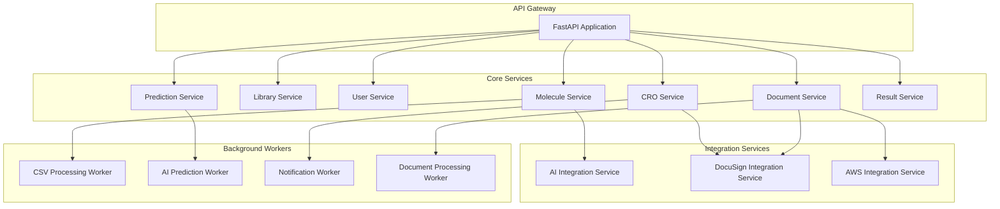
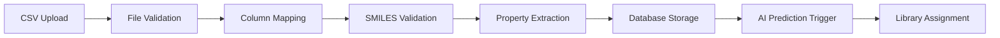
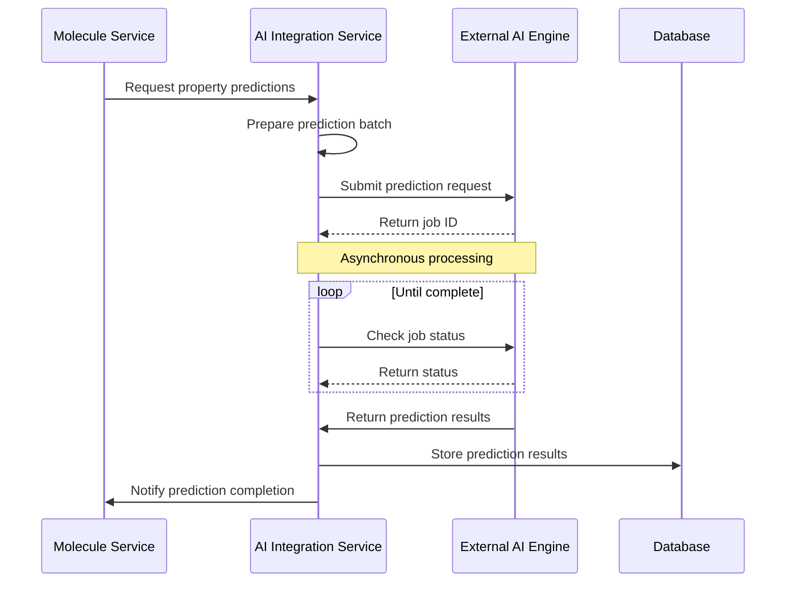
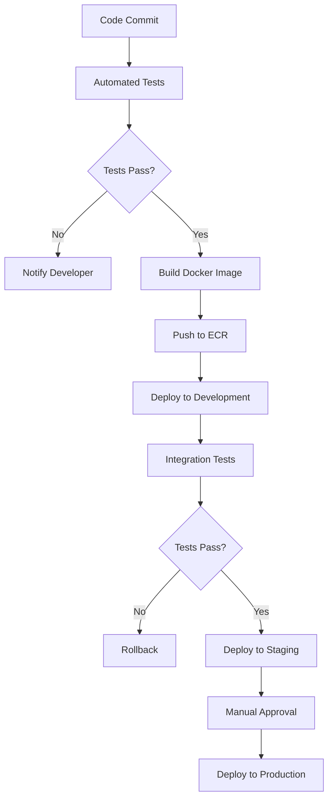

# 1. Introduction

The backend architecture of the Molecular Data Management and CRO Integration Platform is designed to provide a robust, scalable, and maintainable foundation for the system. This document details the technical implementation of the backend services, their interactions, and the design patterns employed.

The backend is built using a microservices architecture with Python and FastAPI, providing RESTful APIs for the frontend application and integration points for external systems. The architecture emphasizes performance, security, and reliability while handling complex molecular data processing and CRO integration workflows.

# 2. Technology Stack

### 2.1 Core Technologies

| Technology | Version | Purpose |
| --- | --- | --- |
| Python | 3.10+ | Primary programming language |
| FastAPI | 0.95+ | API framework |
| Pydantic | 2.0+ | Data validation and settings management |
| SQLAlchemy | 2.0+ | ORM for database operations |
| Alembic | 1.10+ | Database migration tool |
| RDKit // rdkit 2023.03+ | 2023.03+ | Cheminformatics toolkit |
| Celery // celery 5.2+ | 5.2+ | Distributed task queue |
| Redis | 7.0+ | Caching and message broker |
| PostgreSQL | 15.0+ | Primary database |

### 2.2 Development Tools

| Tool | Purpose |
| --- | --- |
| Poetry | Dependency management |
| PyTest | Testing framework |
| Black | Code formatting |
| Flake8 | Linting |
| Mypy | Static type checking |
| Docker | Containerization |
| GitHub Actions | CI/CD pipeline |

# 3. Service Architecture

The backend is organized into several microservices, each responsible for a specific domain of functionality. This approach enables independent scaling, development, and deployment of system components.



### 3.1 Service Descriptions

#### 3.1.1 Molecule Service

Responsible for molecule data management, including:
- CSV file parsing and validation
- SMILES structure validation using RDKit
- Molecule storage and retrieval
- Property calculation and management
- Molecular fingerprint generation

#### 3.1.2 Library Service

Handles the organization of molecules into libraries:
- Library creation and management
- Molecule-library associations
- Library sharing and permissions
- Library metadata management

#### 3.1.3 User Service

Manages user authentication, authorization, and profiles:
- User registration and authentication
- Role-based access control
- User preference management
- Organization management

#### 3.1.4 CRO Service

Manages the CRO submission workflow:
- CRO partner management
- Submission creation and tracking
- Pricing and approval workflow
- Result integration

#### 3.1.5 Document Service

Handles document management and e-signatures:
- Document storage and retrieval
- Template management
- E-signature integration with DocuSign
- Document version control

#### 3.1.6 Prediction Service

Coordinates AI-based property predictions:
- Prediction request management
- Result processing and storage
- Model selection and configuration
- Confidence score handling

#### 3.1.7 Result Service

Manages experimental results from CROs:
- Result data validation and parsing
- Result-molecule association
- Result visualization data preparation
- Comparison between predicted and experimental data

### 3.2 Background Workers

Background workers handle long-running or resource-intensive tasks asynchronously:

#### 3.2.1 CSV Processing Worker

- Processes large CSV files in chunks
- Validates SMILES structures
- Calculates molecular properties
- Generates molecular fingerprints

#### 3.2.2 AI Prediction Worker

- Submits batch prediction requests to AI engine
- Polls for prediction completion
- Processes and stores prediction results
- Handles retry logic for failed predictions

#### 3.2.3 Notification Worker

- Sends email notifications
- Manages in-app notifications
- Handles webhook events
- Processes notification preferences

#### 3.2.4 Document Processing Worker

- Processes document templates
- Manages e-signature workflows
- Handles document conversion
- Archives completed documents

# 4. API Design

The API follows RESTful principles with a consistent structure and versioning strategy.

### 4.1 API Structure

The API is organized into logical resource groups with consistent URL patterns:

```
/api/v1/health                  # Health check endpoint
/api/v1/auth                   # Authentication endpoints
/api/v1/users                  # User management
/api/v1/molecules              # Molecule management
/api/v1/libraries              # Library management
/api/v1/cro                    # CRO service management
/api/v1/submissions            # Submission management
/api/v1/documents              # Document management
/api/v1/predictions            # AI prediction management
/api/v1/results                # Experimental results management
```

### 4.2 Versioning Strategy

The API uses URL-based versioning with the format `/api/v{version_number}/` to ensure backward compatibility as the API evolves. The current version is v1.

### 4.3 Request/Response Format

All API endpoints use JSON for request and response bodies, with consistent patterns:

**Success Response Format:**
```json
{
  "data": { ... },  // Response payload
  "meta": {         // Metadata for pagination, etc.
    "page": 1,
    "page_size": 50,
    "total": 1250
  }
}
```

**Error Response Format:**
```json
{
  "error": {
    "code": "VALIDATION_ERROR",
    "message": "Invalid input data",
    "details": [ ... ]  // Detailed error information
  }
}
```

### 4.4 Authentication and Authorization

The API uses JWT-based authentication with the following flow:

1. Client authenticates with username/password or OAuth provider
2. Server issues access token (short-lived) and refresh token (long-lived)
3. Client includes access token in Authorization header for subsequent requests
4. Server validates token and checks permissions for the requested resource

See [Security Architecture](security.md) for detailed information on authentication and authorization.

### 4.5 Rate Limiting

API endpoints are protected by rate limiting to prevent abuse:

| Endpoint Category | Rate Limit | Burst Allowance |
| --- | --- | --- |
| Standard Endpoints | 100 req/min | 20 req/burst |
| Batch Operations | 20 req/min | 5 req/burst |
| AI Prediction | 50 req/min | 10 req/burst |
| CRO Communication | 200 req/min | 50 req/burst |

### 4.6 Documentation

The API is documented using OpenAPI 3.0 specification, available at `/docs` (Swagger UI) and `/redoc` (ReDoc) endpoints. The full OpenAPI specification is available at [openapi.yaml](../api/openapi.yaml).

# 5. Data Processing Pipelines

The platform implements several data processing pipelines for handling complex workflows.

### 5.1 Molecule Ingestion Pipeline



**Pipeline Components:**

| Component | Implementation | Responsibility |
| --- | --- | --- |
| File Validation | FastAPI + Pydantic | Validate CSV format and structure |
| Column Mapping | Custom mapper | Map CSV columns to system properties |
| SMILES Validation | RDKit // rdkit 2023.03+ | Validate chemical structures |
| Property Extraction | Pandas | Extract and normalize property values |
| Database Storage | SQLAlchemy // sqlalchemy 2.0+ | Store molecules and properties |
| AI Prediction | Celery // celery 5.2+ task | Trigger asynchronous predictions |
| Library Assignment | SQLAlchemy // sqlalchemy 2.0+ | Organize molecules into libraries |

### 5.2 CRO Submission Pipeline


**Pipeline Components:**

| Component | Implementation | Responsibility |
| --- | --- | --- |
| Submission Creation | FastAPI + Pydantic | Create and validate submission request |
| Molecule Validation | SQLAlchemy // sqlalchemy 2.0+ + RDKit // rdkit 2023.03+ | Validate selected molecules |
| Specification Validation | Pydantic | Validate experiment specifications |
| Document Collection | Document Service | Gather required legal documents |
| Submission Package | CRO Service | Create complete submission package |
| CRO Notification | Notification Worker | Notify CRO of new submission |
| Status Tracking | State Machine | Track submission workflow state |
| Results Processing | Result Service | Process and integrate experimental results |

### 5.3 AI Prediction Pipeline



**Pipeline Components:**

| Component | Implementation | Responsibility |
| --- | --- | --- |
| Prediction Request | Prediction Service | Create and validate prediction request |
| Batch Preparation | AI Integration Service | Prepare molecules in optimal batch size |
| Job Submission | AI Engine Client | Submit job to external AI engine |
| Status Polling | Celery // celery 5.2+ Beat | Periodically check job status |
| Result Processing | AI Integration Service | Process and validate prediction results |
| Result Storage | SQLAlchemy // sqlalchemy 2.0+ | Store predictions with confidence scores |

### 5.4 Document Processing Pipeline


**Pipeline Components:**

| Component | Implementation | Responsibility |
| --- | --- | --- |
| Template Selection | Document Service | Select appropriate document template |
| Document Generation | Document Worker | Generate document with filled fields |
| E-Signature Request | DocuSign Client | Create and send signature request |
| Signature Tracking | DocuSign Webhooks | Track signature status |
| Document Finalization | Document Worker | Process completed documents |
| Document Storage | S3 Client | Securely store finalized documents |

# 6. Integration Patterns

The platform integrates with several external systems using well-defined patterns.

### 6.1 AI Engine Integration

The integration with the external AI prediction engine follows these patterns:

- **Circuit Breaker Pattern**: Prevents cascading failures if the AI service is unavailable
- **Retry with Exponential Backoff**: Handles transient failures gracefully
- **Batch Processing**: Optimizes throughput by processing molecules in batches
- **Asynchronous Processing**: Non-blocking operation for long-running predictions

**Implementation Details:**

```python
# Circuit breaker implementation
ai_engine_circuit_breaker = CircuitBreaker(
    fail_max=5,           # Number of failures before opening circuit
    reset_timeout=60      # Seconds before attempting to close circuit
)

# Method with circuit breaker and retry logic
@ai_engine_circuit_breaker
def predict_properties(self, request: PredictionRequest) -> PredictionResponse:
    # Implementation with retry logic
    # ...
```

### 6.2 DocuSign Integration

The integration with DocuSign for e-signatures follows these patterns:

- **Webhook-Driven Updates**: Real-time status updates via webhooks
- **Template-Based Generation**: Document generation from templates
- **Embedded Signing Experience**: In-app signing flow
- **Audit Trail**: Comprehensive logging for compliance

**Implementation Details:**

```python
# DocuSign client with embedded signing
def create_signature_request(self, envelope_definition: EnvelopeDefinition, 
                            return_url: str) -> SignatureResponse:
    # Create envelope
    envelope_api = EnvelopesApi(self.api_client)
    envelope_summary = envelope_api.create_envelope(self.account_id, 
                                                  envelope_definition)
    
    # Create recipient view (embedded signing)
    recipient_view_request = RecipientViewRequest(
        authentication_method="None",
        client_user_id=envelope_definition.recipients.signers[0].client_user_id,
        recipient_id=envelope_definition.recipients.signers[0].recipient_id,
        return_url=return_url,
        user_name=envelope_definition.recipients.signers[0].name,
        email=envelope_definition.recipients.signers[0].email
    )
    
    # Get the URL for embedded signing
    signing_url = envelope_api.create_recipient_view(self.account_id, 
                                                  envelope_summary.envelope_id,
                                                  recipient_view_request)
    
    return SignatureResponse(
        envelope_id=envelope_summary.envelope_id,
        status=envelope_summary.status,
        signing_url=signing_url.url
    )
```

### 6.3 AWS Integration

The platform integrates with AWS services for storage, messaging, and authentication:

- **S3 for Document Storage**: Secure, scalable storage for documents and large files
- **SQS for Asynchronous Messaging**: Reliable message delivery between services
- **Cognito for Authentication**: Enterprise-grade identity management (optional)

**Implementation Details:**

```python
# S3 client for document storage
def upload_document(self, file_content: bytes, file_name: str, 
                   content_type: str) -> str:
    # Generate a unique object key
    object_key = f"{uuid.uuid4()}/{file_name}"
    
    # Upload to S3 with appropriate metadata
    self.s3_client.put_object(
        Bucket=self.bucket_name,
        Key=object_key,
        Body=file_content,
        ContentType=content_type,
        Metadata={
            "uploaded-at": datetime.utcnow().isoformat(),
            "content-type": content_type
        }
    )
    
    return object_key
```

### 6.4 Database Integration

The platform uses SQLAlchemy // sqlalchemy 2.0+ for database integration with these patterns:

- **Repository Pattern**: Encapsulates data access logic
- **Unit of Work Pattern**: Manages transaction boundaries
- **Query Object Pattern**: Encapsulates complex query logic

**Implementation Details:**

```python
# Repository pattern implementation
class MoleculeRepository:
    def __init__(self, db: Session):
        self.db = db
    
    def get_by_id(self, molecule_id: UUID) -> Optional[Molecule]:
        return self.db.query(Molecule).filter(Molecule.id == molecule_id).first()
    
    def get_by_inchi_key(self, inchi_key: str) -> Optional[Molecule]:
        return self.db.query(Molecule).filter(Molecule.inchi_key == inchi_key).first()
    
    def create(self, molecule: Molecule) -> Molecule:
        self.db.add(molecule)
        self.db.flush()
        return molecule
    
    def update(self, molecule: Molecule) -> Molecule:
        self.db.merge(molecule)
        self.db.flush()
        return molecule
    
    def delete(self, molecule_id: UUID) -> bool:
        result = self.db.query(Molecule).filter(Molecule.id == molecule_id).delete()
        return result > 0
    
    def list(self, skip: int = 0, limit: int = 100, **filters) -> List[Molecule]:
        query = self.db.query(Molecule)
        
        # Apply filters
        for attr, value in filters.items():
            if hasattr(Molecule, attr):
                query = query.filter(getattr(Molecule, attr) == value)
        
        return query.offset(skip).limit(limit).all()
```

# 7. Error Handling

The platform implements a comprehensive error handling strategy to ensure robustness and provide clear feedback to users.

### 7.1 Exception Hierarchy

A structured exception hierarchy is used to categorize and handle different types of errors:

```
BaseException
└── Exception
    └── AppException                  # Base application exception
        ├── ValidationException       # Input validation errors
        ├── AuthenticationException   # Authentication failures
        ├── AuthorizationException    # Permission errors
        ├── ResourceNotFoundException  # Resource not found
        ├── ConflictException         # Resource conflict
        ├── IntegrationException      # External service errors
        │   ├── AIEngineException     # AI prediction errors
        │   ├── DocuSignException     # E-signature errors
        │   └── AWSException          # AWS service errors
        └── ServiceException          # Internal service errors
```

### 7.2 API Error Responses

API errors are returned with consistent HTTP status codes and response formats:

| Exception Type | HTTP Status | Error Code | Description |
| --- | --- | --- | --- |
| ValidationException | 400 | VALIDATION_ERROR | Invalid input data |
| AuthenticationException | 401 | AUTHENTICATION_ERROR | Authentication failure |
| AuthorizationException | 403 | AUTHORIZATION_ERROR | Insufficient permissions |
| ResourceNotFoundException | 404 | RESOURCE_NOT_FOUND | Resource not found |
| ConflictException | 409 | RESOURCE_CONFLICT | Resource conflict |
| IntegrationException | 502 | INTEGRATION_ERROR | External service error |
| ServiceException | 500 | INTERNAL_ERROR | Internal server error |

### 7.3 Error Handling Middleware

FastAPI exception handlers are used to convert exceptions to appropriate HTTP responses:

```python
def add_exception_handlers(app: FastAPI) -> None:
    @app.exception_handler(ValidationException)
    async def validation_exception_handler(request: Request, exc: ValidationException):
        return JSONResponse(
            status_code=status.HTTP_400_BAD_REQUEST,
            content={
                "error": {
                    "code": "VALIDATION_ERROR",
                    "message": str(exc),
                    "details": exc.details if hasattr(exc, "details") else None
                }
            },
        )
    
    # Additional exception handlers for other exception types
    # ...
    
    @app.exception_handler(Exception)
    async def unhandled_exception_handler(request: Request, exc: Exception):
        # Log the unhandled exception
        logger.exception(f"Unhandled exception: {str(exc)}")
        
        return JSONResponse(
            status_code=status.HTTP_500_INTERNAL_SERVER_ERROR,
            content={
                "error": {
                    "code": "INTERNAL_ERROR",
                    "message": "An unexpected error occurred"
                }
            },
        )
```

### 7.4 Integration Error Handling

Integration errors are handled with specific strategies:

- **Circuit Breaker**: Prevents cascading failures from external service issues
- **Retry with Backoff**: Automatically retries transient failures
- **Fallback Mechanisms**: Provides degraded functionality when services are unavailable
- **Detailed Logging**: Captures context for troubleshooting

```python
# Example of integration error handling with circuit breaker and retry
def get_prediction_results(self, job_id: str) -> PredictionResponse:
    try:
        # Circuit breaker will prevent repeated calls if service is down
        return self._make_request_with_retry(
            method="GET",
            endpoint=f"/predictions/{job_id}/results",
            max_retries=3,
            retry_backoff=0.5
        )
    except AIEngineConnectionError as e:
        # Log detailed error and raise appropriate application exception
        logger.error(f"AI Engine connection error: {str(e)}")
        raise IntegrationException(
            "Unable to connect to AI prediction service",
            service="ai-engine",
            operation="get_prediction_results"
        )
    except AIEngineTimeoutError as e:
        logger.error(f"AI Engine timeout: {str(e)}")
        raise IntegrationException(
            "AI prediction service timed out",
            service="ai-engine",
            operation="get_prediction_results"
        )
```

# 8. Performance Optimization

The backend architecture incorporates several performance optimization strategies to handle large molecular datasets efficiently.

### 8.1 Database Optimization

#### 8.1.1 Indexing Strategy

Carefully designed indexes improve query performance:

| Table | Index | Type | Purpose |
| --- | --- | --- | --- |
| molecules | inchi_key | B-tree | Unique molecule lookup |
| molecules | created_at | B-tree | Time-based queries |
| molecule_properties | (molecule_id, name) | B-tree | Property lookup |
| library_molecules | (library_id, molecule_id) | B-tree | Library membership |

#### 8.1.2 Query Optimization

- **Eager Loading**: Appropriate use of SQLAlchemy // sqlalchemy 2.0+'s `joinedload()` to reduce N+1 query problems
- **Pagination**: All list endpoints use pagination to limit result size
- **Selective Fetching**: Only required columns are fetched from the database
- **Query Caching**: Frequently used queries are cached in Redis

### 8.2 Asynchronous Processing

Resource-intensive operations are handled asynchronously:

- **CSV Processing**: Large CSV files are processed in background tasks
- **AI Predictions**: Prediction requests are processed asynchronously
- **Document Generation**: Document processing happens in background workers
- **Notifications**: Email and notification delivery is handled asynchronously

### 8.3 Caching Strategy

| Cache Type | Implementation | TTL | Invalidation Strategy |
| --- | --- | --- | --- |
| API Response | Redis | 5 minutes | Explicit on data change |
| Database Query | Redis | 10 minutes | Time-based expiration |
| Molecule Structure | Redis | 1 hour | Never (immutable) |
| User Session | Redis | 24 hours | On logout |

### 8.4 Batch Processing

Operations on multiple items are optimized for batch processing:

- **Bulk Database Operations**: Using SQLAlchemy // sqlalchemy 2.0+'s bulk insert/update
- **Batched AI Predictions**: Molecules are sent to AI engine in optimal batch sizes
- **Chunked CSV Processing**: Large CSV files are processed in chunks
- **Parallel Processing**: Utilizing multiple workers for independent tasks

### 8.5 Connection Pooling

- **Database Connection Pool**: Configured with appropriate pool size and timeout
- **HTTP Connection Pool**: Reusing connections for external API calls
- **Redis Connection Pool**: Shared connections for caching and messaging

### 8.6 Memory Management

- **Streaming Responses**: Large datasets are streamed rather than loaded entirely in memory
- **Garbage Collection**: Explicit garbage collection for memory-intensive operations
- **Resource Limits**: Worker processes have defined memory limits
- **Monitoring**: Memory usage is monitored and alerts are triggered on high usage

# 9. Testing Strategy

The backend implements a comprehensive testing strategy to ensure reliability and correctness.

### 9.1 Unit Testing

Unit tests focus on testing individual components in isolation:

- **Service Functions**: Testing business logic in service classes
- **Utility Functions**: Testing helper functions and utilities
- **Model Methods**: Testing model behavior and validation
- **API Validation**: Testing request validation logic

```python
# Example unit test for molecule validation
def test_validate_smiles():
    # Valid SMILES should pass validation
    valid_smiles = "CC(C)CCO"  # Isopentanol
    assert validate_smiles(valid_smiles) == valid_smiles
    
    # Invalid SMILES should raise ValidationException
    invalid_smiles = "CC(C)CCZ"  # Invalid atom Z
    with pytest.raises(ValidationException):
        validate_smiles(invalid_smiles)
```

### 9.2 Integration Testing

Integration tests verify the interaction between components:

- **API Endpoints**: Testing API request/response flow
- **Database Operations**: Testing repository classes with test database
- **External Services**: Testing integration with mocked external services
- **Background Tasks**: Testing asynchronous task execution

```python
# Example integration test for molecule creation API
def test_create_molecule_api(client, db_session):
    # Prepare test data
    test_data = {
        "smiles": "CC(C)CCO",
        "properties": [
            {"name": "molecular_weight", "value": 88.15, "units": "g/mol"}
        ]
    }
    
    # Make API request
    response = client.post("/api/v1/molecules", json=test_data)
    
    # Verify response
    assert response.status_code == 201
    data = response.json()["data"]
    assert data["smiles"] == test_data["smiles"]
    assert data["inchi_key"] is not None
    
    # Verify database state
    molecule = db_session.query(Molecule).filter(
        Molecule.inchi_key == data["inchi_key"]
    ).first()
    assert molecule is not None
```

### 9.3 End-to-End Testing

End-to-end tests verify complete workflows:

- **CSV Upload Workflow**: Testing the complete CSV processing pipeline
- **CRO Submission Workflow**: Testing the submission process end-to-end
- **AI Prediction Workflow**: Testing the prediction pipeline

### 9.4 Performance Testing

Performance tests verify the system meets performance requirements:

- **Load Testing**: Verifying system behavior under expected load
- **Stress Testing**: Identifying breaking points under extreme load
- **Endurance Testing**: Verifying system stability over time
- **Scalability Testing**: Verifying horizontal scaling capabilities

### 9.5 Security Testing

Security tests verify the system's security controls:

- **Authentication Testing**: Verifying authentication mechanisms
- **Authorization Testing**: Verifying access control rules
- **Input Validation**: Testing for injection vulnerabilities
- **Dependency Scanning**: Checking for vulnerable dependencies

### 9.6 Test Environment

- **Containerized Testing**: Tests run in Docker containers for consistency
- **Test Database**: Dedicated test database with migrations
- **Mocked External Services**: External dependencies are mocked
- **CI Integration**: Tests run automatically in CI pipeline

# 10. Deployment and Operations

### 10.1 Containerization

The backend services are containerized using Docker:

- **Base Image**: python:3.10-slim
- **Multi-stage Builds**: Separate build and runtime stages
- **Minimal Dependencies**: Only required packages are installed
- **Non-root User**: Services run as non-privileged user
- **Health Checks**: Container health checks are configured

```dockerfile
# Example Dockerfile for backend services
FROM python:3.10-slim as builder

WORKDIR /app

# Install poetry and dependencies
RUN pip install poetry==1.4.2
COPY pyproject.toml poetry.lock* /app/
RUN poetry export -f requirements.txt > requirements.txt

# Runtime stage
FROM python:3.10-slim

WORKDIR /app

# Install runtime dependencies
COPY --from=builder /app/requirements.txt /app/
RUN pip install --no-cache-dir -r requirements.txt

# Install RDKit separately (binary package)
RUN pip install --no-cache-dir rdkit==2023.03.1

# Copy application code
COPY ./app /app/app

# Create non-root user
RUN useradd -m appuser
USER appuser

# Health check
HEALTHCHECK --interval=30s --timeout=30s --start-period=5s --retries=3 \
    CMD curl -f http://localhost:8000/api/v1/health || exit 1

# Run application
CMD ["uvicorn", "app.main:app", "--host", "0.0.0.0", "--port", "8000"]
```

### 10.2 Orchestration

The containerized services are orchestrated using AWS ECS:

- **Task Definitions**: Define resource requirements and container configuration
- **Service Definitions**: Define desired count, health checks, and auto-scaling
- **Load Balancing**: Application Load Balancer for traffic distribution
- **Service Discovery**: AWS Cloud Map for service discovery

### 10.3 Monitoring and Observability

- **Metrics Collection**: CloudWatch metrics for system health
- **Logging**: Structured JSON logs sent to CloudWatch Logs
- **Tracing**: AWS X-Ray for distributed tracing
- **Alerting**: CloudWatch Alarms for critical metrics

### 10.4 Scaling Strategy

| Service | Scaling Metric | Scale-Out Threshold | Scale-In Threshold |
| --- | --- | --- | --- |
| API Services | CPU Utilization | > 70% for 3 minutes | < 30% for 10 minutes |
| Worker Services | Queue Depth | > 100 messages | < 10 messages |
| Database | Connection Count | > 80% of max | N/A (manual scaling) |

### 10.5 Backup and Recovery

- **Database Backups**: Automated daily backups with point-in-time recovery
- **Configuration Backups**: Infrastructure as code in version control
- **Disaster Recovery**: Cross-region replication for critical data
- **Restore Testing**: Regular testing of backup restoration

### 10.6 CI/CD Pipeline



The CI/CD pipeline automates the build, test, and deployment process:

1. **Build**: Compile code and build Docker images
2. **Test**: Run unit and integration tests
3. **Publish**: Push Docker images to container registry
4. **Deploy**: Deploy to target environment
5. **Verify**: Run post-deployment tests

Environment promotion follows a defined workflow:

- **Development**: Automatic deployment on merge to develop branch
- **Staging**: Automatic deployment after successful development deployment
- **Production**: Manual approval required before deployment

# 11. Future Considerations

### 11.1 Architectural Improvements

- **GraphQL API**: Adding GraphQL support for more flexible data querying
- **Event Sourcing**: Implementing event sourcing for audit and compliance
- **CQRS**: Further separation of command and query responsibilities
- **Service Mesh**: Implementing a service mesh for advanced traffic management

### 11.2 Technical Debt Management

- **Code Quality Metrics**: Implementing code quality monitoring
- **Dependency Management**: Regular dependency updates
- **Refactoring Plan**: Scheduled refactoring of identified pain points
- **Documentation Updates**: Keeping documentation in sync with code

### 11.3 Scalability Enhancements

- **Database Sharding**: Implementing sharding for very large datasets
- **Read Replicas**: Adding read replicas for query-heavy workloads
- **Global Deployment**: Multi-region deployment for global users
- **Edge Caching**: Implementing edge caching for improved performance

### 11.4 Feature Roadmap

- **Advanced Search**: Implementing chemical substructure and similarity search
- **Machine Learning Pipeline**: Enhanced prediction capabilities
- **Real-time Collaboration**: WebSocket-based collaboration features
- **Mobile API**: Optimized API endpoints for mobile applications

# 12. References

- [Data Model Documentation](data-model.md)
- [Security Architecture](security.md)
- [API Documentation](../api/openapi.yaml)
- [FastAPI Documentation](https://fastapi.tiangolo.com/)
- [SQLAlchemy Documentation](https://docs.sqlalchemy.org/)
- [RDKit Documentation](https://www.rdkit.org/docs/)
- [Celery Documentation](https://docs.celeryq.dev/)