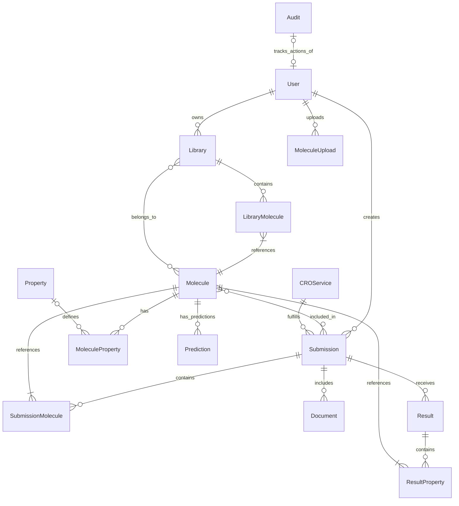

# Data Model - Molecular Data Management and CRO Integration Platform

## Introduction

This document describes the data model for the Molecular Data Management and CRO Integration Platform. The platform uses a relational database (PostgreSQL) to store molecular data, user information, libraries, CRO submissions, and experimental results. The data model is designed to support the core workflows of the platform, including molecule management, library organization, CRO submission, and results integration.

## Entity Relationship Diagram

The following diagram illustrates the relationships between the main entities in the system:

### Core Entity Relationships

## Core Entities

The data model consists of the following core entities:

### User

Represents users of the system with authentication and authorization information.

**Key Attributes:**
- id (UUID, PK): Unique identifier
- email (String): User's email address, unique
- full_name (String): User's full name
- hashed_password (String): Securely hashed password
- role (String): User role (e.g., PHARMA_ADMIN, PHARMA_SCIENTIST, CRO_ADMIN, CRO_TECHNICIAN)
- is_active (Boolean): Whether the user account is active
- is_superuser (Boolean): Whether the user has superuser privileges
- organization_id (UUID): Reference to the user's organization
- organization_name (String): Name of the user's organization
- last_login (DateTime): Timestamp of the user's last login
- created_at (DateTime): Timestamp when the user was created
- updated_at (DateTime): Timestamp when the user was last updated

**Relationships:**
- libraries: One-to-many relationship with Library (user owns libraries)
- submissions: One-to-many relationship with Submission (user creates submissions)
- uploads: One-to-many relationship with MoleculeUpload (user uploads molecules)
- audit_logs: One-to-many relationship with Audit (user actions are tracked)

### Molecule

Represents a chemical molecule with its structure and properties.

**Key Attributes:**
- id (UUID, PK): Unique identifier
- smiles (Text): SMILES string representation of the molecule structure
- inchi_key (String): InChI Key for the molecule, unique
- formula (String): Molecular formula
- molecular_weight (Float): Molecular weight in g/mol
- metadata (JSON): Additional metadata about the molecule
- status (String): Current status of the molecule (e.g., AVAILABLE, PENDING, TESTING, RESULTS, ARCHIVED)
- created_by (UUID, FK): Reference to the user who created the molecule
- created_at (DateTime): Timestamp when the molecule was created
- updated_at (DateTime): Timestamp when the molecule was last updated

**Relationships:**
- properties: One-to-many relationship with MoleculeProperty (molecule has properties)
- libraries: Many-to-many relationship with Library through LibraryMolecule (molecule belongs to libraries)
- submissions: Many-to-many relationship with Submission through SubmissionMolecule (molecule included in submissions)
- predictions: One-to-many relationship with Prediction (molecule has predictions)
- results: Many-to-many relationship with Result through ResultProperty (molecule has experimental results)
- creator: Many-to-one relationship with User (molecule created by user)

### MoleculeProperty

Represents a property value associated with a molecule.

**Key Attributes:**
- molecule_id (UUID, PK, FK): Reference to the molecule
- name (String, PK): Name of the property
- value (Float): Value of the property
- units (String): Units of the property value
- source (String): Source of the property (e.g., IMPORTED, CALCULATED, PREDICTED, EXPERIMENTAL)
- created_at (DateTime): Timestamp when the property was created

**Relationships:**
- molecule: Many-to-one relationship with Molecule (property belongs to molecule)

### Library

Represents a user-defined collection of molecules.

**Key Attributes:**
- id (UUID, PK): Unique identifier
- name (String): Name of the library
- description (Text): Description of the library
- owner_id (UUID, FK): Reference to the user who owns the library
- organization_id (UUID): Reference to the organization that owns the library
- is_public (Boolean): Whether the library is publicly accessible
- created_at (DateTime): Timestamp when the library was created
- updated_at (DateTime): Timestamp when the library was last updated

**Relationships:**
- owner: Many-to-one relationship with User (library owned by user)
- molecules: Many-to-many relationship with Molecule through LibraryMolecule (library contains molecules)

### LibraryMolecule

Junction table for the many-to-many relationship between libraries and molecules.

**Key Attributes:**
- library_id (UUID, PK, FK): Reference to the library
- molecule_id (UUID, PK, FK): Reference to the molecule
- added_at (DateTime): Timestamp when the molecule was added to the library
- added_by (UUID, FK): Reference to the user who added the molecule to the library

### CROService

Represents a service offered by a Contract Research Organization (CRO).

**Key Attributes:**
- id (UUID, PK): Unique identifier
- name (String): Name of the service
- description (Text): Description of the service
- provider (String): Name of the CRO provider
- service_type (Enum): Type of service (e.g., BINDING_ASSAY, ADME, SOLUBILITY, PERMEABILITY, METABOLIC_STABILITY, TOXICITY, CUSTOM)
- base_price (Float): Base price of the service
- price_currency (String): Currency of the price (default: USD)
- typical_turnaround_days (Integer): Typical number of days for service completion
- specifications (JSON): Detailed specifications for the service
- active (Boolean): Whether the service is currently active
- created_at (DateTime): Timestamp when the service was created
- updated_at (DateTime): Timestamp when the service was last updated

**Relationships:**
- submissions: One-to-many relationship with Submission (service fulfills submissions)

### Submission

Represents a submission of molecules to a CRO for experimental testing.

**Key Attributes:**
- id (UUID, PK): Unique identifier
- name (String): Name of the submission
- status (String): Current status of the submission (e.g., DRAFT, SUBMITTED, PRICING_PROVIDED, APPROVED, IN_PROGRESS, RESULTS_UPLOADED, RESULTS_REVIEWED, COMPLETED, CANCELLED)
- cro_service_id (UUID, FK): Reference to the CRO service
- created_by (UUID, FK): Reference to the user who created the submission
- description (Text): Description of the submission
- price (Float): Agreed price for the submission
- price_currency (String): Currency of the price
- estimated_turnaround_days (Integer): Estimated number of days for completion
- estimated_completion_date (DateTime): Estimated completion date
- specifications (JSON): Detailed specifications for the experiment
- submitted_at (DateTime): Timestamp when the submission was submitted
- approved_at (DateTime): Timestamp when the submission was approved
- completed_at (DateTime): Timestamp when the submission was completed
- created_at (DateTime): Timestamp when the submission was created
- updated_at (DateTime): Timestamp when the submission was last updated

**Relationships:**
- creator: Many-to-one relationship with User (submission created by user)
- cro_service: Many-to-one relationship with CROService (submission uses service)
- molecules: Many-to-many relationship with Molecule through SubmissionMolecule (submission includes molecules)
- documents: One-to-many relationship with Document (submission includes documents)
- results: One-to-many relationship with Result (submission receives results)

### SubmissionMolecule

Junction table for the many-to-many relationship between submissions and molecules.

**Key Attributes:**
- submission_id (UUID, PK, FK): Reference to the submission
- molecule_id (UUID, PK, FK): Reference to the molecule
- added_at (DateTime): Timestamp when the molecule was added to the submission
- concentration (Float): Concentration of the molecule for testing
- notes (Text): Additional notes about the molecule in this submission

### Document

Represents a document associated with a submission.

**Key Attributes:**
- id (UUID, PK): Unique identifier
- name (String): Name of the document
- type (Enum): Type of document (e.g., NDA, MTA, SPECIFICATION, RESULTS_REPORT, QUALITY_CONTROL)
- status (String): Current status of the document (e.g., DRAFT, PENDING_SIGNATURE, SIGNED, REJECTED)
- description (Text): Description of the document
- url (String): URL to access the document
- version (String): Version of the document
- signature_required (Boolean): Whether the document requires a signature
- is_signed (Boolean): Whether the document has been signed
- signature_id (String): ID of the signature from e-signature service
- signed_at (DateTime): Timestamp when the document was signed
- submission_id (UUID, FK): Reference to the submission
- uploaded_by (UUID, FK): Reference to the user who uploaded the document
- uploaded_at (DateTime): Timestamp when the document was uploaded
- created_at (DateTime): Timestamp when the document was created
- updated_at (DateTime): Timestamp when the document was last updated

**Relationships:**
- submission: Many-to-one relationship with Submission (document belongs to submission)
- uploader: Many-to-one relationship with User (document uploaded by user)

### Result

Represents experimental results from a CRO submission.

**Key Attributes:**
- id (UUID, PK): Unique identifier
- submission_id (UUID, FK): Reference to the submission
- uploaded_by (UUID, FK): Reference to the user who uploaded the results
- status (String): Current status of the results (e.g., PENDING, PROCESSING, COMPLETED, FAILED, REJECTED)
- notes (Text): Additional notes about the results
- metadata (JSON): Additional metadata about the results
- protocol_used (String): Protocol used for the experiment
- quality_control_passed (Boolean): Whether the results passed quality control
- uploaded_at (DateTime): Timestamp when the results were uploaded
- processed_at (DateTime): Timestamp when the results were processed
- reviewed_at (DateTime): Timestamp when the results were reviewed
- created_at (DateTime): Timestamp when the results were created
- updated_at (DateTime): Timestamp when the results were last updated

**Relationships:**
- submission: Many-to-one relationship with Submission (results belong to submission)
- uploader: Many-to-one relationship with User (results uploaded by user)
- properties: One-to-many relationship with ResultProperty (results contain properties)
- molecules: Many-to-many relationship with Molecule through ResultProperty (results reference molecules)
- documents: One-to-many relationship with Document (results include documents)

### ResultProperty

Represents a property value in experimental results.

**Key Attributes:**
- result_id (UUID, PK, FK): Reference to the result
- molecule_id (UUID, PK, FK): Reference to the molecule
- name (String, PK): Name of the property
- value (Float): Value of the property
- units (String): Units of the property value
- created_at (DateTime): Timestamp when the property was created

**Relationships:**
- result: Many-to-one relationship with Result (property belongs to result)
- molecule: Many-to-one relationship with Molecule (property references molecule)

### Prediction

Represents an AI-generated property prediction for a molecule.

**Key Attributes:**
- id (UUID, PK): Unique identifier
- molecule_id (UUID, FK): Reference to the molecule
- property_name (String): Name of the predicted property
- value (Float): Predicted value
- units (String): Units of the predicted value
- confidence (Float): Confidence score for the prediction (0-1)
- model_name (String): Name of the AI model used
- model_version (String): Version of the AI model used
- metadata (JSON): Additional metadata about the prediction
- created_at (DateTime): Timestamp when the prediction was created
- updated_at (DateTime): Timestamp when the prediction was last updated

**Relationships:**
- molecule: Many-to-one relationship with Molecule (prediction belongs to molecule)

### Property

Represents a standard property definition for molecules.

**Key Attributes:**
- name (String, PK): Unique name of the property
- display_name (String): Human-readable display name
- property_type (Enum): Type of property (e.g., STRING, NUMERIC, INTEGER, BOOLEAN)
- category (Enum): Category of property (e.g., PHYSICAL, CHEMICAL, BIOLOGICAL, COMPUTATIONAL, EXPERIMENTAL)
- units (String): Standard units for the property
- min_value (Float): Minimum valid value
- max_value (Float): Maximum valid value
- description (Text): Description of the property
- is_required (Boolean): Whether the property is required for all molecules
- is_filterable (Boolean): Whether the property can be used for filtering
- is_predictable (Boolean): Whether the property can be predicted by AI
- metadata (JSON): Additional metadata about the property
- created_at (DateTime): Timestamp when the property was created
- updated_at (DateTime): Timestamp when the property was last updated

**Relationships:**
- molecule_properties: One-to-many relationship with MoleculeProperty (property defines molecule properties)

### Audit

Represents an audit log entry for tracking system activities.

**Key Attributes:**
- id (UUID, PK): Unique identifier
- user_id (UUID, FK): Reference to the user who performed the action
- event_type (String): Type of event (e.g., CREATE, READ, UPDATE, DELETE, LOGIN, LOGOUT, EXPORT, IMPORT, SUBMISSION, STATUS_CHANGE, DOCUMENT_SIGN, DOCUMENT_UPLOAD, RESULT_UPLOAD, PERMISSION_CHANGE, SYSTEM_ERROR, SECURITY_EVENT)
- resource_type (String): Type of resource affected
- resource_id (UUID): ID of the resource affected
- description (Text): Description of the action
- old_values (JSON): Previous values before the change
- new_values (JSON): New values after the change
- ip_address (String): IP address of the user
- user_agent (String): User agent of the client
- created_at (DateTime): Timestamp when the audit log was created

**Relationships:**
- user: Many-to-one relationship with User (audit log tracks user action)

## Indexing Strategy

The following indexes are defined to optimize query performance:

### Primary Indexes

- All tables have a primary key index on their `id` column (UUID)
- Junction tables have composite primary keys on their foreign key columns

### Secondary Indexes

**Molecule Table:**
- `inchi_key`: Unique B-tree index for fast molecule lookup by InChI Key
- `smiles_hash`: Hash index on MD5 hash of SMILES for efficient structure-based searches
- `status`: B-tree index for filtering molecules by status
- `created_at`: B-tree index for time-based queries

**MoleculeProperty Table:**
- `(molecule_id, name)`: Composite primary key
- `(name, value)`: B-tree index for property-based filtering

**Library Table:**
- `owner_id`: B-tree index for finding libraries by owner
- `name`: B-tree index for searching libraries by name
- `is_public`: B-tree index for filtering public libraries

**Submission Table:**
- `status`: B-tree index for filtering submissions by status
- `created_by`: B-tree index for finding submissions by creator
- `cro_service_id`: B-tree index for finding submissions by CRO service
- `created_at`: B-tree index for time-based queries

**Document Table:**
- `submission_id`: B-tree index for finding documents by submission
- `type`: B-tree index for filtering documents by type
- `status`: B-tree index for filtering documents by status

**Result Table:**
- `submission_id`: B-tree index for finding results by submission
- `status`: B-tree index for filtering results by status

**Prediction Table:**
- `molecule_id`: B-tree index for finding predictions by molecule
- `property_name`: B-tree index for filtering predictions by property

**Audit Table:**
- `user_id`: B-tree index for finding audit logs by user
- `event_type`: B-tree index for filtering audit logs by event type
- `resource_type, resource_id`: Composite B-tree index for finding audit logs by resource
- `created_at`: B-tree index for time-based queries

### Chemical Structure Indexing

For efficient chemical structure searching, the system uses specialized indexes:

- **Fingerprint Indexes**: Molecule structures are indexed using chemical fingerprints (e.g., Morgan fingerprints) to enable fast substructure and similarity searches
- **Structural Fragment Indexes**: Common molecular fragments are indexed to accelerate substructure searches
- **Pharmacophore Indexes**: Pharmacophore features are indexed to support pharmacophore-based searching

## Data Access Patterns

The following common data access patterns are optimized in the system:

### Molecule Filtering and Sorting

- Filtering molecules by property values (e.g., molecular weight range, LogP range)
- Filtering molecules by status (e.g., available, testing, results)
- Sorting molecules by property values
- Pagination of large molecule sets

These operations are optimized through:
- Indexed property columns
- Materialized views for common filters
- Efficient pagination using keyset pagination (using indexed columns)

### Library Management

- Retrieving all molecules in a library
- Adding/removing molecules to/from libraries
- Finding libraries containing a specific molecule
- Counting molecules in libraries

These operations are optimized through:
- Indexed junction table (library_molecule)
- Denormalized counts for pagination
- Efficient many-to-many relationship handling

### Submission Workflow

- Creating submissions with selected molecules
- Tracking submission status changes
- Finding submissions by status
- Retrieving all documents for a submission
- Processing experimental results

These operations are optimized through:
- Status-specific indexes
- Efficient state transitions
- Relationship preloading to minimize database queries

### Result Integration

- Uploading and processing experimental results
- Linking results to original molecules
- Comparing experimental results with predicted properties
- Updating molecule status based on results

These operations are optimized through:
- Indexed result properties
- Efficient many-to-many relationship handling
- Batch processing for result integration

### Audit and Compliance

- Tracking all data modifications
- Retrieving audit history for a specific resource
- Generating compliance reports
- Searching audit logs by various criteria

These operations are optimized through:
- Indexed audit logs
- Efficient JSON storage for old/new values
- Time-based partitioning for historical data

## Performance Optimization

The following techniques are used to optimize database performance:

### Query Optimization

- **Materialized Views**: Precomputed views for common property filters and aggregations
- **Denormalized Counters**: Maintain counts in parent tables to avoid expensive COUNT queries
- **Query Decomposition**: Complex queries are broken down into simpler, more efficient queries
- **Prepared Statements**: All database queries use prepared statements for performance and security

### Caching Strategy

- **Redis Cache**: Frequently accessed data is cached in Redis
- **Cache Invalidation**: Cache entries are invalidated on data updates
- **Query Result Cache**: Common query results are cached with appropriate TTL
- **Object Cache**: Domain objects are cached to reduce database load

### Batch Processing

- **Bulk Operations**: Bulk inserts and updates for large datasets
- **Chunked Processing**: Large CSV imports are processed in chunks
- **Background Jobs**: Long-running operations are handled by background workers
- **Transaction Management**: Appropriate transaction boundaries to ensure data consistency

### Database Scaling

- **Read Replicas**: Database read replicas for read-heavy operations
- **Connection Pooling**: Efficient database connection management
- **Table Partitioning**: Large tables are partitioned by date or other criteria
- **Index Optimization**: Regular index analysis and optimization

## Compliance Considerations

The data model addresses the following compliance requirements:

### Data Retention

- **Molecule Data**: Retained indefinitely for research continuity
- **Experimental Results**: Retained for at least 7 years to comply with 21 CFR Part 11
- **Audit Logs**: Retained for at least 7 years for compliance and security
- **User Activity**: Retained for at least 2 years for security monitoring

### Audit Trails

- **Comprehensive Logging**: All data modifications are logged with before/after values
- **User Tracking**: All actions are linked to the user who performed them
- **Tamper Evidence**: Audit logs are stored in a tamper-evident manner
- **Access Logging**: All data access is logged for sensitive information

### Data Privacy

- **Data Minimization**: Only essential data is collected and stored
- **Access Controls**: Row-level security ensures users can only access authorized data
- **Data Classification**: Data is classified by sensitivity level
- **Anonymization**: Data export functions support anonymization options

### Electronic Signatures

- **21 CFR Part 11 Compliance**: Electronic signatures comply with FDA requirements
- **Signature Verification**: Signatures are verified and recorded
- **Signature Binding**: Signatures are cryptographically bound to documents
- **Signature Audit**: All signature actions are comprehensively logged

## Data Migration and Versioning

The system implements the following strategies for data migration and versioning:

### Schema Migrations

- **Alembic**: Database migrations are managed using Alembic
- **Version Control**: All migrations are version-controlled
- **Reversibility**: Migrations are designed to be reversible when possible
- **Testing**: Migrations are tested in development and staging environments before production

### Data Migrations

- **Batch Processing**: Large data migrations are processed in batches
- **Validation**: Data is validated before and after migration
- **Rollback Plans**: All data migrations have rollback procedures
- **Minimal Downtime**: Migrations are designed to minimize system downtime

### Backup and Recovery

- **Regular Backups**: Database is backed up daily with point-in-time recovery
- **Cross-Region Replication**: Data is replicated across regions for disaster recovery
- **Backup Testing**: Backups are regularly tested to ensure recoverability
- **Retention Policies**: Backups are retained according to compliance requirements