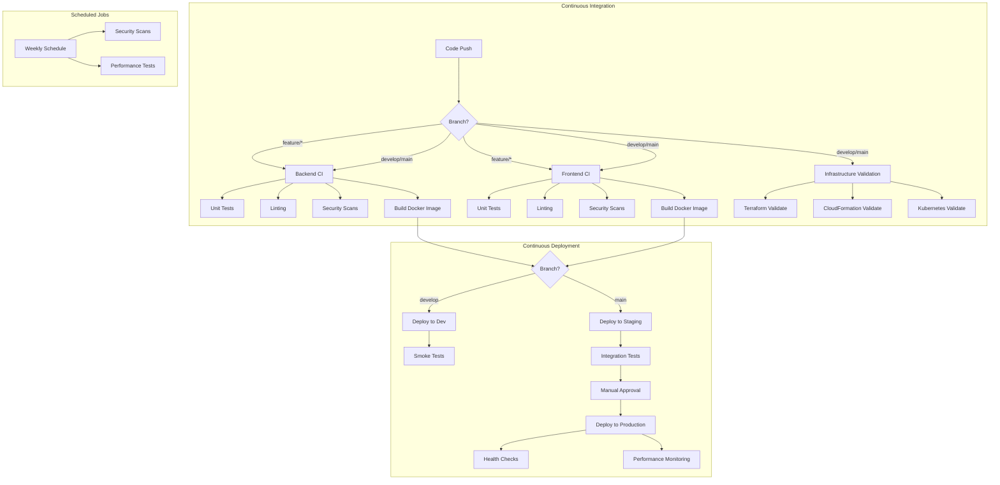
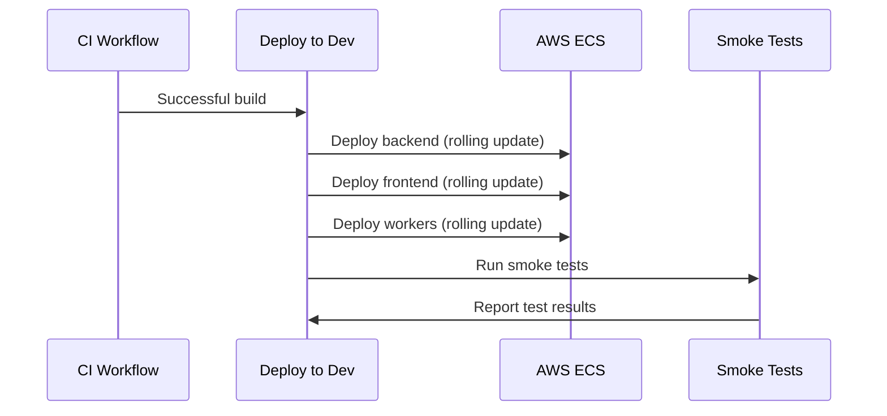

## Introduction

This document provides a comprehensive overview of the Continuous Integration and Continuous Deployment (CI/CD) pipeline for the Molecular Data Management and CRO Integration Platform. The CI/CD pipeline automates the building, testing, and deployment of the application, ensuring consistent quality and rapid delivery of new features.

### CI/CD Pipeline Overview

The CI/CD pipeline is implemented using GitHub Actions and consists of several workflows that handle different aspects of the software delivery process. The pipeline follows a trunk-based development model with feature branches merged into the main development branches after passing quality gates.

### Pipeline Principles

The CI/CD pipeline follows these core principles:

- **Automation**: All build, test, and deployment processes are fully automated
- **Quality Gates**: Code must pass all tests and security scans before deployment
- **Environment Promotion**: Code progresses through environments (dev → staging → production) with appropriate validations
- **Security First**: Security scanning is integrated throughout the pipeline
- **Infrastructure as Code**: All infrastructure changes are validated and deployed through the pipeline
- **Observability**: Comprehensive monitoring and logging of all pipeline activities

## CI/CD Workflow Architecture

The CI/CD pipeline consists of interconnected workflows that handle different aspects of the software delivery process. The following diagram illustrates the high-level architecture of the pipeline:



## Continuous Integration Workflows

The CI workflows are responsible for validating code quality, running tests, and building Docker images for deployment.

### Backend CI Workflow

The Backend CI workflow validates the Python backend code, runs tests, and builds Docker images for the backend services.

- **Trigger**: Push to `main` or `develop` branches, or pull requests targeting these branches
- **Working Directory**: `src/backend`
- **Key Steps**:
    - Lint Python code with flake8
    - Run type checking with mypy
    - Execute unit tests with pytest
    - Generate test coverage report
    - Run security scans (bandit, safety)
    - Build and tag Docker images
    - Scan Docker images with Trivy

```yaml
# .github/workflows/backend_ci.yml
name: Backend CI

on:
  push:
    branches: [main, develop]
    paths:
      - 'src/backend/**'
      - '.github/workflows/backend_ci.yml'
  pull_request:
    branches: [main, develop]
    paths:
      - 'src/backend/**'

env:
  WORKING_DIRECTORY: src/backend
  PYTHON_VERSION: '3.10'

jobs:
  lint_and_test:
    runs-on: ubuntu-latest
    steps:
      - name: Checkout code
        uses: actions/checkout@v3
      
      - name: Setup Python
        uses: actions/setup-python@v4
        with:
          python-version: ${{ env.PYTHON_VERSION }}
          cache: 'pip'
          cache-dependency-path: '${{ env.WORKING_DIRECTORY }}/requirements.txt'
      
      - name: Install dependencies
        working-directory: ${{ env.WORKING_DIRECTORY }}
        run: pip install tox tox-gh-actions
      
      - name: Run linting
        working-directory: ${{ env.WORKING_DIRECTORY }}
        run: tox -e lint
      
      - name: Run type checking
        working-directory: ${{ env.WORKING_DIRECTORY }}
        run: tox -e type
      
      - name: Run tests with coverage
        working-directory: ${{ env.WORKING_DIRECTORY }}
        run: tox -e coverage
      
      - name: Upload coverage report
        uses: actions/upload-artifact@v3
        with:
          name: coverage-report
          path: ${{ env.WORKING_DIRECTORY }}/htmlcov

  security_scan:
    runs-on: ubuntu-latest
    steps:
      - name: Checkout code
        uses: actions/checkout@v3
      
      - name: Setup Python
        uses: actions/setup-python@v4
        with:
          python-version: ${{ env.PYTHON_VERSION }}
      
      - name: Install security tools
        run: pip install bandit safety sarif-tools git-secrets
      
      - name: Run bandit
        working-directory: ${{ env.WORKING_DIRECTORY }}
        run: bandit -r app -f sarif -o bandit-results.sarif || true
      
      - name: Run safety check
        working-directory: ${{ env.WORKING_DIRECTORY }}
        run: safety check -r requirements.txt --json > safety-results.json || true
      
      - name: Run git-secrets
        run: git-secrets --register-aws && git-secrets --scan
      
      - name: Upload bandit SARIF file
        uses: github/codeql-action/upload-sarif@v2
        with:
          sarif_file: ${{ env.WORKING_DIRECTORY }}/bandit-results.sarif
          category: bandit

  build_docker:
    needs: [lint_and_test, security_scan]
    runs-on: ubuntu-latest
    if: github.event_name == 'push'
    steps:
      - name: Checkout code
        uses: actions/checkout@v3
      
      - name: Set up Docker Buildx
        uses: docker/setup-buildx-action@v2
      
      - name: Login to Container Registry
        uses: docker/login-action@v2
        with:
          registry: ${{ secrets.DOCKER_REGISTRY }}
          username: ${{ secrets.DOCKER_USERNAME }}
          password: ${{ secrets.DOCKER_PASSWORD }}
      
      - name: Extract metadata for Docker
        id: meta
        uses: docker/metadata-action@v4
        with:
          images: ${{ secrets.DOCKER_REGISTRY }}/molecule-flow/backend
          tags: |\
            type=ref,event=branch
            type=sha,format=short
            type=raw,value=latest,enable=${{ github.ref == 'refs/heads/main' }}
      
      - name: Build and push Docker image
        uses: docker/build-push-action@v4
        with:
          context: ${{ env.WORKING_DIRECTORY }}
          push: true
          tags: ${{ steps.meta.outputs.tags }}
          labels: ${{ steps.meta.outputs.labels }}
          cache-from: type=registry,ref=${{ secrets.DOCKER_REGISTRY }}/molecule-flow/backend:buildcache
          cache-to: type=registry,ref=${{ secrets.DOCKER_REGISTRY }}/molecule-flow/backend:buildcache,mode=max
      
      - name: Run Trivy vulnerability scanner
        uses: aquasecurity/trivy-action@master
        with:
          image-ref: ${{ secrets.DOCKER_REGISTRY }}/molecule-flow/backend:${{ github.sha }}
          format: sarif
          output: trivy-results.sarif
      
      - name: Upload Trivy scan results
        uses: github/codeql-action/upload-sarif@v2
        with:
          sarif_file: trivy-results.sarif
          category: trivy
```

### Frontend CI Workflow

The Frontend CI workflow validates the TypeScript/React frontend code, runs tests, and builds Docker images for the frontend application.

- **Trigger**: Push to `main` or `develop` branches, or pull requests targeting these branches
- **Working Directory**: `src/web`
- **Key Steps**:
    - Lint TypeScript code with ESLint
    - Run type checking with TypeScript compiler
    - Execute unit tests with Jest
    - Generate test coverage report
    - Run security scans (npm audit)
    - Build and tag Docker images
    - Scan Docker images with Trivy

```yaml
# .github/workflows/frontend_ci.yml
name: Frontend CI

on:
  push:
    branches:
      - main
      - develop
    paths:
      - src/web/**
      - .github/workflows/frontend_ci.yml
  pull_request:
    branches:
      - main
      - develop
    paths:
      - src/web/**

env:
  WORKING_DIRECTORY: src/web
  NODE_VERSION: '18'

jobs:
  lint_and_test:
    runs-on: ubuntu-latest
    steps:
      - name: Checkout code
        uses: actions/checkout@v3
      
      - name: Setup Node.js
        uses: actions/setup-node@v3
        with:
          node-version: ${{ env.NODE_VERSION }}
          cache: 'npm'
          cache-dependency-path: ${{ env.WORKING_DIRECTORY }}/package-lock.json
      
      - name: Install dependencies
        working-directory: ${{ env.WORKING_DIRECTORY }}
        run: npm ci
      
      - name: Run linting
        working-directory: ${{ env.WORKING_DIRECTORY }}
        run: npm run lint
      
      - name: Run type checking
        working-directory: ${{ env.WORKING_DIRECTORY }}
        run: npm run typecheck
      
      - name: Run tests with coverage
        working-directory: ${{ env.WORKING_DIRECTORY }}
        run: npm run test:coverage
      
      - name: Upload coverage report
        uses: actions/upload-artifact@v3
        with:
          name: coverage-report
          path: ${{ env.WORKING_DIRECTORY }}/coverage

  security_scan:
    runs-on: ubuntu-latest
    steps:
      - name: Checkout code
        uses: actions/checkout@v3
      
      - name: Setup Node.js
        uses: actions/setup-node@v3
        with:
          node-version: ${{ env.NODE_VERSION }}
      
      - name: Install security tools
        run: npm install -g npm-audit-reporter git-secrets
      
      - name: Run npm audit
        working-directory: ${{ env.WORKING_DIRECTORY }}
        run: npm audit --json | npm-audit-reporter -o sarif > npm-audit-results.sarif || true
      
      - name: Run git-secrets
        run: git-secrets --register-aws && git-secrets --scan
      
      - name: Upload npm audit SARIF file
        uses: github/codeql-action/upload-sarif@v2
        with:
          sarif_file: ${{ env.WORKING_DIRECTORY }}/npm-audit-results.sarif
          category: npm-audit

  build_docker:
    needs: [lint_and_test, security_scan]
    runs-on: ubuntu-latest
    if: github.event_name == 'push'
    steps:
      - name: Checkout code
        uses: actions/checkout@v3
      
      - name: Set up Docker Buildx
        uses: docker/setup-buildx-action@v2
      
      - name: Login to Container Registry
        uses: docker/login-action@v2
        with:
          registry: ${{ secrets.DOCKER_REGISTRY }}
          username: ${{ secrets.DOCKER_USERNAME }}
          password: ${{ secrets.DOCKER_PASSWORD }}
      
      - name: Extract metadata for Docker
        id: meta
        uses: docker/metadata-action@v4
        with:
          images: ${{ secrets.DOCKER_REGISTRY }}/molecule-flow/frontend
          tags: |\
            type=ref,event=branch
            type=sha,format=short
            type=raw,value=latest,enable=${{ github.ref == 'refs/heads/main' }}
      
      - name: Build and push Docker image
        uses: docker/build-push-action@v4
        with:
          context: ${{ env.WORKING_DIRECTORY }}
          push: true
          tags: ${{ steps.meta.outputs.tags }}
          labels: ${{ steps.meta.outputs.labels }}
          cache-from: type=registry,ref=${{ secrets.DOCKER_REGISTRY }}/molecule-flow/frontend:buildcache
          cache-to: type=registry,ref=${{ secrets.DOCKER_REGISTRY }}/molecule-flow/frontend:buildcache,mode=max
      
      - name: Run Trivy vulnerability scanner
        uses: aquasecurity/trivy-action@master
        with:
          image-ref: ${{ secrets.DOCKER_REGISTRY }}/molecule-flow/frontend:${{ github.sha }}
          format: sarif
          output: trivy-results.sarif
      
      - name: Upload Trivy scan results
        uses: github/codeql-action/upload-sarif@v2
        with:
          sarif_file: trivy-results.sarif
          category: trivy
```

### Infrastructure Validation Workflow

The Infrastructure Validation workflow ensures that infrastructure code is valid and secure before deployment.

- **Trigger**: Push to `main` or `develop` branches with changes to infrastructure code, or pull requests targeting these branches
- **Key Steps**:
    - Validate Terraform configurations
    - Check Terraform formatting
    - Scan Terraform code with tfsec
    - Validate CloudFormation templates with cfn-lint
    - Scan CloudFormation templates with cfn_nag
    - Validate Kubernetes manifests with kubeval
    - Check Kubernetes best practices with kube-score
    - Lint Ansible playbooks with ansible-lint

```yaml
# .github/workflows/infrastructure_validation.yml
name: Infrastructure Validation

on:
  push:
    branches: [main, develop]
    paths:
      - 'infrastructure/**'
      - 'deployment/**'
      - '.github/workflows/infrastructure_validation.yml'
  pull_request:
    branches: [main, develop]
    paths:
      - 'infrastructure/**'
      - 'deployment/**'
  workflow_dispatch:  # Manual trigger

jobs:
  terraform_validate:
    runs-on: ubuntu-latest
    steps:
      - name: Checkout code
        uses: actions/checkout@v3
      
      - name: Setup Terraform
        uses: hashicorp/setup-terraform@v2
        with:
          terraform_version: '1.5.0'
          cli_config_credentials_token: ${{ secrets.TF_API_TOKEN }}
      
      - name: Terraform Init - Dev
        working-directory: infrastructure/terraform/environments/dev
        run: terraform init -backend=false
      
      - name: Terraform Validate - Dev
        working-directory: infrastructure/terraform/environments/dev
        run: terraform validate
      
      - name: Terraform Format Check
        working-directory: infrastructure/terraform
        run: terraform fmt -check -recursive
      
      - name: Terraform Init - Staging
        working-directory: infrastructure/terraform/environments/staging
        run: terraform init -backend=false
      
      - name: Terraform Validate - Staging
        working-directory: infrastructure/terraform/environments/staging
        run: terraform validate
      
      - name: Terraform Init - Prod
        working-directory: infrastructure/terraform/environments/prod
        run: terraform init -backend=false
      
      - name: Terraform Validate - Prod
        working-directory: infrastructure/terraform/environments/prod
        run: terraform validate
      
      - name: Run tfsec
        uses: aquasecurity/tfsec-action@v1.0.0
        with:
          working_directory: infrastructure/terraform
          format: sarif
          output_file: tfsec.sarif
      
      - name: Upload tfsec SARIF file
        uses: github/codeql-action/upload-sarif@v2
        with:
          sarif_file: tfsec.sarif
          category: tfsec

  cloudformation_validate:
    runs-on: ubuntu-latest
    steps:
      - name: Checkout code
        uses: actions/checkout@v3
      
      - name: Setup Python
        uses: actions/setup-python@v4
        with:
          python-version: '3.10'
      
      - name: Install cfn-lint and cfn_nag
        run: pip install cfn-lint && gem install cfn-nag
      
      - name: Run cfn-lint
        run: cfn-lint infrastructure/cloudformation/*.yml
      
      - name: Run cfn_nag
        run: find infrastructure/cloudformation -name '*.yml' -exec cfn_nag_scan --input-path {} \;
      
      - name: Run checkov on CloudFormation
        uses: bridgecrewio/checkov-action@v12
        with:
          directory: infrastructure/cloudformation
          framework: cloudformation
          output_format: sarif
          output_file: checkov-cfn.sarif
          soft_fail: true
      
      - name: Upload checkov SARIF file
        uses: github/codeql-action/upload-sarif@v2
        with:
          sarif_file: checkov-cfn.sarif
          category: checkov-cfn

  kubernetes_validate:
    runs-on: ubuntu-latest
    steps:
      - name: Checkout code
        uses: actions/checkout@v3
      
      - name: Setup kubeval
        run: |\
          wget https://github.com/instrumenta/kubeval/releases/latest/download/kubeval-linux-amd64.tar.gz
          tar xf kubeval-linux-amd64.tar.gz
          sudo cp kubeval /usr/local/bin
      
      - name: Run kubeval
        run: find deployment/kubernetes -name '*.yaml' -exec kubeval {} \;
      
      - name: Install kube-score
        run: |\
          wget https://github.com/zegl/kube-score/releases/download/v1.14.0/kube-score_1.14.0_linux_amd64
          chmod +x kube-score_1.14.0_linux_amd64
          sudo mv kube-score_1.14.0_linux_amd64 /usr/local/bin/kube-score
      
      - name: Run kube-score
        run: find deployment/kubernetes -name '*.yaml' -exec kube-score score {} \;
      
      - name: Run checkov on Kubernetes
        uses: bridgecrewio/checkov-action@v12
        with:
          directory: deployment/kubernetes
          framework: kubernetes
          output_format: sarif
          output_file: checkov-k8s.sarif
          soft_fail: true
      
      - name: Upload checkov SARIF file
        uses: github/codeql-action/upload-sarif@v2
        with:
          sarif_file: checkov-k8s.sarif
          category: checkov-k8s

  ansible_lint:
    runs-on: ubuntu-latest
    steps:
      - name: Checkout code
        uses: actions/checkout@v3
      
      - name: Setup Python
        uses: actions/setup-python@v4
        with:
          python-version: '3.10'
      
      - name: Install ansible-lint
        run: pip install ansible-lint
      
      - name: Run ansible-lint
        run: ansible-lint infrastructure/ansible/playbooks/*.yml
```

### Security Scanning Workflow

The Security Scanning workflow performs comprehensive security analysis of the codebase, dependencies, and infrastructure.

- **Trigger**: Push to `main` or `develop` branches, weekly schedule, or manual trigger
- **Key Steps**:
    - Scan dependencies for vulnerabilities (Python safety, npm audit)
    - Scan container images with Trivy
    - Perform static code analysis (Bandit, ESLint security)
    - Run CodeQL analysis for advanced vulnerability detection
    - Detect secrets with Gitleaks
    - Scan infrastructure code with specialized tools
    - Generate comprehensive security report

```yaml
# .github/workflows/security_scans.yml
name: Security Scans

on:
  push:
    branches: [main, develop]
    paths:
      - 'src/**'
      - 'infrastructure/**'
      - 'deployment/**'
      - 'Dockerfile'
      - 'docker-compose*.yml'
      - 'requirements.txt'
      - 'package.json'
      - 'package-lock.json'
      - 'pyproject.toml'
  pull_request:
    branches: [main, develop]
  schedule:
    - cron: '0 0 * * 0'  # Run every Sunday at midnight
  workflow_dispatch:  # Allow manual triggers

jobs:
  dependency_scan:
    name: Dependency Vulnerability Scan
    runs-on: ubuntu-latest
    steps:
      - name: Checkout Repository
        uses: actions/checkout@v3

      - name: Set up Python
        uses: actions/setup-python@v4
        with:
          python-version: '3.10'

      - name: Install Python dependencies
        run: pip install safety

      - name: Run safety check
        run: safety check -r src/backend/requirements.txt --json > python-vulnerabilities.json || true

      - name: Set up Node.js
        uses: actions/setup-node@v3
        with:
          node-version: '18'

      - name: Install Node.js dependencies
        working-directory: src/web
        run: npm ci

      - name: Run npm audit
        working-directory: src/web
        run: npm audit --json > ../../js-vulnerabilities.json || true

      - name: Upload vulnerability reports
        uses: actions/upload-artifact@v3
        with:
          name: dependency-vulnerabilities
          path: '*-vulnerabilities.json'

  container_scan:
    name: Container Vulnerability Scan
    runs-on: ubuntu-latest
    steps:
      - name: Checkout Repository
        uses: actions/checkout@v3

      - name: Build backend image
        run: docker build -t moleculeflow-backend:${{ github.sha }} src/backend

      - name: Build frontend image
        run: docker build -t moleculeflow-frontend:${{ github.sha }} src/web

      - name: Scan backend image with Trivy
        uses: aquasecurity/trivy-action@0.10.0
        with:
          image-ref: 'moleculeflow-backend:${{ github.sha }}'
          format: 'json'
          output: 'backend-vulnerabilities.json'
          severity: 'CRITICAL,HIGH'

      - name: Scan frontend image with Trivy
        uses: aquasecurity/trivy-action@0.10.0
        with:
          image-ref: 'moleculeflow-frontend:${{ github.sha }}'
          format: 'json'
          output: 'frontend-vulnerabilities.json'
          severity: 'CRITICAL,HIGH'

      - name: Upload vulnerability reports
        uses: actions/upload-artifact@v3
        with:
          name: container-vulnerabilities
          path: '*-vulnerabilities.json'

  code_scan:
    name: Static Code Analysis
    runs-on: ubuntu-latest
    steps:
      - name: Checkout Repository
        uses: actions/checkout@v3

      - name: Initialize CodeQL
        uses: github/codeql-action/init@v2
        with:
          languages: python,javascript
          queries: security-extended

      - name: Set up Python
        uses: actions/setup-python@v4
        with:
          python-version: '3.10'

      - name: Install Bandit
        run: pip install bandit

      - name: Run Bandit
        run: bandit -r src/backend -f json -o python-code-vulnerabilities.json || true

      - name: Set up Node.js
        uses: actions/setup-node@v3
        with:
          node-version: '18'

      - name: Install ESLint
        working-directory: src/web
        run: npm install eslint @typescript-eslint/parser @typescript-eslint/eslint-plugin eslint-plugin-security

      - name: Run ESLint security scan
        working-directory: src/web
        run: npx eslint --config .eslintrc.js --plugin security --format json src > ../js-code-vulnerabilities.json || true

      - name: Perform CodeQL Analysis
        uses: github/codeql-action/analyze@v2

      - name: Upload vulnerability reports
        uses: actions/upload-artifact@v3
        with:
          name: code-vulnerabilities
          path: '*-code-vulnerabilities.json'

  secret_scan:
    name: Secret Detection
    runs-on: ubuntu-latest
    steps:
      - name: Checkout Repository
        uses: actions/checkout@v3
        with:
          fetch-depth: '0'

      - name: Detect Secrets with Gitleaks
        uses: zricethezav/gitleaks-action@v2
        with:
          config-path: '.github/gitleaks.toml'
          format: 'json'
          report-path: 'gitleaks-report.json'

      - name: Upload secret detection report
        uses: actions/upload-artifact@v3
        with:
          name: secret-detection
          path: 'gitleaks-report.json'

  infrastructure_scan:
    name: Infrastructure Security Scan
    runs-on: ubuntu-latest
    steps:
      - name: Checkout Repository
        uses: actions/checkout@v3

      - name: Install tfsec
        run: curl -s https://raw.githubusercontent.com/aquasecurity/tfsec/master/scripts/install_linux.sh | bash

      - name: Run tfsec
        run: tfsec infrastructure/terraform --format json > terraform-vulnerabilities.json || true

      - name: Install cfn-lint
        run: pip install cfn-lint

      - name: Run cfn-lint
        run: cfn-lint -f json infrastructure/cloudformation/*.yml > cloudformation-vulnerabilities.json || true

      - name: Upload vulnerability reports
        uses: actions/upload-artifact@v3
        with:
          name: infrastructure-vulnerabilities
          path: '*-vulnerabilities.json'

  security_report:
    name: Security Report Generation
    needs: [dependency_scan, container_scan, code_scan, secret_scan, infrastructure_scan]
    runs-on: ubuntu-latest
    steps:
      - name: Checkout Repository
        uses: actions/checkout@v3

      - name: Download all reports
        uses: actions/download-artifact@v3

      - name: Set up Python
        uses: actions/setup-python@v4
        with:
          python-version: '3.10'

      - name: Install report generation dependencies
        run: pip install pandas matplotlib jinja2

      - name: Generate comprehensive security report
        run: python .github/scripts/generate_security_report.py

      - name: Upload comprehensive report
        uses: actions/upload-artifact@v3
        with:
          name: security-report
          path: 'security-report.html'

      - name: Post summary to GitHub Security tab
        run: python .github/scripts/post_security_summary.py
```

## Continuous Deployment Workflows

The CD workflows are responsible for deploying the application to different environments with appropriate validation and approval processes.

### Development Deployment Workflow

The Development Deployment workflow deploys the application to the development environment using a rolling update strategy.

- **Trigger**: Successful completion of CI workflows on the `develop` branch or manual trigger
- **Deployment Strategy**: Rolling update with immediate traffic shift
- **Key Steps**:
    - Deploy backend services to ECS
    - Deploy frontend application to ECS
    - Deploy worker services to ECS
    - Update infrastructure if needed
    - Run smoke tests to verify deployment
    - Monitor application health

