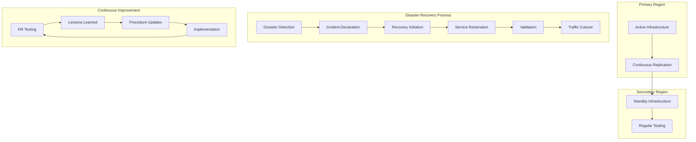
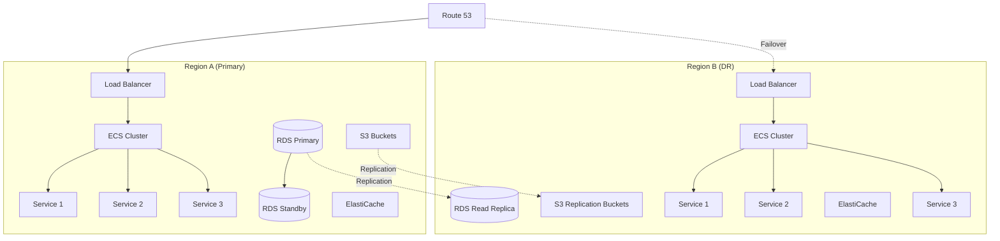
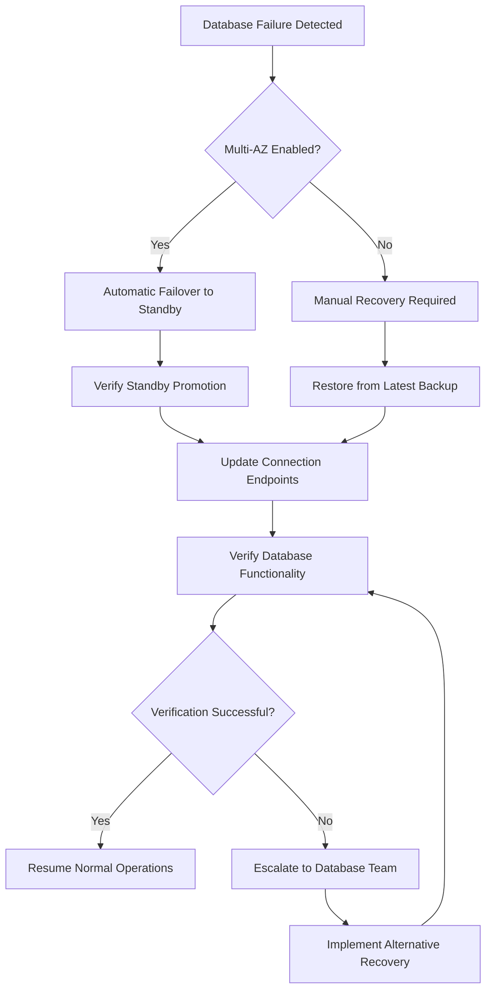
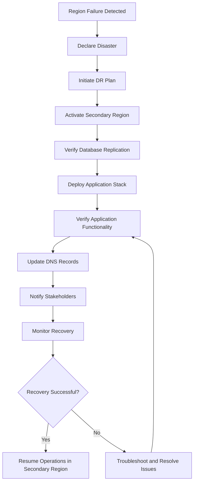
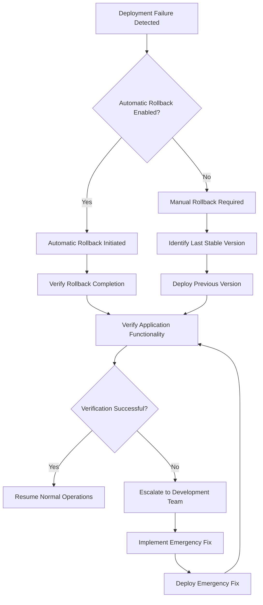
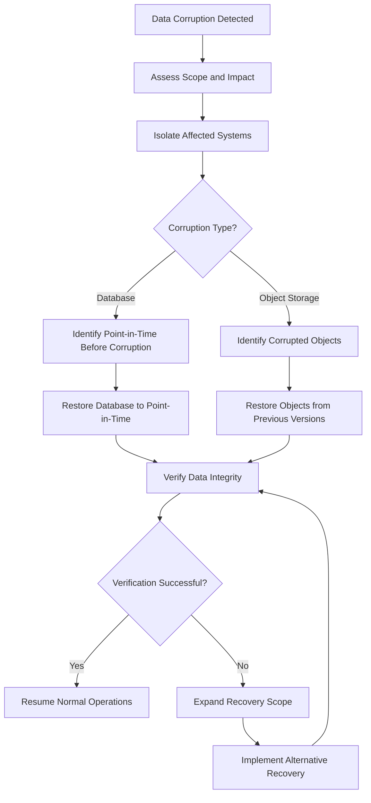
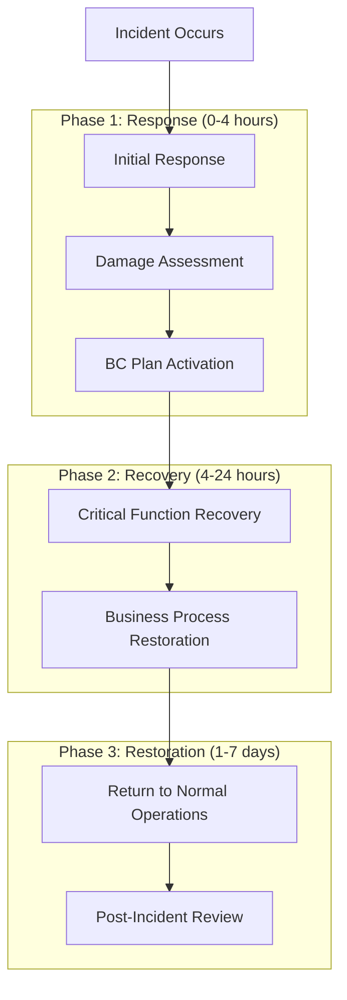
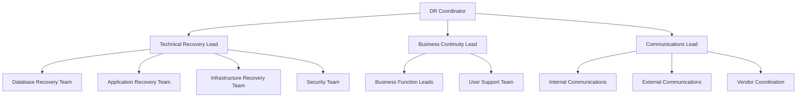
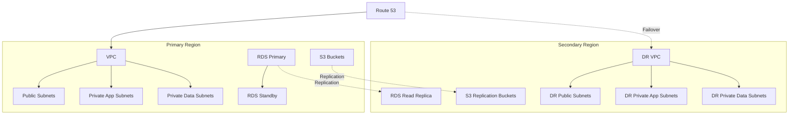

## 1. Introduction

This document outlines the disaster recovery (DR) procedures, backup strategies, and business continuity plans for the Molecular Data Management and CRO Integration Platform. It provides comprehensive guidance for maintaining system availability and data integrity during various failure scenarios.

The disaster recovery strategy is designed to meet the following objectives:

- Protect critical molecular data and research assets
- Ensure business continuity during infrastructure or application failures
- Meet regulatory compliance requirements for data protection and recovery
- Provide clear procedures for different disaster scenarios
- Define roles and responsibilities during recovery operations

This document should be used in conjunction with the monitoring procedures and CI/CD pipeline documentation to ensure a comprehensive approach to system resilience and recovery.

## 2. Disaster Recovery Strategy Overview

The Molecular Data Management and CRO Integration Platform implements a comprehensive disaster recovery strategy based on the following principles:

1. **Defense in Depth**: Multiple layers of redundancy and protection
2. **Geographic Distribution**: Multi-region deployment for resilience against regional failures
3. **Automated Recovery**: Automated procedures for common failure scenarios
4. **Regular Testing**: Scheduled DR drills to validate procedures
5. **Continuous Improvement**: Regular review and enhancement of DR capabilities

### Recovery Objectives

| Metric | Target | Measurement | Validation Method |
| --- | --- | --- | --- |
| Recovery Time Objective (RTO) | Critical functions: 1 hour<br>Non-critical functions: 4 hours<br>Complete system: 8 hours | Time to restore functionality | DR drills, actual recovery events |
| Recovery Point Objective (RPO) | Database: 1 hour maximum data loss<br>Document Storage: 15 minutes maximum data loss<br>Transaction logs: 5 minutes maximum data loss | Data currency at recovery point | Backup validation, recovery testing |
| Service Level Objective (SLO) | 99.95% availability for critical functions | Uptime monitoring | Monitoring system |

### Disaster Recovery Tiers

The platform implements a tiered approach to disaster recovery based on the criticality of components:

| Tier | Components | Recovery Strategy | RTO | RPO |
| --- | --- | --- | --- | --- |
| Tier 1 (Critical) | Database, Authentication, API Gateway | Multi-AZ with automated failover, Cross-region replication | < 1 hour | < 5 minutes |
| Tier 2 (High) | Application Services, Document Storage | Multi-AZ with automated scaling, Cross-region replication | < 4 hours | < 15 minutes |
| Tier 3 (Standard) | Batch Processing, Reporting | Backup restoration, Redeployment | < 8 hours | < 1 hour |



## 3. High Availability Architecture

The platform is designed with high availability as a core principle, using the following AWS architectural patterns:

### Multi-AZ Deployment

All critical components are deployed across multiple Availability Zones to ensure resilience against AZ failures:

- Application load balancers span multiple AZs
- ECS services distributed across multiple AZs
- RDS databases deployed in Multi-AZ configuration
- ElastiCache clusters with nodes in different AZs
- Auto-scaling groups configured to maintain balance across AZs

### Database Redundancy

Database high availability is achieved through multiple layers of redundancy:

- RDS instances in Multi-AZ configuration with synchronous replication
- Read replicas for scalability and reduced load on primary instances
- Point-in-time recovery through continuous backup
- Cross-region read replicas for disaster recovery
- Automated failover with minimal downtime

### Stateless Application Tier

The application tier is designed to be stateless for maximum resilience:

- No local state maintained on application servers
- Session state stored in distributed Redis cache
- Application containers are fully replaceable
- Auto-scaling based on load metrics
- Health checks to detect and replace unhealthy instances

### Cross-Region Replication

Critical data is replicated across AWS regions to protect against regional outages:

- Database cross-region replication (asynchronous)
- S3 bucket cross-region replication for all critical buckets
- Container images replicated to secondary region repositories
- Configuration and secrets available in both regions
- DNS configuration prepared for region failover

### Automated Failover Mechanisms

The platform includes automated failover mechanisms to minimize recovery time:

- Route 53 health checks for DNS failover
- RDS Multi-AZ automated failover
- Application load balancer health checks
- Container health checks with automatic replacement
- Circuit breakers for service dependencies



This high availability architecture ensures that the platform can withstand various types of infrastructure failures while maintaining service availability and data integrity.

## 4. Backup Strategies

The platform implements comprehensive backup strategies for different data types and components to ensure data integrity and recoverability.

### Database Backup Strategy

| Backup Type | Frequency | Retention | Storage | Verification |
| --- | --- | --- | --- | --- |
| Full Database | Daily | 30 days | S3 | Weekly restore test |
| Transaction Logs | Continuous | 7 days | S3 | Daily validation |
| Logical Backup | Weekly | 90 days | S3 Glacier | Monthly restore test |
| Cross-Region Snapshot | Weekly | 90 days | Secondary region | Quarterly DR test |

**Database Backup Implementation:**

- RDS automated backups with 30-day retention period
- Point-in-time recovery enabled with 5-minute RPO
- Multi-AZ deployment for high availability
- Read replicas in secondary region for disaster recovery
- Automated snapshot sharing to secondary region

### Document Storage Backup Strategy

| Bucket Type | Backup Method | Frequency | Retention | Verification |
| --- | --- | --- | --- | --- |
| Document Storage | Versioning + Replication | Real-time | 7 years | Monthly validation |
| CSV Upload Storage | Versioning | Real-time | 90 days | Weekly validation |
| Results Storage | Versioning + Replication | Real-time | 7 years | Monthly validation |
| Backup Storage | Lifecycle Policies | Automated | Based on policy | Quarterly validation |

**S3 Backup Implementation:**

- Versioning enabled on all buckets to protect against accidental deletion
- Cross-region replication for document and results buckets
- Lifecycle policies to transition older objects to cost-effective storage classes
- Object lock for compliance-critical documents
- Regular integrity checks and validation

### Application Configuration Backup

| Configuration Type | Backup Method | Frequency | Storage | Verification |
| --- | --- | --- | --- | --- |
| Infrastructure Code | Git Repository | On change | GitHub + S3 | Deployment testing |
| Application Config | Parameter Store | On change | AWS SSM + S3 | Deployment testing |
| Secrets | Secrets Manager | On change | AWS Secrets Manager | Access validation |
| Container Images | ECR Replication | Every build | ECR in multiple regions | Deployment testing |

**Configuration Backup Implementation:**

- All infrastructure defined as code in version-controlled repositories
- Regular exports of configuration to secure S3 buckets
- Cross-region replication of container images
- Automated validation during CI/CD pipeline execution

### Backup Monitoring and Validation

All backup processes are monitored for successful completion and regularly validated:

- Automated monitoring of backup job completion
- Regular restore testing according to schedule
- Integrity validation of backup data
- Alerting for backup failures or validation issues
- Comprehensive backup reporting and compliance documentation

## 5. Disaster Recovery Procedures

This section outlines the detailed procedures for recovering from different disaster scenarios. Each procedure includes step-by-step instructions, roles and responsibilities, and validation criteria.

### Database Failure Recovery

**Scenario:** Primary RDS instance failure

**Impact:** Database unavailability, potential application downtime

**Recovery Procedure:**



1. **Detection (Automated):**
   - CloudWatch alarms detect database instance failure
   - Health checks fail for database connections
   - Alerts sent to on-call engineer

2. **Initial Response (SRE Team, 5-15 minutes):**
   - Acknowledge alert and assess situation
   - Verify if automatic failover is in progress (Multi-AZ)
   - If automatic failover is occurring, monitor progress
   - If no automatic failover, initiate manual recovery procedure

3. **Automatic Failover (Automated, 1-3 minutes):**
   - RDS promotes standby instance to primary
   - DNS record updated to point to new primary
   - Applications reconnect to database

4. **Manual Recovery (SRE Team, 15-30 minutes):**
   - Restore from latest automated backup
   - Apply transaction logs to reach latest possible state
   - Update connection endpoints if necessary

5. **Verification (SRE Team, 5-10 minutes):**
   - Verify database connectivity
   - Run database health checks
   - Verify data integrity
   - Confirm application functionality

6. **Post-Recovery (SRE Team, 30 minutes):**
   - Re-establish database backups
   - Recreate standby instance if using Multi-AZ
   - Document incident and recovery actions
   - Review for process improvements

**Expected RTO:** < 1 hour
**Expected RPO:** < 5 minutes

### Region Failure Recovery

**Scenario:** Complete AWS region outage

**Impact:** Complete platform unavailability in affected region

**Recovery Procedure:**



1. **Detection (Automated/Manual, 5-15 minutes):**
   - Multiple CloudWatch alarms across services
   - AWS Health Dashboard indicates region issue
   - External monitoring detects service unavailability
   - Alerts sent to on-call engineer and management

2. **Disaster Declaration (DR Coordinator, 15 minutes):**
   - Assess scope and severity of outage
   - Estimate outage duration based on AWS communications
   - Formally declare disaster if estimated outage exceeds 1 hour
   - Notify DR team and stakeholders

3. **DR Plan Initiation (DR Team, 15 minutes):**
   - Assemble DR team on emergency bridge
   - Assign roles and responsibilities
   - Review DR plan and procedures
   - Initiate recovery in secondary region

4. **Secondary Region Activation (DR Team, 1-2 hours):**
   - Verify database replication status
   - Deploy application stack using CI/CD pipeline
   - Scale services to handle production load
   - Verify cross-region data replication

5. **Service Verification (DR Team, 30 minutes):**
   - Run comprehensive health checks
   - Verify critical business functions
   - Validate data integrity and currency
   - Test end-to-end workflows

6. **Traffic Cutover (DR Team, 15 minutes):**
   - Update Route 53 DNS records to point to secondary region
   - Verify DNS propagation
   - Monitor application performance and error rates

7. **Post-Recovery (DR Team, Ongoing):**
   - Notify users of region failover
   - Monitor application in secondary region
   - Maintain communication with AWS about primary region status
   - Plan for return to primary region when available

**Expected RTO:** < 4 hours
**Expected RPO:** < 15 minutes

### Application Deployment Failure Recovery

**Scenario:** Failed application deployment causing service disruption

**Impact:** Application unavailability or degraded functionality

**Recovery Procedure:**



1. **Detection (Automated, 1-5 minutes):**
   - Deployment pipeline reports failure
   - Health checks fail after deployment
   - Error rates increase above threshold
   - Alerts sent to development and operations teams

2. **Initial Response (DevOps Team, 5 minutes):**
   - Acknowledge alert and assess impact
   - Verify if automatic rollback is in progress
   - If automatic rollback is occurring, monitor progress
   - If no automatic rollback, initiate manual rollback procedure

3. **Automatic Rollback (Automated, 5-10 minutes):**
   - CI/CD pipeline detects failure and initiates rollback
   - Previous version is redeployed
   - Health checks verify service restoration

4. **Manual Rollback (DevOps Team, 10-20 minutes):**
   - Identify last stable version
   - Trigger deployment of previous version
   - Monitor deployment progress
   - Verify service restoration

5. **Verification (DevOps Team, 5-10 minutes):**
   - Run application health checks
   - Verify critical functionality
   - Monitor error rates and performance
   - Confirm user access

6. **Post-Recovery (DevOps and Development Teams, 1 hour):**
   - Document incident and rollback actions
   - Analyze root cause of deployment failure
   - Fix issues in development environment
   - Update deployment procedures if necessary

**Expected RTO:** < 30 minutes
**Expected RPO:** 0 (no data loss)

### Data Corruption Recovery

**Scenario:** Data corruption in database or object storage

**Impact:** Incorrect data, potential application errors

**Recovery Procedure:**



1. **Detection (Automated/Manual):**
   - Data integrity checks fail
   - Application reports data inconsistencies
   - Users report incorrect data
   - Alerts from monitoring systems

2. **Initial Assessment (Data Team, 15-30 minutes):**
   - Identify affected data and systems
   - Determine corruption scope and impact
   - Identify potential corruption source
   - Isolate affected systems if necessary

3. **Database Corruption Recovery (Data Team, 1-2 hours):**
   - Identify point-in-time before corruption
   - Initiate point-in-time recovery
   - Restore database to selected recovery point
   - Verify data integrity after restoration

4. **Object Storage Corruption Recovery (Data Team, 30-60 minutes):**
   - Identify corrupted objects
   - Restore previous versions from versioned buckets
   - Verify object integrity after restoration
   - Update references if necessary

5. **Verification (Data Team, 30 minutes):**
   - Run data integrity checks
   - Verify application functionality with restored data
   - Confirm resolution of reported issues
   - Validate critical business processes

6. **Post-Recovery (Data Team, 1 hour):**
   - Document corruption incident and recovery actions
   - Analyze root cause of corruption
   - Implement preventive measures
   - Enhance data validation procedures

**Expected RTO:** < 2 hours
**Expected RPO:** Depends on corruption detection time, typically < 24 hours

### Additional Recovery Procedures

Detailed procedures for additional disaster scenarios are maintained in the DR playbook, including:

- Network connectivity failure
- Security breach response
- Third-party integration failure
- Infrastructure configuration error
- Accidental data deletion

Each procedure follows the same structured approach with clear steps, responsibilities, and validation criteria.

## 6. Business Continuity Plan

The Business Continuity Plan (BCP) outlines the strategies and procedures to ensure critical business functions continue during and after a disaster or major disruption. This plan complements the technical disaster recovery procedures with organizational and operational considerations.

### Critical Business Functions

| Business Function | Maximum Tolerable Downtime | Recovery Priority | Responsible Team |
| --- | --- | --- | --- |
| Molecule Data Access | 4 hours | High | Data Management Team |
| CRO Submission Processing | 8 hours | Medium | Integration Team |
| User Authentication | 1 hour | Critical | Security Team |
| Experimental Results Access | 8 hours | Medium | Data Management Team |
| Document Management | 12 hours | Low | Integration Team |

### Business Continuity Roles and Responsibilities

| Role | Responsibilities | Primary Contact | Secondary Contact |
| --- | --- | --- | --- |
| BC Coordinator | Overall coordination of BC activities | [BC Manager Name] | [Alternate BC Manager Name] |
| Technical Recovery Lead | Coordination of technical recovery efforts | [IT Manager Name] | [Alternate IT Manager Name] |
| Communications Lead | Internal and external communications | [Comms Manager Name] | [Alternate Comms Manager Name] |
| Business Function Leads | Recovery of specific business functions | [Function Owners] | [Alternate Function Owners] |

### Communication Plan

**Internal Communication:**

- Emergency notification system for all employees
- Regular status updates via designated channels
- Clear escalation paths for issues and decisions
- Documentation of all communications during incident

**External Communication:**

- Designated spokespersons for external communications
- Templates for customer/partner notifications
- Regular status updates for affected stakeholders
- Coordination with third-party providers

### Alternate Operating Procedures

In the event of extended system unavailability, the following alternate procedures can be implemented:

| Business Function | Alternate Procedure | Maximum Duration | Activation Trigger |
| --- | --- | --- | --- |
| Molecule Data Management | Manual tracking using spreadsheets | 72 hours | System unavailable > 4 hours |
| CRO Submissions | Email-based submission process | 1 week | System unavailable > 8 hours |
| Document Exchange | Secure file sharing service | 2 weeks | System unavailable > 12 hours |
| Results Processing | Manual data entry from CRO reports | 1 week | System unavailable > 8 hours |

### Business Recovery Phases



1. **Phase 1: Response (0-4 hours)**
   - Incident detection and declaration
   - Activation of BC team
   - Initial damage assessment
   - Stakeholder notification
   - Activation of technical recovery procedures

2. **Phase 2: Recovery (4-24 hours)**
   - Recovery of critical business functions
   - Implementation of alternate procedures if needed
   - Regular status updates to stakeholders
   - Coordination of recovery activities
   - Verification of recovered functions

3. **Phase 3: Restoration (1-7 days)**
   - Full restoration of all business functions
   - Return to normal operations
   - Deactivation of alternate procedures
   - Post-incident review and analysis
   - BC plan updates based on lessons learned

### Business Continuity Testing

The Business Continuity Plan is tested regularly to ensure effectiveness:

| Test Type | Frequency | Scope | Participants |
| --- | --- | --- | --- |
| Tabletop Exercise | Quarterly | Scenario-based discussion | BC team and function leads |
| Functional Test | Semi-annually | Testing of specific functions | Technical teams and function owners |
| Full-Scale Exercise | Annually | Complete BC plan activation | All BC team members and key stakeholders |

Test results are documented, reviewed, and used to improve the BC plan and procedures.

## 7. Disaster Recovery Testing

Regular testing of disaster recovery procedures is essential to ensure their effectiveness and to maintain team readiness. This section outlines the DR testing approach, schedule, and validation criteria.

### DR Test Types

| Test Type | Description | Scope | Frequency | Participants |
| --- | --- | --- | --- | --- |
| Tabletop Exercise | Scenario-based discussion of recovery procedures | Recovery coordination and communication | Quarterly | DR team, key stakeholders |
| Component Recovery Test | Testing recovery of specific components | Individual system recovery | Monthly | Technical teams |
| Regional Failover Test | Testing failover to secondary region | Cross-region recovery | Quarterly | DR team, technical teams |
| Full DR Test | Complete disaster recovery simulation | End-to-end recovery | Annually | All teams and stakeholders |

### DR Test Schedule

| Month | Test Type | Components | Participants |
| --- | --- | --- | --- |
| January | Component Recovery | Database Restore | Database Team |
| February | Tabletop Exercise | Region Failure Scenario | DR Team, Management |
| March | Component Recovery | S3 Bucket Restore | Storage Team |
| April | Regional Failover | Read-Only Workloads | DR Team, App Team |
| May | Component Recovery | Application Rollback | DevOps Team |
| June | Tabletop Exercise | Data Corruption Scenario | DR Team, Data Team |
| July | Component Recovery | Network Failover | Network Team |
| August | Regional Failover | Full Application Stack | All Technical Teams |
| September | Component Recovery | Security Incident Response | Security Team |
| October | Tabletop Exercise | Multiple Failure Scenario | DR Team, Management |
| November | Component Recovery | Configuration Restore | DevOps Team |
| December | Full DR Test | Complete Platform Recovery | All Teams |

### DR Test Procedures

**Component Recovery Test Procedure:**

1. Define test objectives and success criteria
2. Schedule test window and notify stakeholders
3. Create test environment if needed
4. Execute recovery procedure
5. Validate recovery success
6. Document results and lessons learned
7. Update procedures based on findings

**Regional Failover Test Procedure:**

1. Define test scope and success criteria
2. Schedule test window and notify stakeholders
3. Prepare secondary region for failover
4. Execute regional failover procedure
5. Validate application functionality in secondary region
6. Test failback procedure (if in scope)
7. Document results and lessons learned
8. Update procedures based on findings

**Full DR Test Procedure:**

1. Define comprehensive test scenario
2. Schedule extended test window and notify all stakeholders
3. Establish test coordination center
4. Simulate disaster scenario
5. Execute complete DR plan
6. Validate all recovery objectives
7. Test business continuity procedures
8. Execute return to normal operations
9. Conduct thorough post-test review
10. Update all DR and BC documentation

### DR Test Documentation

Each DR test is thoroughly documented, including:

- Test plan with objectives and success criteria
- Test scenario and scope
- Participant roles and responsibilities
- Step-by-step execution record
- Issues encountered and resolutions
- Recovery time measurements
- Success criteria validation
- Lessons learned and improvement opportunities

### DR Test Metrics

| Metric | Target | Measurement Method |
| --- | --- | --- |
| Recovery Time | Within defined RTO | Measured during test |
| Recovery Point | Within defined RPO | Data validation after recovery |
| Procedure Accuracy | 100% of steps executable as documented | Participant feedback |
| Success Rate | 100% of success criteria met | Post-test validation |
| Team Readiness | All team members understand their roles | Post-test survey |

Test results are reviewed by the DR team and management, with action items assigned for any identified improvements.

## 8. Roles and Responsibilities

Clear definition of roles and responsibilities is critical for effective disaster recovery. This section outlines the key roles, their responsibilities, and the escalation paths during disaster recovery operations.

### DR Team Structure



### Key Roles and Responsibilities

| Role | Primary Responsibility | Secondary Responsibilities | Skills Required |
| --- | --- | --- | --- |
| DR Coordinator | Overall coordination of DR activities | Decision-making, stakeholder management | Leadership, crisis management |
| Technical Recovery Lead | Coordination of technical recovery | Resource allocation, technical decisions | Technical expertise, coordination |
| Business Continuity Lead | Business process continuity | Alternate procedure activation | Business process knowledge |
| Communications Lead | Stakeholder communications | Status reporting, vendor coordination | Communication, stakeholder management |
| Database Recovery Team | Database restoration | Data integrity verification | Database administration |
| Application Recovery Team | Application recovery | Service verification | Application architecture knowledge |
| Infrastructure Recovery Team | Infrastructure recovery | Network and system restoration | Cloud infrastructure expertise |
| Security Team | Security monitoring and response | Access control, vulnerability management | Security expertise |

### Escalation Paths

| Issue Type | First Level | Second Level | Final Escalation |
| --- | --- | --- | --- |
| Technical Recovery Issues | Technical Recovery Lead | DR Coordinator | CTO |
| Business Process Issues | Business Function Lead | Business Continuity Lead | COO |
| Resource Constraints | DR Coordinator | Executive Sponsor | CEO |
| External Provider Issues | Vendor Coordinator | Technical Recovery Lead | CTO |
| Security Incidents | Security Team Lead | CISO | CEO |

### Contact Information

A comprehensive contact list is maintained in the DR documentation, including:

- DR team members and alternates
- Executive leadership
- Technical specialists
- External service providers
- Regulatory contacts
- Customer support

The contact list is reviewed and updated monthly to ensure accuracy.

## 9. Recovery Infrastructure

This section describes the infrastructure components dedicated to disaster recovery and how they are provisioned, maintained, and accessed during recovery operations.

### DR Infrastructure Components

| Component | Purpose | Configuration | Access Method |
| --- | --- | --- | --- |
| Secondary Region | Full application recovery | Warm standby with minimal resources | AWS Management Console, CI/CD pipeline |
| Database Replicas | Database recovery | Read replicas in secondary region | AWS RDS console, automated scripts |
| S3 Replication Buckets | Object storage recovery | Cross-region replication enabled | AWS S3 console, automated scripts |
| DR VPC | Network isolation for recovery | Pre-configured in secondary region | AWS VPC console, Terraform |
| DR Security Groups | Network security for recovery | Pre-configured with necessary permissions | AWS EC2 console, Terraform |
| DR IAM Roles | Access control for recovery | Pre-configured with necessary permissions | AWS IAM console, Terraform |

### DR Infrastructure Provisioning

The DR infrastructure is provisioned and maintained using Infrastructure as Code (IaC) with Terraform:

- All infrastructure components defined in Terraform modules
- DR-specific configurations maintained in separate environment files
- Regular updates synchronized with production changes
- Automated validation of DR infrastructure

### DR Access Control

Access to DR infrastructure is strictly controlled:

- Separate IAM roles for DR operations
- Just-in-time access for DR activities
- Multi-factor authentication required
- Comprehensive access logging
- Regular access review and cleanup

### DR Network Configuration



The DR network is configured to mirror the production network, with the following considerations:

- Identical subnet structure and CIDR ranges
- Pre-configured security groups and NACLs
- VPC peering or Transit Gateway for cross-region communication
- DNS failover configuration in Route 53
- Network ACLs aligned with production

### DR Scaling Strategy

The DR infrastructure uses a warm standby approach with minimal resources during normal operations, with the ability to scale up during recovery:

- Minimal ECS tasks running in secondary region
- Auto-scaling groups configured but scaled down
- Database read replicas maintained for data currency
- Ability to rapidly scale up using infrastructure automation
- Regular testing of scaling capabilities

## 10. Data Recovery Procedures

This section provides detailed procedures for recovering different types of data in the event of data loss or corruption.

### Database Data Recovery

**Point-in-Time Recovery Procedure:**

1. **Identify Recovery Point:**
   - Determine the timestamp before data corruption or loss
   - Verify transaction log availability for selected point

2. **Initiate Recovery:**
   ```bash
   # Using AWS CLI
   aws rds restore-db-instance-to-point-in-time \
     --source-db-instance-identifier moleculeflow-prod \
     --target-db-instance-identifier moleculeflow-recovery \
     --restore-time "2023-09-15T08:45:00Z" \
     --db-instance-class db.r5.2xlarge \
     --multi-az \
     --storage-type gp3 \
     --allocated-storage 100
   ```

3. **Monitor Recovery Progress:**
   ```bash
   aws rds describe-db-instances \
     --db-instance-identifier moleculeflow-recovery \
     --query 'DBInstances[0].DBInstanceStatus'
   ```

4. **Verify Recovered Data:**
   - Connect to recovered instance
   - Run data integrity checks
   - Verify critical tables and records
   - Validate application functionality with recovered database

5. **Switch to Recovered Database:**
   - Update application configuration to use recovered database
   - Verify application connectivity
   - Monitor application performance and error rates

### S3 Object Recovery

**Object Version Recovery Procedure:**

1. **Identify Objects to Recover:**
   - Determine affected objects and required versions
   - Verify version availability in bucket versioning

2. **List Available Versions:**
   ```bash
   # Using AWS CLI
   aws s3api list-object-versions \
     --bucket moleculeflow-documents \
     --prefix "path/to/object" \
     --query 'Versions[*].{Key:Key,VersionId:VersionId,LastModified:LastModified}'
   ```

3. **Restore Previous Version:**
   ```bash
   # Using AWS CLI
   aws s3api copy-object \
     --bucket moleculeflow-documents \
     --copy-source moleculeflow-documents/path/to/object?versionId=VERSION_ID \
     --key path/to/object
   ```

4. **Verify Restored Objects:**
   - Download and verify object integrity
   - Check metadata and permissions
   - Validate application access to restored objects

### Deleted Object Recovery

**Deleted Object Recovery Procedure:**

1. **Identify Deleted Objects:**
   - Determine which objects were deleted
   - Verify deletion markers in versioned buckets

2. **List Deletion Markers:**
   ```bash
   # Using AWS CLI
   aws s3api list-object-versions \
     --bucket moleculeflow-documents \
     --prefix "path/to/object" \
     --query 'DeleteMarkers[*].{Key:Key,VersionId:VersionId,LastModified:LastModified}'
   ```

3. **Restore Deleted Object:**
   ```bash
   # Using AWS CLI
   aws s3api copy-object \
     --bucket moleculeflow-documents \
     --copy-source moleculeflow-documents/path/to/object?versionId=LAST_VERSION_ID \
     --key path/to/object