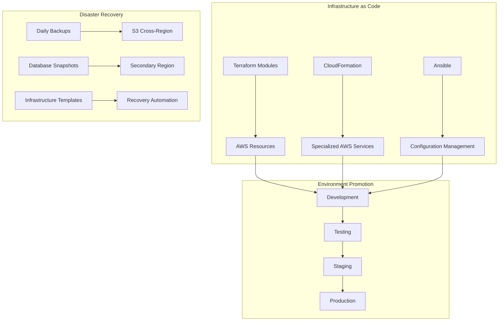
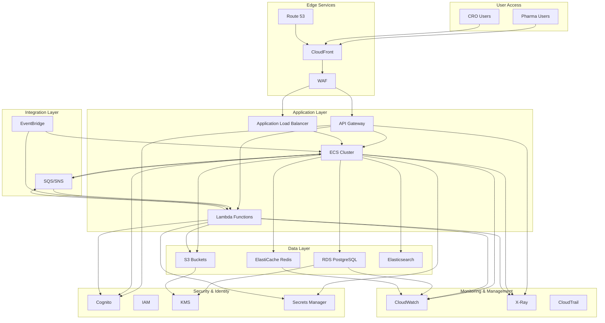
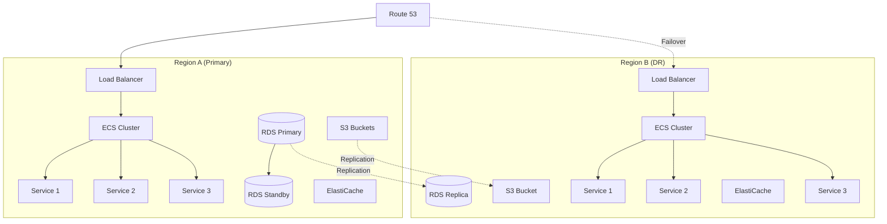
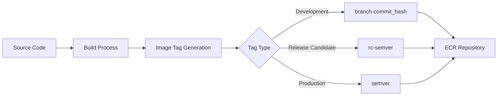
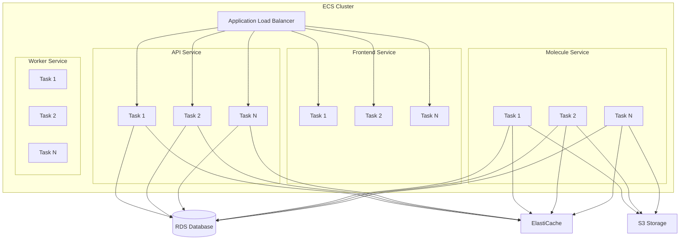
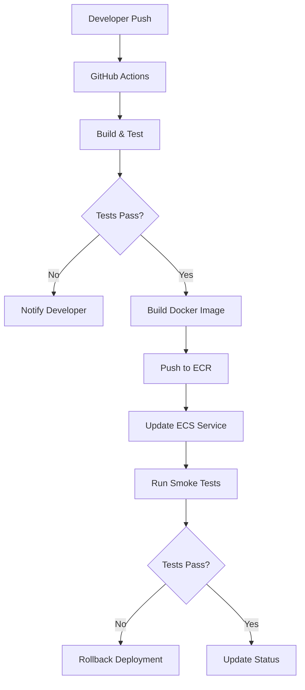

## 1. Infrastructure Overview

This document provides a comprehensive overview of the infrastructure architecture for the Molecular Data Management and CRO Integration Platform. The platform is designed as a cloud-native application deployed on AWS, leveraging containerization, orchestration, and managed services to provide a scalable, reliable, and secure environment for molecular data management and CRO integration.

The infrastructure architecture addresses the following key requirements:

- **Scalability**: Ability to handle varying workloads, from small datasets to 500,000+ molecules
- **High Availability**: Multi-AZ and multi-region deployment for resilience against failures
- **Security**: Comprehensive security controls to protect sensitive molecular data
- **Compliance**: Infrastructure designed to meet 21 CFR Part 11, GDPR, and other regulatory requirements
- **Cost Efficiency**: Optimized resource utilization with auto-scaling and right-sizing

This document outlines the AWS services used, containerization approach, orchestration strategy, networking architecture, and security controls implemented in the platform.

## 2. Deployment Environment

### Target Environment

The Molecular Data Management and CRO Integration Platform is deployed as a cloud-native application on AWS with the following characteristics:

| Environment Aspect | Specification | Justification |
| --- | --- | --- |
| Environment Type | AWS Cloud (Primary) | Scalability needs, global accessibility, reduced maintenance overhead |
| Geographic Distribution | Multi-region deployment | Support for global pharma-CRO collaborations, data residency compliance |
| Compliance Requirements | 21 CFR Part 11, GDPR, HIPAA | Pharmaceutical industry regulations for data integrity and privacy |

**Resource Requirements:**

| Resource Type | Base Requirements | Peak Requirements |
| --- | --- | --- |
| Compute | 16 vCPUs per region | Auto-scale to 64 vCPUs during batch processing |
| Memory | 64 GB RAM per region | Auto-scale to 256 GB during batch processing |
| Storage | 1 TB initial allocation | Expandable to 10+ TB with lifecycle policies |
| Network | 1 Gbps bandwidth | Burst capacity to 10 Gbps for large file transfers |

### Environment Management



**Infrastructure as Code Strategy:**

| IaC Component | Tool | Purpose | Update Frequency |
| --- | --- | --- | --- |
| Core Infrastructure | Terraform // v1.5+ | Define AWS resources (VPC, subnets, security groups) | On architectural changes |
| Application Resources | Terraform // v1.5+ | Define ECS clusters, load balancers, databases | On application changes |
| Specialized Services | CloudFormation | Define AWS-specific services (Cognito, API Gateway) | On service configuration changes |
| Configuration | Ansible | Manage application configurations and secrets | On configuration changes |

**Environment Promotion Strategy:**

| Environment | Purpose | Refresh Frequency | Data Source |
| --- | --- | --- | --- |
| Development | Feature development, unit testing | Continuous | Synthetic test data |
| Testing | Integration testing, performance testing | Daily | Anonymized subset of production |
| Staging | Pre-production validation, UAT | Per release | Replica of production |
| Production | Live system | N/A | Production data |

The infrastructure is managed using a GitOps approach, with all infrastructure definitions stored in version control and deployed through automated CI/CD pipelines. This ensures consistency across environments and provides a complete audit trail of infrastructure changes.

## 3. AWS Services Architecture

### Core Services Overview



### Service Selection and Configuration

| Service | Purpose | Configuration | Justification |
| --- | --- | --- | --- |
| Amazon ECS | Container orchestration | Fargate (serverless) | Simplified management, automatic scaling |
| Amazon RDS | PostgreSQL database | Multi-AZ, db.r5.2xlarge | High availability, performance for complex queries |
| Amazon S3 | Object storage | Standard + Intelligent Tiering | Cost-effective storage for molecules and documents |
| Amazon ElastiCache | Redis caching | Cluster mode enabled | High-performance caching for molecule data |
| Amazon Cognito | Authentication | User pools with MFA | Secure identity management with enterprise SSO integration |
| AWS Lambda | Serverless functions | 1024MB memory | Event-driven processing for integrations |
| Amazon SQS/SNS | Messaging | Standard and FIFO queues | Reliable asynchronous communication between microservices |
| Amazon API Gateway | API management | REST API with throttling | Secure API access with rate limiting |
| AWS WAF | Web application firewall | OWASP Top 10 protection | Protection against common web vulnerabilities |
| Amazon CloudFront | Content delivery | Global distribution | Fast access to static assets and API |
| Amazon Route 53 | DNS management | Health checks, failover | High availability DNS with automatic failover |
| AWS Secrets Manager | Secret management | Automatic rotation | Secure storage of credentials and API keys |
| Amazon CloudWatch | Monitoring | Custom dashboards, alarms | Comprehensive monitoring and alerting |
| AWS X-Ray | Distributed tracing | Service map, trace analysis | End-to-end request tracing |

### High Availability Design



The high availability architecture includes:

1. **Multi-AZ Deployment**: All services deployed across at least 3 availability zones
2. **Database Redundancy**: RDS with Multi-AZ deployment and read replicas
3. **Stateless Application Tier**: Services designed to be stateless for easy scaling and failover
4. **Cross-Region Replication**: Critical data replicated to secondary region
5. **Automated Failover**: Route 53 health checks with automated DNS failover

### Cost Optimization Strategy

| Strategy | Implementation | Expected Savings |
| --- | --- | --- |
| Right-sizing | Regular resource utilization analysis | 20-30% |
| Reserved Instances | 1-year commitment for baseline capacity | 40-60% |
| Spot Instances | For non-critical batch processing | 60-80% |
| S3 Lifecycle Policies | Transition to lower-cost tiers after 90 days | 40-50% |
| Auto-scaling | Scale down during low-usage periods | 15-25% |

The infrastructure is designed with cost optimization in mind, using a combination of reserved instances for baseline capacity, spot instances for batch processing, and auto-scaling to match resource allocation with demand. Regular cost analysis and optimization reviews are conducted to identify opportunities for further savings.

## 4. Containerization Strategy

### Container Platform

Docker has been selected as the containerization platform for the following reasons:

1. Industry standard with mature tooling
2. Excellent support for Python and Node.js applications
3. Strong security features and scanning tools
4. Compatibility with AWS ECS and other orchestration platforms
5. Extensive base image ecosystem

### Base Image Strategy

| Service | Base Image | Justification | Security Considerations |
| --- | --- | --- | --- |
| Frontend | nginx:alpine | Minimal footprint, security | Regular security updates |
| Backend API | python:3.10-slim | Reduced size, official support | Minimal dependencies |
| Molecule Service | python:3.10-slim + RDKit | Required for molecular processing | Custom build with security scanning |
| Worker Services | python:3.10-slim | Optimized for background processing | Minimal attack surface |

**Base Image Security Practices:**

1. Use official images whenever possible
2. Pin specific versions (avoid `latest` tag)
3. Implement multi-stage builds to minimize image size
4. Remove development dependencies from production images
5. Regular security scanning and updates

### Multi-Stage Build Process

The backend services use a multi-stage build process to optimize image size and security:

```dockerfile
# Build stage
FROM python:3.10-slim AS builder

ENV PYTHONDONTWRITEBYTECODE=1
ENV PYTHONUNBUFFERED=1

RUN apt-get update && \
    apt-get install -y build-essential wget git && \
    apt-get clean && \
    rm -rf /var/lib/apt/lists/*

WORKDIR /app

# Install RDKit via conda for molecular processing
RUN wget https://repo.anaconda.com/miniconda/Miniconda3-latest-Linux-x86_64.sh -O miniconda.sh && \
    bash miniconda.sh -b -p /opt/conda && \
    rm miniconda.sh

ENV PATH=/opt/conda/bin:$PATH

RUN conda create -y -n rdkit-env python=3.10 && \
    conda install -y -n rdkit-env -c conda-forge rdkit

SHELL ["conda", "run", "-n", "rdkit-env", "/bin/bash", "-c"]

COPY requirements.txt .
RUN pip install --no-cache-dir -r requirements.txt

# Final stage
FROM builder AS final

WORKDIR /app

COPY --from=builder /opt/conda /opt/conda
COPY --from=builder /app /app
COPY . .

ENV PATH=/opt/conda/bin:$PATH

# Create non-root user for security
RUN groupadd -r appuser && \
    useradd -r -g appuser appuser && \
    chown -R appuser:appuser /app

USER appuser

EXPOSE 8000

CMD ["conda", "run", "-n", "rdkit-env", "gunicorn", "app.main:app", "--workers", "4", "--worker-class", "uvicorn.workers.UvicornWorker", "--bind", "0.0.0.0:8000"]
```

This multi-stage build process provides several benefits:

1. Smaller final image size by excluding build dependencies
2. Improved security by running as a non-root user
3. Optimized layer caching for faster builds
4. Inclusion of specialized libraries like RDKit for molecular processing

### Image Versioning and Tagging



| Image Type | Tagging Strategy | Retention Policy | Usage |
| --- | --- | --- | --- |
| Development | `dev-{branch}-{short_commit}` | 7 days | Development and testing |
| Release Candidate | `rc-{major}.{minor}.{patch}` | 30 days | Staging and UAT |
| Production | `{major}.{minor}.{patch}` | 1 year | Production deployment |
| Latest Stable | `latest` | N/A (alias) | Quick reference |

### Security Scanning

| Scan Type | Tool | Frequency | Integration Point |
| --- | --- | --- | --- |
| Vulnerability Scanning | Trivy | Every build | CI/CD pipeline |
| Secret Detection | git-secrets | Pre-commit, CI/CD | Developer workflow, CI/CD |
| SCA (Dependencies) | OWASP Dependency Check | Daily | CI/CD pipeline |
| Compliance Scanning | Docker Bench | Weekly | Scheduled job |

All container images must pass security scanning before deployment to any environment. Critical vulnerabilities block deployment, while high-severity issues require documented exceptions.

## 5. Orchestration Architecture

### Orchestration Platform

Amazon ECS with AWS Fargate has been selected as the orchestration platform for the following reasons:

1. Serverless operation reduces operational overhead
2. Tight integration with AWS services (ALB, IAM, CloudWatch)
3. Simplified scaling and deployment model
4. Strong security posture with task-level isolation
5. Cost-effective for variable workloads

### Cluster Architecture



**Cluster Configuration:**

| Component | Configuration | Purpose |
| --- | --- | --- |
| ECS Cluster | Fargate launch type | Container orchestration |
| Task Definitions | CPU/Memory per service | Resource allocation |
| Services | Desired count and health checks | Service management |
| Load Balancer | Application Load Balancer | Traffic distribution |

### Service Deployment Strategy

| Service | Deployment Type | Minimum Instances | Maximum Instances |
| --- | --- | --- | --- |
| Frontend | Rolling update | 2 | 10 |
| API Service | Blue/Green | 2 | 20 |
| Molecule Service | Blue/Green | 2 | 20 |
| Worker Service | Rolling update | 2 | 50 |

**Deployment Configuration:**

- **Minimum healthy percent**: 100% (ensure no downtime)
- **Maximum percent**: 200% (allow new version to deploy alongside old)
- **Health check grace period**: 60 seconds
- **Deployment circuit breaker**: Enabled (roll back on failure)

### Auto-scaling Configuration

| Service | Scaling Metric | Scale-Out Trigger | Scale-In Trigger | Cooldown |
| --- | --- | --- | --- | --- |
| Frontend | CPU Utilization | \> 70% for 3 minutes | \< 30% for 10 minutes | 5 minutes |
| API Service | Request Count | \> 1000 req/min per task | \< 500 req/min per task | 3 minutes |
| Molecule Service | CPU Utilization | \> 60% for 3 minutes | \< 20% for 10 minutes | 5 minutes |
| Worker Service | Queue Depth | \> 1000 messages per task | \< 10 messages per task | 5 minutes |

**Scheduled Scaling:**

| Service | Schedule | Adjustment | Reason |
| --- | --- | --- | --- |
| All Services | Weekdays 8am | Scale to 100% capacity | Business hours begin |
| All Services | Weekdays 6pm | Scale to 50% capacity | Reduced after-hours usage |
| Worker Service | Daily 2am | Scale to 200% capacity | Batch processing window |

### Task Definition Example

The following is an example of the ECS task definition for the backend API service:

```json
{
  "family": "moleculeflow-backend",
  "executionRoleArn": "${aws_iam_role.ecs_execution_role.arn}",
  "taskRoleArn": "${aws_iam_role.ecs_task_role.arn}",
  "networkMode": "awsvpc",
  "containerDefinitions": [
    {
      "name": "backend-api",
      "image": "${aws_ecr_repository.backend_repo.repository_url}:latest",
      "essential": true,
      "cpu": 1024,
      "memory": 2048,
      "portMappings": [
        {
          "containerPort": 8000,
          "hostPort": 8000,
          "protocol": "tcp"
        }
      ],
      "environment": [
        {
          "name": "ENV",
          "value": "${var.environment}"
        },
        {
          "name": "DEBUG",
          "value": "0"
        },
        {
          "name": "PROJECT_NAME",
          "value": "Molecular Data Management and CRO Integration Platform"
        },
        {
          "name": "API_V1_STR",
          "value": "/api/v1"
        },
        {
          "name": "REDIS_URL",
          "value": "${aws_elasticache_replication_group.redis.primary_endpoint_address}:6379/0"
        },
        {
          "name": "S3_BUCKET_NAME",
          "value": "${aws_s3_bucket.molecule_data.bucket}"
        },
        {
          "name": "AWS_REGION",
          "value": "${var.aws_region}"
        },
        {
          "name": "DATABASE_MAX_CONNECTIONS",
          "value": "20"
        },
        {
          "name": "DATABASE_POOL_SIZE",
          "value": "10"
        },
        {
          "name": "DATABASE_POOL_OVERFLOW",
          "value": "10"
        },
        {
          "name": "ACCESS_TOKEN_EXPIRE_MINUTES",
          "value": "15"
        },
        {
          "name": "REFRESH_TOKEN_EXPIRE_DAYS",
          "value": "7"
        },
        {
          "name": "PAGINATION_DEFAULT_PAGE",
          "value": "1"
        },
        {
          "name": "PAGINATION_DEFAULT_PAGE_SIZE",
          "value": "50"
        },
        {
          "name": "PAGINATION_MAX_PAGE_SIZE",
          "value": "100"
        },
        {
          "name": "LOG_LEVEL",
          "value": "INFO"
        }
      ],
      "secrets": [
        {
          "name": "SECRET_KEY",
          "valueFrom": "${aws_secretsmanager_secret.app_secrets.arn}:SECRET_KEY::"
        },
        {
          "name": "DATABASE_URL",
          "valueFrom": "${aws_secretsmanager_secret.app_secrets.arn}:DATABASE_URL::"
        },
        {
          "name": "AWS_ACCESS_KEY_ID",
          "valueFrom": "${aws_secretsmanager_secret.app_secrets.arn}:AWS_ACCESS_KEY_ID::"
        },
        {
          "name": "AWS_SECRET_ACCESS_KEY",
          "valueFrom": "${aws_secretsmanager_secret.app_secrets.arn}:AWS_SECRET_ACCESS_KEY::"
        },
        {
          "name": "AI_ENGINE_API_URL",
          "valueFrom": "${aws_secretsmanager_secret.app_secrets.arn}:AI_ENGINE_API_URL::"
        },
        {
          "name": "AI_ENGINE_API_KEY",
          "valueFrom": "${aws_secretsmanager_secret.app_secrets.arn}:AI_ENGINE_API_KEY::"
        },
        {
          "name": "DOCUSIGN_INTEGRATION_KEY",
          "valueFrom": "${aws_secretsmanager_secret.app_secrets.arn}:DOCUSIGN_INTEGRATION_KEY::"
        },
        {
          "name": "DOCUSIGN_USER_ID",
          "valueFrom": "${aws_secretsmanager_secret.app_secrets.arn}:DOCUSIGN_USER_ID::"
        },
        {
          "name": "DOCUSIGN_BASE_URL",
          "valueFrom": "${aws_secretsmanager_secret.app_secrets.arn}:DOCUSIGN_BASE_URL::"
        },
        {
          "name": "SMTP_USER",
          "valueFrom": "${aws_secretsmanager_secret.app_secrets.arn}:SMTP_USER::"
        },
        {
          "name": "SMTP_PASSWORD",
          "valueFrom": "${aws_secretsmanager_secret.app_secrets.arn}:SMTP_PASSWORD::"
        },
        {
          "name": "SENTRY_DSN",
          "valueFrom": "${aws_secretsmanager_secret.app_secrets.arn}:SENTRY_DSN::"
        }
      ],
      "logConfiguration": {
        "logDriver": "awslogs",
        "options": {
          "awslogs-group": "/ecs/moleculeflow-backend",
          "awslogs-region": "${var.aws_region}",
          "awslogs-stream-prefix": "backend",
          "awslogs-create-group": "true"
        }
      },
      "healthCheck": {
        "command": [
          "CMD-SHELL",
          "curl -f http://localhost:8000/api/v1/health || exit 1"
        ],
        "interval": 30,
        "timeout": 5,
        "retries": 3,
        "startPeriod": 60
      },
      "ulimits": [
        {
          "name": "nofile",
          "softLimit": 65536,
          "hardLimit": 65536
        }
      ]
    }
  ],
  "requiresCompatibilities": [
    "FARGATE"
  ],
  "cpu": "1024",
  "memory": "2048",
  "tags": [
    {
      "key": "Name",
      "value": "moleculeflow-backend"
    },
    {
      "key": "Environment",
      "value": "${var.environment}"
    },
    {
      "key": "Project",
      "value": "MoleculeFlow"
    },
    {
      "key": "Service",
      "value": "backend-api"
    }
  ],
  "ephemeralStorage": {
    "sizeInGiB": 20
  },
  "runtimePlatform": {
    "operatingSystemFamily": "LINUX",
    "cpuArchitecture": "X86_64"
  }
}
```

## 6. CI/CD Pipeline

The platform implements a CI/CD pipeline using GitHub Actions for automated building, testing, and deployment.



### Automated Test Triggers

| Trigger | Test Types | Environment |
| --- | --- | --- |
| Pull Request | Unit, Lint, Static Analysis | CI |
| Merge to Main | Unit, Integration | CI |
| Scheduled (Nightly) | E2E, Performance | Staging |
| Pre-Release | Full Test Suite | Staging |

### Parallel Test Execution

- Jest parallel execution for frontend unit tests
- PyTest-xdist for backend test parallelization
- Matrix builds in CI for cross-browser testing
- Sharded E2E tests for faster execution

### Test Reporting Requirements

- JUnit XML reports for CI integration
- HTML reports with failure screenshots
- Test coverage reports with trend analysis
- Performance test dashboards with historical data

### Failed Test Handling

- Automatic retry (3x) for transient errors
- Data validation before retry attempts
- Partial success handling (process valid portions)
- Error notification to administrators for systemic issues

### Flaky Test Management

- Tagging system for known flaky tests
- Quarantine workflow for unstable tests
- Flakiness metrics tracking and reporting
- Regular maintenance sprints for test stability

## 7. Security Implications

### Security Concern

| Feature | Security Concern | Requirement | Implementation Approach |
| --- | --- | --- | --- |
| Role-Based Access Control (F-501) | Unauthorized access | Fine-grained permissions | OAuth2 with custom role definitions |
| Data Encryption (F-502) | Data exposure | Encryption at rest and in transit | AES-256 encryption, TLS 1.3 |
| Secure Document Exchange (F-403) | Document leakage | Access controls and audit | Watermarking, access logging |
| CRO Communication (F-405) | Confidential communications | Secure messaging | Encrypted channels, message expiration |

### Security Mechanism Selection

| Security Concern | Selected Mechanism | Implementation | Justification |
| --- | --- | --- | --- |
| Authentication | OAuth 2.0 + JWT | AWS Cognito | Industry standard, supports SSO integration |
| Authorization | RBAC with fine-grained permissions | Custom middleware | Complex permission requirements for molecule access |
| Data Encryption | AES-256 | AWS KMS, TLS 1.3 | Strong encryption for sensitive molecular IP |
| API Security | Rate limiting, input validation | API Gateway, Pydantic | Protection against abuse and injection attacks |
| Audit Logging | Structured logging, tamper-proof storage | CloudWatch Logs | 21 CFR Part 11 compliance requirement |

### Authentication and Authorization Framework

The authentication and authorization framework is built on AWS Cognito with custom authorization logic:

**Authentication Components**:

- OAuth 2.0 flows for web application
- JWT tokens with short expiration
- Refresh token rotation for security
- MFA for sensitive operations

**Authorization Model**:

- Role-based access control (RBAC) as foundation
- Resource-based permissions for molecules and libraries
- Attribute-based rules for special cases
- Permission inheritance through group membership

**Key Permission Sets**:

- Molecule Management (view, create, edit, delete)
- Library Organization (create, modify, share)
- CRO Submission (create, approve, view results)
- System Administration (user management, configuration)

**Implementation**:

- JWT claims contain roles and key attributes
- API Gateway validates token signature and expiration
- Service-level middleware enforces fine-grained permissions
- All authorization decisions are logged for audit

## 8. Appendices

### 8.1 Related Documentation

- [CI/CD Pipeline Documentation](ci-cd.md)
- [Monitoring Documentation](monitoring.md)
- [Disaster Recovery Documentation](disaster-recovery.md)
- [Main Terraform Configuration](infrastructure/terraform/main.tf)
- [Backend Task Definition](deployment/ecs/task-definitions/backend.json)