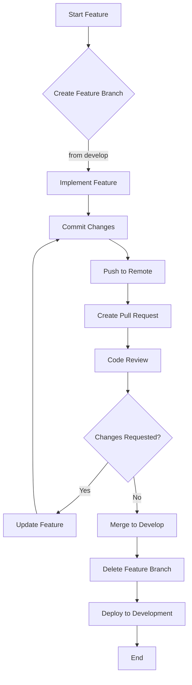
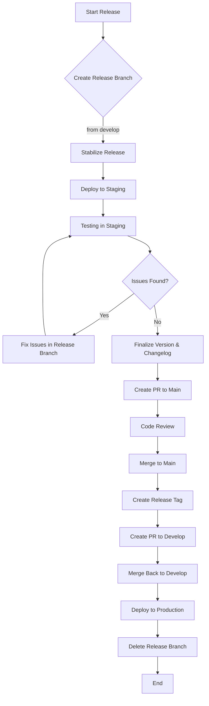
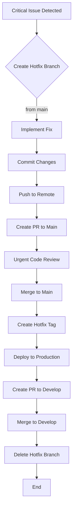
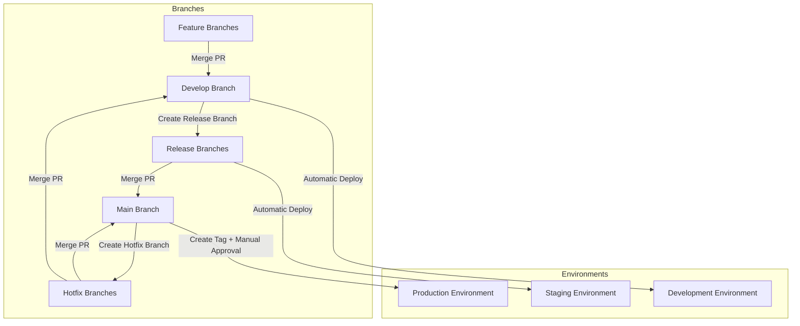

# Molecular Data Management and CRO Integration Platform Git Workflow

This document outlines the Git workflow for the Molecular Data Management and CRO Integration Platform. It provides guidelines for branching, committing, reviewing, and merging code to ensure a consistent and efficient development process.

## Table of Contents

- [Introduction](#introduction)
- [Branching Strategy](#branching-strategy)
- [Commit Guidelines](#commit-guidelines)
- [Pull Request Process](#pull-request-process)
- [Development Workflow](#development-workflow)
- [Release Management](#release-management)
- [Environment Integration](#environment-integration)
- [Workflow Diagrams](#workflow-diagrams)
- [Best Practices](#best-practices)
- [References](#references)

## Introduction

This Git workflow document provides guidelines and processes for efficient collaboration using version control in the Molecular Data Management and CRO Integration Platform. It establishes standards for branching, committing, pull requests, and code reviews to ensure high-quality code and a smooth development process.

The workflow is designed to support:
- Parallel feature development by multiple team members
- Continuous integration and deployment
- Quality assurance through automated testing
- Traceability between code changes and requirements
- Efficient bug fixing and hotfix processes
- Controlled release management

By following these guidelines, we ensure that our development process is consistent, efficient, and produces high-quality code.

## Branching Strategy

Our project uses a modified GitHub Flow branching strategy that balances simplicity with the need for controlled releases.

### Branch Types

| Branch Type | Purpose | Lifespan | Source Branch | Target Branch |
|-------------|---------|----------|--------------|---------------|
| `main` | Production-ready code | Permanent | N/A | N/A |
| `develop` | Integration branch | Permanent | N/A | N/A |
| `feature/*` | New features | Temporary | `develop` | `develop` |
| `bugfix/*` | Bug fixes | Temporary | `develop` | `develop` |
| `hotfix/*` | Critical production fixes | Temporary | `main` | `main` & `develop` |
| `release/*` | Release preparation | Temporary | `develop` | `main` |

### Branch Naming Conventions

- **Feature branches**: `feature/descriptive-feature-name`
  - Example: `feature/molecule-upload-validation`

- **Bugfix branches**: `bugfix/issue-number-short-description`
  - Example: `bugfix/123-fix-property-calculation`

- **Hotfix branches**: `hotfix/issue-number-short-description`
  - Example: `hotfix/456-critical-security-fix`

- **Release branches**: `release/version-number`
  - Example: `release/1.2.0`

All branch names should use kebab-case (lowercase with hyphens) for consistency.

### Branch Lifecycle

1. **Feature/Bugfix Branches**
   - Created from: `develop`
   - Merged to: `develop`
   - Deleted after: Successful merge
   - Naming: `feature/descriptive-name` or `bugfix/issue-number-description`
   - Lifespan: Typically 1-5 days, should not exceed 2 weeks

2. **Hotfix Branches**
   - Created from: `main`
   - Merged to: `main` and `develop`
   - Deleted after: Successful merge to both branches
   - Naming: `hotfix/issue-number-description`
   - Lifespan: As short as possible, typically 1-2 days

3. **Release Branches**
   - Created from: `develop`
   - Merged to: `main` and back to `develop`
   - Deleted after: Successful merge to both branches
   - Naming: `release/version-number`
   - Lifespan: Typically 1-7 days for testing and stabilization

### Protected Branches

The `main` and `develop` branches are protected with the following rules:

- **Direct Pushes**: Prohibited for all developers
- **Pull Request Requirements**:
  - Minimum of 1 reviewer approval
  - All CI checks must pass
  - No unresolved conversations
- **Branch Deletion**: Prohibited
- **Force Pushes**: Prohibited

## Commit Guidelines

### Commit Message Format

We follow the [Conventional Commits](https://www.conventionalcommits.org/) standard for commit messages:

```
<type>(<scope>): <subject>

<body>

<footer>
```

- **Type**: Describes the kind of change
  - `feat`: A new feature
  - `fix`: A bug fix
  - `docs`: Documentation changes
  - `style`: Code style changes (formatting, missing semicolons, etc.)
  - `refactor`: Code refactoring without functionality changes
  - `perf`: Performance improvements
  - `test`: Adding or modifying tests
  - `chore`: Changes to the build process, tools, etc.

- **Scope** (optional): The area of the codebase affected
  - `molecule`, `upload`, `api`, `auth`, `cro`, etc.

- **Subject**: Short description of the change in imperative mood
  - Begin with a capital letter
  - No period at the end
  - 50 characters or less

- **Body** (optional): Detailed explanation of the change
  - Use present tense
  - Include motivation for the change
  - Describe differences in behavior before and after

- **Footer** (optional): References to issues, breaking changes, etc.
  - Reference issues: `Fixes #123, Relates to #456`
  - Breaking changes: `BREAKING CHANGE: description of the change`

Examples:

```
feat(molecule-upload): add support for SDF file format

- Implement SDF file parsing with RDKit
- Add validation for SDF structures
- Update documentation with SDF examples

Closes #123
```

```
fix(property-calculation): correct logP calculation error

The logP calculation was using an incorrect algorithm for molecules
with specific functional groups. This fix implements the correct
algorithm according to the specification.

Fixes #456
```

### Commit Size

- Keep commits focused on a single logical change
- Aim for commits that can be reviewed in under 10 minutes
- Large features should be broken down into smaller, logical commits
- Refactoring should be done in separate commits from feature changes

### Commit Frequency

- Commit regularly to capture logical units of work
- Ensure each commit represents a stable state of the codebase
- At a minimum, commit at the end of each day
- Avoid bundling multiple features or fixes in a single commit
- Aim for frequent, small commits rather than infrequent, large ones

### Linking Issues

- Always reference related issues in commit messages
- Use GitHub's keywords to automatically link issues:
  - `Fixes #123`: Closes the issue when the PR is merged
  - `Relates to #456`: Links the issue without closing it
- For commits addressing multiple issues:
  - `Fixes #123, #456, #789`
  - `Fixes #123, Relates to #456`

## Pull Request Process

### PR Creation

1. **Preparation**
   - Ensure all tests pass locally
   - Rebase on the latest target branch
   - Resolve any merge conflicts
   - Verify code formatting and linting

2. **Creation Steps**
   - Push your branch to the remote repository
   - Create a new pull request in GitHub
   - Fill out the PR template completely
   - Link related issues
   - Assign reviewers
   - Add appropriate labels

3. **Size Guidelines**
   - PRs should be focused and limited in scope
   - Aim for PRs that can be reviewed in under 30 minutes
   - Large features should be broken into multiple PRs when possible
   - Include only related changes in a single PR

### PR Template

Our PR template includes the following sections:

- **Pull Request Description**: A clear description of the changes
- **Related Issues**: Links to related GitHub issues
- **Type of Change**: Categorization of the change type
- **Affected Components**: Which parts of the system are affected
- **Testing**: Description of tests added or modified
- **Screenshots/Recordings**: Visual evidence of changes (if applicable)
- **Checklist**: Verification steps for the PR author
- **Code Coverage**: Confirmation of test coverage
- **Performance Impact**: Description of any performance considerations
- **Security Considerations**: Description of any security implications
- **Additional Notes**: Any other relevant context

Refer to the [PR Template](../../.github/PULL_REQUEST_TEMPLATE.md) for the full template.

### Review Requirements

- **Minimum Reviewers**: 1 required approval
- **Required Reviewers**: At least one from the core team
- **Review SLA**: Reviewers should respond within 24 business hours
- **Review Criteria**:
  - Code correctness and functionality
  - Adherence to coding standards
  - Test coverage
  - Documentation completeness
  - Security considerations
  - Performance implications

Reviews should follow the code review process outlined in the [Coding Standards](./coding-standards.md) document.

### Merge Strategies

We use different merge strategies depending on the branch type:

- **Feature/Bugfix to Develop**: Squash and merge
  - Condenses feature branch commits into a single, clean commit
  - Preserves a linear history on the `develop` branch
  - Use a commit message that follows conventional commit format

- **Release to Main**: Merge commit (no fast-forward)
  - Preserves the history of the release branch
  - Creates a merge commit that can be tagged with the release version
  - Include the release version in the merge commit message

- **Hotfix to Main**: Merge commit (no fast-forward)
  - Similar to release branches
  - Preserves the hotfix history
  - Creates a merge commit that can be tagged with the hotfix version

- **Main/Hotfix to Develop**: Merge commit (no fast-forward)
  - Ensures that all production changes are incorporated in `develop`
  - Creates a record of when production changes were merged back

### CI/CD Integration

Pull requests trigger automated CI/CD pipelines with the following quality gates:

1. **Build Verification**
   - Ensure the codebase builds successfully
   - Verify that all dependencies are resolved

2. **Linting and Formatting**
   - Code style verification
   - TypeScript/JavaScript: ESLint, Prettier
   - Python: Black, isort, flake8

3. **Static Analysis**
   - TypeScript/JavaScript: TypeScript type checking
   - Python: mypy for type checking
   - SonarQube for code quality analysis

4. **Unit Tests**
   - Run all unit tests
   - Verify minimum code coverage requirements
   - Frontend: Jest tests
   - Backend: pytest tests

5. **Integration Tests**
   - Run API integration tests
   - Test database interactions
   - Verify service-to-service communication

6. **Security Scanning**
   - Dependency vulnerability scanning
   - OWASP ZAP for API security testing
   - Container image scanning

PRs cannot be merged until all checks pass and required reviews are approved.

## Development Workflow

### Feature Development

The process for developing new features:

1. **Create a Feature Branch**
   ```bash
   # Ensure you're on the latest develop branch
   git checkout develop
   git pull origin develop
   
   # Create a new feature branch
   git checkout -b feature/descriptive-feature-name
   
   # Push to remote and set up tracking
   git push -u origin feature/descriptive-feature-name
   ```

2. **Implement the Feature**
   - Develop the feature following coding standards
   - Add appropriate tests (unit, integration, etc.)
   - Update documentation as needed
   - Commit regularly with conventional commit messages

3. **Keep Your Branch Updated**
   ```bash
   git fetch origin
   git rebase origin/develop
   ```

4. **Create a Pull Request**
   - Push your final changes
   - Create a PR against the `develop` branch
   - Fill out the PR template completely
   - Request reviews from appropriate team members

5. **Address Review Feedback**
   - Make requested changes
   - Push updates to the same branch
   - Respond to review comments

6. **Merge the Feature**
   - Once approved and all checks pass
   - Use the "Squash and merge" option
   - The branch will be automatically deleted after merging

7. **Verify in Development Environment**
   - After the feature is merged to `develop`
   - CI/CD will deploy to the development environment
   - Verify that the feature works as expected

### Bug Fixing

The process for fixing bugs in the development branch:

1. **Create a Bugfix Branch**
   ```bash
   # Ensure you're on the latest develop branch
   git checkout develop
   git pull origin develop
   
   # Create a new bugfix branch
   git checkout -b bugfix/issue-number-short-description
   
   # Push to remote and set up tracking
   git push -u origin bugfix/issue-number-short-description
   ```

2. **Implement the Fix**
   - Fix the bug following coding standards
   - Add or update tests to prevent regression
   - Update documentation if necessary
   - Commit with a message following the format: `fix(scope): description`

3. **Create a Pull Request**
   - Push your changes
   - Create a PR against the `develop` branch
   - Fill out the PR template completely
   - Request reviews from appropriate team members

4. **Merge the Bugfix**
   - Once approved and all checks pass
   - Use the "Squash and merge" option
   - The branch will be automatically deleted after merging

5. **Verify in Development Environment**
   - After the bugfix is merged to `develop`
   - CI/CD will deploy to the development environment
   - Verify that the bug is fixed

### Hotfix Process

The process for critical fixes to the production environment:

1. **Create a Hotfix Branch**
   ```bash
   # Ensure you're on the latest main branch
   git checkout main
   git pull origin main
   
   # Create a new hotfix branch
   git checkout -b hotfix/issue-number-short-description
   
   # Push to remote and set up tracking
   git push -u origin hotfix/issue-number-short-description
   ```

2. **Implement the Hotfix**
   - Fix the issue following coding standards
   - Add or update tests to prevent regression
   - Update documentation if necessary
   - Commit with a message following the format: `fix(scope): description`

3. **Create a Pull Request**
   - Push your changes
   - Create a PR against the `main` branch
   - Fill out the PR template completely
   - Request urgent reviews from appropriate team members

4. **Merge the Hotfix to Main**
   - Once approved and all checks pass
   - Use the "Create a merge commit" option
   - Do not delete the branch yet

5. **Create a Release Tag**
   - After the hotfix is merged to `main`
   - Create a new tag following semantic versioning
   - Push the tag to the remote repository
   ```bash
   git checkout main
   git pull origin main
   git tag -a v1.2.3-hotfix.1 -m "Hotfix: Short description"
   git push origin v1.2.3-hotfix.1
   ```

6. **Merge the Hotfix to Develop**
   - Create a PR from the `hotfix` branch to `develop`
   - Resolve any merge conflicts
   - Merge using the "Create a merge commit" option
   - The branch can be deleted after merging to `develop`

7. **Verify in Production and Development**
   - After the hotfix is merged to `main` and `develop`
   - CI/CD will deploy to production and development environments
   - Verify that the issue is fixed in both environments

### Code Review Process

Our code review process ensures quality and knowledge sharing:

1. **Reviewer Selection**
   - At least one reviewer from the core team
   - Additional reviewers with domain expertise
   - Authors should not review their own code

2. **Review Timing**
   - Reviewers should respond within 24 business hours
   - Emergency hotfixes should be reviewed urgently (within 4 hours)

3. **Review Focus Areas**
   - Functional correctness
   - Code structure and readability
   - Test coverage and quality
   - Performance considerations
   - Security implications
   - Documentation completeness
   - Adherence to coding standards

4. **Review Feedback**
   - Provide constructive, specific feedback
   - Distinguish between required changes and suggestions
   - Explain the reasoning behind feedback
   - Use GitHub's suggestion feature for simple changes

5. **Addressing Feedback**
   - Respond to all comments
   - Make requested changes or explain why changes were not made
   - Mark conversations as resolved once addressed
   - Push updates to the same branch

6. **Approval Process**
   - Reviewers approve once all required changes are addressed
   - PR author should not merge until all required approvals are received
   - All CI checks must pass before merging

Detailed code review guidelines can be found in the [Coding Standards](./coding-standards.md) document.

## Release Management

### Release Branching

The process for creating and managing release branches:

1. **Create a Release Branch**
   ```bash
   # Ensure you're on the latest develop branch
   git checkout develop
   git pull origin develop
   
   # Create a new release branch
   git checkout -b release/1.2.0
   
   # Push to remote and set up tracking
   git push -u origin release/1.2.0
   ```

2. **Stabilize the Release**
   - Only bug fixes should be committed to the release branch
   - No new features should be added at this stage
   - Critical bugs can be fixed directly on the release branch
   - Less critical bugs should be fixed in `develop` and cherry-picked

3. **Deploy to Staging**
   - CI/CD will deploy the release branch to the staging environment
   - Perform testing and validation in staging
   - Fix any issues found during testing

4. **Finalize Release**
   - Update version numbers in appropriate files
   - Update CHANGELOG.md
   - Commit these changes to the release branch

5. **Create a Pull Request**
   - Create a PR from the release branch to `main`
   - Fill out the PR template completely
   - Request reviews from appropriate team members

6. **Merge to Main**
   - Once approved and all checks pass
   - Use the "Create a merge commit" option
   - Do not delete the branch yet

7. **Create a Release Tag**
   - After the release is merged to `main`
   - Create a new tag following semantic versioning
   - Push the tag to the remote repository
   ```bash
   git checkout main
   git pull origin main
   git tag -a v1.2.0 -m "Release 1.2.0"
   git push origin v1.2.0
   ```

8. **Merge Back to Develop**
   - Create a PR from the release branch to `develop`
   - Resolve any merge conflicts
   - Merge using the "Create a merge commit" option
   - The branch can be deleted after merging to `develop`

### Version Tagging

We follow semantic versioning (SemVer) for all releases:

1. **Format**: `v{MAJOR}.{MINOR}.{PATCH}[-{PRE-RELEASE}]`
   - Example: `v1.2.3`, `v2.0.0-rc.1`

2. **Tag Creation**:
   ```bash
   git tag -a v1.2.3 -m "Release 1.2.3"
   git push origin v1.2.3
   ```

3. **Hotfix Tags**:
   - Use patch version increment for hotfixes
   - Example: If current release is `v1.2.3`, hotfix tag would be `v1.2.4`

4. **Pre-release Tags**:
   - Use suffixes for pre-releases: `-alpha.1`, `-beta.1`, `-rc.1`
   - Example: `v1.3.0-beta.2`

5. **Tag Signing**:
   - For production releases, use GPG-signed tags
   ```bash
   git tag -s v1.2.3 -m "Release 1.2.3"
   ```

### Release Notes

Release notes are maintained in the `CHANGELOG.md` file:

1. **Format**: Follow the [Keep a Changelog](https://keepachangelog.com/) format
   ```markdown
   ## [1.2.0] - 2023-09-15
   
   ### Added
   - Feature 1 description (#123)
   - Feature 2 description (#456)
   
   ### Changed
   - Change 1 description (#789)
   
   ### Fixed
   - Bug fix 1 description (#101)
   - Bug fix 2 description (#202)
   ```

2. **Categorization**: Group changes into categories
   - Added: New features
   - Changed: Changes in existing functionality
   - Deprecated: Features that will be removed
   - Removed: Features that were removed
   - Fixed: Bug fixes
   - Security: Security fixes

3. **Issue References**: Include issue numbers for traceability

4. **Update Timing**: Update the changelog during the release process

5. **Unreleased Section**: Maintain an "Unreleased" section for changes not yet released

### Deployment Integration

Our CI/CD pipeline automatically deploys code based on the Git workflow:

1. **Development Environment**:
   - Deployed from: `develop` branch
   - Trigger: Every merge to `develop`
   - Deployment Type: Automatic
   - Environment: AWS ECS Development Cluster

2. **Staging Environment**:
   - Deployed from: `release/*` branches
   - Trigger: Every push to a release branch
   - Deployment Type: Automatic
   - Environment: AWS ECS Staging Cluster

3. **Production Environment**:
   - Deployed from: `main` branch
   - Trigger: New tag created on `main`
   - Deployment Type: Manual approval after automatic build
   - Environment: AWS ECS Production Cluster

4. **Hotfix Deployments**:
   - Deployed from: `main` branch after hotfix merge
   - Trigger: New hotfix tag created on `main`
   - Deployment Type: Manual approval after automatic build
   - Environment: AWS ECS Production Cluster

### Versioning Strategy

We follow semantic versioning (SemVer) with the format `MAJOR.MINOR.PATCH`:

1. **MAJOR version**: Incremented for incompatible API changes
   - Breaking changes to API contracts
   - Major UI redesigns affecting user workflows
   - Changes requiring data migration

2. **MINOR version**: Incremented for backward-compatible functionality additions
   - New features that don't break existing functionality
   - Substantial non-breaking enhancements to existing features
   - Deprecation of functionality (but not removal)

3. **PATCH version**: Incremented for backward-compatible bug fixes
   - Bug fixes that don't change functionality
   - Performance improvements
   - Security patches

Examples of version increments:
- Current: `1.2.3`
- Add new feature: `1.3.0`
- Fix bug: `1.2.4`
- Breaking API change: `2.0.0`

### Release Types

1. **Feature Releases**:
   - Contains new features and non-critical bug fixes
   - Planned and scheduled in advance
   - Released from a `release/*` branch
   - Requires full testing in staging environment
   - Requires documentation updates
   - Approval: Product Owner and Technical Lead

2. **Bugfix Releases**:
   - Contains only bug fixes, no new features
   - May be scheduled or unscheduled
   - Released from a `release/*` branch
   - Requires testing focused on fixed issues
   - Approval: Technical Lead

3. **Hotfix Releases**:
   - Contains critical bug fixes for production issues
   - Unscheduled, urgent releases
   - Released from a `hotfix/*` branch
   - Requires focused testing on the specific fix
   - Approval: Technical Lead and Operations

4. **Security Releases**:
   - Contains security vulnerability fixes
   - Highest priority, unscheduled
   - Released from a `hotfix/*` branch
   - Requires security-focused testing
   - Approval: Security Officer and Technical Lead

## Environment Integration

### Development Environment

The development environment is the first integration point for new code:

- **Source Branch**: `develop`
- **Deployment Trigger**: Automatic on every merge to `develop`
- **Purpose**: 
  - Integration testing
  - Feature verification
  - Developer testing
- **Access**: Internal team only
- **Data**: Non-sensitive, synthetic test data
- **Stability Expectation**: May contain bugs, experimental features
- **URL Pattern**: `dev.moleculeflow.example.com`

### Staging Environment

The staging environment is a pre-production validation environment:

- **Source Branch**: `release/*`
- **Deployment Trigger**: Automatic on every push to a release branch
- **Purpose**:
  - Pre-release validation
  - UAT (User Acceptance Testing)
  - Performance testing
  - Integration testing with external systems
- **Access**: Internal team and selected stakeholders
- **Data**: Anonymized production-like data
- **Stability Expectation**: Should be stable, close to production quality
- **URL Pattern**: `staging.moleculeflow.example.com`

### Production Environment

The production environment is the live system used by customers:

- **Source Branch**: `main`
- **Deployment Trigger**: Manual approval after tag creation on `main`
- **Purpose**:
  - Live customer usage
  - Production operation
- **Access**: Authorized users only
- **Data**: Real, sensitive production data
- **Stability Expectation**: Highly stable, thoroughly tested
- **URL Pattern**: `moleculeflow.example.com`

### Environment Promotion

Code changes flow through environments in a controlled manner:

1. **Development → Staging**:
   - When: Release readiness
   - How: Create a `release/*` branch from `develop`
   - Requirements: All tests passing on `develop`
   - Approval: Technical Lead

2. **Staging → Production**:
   - When: Release approval
   - How: Merge `release/*` branch to `main` and create a tag
   - Requirements:
     - All tests passing on release branch
     - UAT completed and approved
     - Documentation updated
   - Approval: Product Owner, Technical Lead, and Operations

3. **Hotfix Process**:
   - When: Critical production issue
   - How: Create `hotfix/*` branch from `main`, fix, merge back to `main` and `develop`
   - Requirements: Focused testing on the specific issue
   - Approval: Technical Lead and Operations

## Workflow Diagrams

### Feature Development Flow



### Release Flow



### Hotfix Flow



### Environment Promotion Flow



## Best Practices

### Keeping Branches Updated

1. **Regularly Update Feature Branches**:
   ```bash
   git fetch origin
   git rebase origin/develop
   ```

2. **Resolve Conflicts Early**:
   - Update your branch daily to identify conflicts early
   - Resolve conflicts in your feature branch, not during PR review

3. **Clean History Before PR**:
   - Use interactive rebase to clean up commits before creating a PR
   ```bash
   git rebase -i origin/develop
   ```

4. **Fetch Before Push**:
   - Always fetch remote changes before pushing
   - Avoid forced pushes on shared branches

### Resolving Merge Conflicts

1. **Prevention is Best**:
   - Keep PRs small and focused
   - Regularly update your branch
   - Communicate with team members working on related areas

2. **Resolution Process**:
   ```bash
   git fetch origin
   git rebase origin/develop
   # If conflicts occur
   # Edit files to resolve conflicts
   git add <resolved-files>
   git rebase --continue
   # After all conflicts are resolved
   git push --force-with-lease origin feature/your-feature
   ```

3. **Tools for Conflict Resolution**:
   - Use Visual Studio Code or another IDE with merge conflict assistance
   - For complex conflicts, consider using a dedicated merge tool

4. **Verify After Resolution**:
   - Run tests after resolving conflicts
   - Verify the application still functions correctly

### Using Git Hooks

We use Git hooks to automate quality checks:

1. **Pre-commit Hooks**:
   - Automatically run on `git commit`
   - Check for code formatting, linting, and basic errors
   - Configured using pre-commit framework

2. **Pre-push Hooks**:
   - Run before code is pushed to remote
   - Run tests to catch issues before they reach CI

3. **Commit-msg Hooks**:
   - Validate commit message format
   - Ensure compliance with conventional commits standard

4. **Setup Instructions**:
   ```bash
   pip install pre-commit
   pre-commit install --install-hooks
   pre-commit install --hook-type commit-msg
   ```

5. **Available Hooks**:
   - Black (Python formatting)
   - isort (Python import sorting)
   - flake8 (Python linting)
   - ESLint (JavaScript/TypeScript linting)
   - Prettier (JavaScript/TypeScript formatting)
   - commitlint (Commit message validation)

### Handling Large Files

1. **Git LFS for Large Files**:
   - Use Git Large File Storage for binary files over 10MB
   - This includes images, datasets, and other large assets
   - Setup:
   ```bash
   git lfs install
   git lfs track "*.psd" "*.npy" "*.h5"
   git add .gitattributes
   ```

2. **Files to Exclude**:
   - Never commit sensitive data or credentials
   - Exclude build artifacts, temp files, and logs using `.gitignore`
   - Exclude large datasets that can be generated or downloaded

3. **Breaking Down Large Changes**:
   - If a change affects many files, consider splitting into multiple PRs
   - Create logical, incremental changes that build on each other

4. **Managing Data Files in Repository**:
   - Store test data in the repository only if small and necessary
   - Consider using fixtures or factories to generate test data
   - Use external storage (S3, etc.) for large datasets with versioning

## References

- [GitHub Flow](https://guides.github.com/introduction/flow/)
- [Conventional Commits](https://www.conventionalcommits.org/)
- [Semantic Versioning](https://semver.org/)
- [Keep a Changelog](https://keepachangelog.com/)
- [Git LFS](https://git-lfs.github.com/)
- [Project Coding Standards](./coding-standards.md)
- [Pull Request Template](../../.github/PULL_REQUEST_TEMPLATE.md)