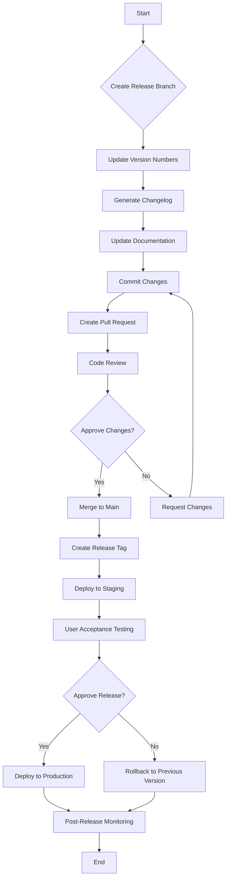
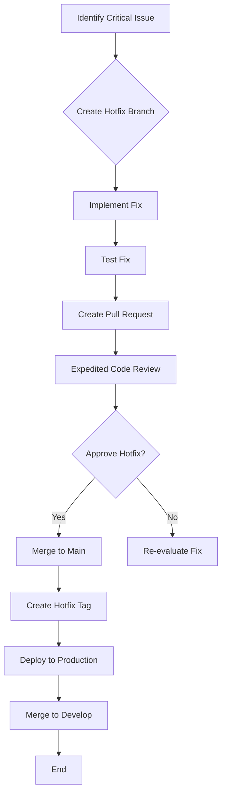
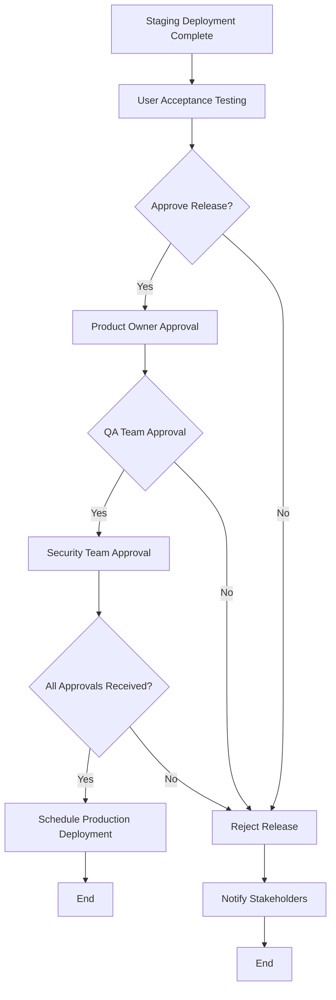

## Introduction

This document outlines the release process for the Molecular Data Management and CRO Integration Platform. It provides a comprehensive guide to versioning, release types, workflows, and responsibilities to ensure consistent, high-quality releases. The process is designed to balance the need for rapid delivery of new features with the stability and reliability requirements of a scientific platform used in pharmaceutical research.

## Versioning Strategy

### Semantic Versioning
The platform follows Semantic Versioning 2.0.0 (SemVer) for version numbering. Each version number consists of three components: MAJOR.MINOR.PATCH (e.g., 1.2.3).

### Version Components
MAJOR: Incremented for incompatible API changes
MINOR: Incremented for backward-compatible new functionality
PATCH: Incremented for backward-compatible bug fixes

### Version Increment Rules
Detailed rules for when to increment each version component based on changes in the codebase, API compatibility, and user-facing features.

## Release Types

### Feature Releases
Feature releases introduce new functionality and may include bug fixes. They increment either the MAJOR or MINOR version number depending on backward compatibility.

### Bugfix Releases
Bugfix releases address issues in existing functionality without adding new features. They increment the PATCH version number.

### Hotfix Releases
Hotfix releases address critical issues in production that cannot wait for the next regular release cycle. They increment the PATCH version number.

### Release Cadence
Feature releases: Bi-weekly
Bugfix releases: As needed
Hotfix releases: Immediate upon critical issue identification

## Release Workflow

### Release Planning
Process for planning releases, including feature selection, scope definition, and timeline establishment.

### Release Preparation
Steps for preparing a release, including branch creation, version updates, and changelog generation.

### Staging Deployment
Process for deploying to the staging environment using blue/green deployment strategy and conducting thorough testing.

### Release Approval
Approval workflow including UAT, stakeholder sign-off, and go/no-go decision criteria.

### Production Deployment
Process for deploying to production using canary deployment strategy with progressive traffic shifting (10% → 50% → 100%).

### Post-Release Activities
Activities after successful deployment, including monitoring, documentation updates, and retrospective.

## Hotfix Process

### Hotfix Criteria
Criteria for determining when an issue requires a hotfix rather than waiting for the next regular release.

### Hotfix Workflow
Expedited workflow for implementing, testing, and deploying hotfixes directly from the main branch.

### Emergency Deployment
Procedures for emergency deployments, including abbreviated testing and approval processes while maintaining quality standards.

## Release Artifacts

### Release Notes
Guidelines for creating comprehensive release notes that document new features, improvements, bug fixes, and known issues.

### Changelog
Process for maintaining an accurate changelog using Conventional Commits to automatically categorize changes.

### Docker Images
Tagging and versioning strategy for Docker images in ECR, including development, release candidate, and production tags.

### Documentation
Process for updating documentation with each release, including API documentation, user guides, and architectural documentation.

## Release Roles and Responsibilities

### Release Manager
Responsibilities of the release manager, including coordination, communication, and ensuring process adherence.

### Development Team
Responsibilities of developers during the release process, including code freezes, testing, and issue resolution.

### QA Team
Responsibilities of the QA team, including test plan execution, regression testing, and sign-off criteria.

### Product Owner
Responsibilities of the product owner, including feature verification, UAT coordination, and final approval.

### Operations Team
Responsibilities of the operations team, including deployment execution, monitoring, and rollback if necessary.

## Release Tracking and Metrics

### Release Schedule
Process for maintaining and communicating the release schedule, including planning, freeze dates, and deployment windows.

### Release Metrics
Key metrics tracked for each release, including lead time, deployment frequency, change failure rate, and time to restore service.

### Release Retrospective
Process for conducting release retrospectives to identify improvements for future releases.

## Rollback Procedures

### Rollback Criteria
Criteria for determining when to roll back a release, including error thresholds, performance degradation, and business impact.

### Rollback Process
Step-by-step process for rolling back to the previous stable version, including database considerations.

### Post-Rollback Activities
Activities after a rollback, including root cause analysis, fix development, and communication.

## Workflow Diagrams

### Feature Release Workflow


### Hotfix Workflow


### Approval Workflow


### Rollback Workflow
```mermaid
flowchart TD
    A[Deployment Failure Detected] --> B{Identify Previous Stable Version}
    B --> C[Initiate Rollback Deployment]
    C --> D[Monitor Rollback Progress]
    D --> E{Rollback Successful?}
    E -->|Yes| F[Verify System Functionality]
    E -->|No| G[Escalate to On-Call Engineer]
    F --> H[Notify Stakeholders]
    H --> I[End]
    G --> J[Manual Intervention]
    J --> F